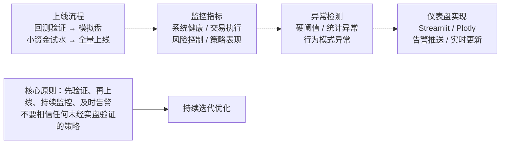

## 第二十四章：实盘部署与监控：算法上线流程、实时监控指标、异常检测与告警、Python实现监控仪表盘

说实话，很多做量化的人，策略回测跑得飞起，一到实盘就翻车。我见过太多这样的案例了。回测是理想环境，实盘才是修罗场。今天这一章，咱们就聊聊怎么把算法安全地送上生产线，以及上线后怎么盯着它别出幺蛾子。

### 一、算法上线流程：从回测到实盘的最后一公里

我个人习惯把上线流程分成四个阶段。每一步都不能省，省了就是给自己埋雷。

#### 1.1 回测验证与参数固化

回测跑通了，不代表就完事了。我建议你再做三件事：

- **样本外测试**：留一段最近的数据不参与回测，专门用来验证。我曾经有个策略，回测年化30%，样本外直接亏成狗，就是因为过拟合了。
- **参数敏感性分析**：稍微改改参数，看看收益曲线会不会剧烈抖动。如果会，说明策略不稳定，上线就是赌博。
- **压力测试**：模拟极端行情，比如2015年股灾、2020年原油暴跌。你的算法扛得住吗？

#### 1.2 模拟盘试运行

这一步很多人跳过，但我强烈建议你跑至少两周的模拟盘。模拟盘用的是真实行情，但不下真单。主要看两件事：

- 信号延迟：从行情到信号，再到下单指令，整个链路耗时多少？
- 滑点模拟：你的算法在模拟盘里成交价和预期价差多少？

嗯，这里要注意：模拟盘的成交逻辑和实盘有差异，别太当真，但至少能帮你排除明显的bug。

#### 1.3 小资金实盘试水

模拟盘没问题了，就上小资金。我一般建议用计划资金的5%-10%先跑一周。这个阶段的目标不是赚钱，是验证系统在真实环境下的稳定性。

> ⚠️ **我曾经犯过的错：** 第一次实盘时，我忘了检查交易所的API限频。结果策略在开盘瞬间发了200个订单，直接被交易所封了IP。所以，上线前一定要确认API的调用限制。

#### 1.4 全量上线与灰度发布

小资金跑稳了，就可以逐步加仓。我习惯用灰度发布的方式：第一天加20%，第二天加到50%，第三天全量。这样万一出问题，损失可控。

### 二、实时监控指标：盯住这几个关键数字

算法上线后，你不能撒手不管。实时监控是必须的。我总结了一套「四维监控」体系，你想想看，是不是这个理？

| 维度 | 核心指标 | 说明 |
| --- | --- | --- |
| 系统健康 | CPU使用率、内存占用、网络延迟 | 服务器别崩了 |
| 交易执行 | 订单成交率、滑点、延迟 | 算法跑得顺不顺 |
| 风险控制 | 最大回撤、敞口、杠杆率 | 别爆仓 |
| 策略表现 | 实时PnL、夏普比率、胜率 | 策略还活着吗 |

我个人最看重的是「订单成交率」和「滑点」。这两个指标直接反映了你的算法在真实市场中的执行质量。如果成交率突然从95%掉到80%，那肯定有问题——要么是流动性变了，要么是你的算法被市场反制了。

### 三、异常检测与告警：别等亏钱了才发现

监控的目的是发现异常。异常怎么定义？我一般分三类：

#### 3.1 硬性阈值告警

最简单的办法：设个阈值。比如：

- 单笔亏损超过总资金的1%
- 连续3笔交易滑点超过0.5%
- 系统延迟超过500ms

超过阈值就告警。但阈值设多少合适？我建议根据历史数据统计，取99%分位数。别拍脑袋设。

#### 3.2 统计异常检测

硬阈值太死板了。市场在变，阈值也得跟着变。我常用的是移动平均+标准差的方法：

```python
import numpy as np

def detect_anomaly(series, window=20, threshold=3):
    rolling_mean = series.rolling(window).mean()
    rolling_std = series.rolling(window).std()
    upper_bound = rolling_mean + threshold * rolling_std
    lower_bound = rolling_mean - threshold * rolling_std
    return (series > upper_bound) | (series < lower_bound)
```

说白了，就是看当前值偏离正常范围多远。偏离超过3个标准差，我就认为异常了。

#### 3.3 行为模式异常

这个更高级一点。比如你的策略平时都是上午10点下单，今天突然在下午2点频繁交易。这可能是策略逻辑出bug了，也可能是市场变了。我建议用机器学习模型（比如孤立森林）来检测这种模式异常。

> 💡 **避坑指南：** 告警别太多，否则你会变成「狼来了」里的那个小孩。我一般只对「影响资金安全」和「系统不可用」这两类事件发告警。其他的，写到日志里，每天看一次就够了。

### 四、Python实现监控仪表盘

好了，理论说完了，咱们动手写个简单的监控仪表盘。我用的是Streamlit，轻量级，适合快速搭建。

#### 4.1 数据采集层

首先，你得有数据。我习惯用Redis缓存实时数据，然后定时写入InfluxDB（时序数据库）。这里简化一下，用Pandas模拟数据流：

```python
import pandas as pd
import numpy as np
import time

def generate_mock_data():
    """模拟实时行情和交易数据"""
    while True:
        data = {
            'timestamp': pd.Timestamp.now(),
            'cpu_usage': np.random.uniform(30, 80),
            'memory_usage': np.random.uniform(40, 90),
            'order_fill_rate': np.random.uniform(0.9, 1.0),
            'slippage': np.random.uniform(0.001, 0.01),
            'pnl': np.random.normal(0, 1000)
        }
        yield data
        time.sleep(1)  # 每秒生成一条数据
```

#### 4.2 监控仪表盘核心代码

下面这个仪表盘，我用了Streamlit的实时更新功能。它会每秒刷新一次，展示关键指标和告警状态。

```python
import streamlit as st
import plotly.graph_objects as go
from collections import deque

# 初始化数据缓存
MAX_POINTS = 100
cpu_history = deque(maxlen=MAX_POINTS)
pnl_history = deque(maxlen=MAX_POINTS)

st.set_page_config(page_title="量化交易监控仪表盘", layout="wide")
st.title("📊 实盘监控仪表盘")

# 布局：左侧指标卡片，右侧图表
col1, col2, col3, col4 = st.columns(4)
col1.metric("CPU使用率", f"{cpu_usage:.1f}%")
col2.metric("内存使用率", f"{memory_usage:.1f}%")
col3.metric("订单成交率", f"{order_fill_rate:.2%}")
col4.metric("实时PnL", f"${pnl:+,.2f}")

# 实时折线图
fig = go.Figure()
fig.add_trace(go.Scatter(y=list(cpu_history), mode='lines', name='CPU'))
fig.add_trace(go.Scatter(y=list(pnl_history), mode='lines', name='PnL'))
st.plotly_chart(fig, use_container_width=True)

# 告警区域
if cpu_usage > 90:
    st.error("🚨 CPU使用率超过90%，请检查服务器！")
if order_fill_rate < 0.8:
    st.warning("⚠️ 订单成交率低于80%，可能存在流动性问题！")
```

#### 4.3 告警推送

仪表盘只是展示，真正的告警得推送到手机上。我一般用企业微信机器人或者钉钉机器人。代码很简单：

```python
import requests

def send_alert(message):
    webhook_url = "https://qyapi.weixin.qq.com/cgi-bin/webhook/send?key=YOUR_KEY"
    data = {
        "msgtype": "text",
        "text": {"content": message}
    }
    requests.post(webhook_url, json=data)

# 使用示例
if cpu_usage > 90:
    send_alert(f"告警：CPU使用率 {cpu_usage:.1f}%，请立即处理！")
```

> 💡 **我的经验：** 告警消息别太啰嗦。我一般只发三要素：时间、指标、建议操作。比如「14:32:15 CPU 95% - 建议重启策略进程」。这样值班的人一看就知道该干嘛。

### 五、知识体系总览



说白了，实盘部署不是一锤子买卖。它是一个持续迭代的过程。你今天上线了，明天可能就要根据市场变化调整参数。监控仪表盘就是你的眼睛，告警系统就是你的神经。没有这两样东西，你就是在裸奔。

我记得有一次，我的一个策略在凌晨3点突然开始疯狂下单。要不是监控系统及时告警，我可能到第二天早上才发现。那次之后，我就在告警系统里加了一条规则：任何非交易时段的下单行为，直接触发最高级别告警。你想想看，这种异常，靠人工盯盘根本盯不过来。

好了，这一章的内容就到这里。代码示例你可以直接拿去用，但记得改掉webhook的key。别把我的key也复制走了，哈哈。
