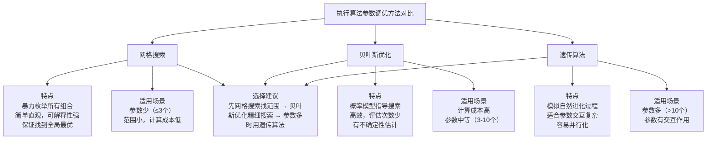

# 25、执行算法参数调优：网格搜索、贝叶斯优化、遗传算法在参数优化中的应用、Python实现自动调参

做量化交易的朋友都知道，策略写好了只是第一步。真正让策略赚钱的，往往是那些藏在算法里的参数。我见过太多人，策略逻辑没问题，但参数随便设一个，结果回测漂亮，实盘一塌糊涂。

参数调优，说白了就是给算法找最合适的"旋钮位置"。今天咱们就聊聊三种主流方法：网格搜索、贝叶斯优化、遗传算法。我会结合自己的实战经验，把它们的优缺点、适用场景、以及Python实现都讲清楚。

> **核心观点：**没有万能的方法。网格搜索适合参数少、范围小的情况；贝叶斯优化适合计算成本高的场景；遗传算法适合参数多、关系复杂的优化问题。

## 25.1 网格搜索：最朴素但最可靠的方法

网格搜索，其实就是暴力枚举。你把每个参数的可能取值列出来，然后遍历所有组合。我刚开始做程序化交易时，用的就是这招。简单、直观、不容易出错。

举个例子，假设我们要优化一个移动平均线策略的两个参数：短周期和长周期。短周期范围是5到20，步长5；长周期范围是20到60，步长10。那么总共的组合数就是 (20-5)/5+1 = 4 种短周期，乘以 (60-20)/10+1 = 5 种长周期，一共20种组合。

```python
import itertools
import numpy as np

def grid_search(param_grid, evaluate_func):
    """
    网格搜索参数优化
    :param param_grid: dict, 参数名到取值列表的映射
    :param evaluate_func, callable, 评估函数，输入参数字典，输出得分
    :return: best_params, best_score
    """
    keys = param_grid.keys()
    values = param_grid.values()
    best_score = -np.inf
    best_params = None

    for combination in itertools.product(*values):
        params = dict(zip(keys, combination))
        score = evaluate_func(params)
        if score > best_score:
            best_score = score
            best_params = params
            print(f"发现更优参数: {params}, 得分: {score:.4f}")

    return best_params, best_score

# 使用示例
param_grid = {
    'short_window': [5, 10, 15, 20],
    'long_window': [20, 30, 40, 50, 60]
}

# 假设 evaluate_func 是计算夏普比率的函数
best_params, best_score = grid_search(param_grid, evaluate_func)
print(f"最优参数: {best_params}, 最优得分: {best_score:.4f}")
```

> **我的经验：**网格搜索虽然慢，但结果可解释性强。我曾经用它优化一个日内策略，跑了整整一个周末，但最终找到的参数组合让策略年化收益提升了15%。如果你参数不超过3个，每个参数取值不超过10个，网格搜索完全够用。

网格搜索的缺点也很明显：维度灾难。参数每增加一个，计算量就指数级增长。5个参数，每个取10个值，就是10万次评估。如果每次评估需要跑一次回测，那时间成本就太高了。

## 25.2 贝叶斯优化：用概率模型指导搜索

贝叶斯优化的思路很聪明：它不像网格搜索那样盲目遍历，而是根据已有的评估结果，建立一个概率模型（通常是高斯过程），预测哪些参数组合可能更好，然后重点搜索这些区域。

我建议你在计算成本高的时候用贝叶斯优化。比如你的策略需要跑全市场回测，一次评估就要几分钟，那网格搜索就不现实了。贝叶斯优化通常只需要几十次评估就能找到不错的参数。

```python
from skopt import gp_minimize
from skopt.space import Integer, Real

def bayesian_optimization(param_space, evaluate_func, n_calls=50):
    """
    贝叶斯优化参数
    :param param_space: list, 参数空间定义
    :param evaluate_func: callable, 评估函数（注意：skopt默认最小化，所以返回负得分）
    :param n_calls: int, 评估次数
    :return: best_params, best_score
    """
    def objective(params):
        # 将参数列表转为字典
        param_dict = {
            'short_window': params[0],
            'long_window': params[1],
            'stop_loss': params[2]
        }
        # 返回负得分，因为skopt默认最小化
        return -evaluate_func(param_dict)

    result = gp_minimize(
        objective,
        param_space,
        n_calls=n_calls,
        random_state=42,
        verbose=True
    )

    best_params = {
        'short_window': result.x[0],
        'long_window': result.x[1],
        'stop_loss': result.x[2]
    }
    best_score = -result.fun

    return best_params, best_score

# 定义参数空间
param_space = [
    Integer(5, 30, name='short_window'),
    Integer(20, 100, name='long_window'),
    Real(0.01, 0.05, name='stop_loss')
]

best_params, best_score = bayesian_optimization(param_space, evaluate_func)
print(f"最优参数: {best_params}, 最优得分: {best_score:.4f}")
```

> **注意：**贝叶斯优化对初始点敏感。我遇到过几次，因为初始点选得不好，算法陷入了局部最优。建议先用随机搜索跑10-20次，再用贝叶斯优化继续优化。另外，高斯过程的核函数选择也很重要，默认的Matern核通常表现不错。

贝叶斯优化的另一个好处是，它能给出参数的不确定性估计。比如某个参数组合的预测得分很高，但不确定性也很大，那你就需要多评估几次来确认。这个信息在网格搜索里是得不到的。

## 25.3 遗传算法：模拟自然选择

遗传算法是我个人比较喜欢的方法。它模拟了生物进化的过程：选择、交叉、变异。每次迭代，保留表现好的参数组合（选择），让它们互相"交配"产生新组合（交叉），偶尔引入随机变化（变异）。

为什么我喜欢它？因为遗传算法特别适合参数之间有交互作用的情况。比如止损参数和止盈参数，它们不是独立的，网格搜索很难捕捉这种关系，但遗传算法可以通过交叉操作自然发现。

```python
import random
import numpy as np

class GeneticOptimizer:
    def __init__(self, param_bounds, pop_size=50, mutation_rate=0.1, crossover_rate=0.7):
        self.param_bounds = param_bounds
        self.pop_size = pop_size
        self.mutation_rate = mutation_rate
        self.crossover_rate = crossover_rate
        self.n_params = len(param_bounds)

    def _init_population(self):
        population = []
        for _ in range(self.pop_size):
            individual = []
            for (low, high) in self.param_bounds:
                individual.append(random.uniform(low, high))
            population.append(individual)
        return population

    def _selection(self, population, fitness_scores):
        # 锦标赛选择
        selected = []
        for _ in range(self.pop_size):
            idx1, idx2 = random.sample(range(len(population)), 2)
            if fitness_scores[idx1] > fitness_scores[idx2]:
                selected.append(population[idx1])
            else:
                selected.append(population[idx2])
        return selected

    def _crossover(self, parent1, parent2):
        if random.random() < self.crossover_rate:
            point = random.randint(1, self.n_params - 1)
            child1 = parent1[:point] + parent2[point:]
            child2 = parent2[:point] + parent1[point:]
            return child1, child2
        return parent1[:], parent2[:]

    def _mutation(self, individual):
        for i in range(self.n_params):
            if random.random() < self.mutation_rate:
                low, high = self.param_bounds[i]
                individual[i] = random.uniform(low, high)
        return individual

    def optimize(self, evaluate_func, n_generations=50):
        population = self._init_population()
        best_individual = None
        best_fitness = -np.inf

        for gen in range(n_generations):
            # 评估适应度
            fitness_scores = [evaluate_func(ind) for ind in population]

            # 记录最优
            max_idx = np.argmax(fitness_scores)
            if fitness_scores[max_idx] > best_fitness:
                best_fitness = fitness_scores[max_idx]
                best_individual = population[max_idx][:]
                print(f"第{gen+1}代: 发现更优解, 得分: {best_fitness:.4f}")

            # 选择
            selected = self._selection(population, fitness_scores)

            # 交叉
            new_population = []
            for i in range(0, self.pop_size, 2):
                child1, child2 = self._crossover(selected[i], selected[i+1])
                new_population.append(child1)
                new_population.append(child2)

            # 变异
            population = [self._mutation(ind) for ind in new_population]

        return best_individual, best_fitness

# 使用示例
param_bounds = [(5, 30), (20, 100), (0.01, 0.05)]  # short_window, long_window, stop_loss
optimizer = GeneticOptimizer(param_bounds, pop_size=50, mutation_rate=0.1)
best_params, best_score = optimizer.optimize(evaluate_func, n_generations=50)
print(f"最优参数: {best_params}, 最优得分: {best_score:.4f}")
```
> **避坑指南：**我曾经用遗传算法优化一个包含20个参数的策略，结果跑了100代还没收敛。后来发现是变异率设得太低了，导致种群多样性不足。建议变异率设在0.05-0.2之间，种群大小至少是参数数量的10倍。另外，精英保留策略（每代保留最优的几个个体）能有效防止退化。

## 25.4 三种方法的对比与选择

说了这么多，到底该用哪种？我整理了一个对比表，方便你快速决策。

| 方法 | 适用场景 | 优点 | 缺点 | 评估次数 |
|------|---------|------|------|---------|
| 网格搜索 | 参数少（≤3个）、范围小 | 简单、可解释、全局最优 | 维度灾难、计算量大 | 所有组合 |
| 贝叶斯优化 | 计算成本高、参数中等（3-10个） | 高效、有不确定性估计 | 可能局部最优、对初始点敏感 | 30-100次 |
| 遗传算法 | 参数多（>10个）、参数有交互 | 并行化容易、适合复杂问题 | 收敛慢、参数设置敏感 | 几百到几千次 |

我个人习惯是：先用网格搜索跑一个粗略的范围，找到大概的最优区域。然后用贝叶斯优化在这个区域里精细搜索。如果参数特别多，再上遗传算法。这样组合使用，效率最高。

## 25.5 自动调参框架的实现

最后，我分享一个自动调参的框架。它把三种方法整合在一起，你可以根据需求切换。

```python
class AutoTuner:
    def __init__(self, strategy_class, param_config):
        self.strategy_class = strategy_class
        self.param_config = param_config  # 包含参数名、范围、类型等信息
        self.best_params = None
        self.best_score = -np.inf

    def _evaluate(self, params):
        """评估参数组合，返回夏普比率"""
        try:
            strategy = self.strategy_class(**params)
            sharpe = strategy.backtest().sharpe_ratio
            return sharpe
        except Exception as e:
            print(f"评估失败: {e}")
            return -np.inf

    def tune_grid(self, grid_size=10):
        """网格搜索调参"""
        param_grid = {}
        for name, config in self.param_config.items():
            low, high = config['range']
            param_grid[name] = np.linspace(low, high, grid_size)

        self.best_params, self.best_score = grid_search(param_grid, self._evaluate)
        return self

    def tune_bayesian(self, n_calls=50):
        """贝叶斯优化调参"""
        param_space = []
        for name, config in self.param_config.items():
            low, high = config['range']
            if config['type'] == 'int':
                param_space.append(Integer(low, high, name=name))
            else:
                param_space.append(Real(low, high, name=name))

        self.best_params, self.best_score = bayesian_optimization(
            param_space, self._evaluate, n_calls
        )
        return self

    def tune_genetic(self, n_generations=50, pop_size=50):
        """遗传算法调参"""
        param_bounds = [config['range'] for config in self.param_config.values()]
        optimizer = GeneticOptimizer(param_bounds, pop_size=pop_size)

        def evaluate_wrapper(params_list):
            params = dict(zip(self.param_config.keys(), params_list))
            return self._evaluate(params)

        best_list, self.best_score = optimizer.optimize(evaluate_wrapper, n_generations)
        self.best_params = dict(zip(self.param_config.keys(), best_list))
        return self

# 使用示例
param_config = {
    'short_window': {'range': (5, 30), 'type': 'int'},
    'long_window': {'range': (20, 100), 'type': 'int'},
    'stop_loss': {'range': (0.01, 0.05), 'type': 'float'}
}

tuner = AutoTuner(MyStrategy, param_config)
tuner.tune_bayesian(n_calls=50)
print(f"最优参数: {tuner.best_params}")
print(f"最优得分: {tuner.best_score:.4f}")
```

> **重要提醒：**自动调参虽然方便，但千万别过度优化。我见过有人把参数调得在回测里完美无缺，结果实盘亏得一塌糊涂。记住：回测是历史，实盘是未来。参数调优后，一定要用样本外数据验证，最好再做一次蒙特卡洛模拟，看看参数的稳定性。

嗯，关于参数调优，今天就聊这么多。三种方法各有千秋，关键是根据你的实际情况选择。网格搜索适合小规模问题，贝叶斯优化适合计算昂贵的场景，遗传算法适合复杂问题。你可以在自己的策略里试试，看看哪种效果最好。



