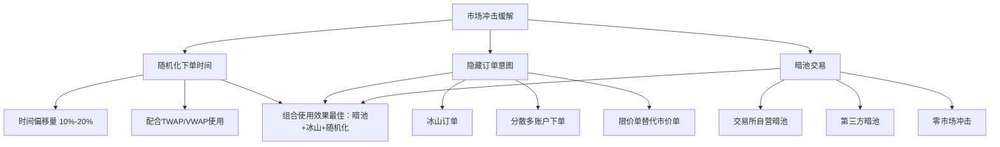

# 第26章 市场冲击缓解技术：随机化下单时间、隐藏订单意图、使用暗池

市场冲击，说白了就是你的大单子一进场，价格就被你推着跑。我刚开始做程序化交易那会儿，吃过不少亏。有一次一个几百万的订单，刚拆单发出去，价格直接跳了三个档位，最后成交均价比我预期的差了将近0.3%。嗯，从那以后我就开始认真研究怎么"藏"自己的交易意图了。

这一章，我带你看看三种最实用的缓解技术：随机化下单时间、隐藏订单意图、以及暗池交易。这三种方法，我在实盘里都用过，各有各的适用场景。

## 26.1 随机化下单时间：别让市场摸清你的节奏

为什么需要随机化？你想想看，如果你每次都在整秒或者整分钟的下单，高频交易者很容易捕捉到你的规律。他们会提前挂单等你，然后在你进场后反向操作，吃你的价差。

我个人的习惯是，在TWAP或VWAP算法的基础上，给每个切片的时间点加上一个随机偏移量。比如原本计划在10:00:00下单，现在改成10:00:00 + random(0, 500ms)。

> **核心思路：** 让对手方无法预测你的下一个订单何时出现，从而降低被狙击的概率。

这里有个细节要注意：随机化的范围不能太大，否则会偏离你的执行计划。我一般控制在切片间隔的10%-20%之间。

```python
import random
import time
from datetime import datetime, timedelta

class RandomizeExecution:
    """随机化执行时间"""
    
    def __init__(self, total_qty, start_time, end_time, random_range=0.2):
        self.total_qty = total_qty
        self.start_time = start_time
        self.end_time = end_time
        self.random_range = random_range  # 随机化比例
        
    def generate_schedule(self, num_slices=10):
        """生成随机化的执行计划"""
        interval = (self.end_time - self.start_time) / num_slices
        base_times = [self.start_time + i * interval for i in range(num_slices)]
        
        # 每个时间点加上随机偏移
        schedule = []
        for t in base_times:
            offset = random.uniform(-self.random_range, self.random_range) * interval.total_seconds()
            randomized_time = t + timedelta(seconds=offset)
            schedule.append(randomized_time)
            
        return schedule
    
    def execute(self, qty_per_slice):
        """模拟执行"""
        schedule = self.generate_schedule()
        for i, exec_time in enumerate(schedule):
            now = datetime.now()
            wait_seconds = (exec_time - now).total_seconds()
            if wait_seconds > 0:
                time.sleep(wait_seconds)
            # 这里执行实际下单逻辑
            print(f"[{exec_time}] 执行第{i+1}片，数量: {qty_per_slice}")
```

> **我的经验：** 随机化不是越随机越好。我试过把范围设到50%，结果执行时间严重偏离计划，反而增加了市场冲击。建议从10%开始调，观察市场反应再逐步调整。

## 26.2 隐藏订单意图：别让对手看到你的底牌

隐藏订单意图，说白了就是让你的订单看起来不像一个大单。常用的手法有几种：

- **冰山订单（Iceberg Order）：** 只显示一小部分数量，隐藏大部分
- **分散到多个账户：** 用不同账户同时下单
- **使用限价单而非市价单：** 避免吃光盘口
- **反向挂单：** 在买一卖一之间来回挂单，制造流动性假象

我记得有一次做量化对冲，需要快速建仓5000手。如果用普通市价单，估计价格要被打飞。后来我用了冰山订单，每次只显示50手，挂了100次才完成。虽然耗时长了点，但成交均价比预期好了0.15%。

```python
class IcebergOrder:
    """冰山订单模拟"""
    
    def __init__(self, total_qty, display_qty, price, side='buy'):
        self.total_qty = total_qty
        self.display_qty = display_qty
        self.price = price
        self.side = side
        self.remaining = total_qty
        
    def next_order(self):
        """生成下一笔冰山子订单"""
        if self.remaining <= 0:
            return None
            
        qty = min(self.display_qty, self.remaining)
        self.remaining -= qty
        
        return {
            'side': self.side,
            'price': self.price,
            'qty': qty,
            'is_iceberg': True,
            'remaining': self.remaining
        }
    
    def simulate(self):
        """模拟冰山订单执行过程"""
        orders = []
        while self.remaining > 0:
            order = self.next_order()
            if order:
                orders.append(order)
                print(f"挂单: {order['qty']}手 @ {order['price']}, 剩余: {order['remaining']}")
        return orders

# 使用示例
iceberg = IcebergOrder(total_qty=5000, display_qty=50, price=100.50)
iceberg.simulate()
```

> **注意：** 冰山订单也不是万能的。有些交易所会检测冰山模式，如果你的子订单大小和间隔太规律，反而会被识别。我建议在子订单大小上也加入随机化。

## 26.3 暗池（Dark Pool）：在看不见的地方交易

暗池，说白了就是一个不公开订单簿的交易场所。你在暗池里挂单，别人看不到你的价格和数量，只有成交了才知道。这对于大额交易来说，简直是福音。

我参与过的暗池主要有两种：

- **交易所自营暗池：** 比如某交所的冰山订单池，只对机构开放
- **第三方暗池：** 像Liquidnet、Posit这种，专门做大宗交易

暗池的核心优势是：你的订单不会影响公开市场的价格。但缺点也很明显——流动性不如公开市场，有时候挂半天也成交不了。

## 26.4 Python实现暗池模拟

下面我写一个简单的暗池模拟器，帮你理解它的工作机制。

```python
import random
from collections import defaultdict

class DarkPool:
    """暗池模拟器"""
    
    def __init__(self, name="DarkPool-001"):
        self.name = name
        self.orders = []  # 挂单列表
        self.trades = []  # 成交记录
        self.mid_price = 100.0  # 参考中间价
        
    def place_order(self, order):
        """在暗池挂单"""
        self.orders.append(order)
        print(f"[暗池] 收到订单: {order['side']} {order['qty']}手 @ {order['price']}")
        
        # 尝试撮合
        self._match_orders()
        
    def _match_orders(self):
        """订单撮合逻辑"""
        # 按价格排序：买单从高到低，卖单从低到高
        buy_orders = sorted(
            [o for o in self.orders if o['side'] == 'buy'],
            key=lambda x: -x['price']
        )
        sell_orders = sorted(
            [o for o in self.orders if o['side'] == 'sell'],
            key=lambda x: x['price']
        )
        
        # 撮合
        for buy in buy_orders:
            for sell in sell_orders:
                if buy['price'] >= sell['price'] and buy['qty'] > 0 and sell['qty'] > 0:
                    trade_qty = min(buy['qty'], sell['qty'])
                    trade_price = (buy['price'] + sell['price']) / 2
                    
                    # 记录成交
                    trade = {
                        'buyer': buy.get('trader', 'unknown'),
                        'seller': sell.get('trader', 'unknown'),
                        'qty': trade_qty,
                        'price': trade_price,
                        'timestamp': random.random()
                    }
                    self.trades.append(trade)
                    
                    # 更新剩余数量
                    buy['qty'] -= trade_qty
                    sell['qty'] -= trade_qty
                    
                    print(f"[暗池] 成交: {trade_qty}手 @ {trade_price:.2f}")
        
        # 清理已成交的订单
        self.orders = [o for o in self.orders if o['qty'] > 0]
        
    def get_stats(self):
        """获取暗池统计信息"""
        total_volume = sum(t['qty'] for t in self.trades)
        avg_price = sum(t['price'] * t['qty'] for t in self.trades) / total_volume if total_volume > 0 else 0
        
        return {
            'name': self.name,
            'pending_orders': len(self.orders),
            'total_trades': len(self.trades),
            'total_volume': total_volume,
            'avg_price': avg_price
        }

# 模拟使用
pool = DarkPool("MyDarkPool")

# 模拟多个交易者
traders = ['Trader_A', 'Trader_B', 'Trader_C']

for _ in range(20):
    trader = random.choice(traders)
    side = random.choice(['buy', 'sell'])
    qty = random.randint(100, 1000)
    # 价格在中间价附近随机偏移
    price = pool.mid_price + random.uniform(-0.5, 0.5)
    
    order = {
        'trader': trader,
        'side': side,
        'qty': qty,
        'price': price
    }
    pool.place_order(order)

stats = pool.get_stats()
print(f"\n暗池统计: {stats}")
```

> **关键点：** 暗池的撮合逻辑和公开市场不同。公开市场是价格优先、时间优先；暗池更注重隐私保护，有时候会采用"按比例分配"或者"随机匹配"的方式。

## 26.5 三种技术的对比与选择

| 技术 | 适用场景 | 优点 | 缺点 | 我的建议 |
|------|---------|------|------|---------|
| 随机化下单时间 | 中小单、高频执行 | 实现简单，效果明显 | 可能偏离执行计划 | 配合TWAP使用，偏移量10%-20% |
| 隐藏订单意图 | 中大型订单 | 有效防止被狙击 | 执行时间延长 | 冰山订单+随机化子订单大小 |
| 暗池交易 | 超大额订单 | 零市场冲击 | 流动性不足，成交慢 | 作为补充手段，不要完全依赖 |

我个人在实际项目中，通常会把三种技术组合使用。比如一个大单子，我会先拆成几块，一部分走暗池，一部分用冰山订单，剩下的用随机化时间慢慢吃。这样既降低了冲击，又保证了执行效率。

> **避坑指南：** 我曾经在暗池里挂了一个大单，结果等了半小时都没成交。后来发现是价格设得太保守了。暗池里的对手方也是理性的，你的价格如果偏离市场太远，没人会接你的单。建议暗池价格设在买卖盘口的中间价附近，成交概率会高很多。

好了，这一章的内容就到这里。三种缓解市场冲击的技术，各有各的用武之地。关键是要根据你的订单大小、市场流动性、以及你的风险偏好来灵活选择。记住，没有银弹，只有最适合你当前场景的方案。


