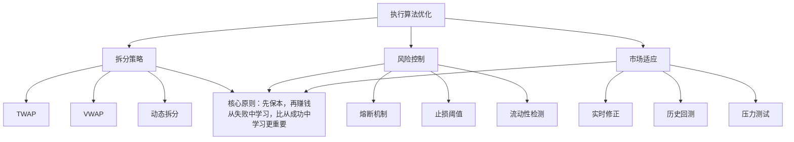

# 第二十八讲：执行算法案例分析——经典案例复盘

做量化交易这些年，我见过不少让人拍大腿的案例。有些是教科书级别的成功，有些则是血淋淋的教训。今天咱们就来复盘几个经典案例——大单拆分、闪崩事件，还有那些从失败中总结出的经验。

我个人习惯是，每学一个算法，先看它怎么死的，再看它怎么活的。你想想看，一个算法在实盘中崩掉，往往比它跑得顺的时候更有教育意义。

## 案例一：大单拆分——TWAP 与 VWAP 的实战对比

先说个我亲身经历的事。几年前，我帮一家私募做 ETF 套利。他们每天要买卖几百万份 ETF，直接挂单肯定不行。当时我们用了 TWAP（时间加权平均价格）和 VWAP（成交量加权平均价格）两种拆分策略。

先看代码，咱们用 Python 复现一下这两种策略的核心逻辑：

```python
import numpy as np
import pandas as pd
from datetime import datetime, timedelta

class TWAPExecutor:
    """时间加权平均价格执行器"""
    def __init__(self, total_volume, start_time, end_time, num_slices=20):
        self.total_volume = total_volume
        self.start_time = start_time
        self.end_time = end_time
        self.num_slices = num_slices
        self.slice_volume = total_volume / num_slices
        
    def generate_schedule(self):
        """生成时间均匀的拆分计划"""
        time_interval = (self.end_time - self.start_time) / self.num_slices
        schedule = []
        for i in range(self.num_slices):
            exec_time = self.start_time + i * time_interval
            schedule.append({
                'time': exec_time,
                'volume': self.slice_volume,
                'type': 'TWAP'
            })
        return pd.DataFrame(schedule)

class VWAPExecutor:
    """成交量加权平均价格执行器"""
    def __init__(self, total_volume, historical_volume_profile):
        self.total_volume = total_volume
        self.volume_profile = historical_volume_profile  # 历史成交量分布
        
    def generate_schedule(self):
        """根据历史成交量分布生成拆分计划"""
        total_hist_vol = sum(self.volume_profile.values())
        schedule = []
        for time_slot, hist_vol in self.volume_profile.items():
            weight = hist_vol / total_hist_vol
            exec_volume = self.total_volume * weight
            schedule.append({
                'time': time_slot,
                'volume': exec_volume,
                'type': 'VWAP'
            })
        return pd.DataFrame(schedule)

# 模拟执行效果
np.random.seed(42)
price_path = 100 + np.cumsum(np.random.randn(100) * 0.1)  # 模拟价格波动

twap = TWAPExecutor(total_volume=100000, 
                    start_time=datetime(2024,1,1,9,30),
                    end_time=datetime(2024,1,1,10,30))
twap_schedule = twap.generate_schedule()

# 假设历史成交量分布：早盘活跃，午盘平稳
volume_profile = {
    '09:30': 0.15, '09:35': 0.12, '09:40': 0.10,
    '09:45': 0.08, '09:50': 0.07, '09:55': 0.06,
    '10:00': 0.05, '10:05': 0.05, '10:10': 0.05,
    '10:15': 0.05, '10:20': 0.05, '10:25': 0.05,
    '10:30': 0.12  # 收盘前放量
}
vwap = VWAPExecutor(total_volume=100000, 
                    historical_volume_profile=volume_profile)
vwap_schedule = vwap.generate_schedule()

print("TWAP 拆分计划（前5笔）：")
print(twap_schedule.head())
print("\nVWAP 拆分计划：")
print(vwap_schedule)
```

> **关键发现：**
> - TWAP 适合流动性充足、波动小的品种。说白了就是「匀速前进」，不猜市场节奏。
> - VWAP 适合有明确成交量规律的品种。比如 A 股早盘和尾盘成交量通常更大。
> - 我建议：如果市场突然放量或缩量，VWAP 的权重需要动态调整，否则会跑偏。

## 案例二：闪崩事件——2010 年美股闪电崩盘

2010 年 5 月 6 日，美股道琼斯指数在几分钟内暴跌近 1000 点，然后又迅速反弹。这就是著名的「闪电崩盘」。当时很多算法交易系统直接崩溃了。

为什么会这样？说白了，就是高频交易算法在极端行情下产生了正反馈效应。一个算法卖出，触发另一个算法的止损，再触发更多算法的卖出……像多米诺骨牌一样。

我用 Python 模拟一下这种「正反馈崩盘」的机制：

```python
import random

class MarketSimulator:
    """模拟闪崩事件中的正反馈机制"""
    def __init__(self, initial_price=100, num_algos=50):
        self.price = initial_price
        self.algos = [{'threshold': random.uniform(0.95, 0.98),  # 止损阈值
                       'position': random.randint(1000, 10000)} 
                      for _ in range(num_algos)]
        self.crash_log = []
        
    def step(self, external_shock=0):
        """模拟一个时间步"""
        # 外部冲击（比如一个错误订单）
        if external_shock:
            self.price *= (1 - external_shock)
            self.crash_log.append(('external_shock', self.price))
            
        # 检查每个算法是否触发止损
        triggered = []
        for algo in self.algos:
            if self.price / 100 < algo['threshold']:  # 相对于初始价格
                triggered.append(algo)
                
        # 触发止损的算法卖出，进一步压低价格
        if triggered:
            sell_volume = sum(a['position'] for a in triggered)
            price_impact = sell_volume / 1e6 * 0.01  # 假设价格影响
            self.price *= (1 - price_impact)
            self.crash_log.append(('algo_sell', self.price, len(triggered)))
            
            # 移除已触发的算法（它们已经清仓了）
            self.algos = [a for a in self.algos if a not in triggered]
            
        return self.price

# 模拟闪崩
sim = MarketSimulator()
print("初始价格:", sim.price)

# 第一步：一个错误的大单（外部冲击）
sim.step(external_shock=0.02)  # 2% 的冲击
print("外部冲击后:", sim.price)

# 后续步骤：算法连锁反应
for i in range(5):
    price = sim.step()
    print(f"第{i+1}轮算法卖出后:", price)
    if len(sim.crash_log) > 10:
        print("⚠️ 正反馈已启动，价格加速下跌！")
        break
```

> **避坑指南：**
> 我曾经在实盘中遇到过类似情况。一个流动性较差的品种，我们的 VWAP 算法在尾盘突然加速执行，结果把价格砸下去 3%。虽然没到闪崩的程度，但足够让人出一身冷汗。
> 从那以后，我给自己定了个规矩：**任何执行算法都必须有「熔断机制」**——当价格偏离超过一定阈值时，自动暂停执行。

## 案例三：从失败中学习——那些年我们踩过的坑

做执行算法优化，失败案例比成功案例更有价值。我整理了几个典型的「坑」：

| 失败场景 | 原因分析 | 解决方案 |
|---------|---------|---------|
| 大单拆分后，部分子单未成交 | 限价单价格设置不合理，市场快速移动 | 改用「盯住买一/卖一」的动态定价 |
| VWAP 算法在尾盘跑偏 | 历史成交量分布与当天实际分布严重不符 | 引入实时成交量修正因子 |
| 算法在低流动性时段「自残」 | 没有检测市场深度，盲目执行 | 加入流动性检测模块，低于阈值时暂停 |
| 多个算法同时运行产生冲突 | 不同策略的订单相互影响价格 | 统一订单管理，设置优先级 |

> **我的经验：**
> 做执行算法，别追求「最优解」。市场是动态的，你永远算不出完美的拆分方案。我现在的做法是：**先保证不亏，再考虑赚**。说白了，就是控制风险比追求 alpha 更重要。

## 核心逻辑图：执行算法优化的知识体系

下面这张图，是我这些年做执行算法优化的总结。它把整个知识体系串起来了：



这张图的核心就一句话：**拆分策略、风险控制、市场适应**，三者缺一不可。你光会拆分，不会控制风险，早晚出事。你光控制风险，不懂市场适应，赚不到钱。

## Python 复现：一个完整的执行算法回测框架

最后，我给大家一个完整的回测框架。你可以用它来测试自己的执行算法：

```python
import numpy as np
import pandas as pd
from dataclasses import dataclass
from typing import List, Callable

@dataclass
class Order:
    """订单数据结构"""
    time: float
    price: float
    volume: int
    side: str  # 'buy' or 'sell'

class ExecutionBacktest:
    """执行算法回测框架"""
    def __init__(self, market_data: pd.DataFrame):
        self.market_data = market_data
        self.orders: List[Order] = []
        self.execution_log = []
        
    def run(self, 
            total_volume: int, 
            side: str,
            schedule_func: Callable,
            slippage_model: str = 'linear'):
        """运行回测"""
        # 生成执行计划
        schedule = schedule_func(total_volume, len(self.market_data))
        
        # 模拟执行
        for i, slice_vol in enumerate(schedule):
            if i >= len(self.market_data):
                break
                
            row = self.market_data.iloc[i]
            mid_price = (row['bid'] + row['ask']) / 2
            
            # 计算滑点
            if slippage_model == 'linear':
                slippage = slice_vol / 1e6 * 0.001  # 每百万股滑点0.1%
            else:
                slippage = 0
                
            exec_price = mid_price * (1 + slippage) if side == 'buy' else mid_price * (1 - slippage)
            
            # 记录执行
            self.execution_log.append({
                'time': row['time'],
                'planned_volume': slice_vol,
                'exec_price': exec_price,
                'slippage': slippage
            })
            
        # 计算执行成本
        total_cost = sum(log['exec_price'] * log['planned_volume'] 
                        for log in self.execution_log)
        avg_price = total_cost / total_volume
        
        return {
            'avg_price': avg_price,
            'total_slippage': sum(log['slippage'] for log in self.execution_log),
            'execution_log': pd.DataFrame(self.execution_log)
        }

# 使用示例
# 假设 market_data 是包含 bid/ask 的 DataFrame
# bt = ExecutionBacktest(market_data)
# result = bt.run(total_volume=100000, side='buy', 
#                 schedule_func=lambda v, n: [v/n]*n)
# print(f"平均执行价格: {result['avg_price']:.2f}")
```

> **重要提醒：**
> 回测框架只是工具，真正决定成败的是你对市场的理解。我见过太多人把回测做得花里胡哨，实盘一跑就崩。记住：**回测是验证假设的，不是证明你牛逼的**。

好了，这一讲的内容就到这。案例复盘、代码复现、框架搭建，该有的都有了。剩下的就是你自己动手去跑一跑、改一改。毕竟，纸上得来终觉浅，绝知此事要躬行。
