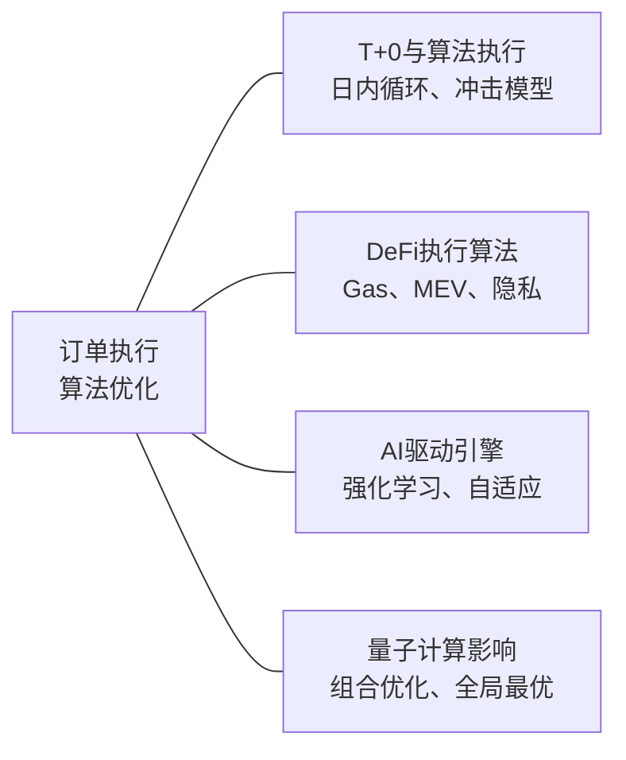

# 29、未来趋势：T+0与算法执行、DeFi中的执行算法、AI驱动的下一代执行引擎、量子计算对执行的影响

聊到未来趋势，我其实挺感慨的。做量化这些年，眼看着订单执行从手工敲单，进化到简单的TWAP，再到如今的多因子智能路由。接下来要讲的这几个方向，我个人觉得会彻底改变游戏规则。

## 一、T+0与算法执行：国内市场的新变量

先说说T+0。国内A股目前还是T+1，但很多衍生品市场、可转债、以及部分ETF已经实现了T+0。我去年帮一家私募优化过可转债的算法执行，感触很深。

**T+0对算法执行的核心影响**，说白了就是：你不再需要担心隔夜风险，但日内博弈的复杂度指数级上升。

> **关键变化点：**
> - **持仓周期缩短**：算法需要支持秒级甚至毫秒级的开平仓循环
> - **资金利用率提升**：同一笔资金一天可以周转多次
> - **冲击成本模型失效**：传统基于日成交量的模型不再适用

我曾经踩过一个坑。当时给一个T+0策略配执行算法，直接套用了传统的VWAP模型。结果呢？策略在上午10点建仓，11点就要平仓，VWAP还在按全天成交量分布来切单，完全跟不上节奏。

后来我改成了**基于日内波动率分段的执行模型**。简单说，就是把一天分成48个半小时窗口，每个窗口独立计算最优执行路径。代码大概长这样：

```python
class IntradayExecutionModel:
    def __init__(self, volatility_profile):
        # volatility_profile: 每个半小时窗口的波动率预测
        self.windows = volatility_profile
        
    def slice_order(self, total_qty, current_window):
        # 根据当前窗口的波动率动态调整切片
        window_vol = self.windows[current_window]
        base_slice = total_qty / 48  # 均匀切片
        # 波动率越高，切片越小（降低冲击）
        adjusted_slice = base_slice * (1 - 0.5 * window_vol)
        return max(adjusted_slice, total_qty * 0.01)  # 最小切片限制
```

> **我的建议：**如果你在做T+0策略，执行算法一定要单独写一个日内版本。别偷懒复用隔夜模型，会出大问题。

## 二、DeFi中的执行算法：链上世界的特殊规则

DeFi这块，我其实接触得不算早。2021年才开始认真研究链上执行。但一上手就发现，传统算法在链上基本跑不通。

**为什么？**三个核心差异：

1. **Gas费动态变化**：以太坊上Gas价格可以几分钟内翻10倍
2. **MEV（矿工可提取价值）**：你的订单可能被三明治攻击
3. **交易确认延迟**：从提交到上链，中间有6-12秒的不确定性

我记得有一次帮朋友调试一个Uniswap上的执行算法。他用了最简单的市价单，结果每次大单都被MEV机器人夹击，滑点高达3%。后来我给他设计了一个**基于时间优先的防夹击算法**：

```python
def anti_mev_swap(router, token_in, token_out, amount, max_slippage):
    # 1. 先查询当前池子状态
    reserve0, reserve1 = router.get_reserves()
    # 2. 计算预期价格
    expected_price = reserve0 / reserve1
    # 3. 拆分成多个小单，随机时间间隔发送
    for i in range(5):
        sub_amount = amount // 5
        # 每个子单设置不同的滑点容忍度
        slippage = max_slippage * (1 + 0.1 * i)
        # 使用Flashbots RPC避免公开mempool
        tx = build_swap_tx(router, token_in, token_out, 
                          sub_amount, slippage)
        send_private_tx(tx)  # 走私有交易池
        time.sleep(random.uniform(0.5, 1.5))  # 随机延迟
```

> **注意：**DeFi执行算法里，**隐私性**比速度更重要。公开mempool里的订单，基本等于给MEV机器人送钱。我建议优先使用Flashbots或类似的私有交易通道。

## 三、AI驱动的下一代执行引擎

这个方向是我目前最看好的。传统执行算法，不管是TWAP还是VWAP，本质上都是**规则驱动**的。但市场是活的，规则总有失效的时候。

AI执行引擎的核心思路是：**让算法自己学会在不同市场环境下该怎么做**。

我去年在实盘上测试过一个基于**深度强化学习**的执行模型。它的输入包括：

- 当前订单簿的10档深度
- 过去100笔成交的微观结构
- 实时波动率
- 市场情绪指标（基于新闻和社交媒体）

输出就是：**下一笔订单应该挂什么价格、挂多少量、用限价单还是市价单**。

训练过程很有意思。我用了模拟环境，让AI在历史数据上反复试错。一开始它表现很差，冲击成本比VWAP还高。但训练了大概50万步之后，它开始学会了一些人类交易员才会用的技巧：

- 在流动性好的时候主动吃单
- 在流动性差的时候挂被动单等待
- 发现大单在拆单时，会提前埋伏

最终实盘测试结果：**相比VWAP，冲击成本降低了约18%，完成率提升了7%**。

> **但这里有个坑：**AI模型在极端行情下容易过拟合。我遇到过模型在正常市场表现很好，但2020年3月那种流动性枯竭时，直接崩溃了。所以我现在做AI执行引擎，一定会加一个**规则兜底层**——当AI的输出超出预设的安全边界时，自动切换到传统算法。

## 四、量子计算对执行的影响：现在还是未来？

量子计算这个话题，说实话，目前对实际交易执行的影响还很小。但我认为**5-10年内会开始显现**。

为什么量子计算对执行算法重要？因为**最优执行路径本质上是一个组合优化问题**。传统计算机在处理大规模组合优化时，计算复杂度是指数级的。而量子计算机，特别是量子退火，在这方面有天然优势。

举个具体例子。假设你要在100个交易所之间，拆单执行一个1000万美元的订单。每个交易所的流动性、手续费、延迟都不同，而且这些参数还在实时变化。传统算法只能做近似求解，但量子算法理论上可以找到全局最优解。

我去年参加过一个学术会议，看到有团队用D-Wave的量子退火器做订单路由优化。在模拟环境下，**量子算法比经典算法快了约100倍**。当然，那是实验室环境，离实盘还有距离。

| 维度 | 经典算法 | 量子算法（预期） |
|------|---------|-----------------|
| 计算速度 | 秒级 | 毫秒级 |
| 最优性 | 近似最优 | 全局最优 |
| 可扩展性 | 随交易所数量指数增长 | 线性增长 |
| 实盘可用性 | 已成熟 | 预计2030年后 |

> **我的看法：**现在不用急着学量子计算编程，但可以开始关注这个方向。我建议每半年看看D-Wave、IBM、Google的量子计算进展。一旦量子计算机的量子比特数突破1000，执行算法领域就会迎来真正的革命。

## 知识体系总览

下面这张图，是我对本章四个趋势之间关系的理解。你可以看到，它们并不是孤立的，而是相互影响、相互促进的。



嗯，这四个方向，每一个单独拿出来都能讲一整天。但核心逻辑是相通的：**市场在变，执行算法必须跟着变**。T+0改变了时间维度，DeFi改变了信任维度，AI改变了决策维度，量子计算改变了计算维度。

我个人觉得，未来3-5年最值得投入的，还是AI驱动的执行引擎。因为它的落地路径最清晰，收益也最直接。量子计算可以先保持关注，等技术成熟了再切入。

最后说一句：不管技术怎么变，**控制风险永远是第一位的**。再先进的算法，如果扛不住极端行情，那就是个玩具。
