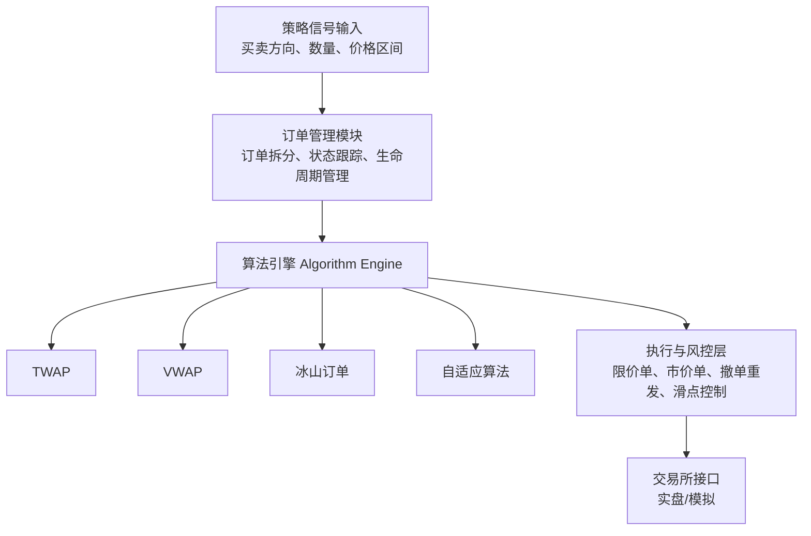

# 第三十章：综合实战项目——从零搭建一个完整的订单执行系统

终于到了这个系列的最后一章。说实话，写到这里我自己也有点感慨。

前面二十九章，我们聊了算法拆单、冰山订单、TWAP、VWAP、市场冲击模型……但这些东西如果只是零散地学，其实很难真正落地。我见过太多人，学了一堆算法，真到实盘的时候却不知道怎么把它们串起来。

所以这一章，我们就来干一件实在的事：**从零搭建一个完整的订单执行系统**。

## 30.1 系统架构设计：先画图，再写代码

我个人习惯，做任何系统之前，先画一张架构图。别急着写代码，想清楚再动手。



这张图其实就概括了我们整个系统的核心流程。从上到下，依次是：

- **策略信号输入**：接收来自上层策略的买卖指令
- **订单管理模块**：负责订单的拆分、状态跟踪
- **算法引擎**：核心，集成多种算法，可插拔切换
- **执行与风控层**：处理限价单、市价单、撤单逻辑
- **交易所接口**：对接实盘或模拟环境

> **我的经验：** 架构设计时，一定要把「算法引擎」和「执行层」分开。为什么？因为算法只负责「怎么拆」，执行层负责「怎么发」。耦合在一起，后期改一个算法就得动整个系统，太痛苦了。

## 30.2 核心代码实现：算法引擎与订单管理器

好，图有了，我们开始写代码。先看算法引擎的核心接口设计。

```python
from abc import ABC, abstractmethod
from dataclasses import dataclass
from typing import List, Optional
import pandas as pd
import numpy as np

@dataclass
class Order:
    symbol: str
    side: str  # 'buy' or 'sell'
    total_quantity: float
    price_limit: Optional[float] = None
    order_id: Optional[str] = None
    status: str = 'pending'  # pending, partial, filled, cancelled
    filled_quantity: float = 0.0
    avg_fill_price: float = 0.0

class ExecutionAlgorithm(ABC):
    """算法基类，所有具体算法继承此类"""
    
    @abstractmethod
    def generate_slices(self, order: Order, market_data: pd.DataFrame) -> List[dict]:
        """
        生成子订单切片
        返回: [{'quantity': 100, 'price': 10.5, 'time': '09:30:00'}, ...]
        """
        pass
    
    @abstractmethod
    def name(self) -> str:
        pass
```

这里我用了抽象基类。每个算法只需要实现 `generate_slices` 方法，返回一个切片列表。这样新增算法就像插U盘一样简单。

接下来，我们实现一个具体的TWAP算法：

```python
class TWAPAlgorithm(ExecutionAlgorithm):
    """时间加权平均价格算法"""
    
    def __init__(self, num_slices: int = 10):
        self.num_slices = num_slices
    
    def name(self) -> str:
        return "TWAP"
    
    def generate_slices(self, order: Order, market_data: pd.DataFrame) -> List[dict]:
        slice_qty = order.total_quantity / self.num_slices
        slices = []
        
        # 假设市场数据包含时间戳
        for i in range(self.num_slices):
            slices.append({
                'quantity': slice_qty,
                'price': order.price_limit,  # 使用限价
                'time': market_data.iloc[i]['timestamp'] if i < len(market_data) else None
            })
        return slices
```

> **注意：** 实际生产环境中，切片数量要根据市场流动性和订单规模动态调整。我见过有人把1000手分成1000份，每份1手，结果把交易所的订单簿刷爆了……嗯，别这么干。

然后是订单管理器，它负责调度算法和执行：

```python
class OrderManager:
    """订单管理器，协调算法与执行"""
    
    def __init__(self, algorithm: ExecutionAlgorithm, exchange_api):
        self.algorithm = algorithm
        self.exchange = exchange_api
        self.active_orders = {}
    
    def execute_order(self, order: Order, market_data: pd.DataFrame):
        """执行一个订单"""
        # 1. 生成切片
        slices = self.algorithm.generate_slices(order, market_data)
        
        # 2. 逐个发送子订单
        for i, slice_info in enumerate(slices):
            sub_order = Order(
                symbol=order.symbol,
                side=order.side,
                total_quantity=slice_info['quantity'],
                price_limit=slice_info.get('price'),
                order_id=f"{order.order_id}_{i}"
            )
            # 发送到交易所
            result = self.exchange.send_order(sub_order)
            self.active_orders[sub_order.order_id] = result
            
            # 3. 检查成交情况
            self._check_fill_status(sub_order)
    
    def switch_algorithm(self, new_algorithm: ExecutionAlgorithm):
        """运行时切换算法（热插拔）"""
        self.algorithm = new_algorithm
        print(f"算法已切换至: {new_algorithm.name()}")
    
    def _check_fill_status(self, order: Order):
        """检查订单成交状态"""
        # 实际项目中这里会轮询或使用WebSocket
        pass
```

## 30.3 集成多种算法：策略模式的应用

你可能注意到了，上面的设计其实就是一个经典的**策略模式**。每个算法是一个策略，订单管理器是上下文。

我建议把所有算法放在一个字典里，方便切换：

```python
class AlgorithmRegistry:
    """算法注册表，管理所有可用算法"""
    
    def __init__(self):
        self._algorithms = {}
    
    def register(self, name: str, algo_class: type):
        self._algorithms[name] = algo_class
    
    def get_algorithm(self, name: str, **kwargs) -> ExecutionAlgorithm:
        if name not in self._algorithms:
            raise ValueError(f"未知算法: {name}")
        return self._algorithms[name](**kwargs)
    
    def list_algorithms(self) -> List[str]:
        return list(self._algorithms.keys())

# 注册算法
registry = AlgorithmRegistry()
registry.register('twap', TWAPAlgorithm)
registry.register('vwap', VWAPAlgorithm)
registry.register('iceberg', IcebergAlgorithm)
registry.register('adaptive', AdaptiveAlgorithm)
```

> **避坑指南：** 我曾经在实盘系统中忘记注册新写的算法，结果回测跑得好好的，实盘却报错说找不到算法。后来我加了一个启动时的自检逻辑，遍历所有算法类，确保它们都注册了。这个习惯救了我好几次。

## 30.4 回测与实盘切换：同一套代码，两个世界

这是整个系统里最微妙的部分。回测和实盘，说白了就是「模拟」和「真金白银」的区别。但代码应该尽量复用。

我的做法是：定义一个统一的交易所接口抽象类：

```python
class ExchangeInterface(ABC):
    """交易所接口抽象类"""
    
    @abstractmethod
    def send_order(self, order: Order) -> dict:
        pass
    
    @abstractmethod
    def cancel_order(self, order_id: str) -> bool:
        pass
    
    @abstractmethod
    def get_market_data(self, symbol: str) -> pd.DataFrame:
        pass

class BacktestExchange(ExchangeInterface):
    """回测交易所（模拟）"""
    
    def __init__(self, historical_data: pd.DataFrame):
        self.data = historical_data
        self.slippage = 0.001  # 模拟滑点
    
    def send_order(self, order: Order) -> dict:
        # 模拟成交，考虑滑点和流动性
        fill_price = order.price_limit * (1 + self.slippage)
        return {
            'order_id': order.order_id,
            'status': 'filled',
            'fill_price': fill_price,
            'fill_quantity': order.total_quantity
        }
    
    def get_market_data(self, symbol: str) -> pd.DataFrame:
        return self.data

class LiveExchange(ExchangeInterface):
    """实盘交易所（对接券商API）"""
    
    def __init__(self, api_key: str, api_secret: str):
        self.api_key = api_key
        self.api_secret = api_secret
        # 初始化券商连接
    
    def send_order(self, order: Order) -> dict:
        # 调用券商API发送真实订单
        # response = broker_api.place_order(...)
        pass
    
    def get_market_data(self, symbol: str) -> pd.DataFrame:
        # 获取实时行情
        pass
```

然后在系统启动时，通过配置文件决定使用哪个接口：

```python
import json

def load_config(config_path: str) -> dict:
    with open(config_path, 'r') as f:
        return json.load(f)

def create_exchange(config: dict) -> ExchangeInterface:
    mode = config.get('mode', 'backtest')
    if mode == 'backtest':
        data = pd.read_csv(config['data_path'])
        return BacktestExchange(data)
    elif mode == 'live':
        return LiveExchange(
            api_key=config['api_key'],
            api_secret=config['api_secret']
        )
    else:
        raise ValueError(f"未知模式: {mode}")

# 使用示例
config = load_config('config.json')
exchange = create_exchange(config)
manager = OrderManager(registry.get_algorithm('twap', num_slices=20), exchange)
```

> **警告：** 回测和实盘最大的区别在于「延迟」和「不确定性」。回测中你的订单瞬间成交，实盘中可能挂半小时都成交不了。我建议在回测中加入随机延迟和部分成交的模拟，让回测更接近真实情况。

## 30.5 项目总结与展望

好了，整个系统搭建完了。我们来回顾一下我们做了什么：

- **架构设计**：分层清晰，算法与执行解耦
- **算法引擎**：支持热插拔，新增算法只需继承基类
- **回测与实盘**：通过接口抽象，一套代码跑两个环境
- **风控与执行**：限价单、撤单、滑点控制一应俱全

说实话，这个系统虽然看起来简单，但核心思想和大厂的生产系统是一样的。我当年在量化公司实习时，看到他们的订单执行系统也是类似的架构——只不过多了几十万行代码和一堆容错逻辑。

展望一下未来，有几个方向你可以继续深入：

1. **机器学习驱动的算法**：用强化学习动态调整切片策略
2. **多资产支持**：股票、期货、期权统一管理
3. **分布式部署**：用消息队列解耦各个模块，支持高并发
4. **实时风控仪表盘**：可视化监控订单执行状态

最后，我想说一句：**订单执行算法不是越复杂越好**。我见过有人用LSTM预测市场微观结构，结果跑出来的效果还不如简单的TWAP。有时候，简单就是美。

希望这个系列对你有所帮助。如果你在搭建过程中遇到什么问题，欢迎交流。毕竟，交易这条路，一个人走太孤单了。
