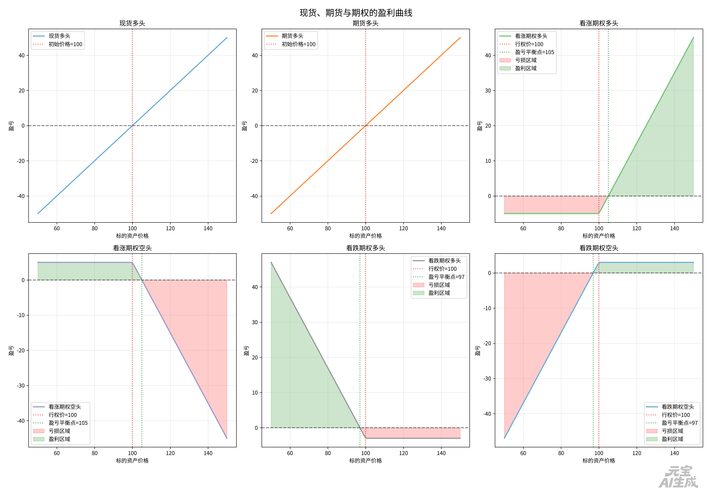

## 期权

### 定义

期权是一种金融衍生工具，赋予持有者在特定时间以特定价格买入或卖出标的资产的权利，但没有义务。期权分为两种类型：看涨期权（Call Option）和看跌期权（Put Option）。看涨期权允许持有者在未来某个时间以预定价格购买标的资产，而看跌期权则允许持有者以预定价格出售标的资产。

期权买方支付期权费（Premium）购买期权，并获得在未来行使期权的权利。期权卖方（也称为期权写手）收取期权费，并承担在未来可能被行使的义务。

如果期权在到期时处于价内（In-the-Money），买方可以选择行使期权，获得利润；如果期权处于价外（Out-of-the-Money），买方通常会放弃行使期权，损失仅限于支付的期权费。

Call Option（看涨期权）和 Put Option（看跌期权）的买方支付期权费，获得在未来行使期权的权利。

买卖方作为对手盘

### 欧式期权 VS 美式期权

欧式期权只能在到期日行使，而美式期权可以在到期日前的任何时间行使。由于美式期权提供了更大的灵活性，因此通常比欧式期权更昂贵。

### 举例

具体举例说明

#### 场景一：看涨期权

期权合约：一张“苹果4月18日到期、行权价185美元的看涨期权”，当前权利金为 5美元/股（一张合约控制100股，总价500美元）。

- 买方（看涨者）：
  - 动作：支付 500美元​ 权利金，买入这张合约。
  - 权利：在4月18日或之前，有权利以 185美元​ 的价格买入100股苹果股票。
  - 心态：他认为到期前苹果股价会大涨超过 190美元（行权价185+权利金5）。
  - 盈亏：
    - 到期时股价 ≤ 185美元：期权无价值，他损失全部 500美元​ 权利金。
    - 到期时股价 = 190美元：他行权不赚不赔（赚的股价差刚好抵权利金）。
    - 到期时股价 = 200美元：他行权可赚 (200-185)*100 = 1500美元，减去500成本，净赚 1000美元（收益率200%）。
- 卖方（义务承担者）：
  - 动作：收取 500美元​ 权利金，卖出这张合约。
  - 义务：如果买方选择行权，他必须以185美元的价格卖出100股苹果股票（无论市场价多高）。
  - 心态：他认为到期前苹果股价不会超过190美元。他可能本身持有苹果股票（备兑开仓），或只是单纯看震荡/下跌（裸卖空，风险极高）。
  - 盈亏：
    - 到期时股价 ≤ 185美元：买方不行权，他白赚 500美元​ 权利金。
    - 到期时股价 = 190美元：刚好不赚不赔。
    - 到期时股价 = 200美元：他必须按185美元卖出市价200美元的股票，每股亏损15美元，总计亏损 1500美元，但之前收了500权利金，净亏 1000美元。如果股价一直涨，他的亏损理论上是无限的。

#### 场景二：看跌期权

期权合约：一张“苹果4月18日到期、行权价175美元的看跌期权”，权利金为 4美元/股（总价400美元）。

- 买方（看跌者/保险购买者）：
  - 动作：支付 400美元，买入这张合约。
  - 权利：在到期前，有权利以 175美元​ 的价格卖出100股苹果股票。
  - 心态：1) 投机：认为股价会大跌。2) 保险：持有苹果股票，担心下跌，买入看跌期权对冲风险（股价大跌时，期权盈利可弥补股票损失）。
  - 盈亏：
    - 到期时股价 ≥ 175美元：期权无价值，损失 400美元​ 权利金（保险保费）。
    - 到期时股价 = 171美元：行权不赚不赔。
到期时股价 = 160美元：行权可赚 (175-160)*100 = 1500美元，减去400成本，净赚 1100美元。
- 卖方（保险出售者）：
  - 动作：收取 400美元​ 权利金。
  - 义务：如果买方行权，他必须以175美元的价格买入买方卖出的100股苹果股票（无论市场价多低）。
  - 心态：他认为股价不会跌破171美元。他可能想以更低成本买入股票（愿意在175接货），或单纯看涨/震荡。
  - 盈亏：
    - 到期时股价 ≥ 175美元：白赚 400美元。
    - 到期时股价 = 160美元：他必须按175美元买入市价160美元的股票，每股立即浮亏15美元，总计亏损 1500美元，扣除400权利金，净亏 1100美元。最大亏损发生在股价跌至0时，为 (175-0)*100 - 400 = 17100美元。

### 盈利曲线

### 状态分类

| 状态 | call | put | 特征 |
| ------ | ------ | ------ | ------ |
| 实值（In-the-Money） | 股价 > 行权价 | 股价 < 行权价 | 期权具有内在价值，行权有利可图 |
| 虚值（Out-of-the-Money） | 股价 < 行权价 |  股价 > 行权价 | 期权没有内在价值，仅含有时间价值 |
| 平值（At-the-Money） | 股价 = 行权价 | 股价 = 行权价 | 权利金 约等于 时间价值 |

### 价值

期权的价值由内在价值和时间价值组成：

#### 内在价值

- 看涨期权：内在价值 = max(0, 股价 - 行权价)
- 看跌期权：内在价值 = max(0, 行权价 - 股价)
- 内在价值反映了期权当前的实际盈利情况，只有当期权处于实值状态时才有内在价值。

#### 时间价值

- 时间价值 = 权利金 - 内在价值
- 时间价值反映了期权到期前潜在盈利的可能性，受多种因素影响，包括剩余时间、标的资产价格波动性、市场利率等。
- 时间价值随着期权到期日的临近而逐渐减少，最终在到期日时为零。

### 策略

#### 备兑看涨（Covered Call）

投资者持有标的资产的同时卖出看涨期权，收取权利金以增加收益，但限制了潜在的上涨收益。
