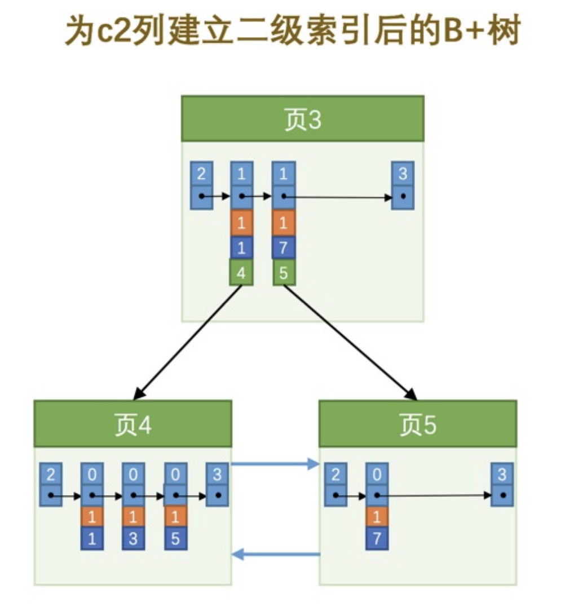

# MySQL是怎样运行的

## 第一章

### 通信方式

#### TCP/IP

真实环境中，数据库服务器进程和客户端进程可能运行在不同的主机中，它们之间必须通过网络来进行通讯。MySQL采用TCP作为服务器和客户端之间的网络通信协议。在网络环境下，每台计算机都有一个唯一的IP地址，如果某个进程有需要采用TCP协议进行网络通信方面的需求，可以向操作系统申请一个端口号，这是一个整数值，它的取值范围是0~65535。这样在网络中的其他进程就可以通过IP地址 + 端口号的方式来与这个进程连接，这样进程之间就可以通过网络进行通信了

#### 命名管道和共享内存

如果你是一个`Windows`用户，那么客户端进程和服务器进程之间可以考虑使用`命名管道`或`共享内存`进行通信。不过启用这些通信方式的时候需要在启动服务器程序和客户端程序时添加一些参数：

- 使用`命名管道`来进行进程间通信

    需要在启动服务器程序的命令中加上`--enable-named-pipe`参数，然后在启动客户端程序的命令中加入`--pipe`或者`--protocol=pipe`参数。

- 使用`共享内存`来进行进程间通信

    需要在启动服务器程序的命令中加上`--shared-memory`参数，在成功启动服务器后，`共享内存`便成为本地客户端程序的默认连接方式，不过我们也可以在启动客户端程序的命令中加入`--protocol=memory`参数来显式的指定使用共享内存进行通信。

    不过需要注意的是，使用`共享内存`的方式进行通信的服务器进程和客户端进程必须在同一台`Windows`主机中。

#### Unix域套接字文件

如果我们的服务器进程和客户端进程都运行在同一台操作系统为类`Unix`的机器上的话，我们可以使用`Unix域套接字文件`来进行进程间通信。如果我们在启动客户端程序的时候指定的主机名为`localhost`，或者指定了`--protocol=socket`的启动参数，那服务器程序和客户端程序之间就可以通过`Unix`域套接字文件来进行通信了。`MySQL`服务器程序默认监听的`Unix`域套接字文件路径为`/tmp/mysql.sock`，客户端程序也默认连接到这个`Unix`域套接字文件。如果我们想改变这个默认路径，可以在启动服务器程序时指定`socket`参数，就像这样：

```
mysqld --socket=/tmp/a.txt
```

这样服务器启动后便会监听`/tmp/a.txt`。在服务器改变了默认的`UNIX`域套接字文件后，如果客户端程序想通过`UNIX`域套接字文件进行通信的话，也需要显式的指定连接到的`UNIX`域套接字文件路径，就像这样：

```
mysql -hlocalhost -uroot --socket=/tmp/a.txt -p
```

这样该客户端进程和服务器进程就可以通过路径为`/tmp/a.txt`的`Unix`域套接字文件进行通信了。

### 处理过程

其实不论客户端进程和服务器进程是采用哪种方式进行通信，最后实现的效果都是：<span style="color:red">客户端进程向服务器进程发送一段文本（MySQL语句），服务器进程处理后再向客户端进程发送一段文本（处理结果）</span>。那服务器进程对客户端进程发送的请求做了什么处理，才能产生最后的处理结果呢？客户端可以向服务器发送增删改查各类请求，我们这里以比较复杂的查询请求为例来画个图展示一下大致的过程：
`连接管理`、`解析与优化`、`存储引擎`

#### 连接管理

每当有一个客户端进程连接到服务器进程时，服务器进程都会创建一个线程来专门处理与这个客户端的交互，当该客户端退出时会与服务器断开连接，服务器并不会立即把与该客户端交互的线程销毁掉，而是把它缓存起来，在另一个新的客户端再进行连接时，把这个缓存的线程分配给该新客户端。这样就起到了不频繁创建和销毁线程的效果，从而节省开销。

当连接建立后，与该客户端关联的服务器线程会一直等待客户端发送过来的请求，`MySQL`服务器接收到的请求只是一个文本消息，该文本消息还要经过各种处。

#### 解析与优化

`MySQL`服务器已经获得了文本形式的请求，接着
还要经过九九八十一难的处理，其中的几个比较重要的部分分别是`查询缓存`、`语法解析`和`查询优化`，下边我们详细来看。

##### 查询缓存

`MySQL`服务器程序处理查询请求会把刚刚处理过的查询请求和结果`缓存`起来，如果下一次有一模一样的请求过来，直接从缓存中查找结果就好了，就不用再傻呵呵的去底层的表中查找了。这个查询缓存可以在不同客户端之间共享，也就是说如果客户端A刚刚查询了一个语句，而客户端B之后发送了同样的查询请求，那么客户端B的这次查询就可以直接使用查询缓存中的数据

<span style="color:red">如果两个查询请求在任何字符上的不同（例如：空格、注释、大小写），都会导致缓存不会命中</span>。另外，<span style="color:red">如果查询请求中包含某些系统函数、用户自定义变量和函数、一些系统表，如 mysql 、information_schema、 performance_schema 数据库中的表，那这个请求就不会被缓存</span>。以某些系统函数举例，可能同样的函数的两次调用会产生不一样的结果，比如函数`NOW`，每次调用都会产生最新的当前时间，如果在一个查询请求中调用了这个函数，那即使查询请求的文本信息都一样，那不同时间的两次查询也应该得到不同的结果，如果在第一次查询时就缓存了，那第二次查询的时候直接使用第一次查询的结果就是错误的！

不过既然是缓存，那就有它缓存失效的时候。<span style="color:red">MySQL的缓存系统会监测涉及到的每张表，只要该表的结构或者数据被修改，如对该表使用了`INSERT`、 `UPDATE`、`DELETE`、`TRUNCATE TABLE`、`ALTER TABLE`、`DROP TABLE`或 `DROP DATABASE`语句，那使用该表的所有高速缓存查询都将变为无效并从高速缓存中删除</span>！

```!
小贴士：

虽然查询缓存有时可以提升系统性能，但也不得不因维护这块缓存而造成一些开销，比如每次都要去查询缓存中检索，查询请求处理完需要更新查询缓存，维护该查询缓存对应的内存区域。从MySQL 5.7.20开始，不推荐使用查询缓存，并在MySQL 8.0中删除。
```

##### 语法解析

因为客户端程序发送过来的请求只是一段文本而已，所以`MySQL`服务器程序首先要对这段文本做分析，判断请求的语法是否正确，然后从文本中将要查询的表、各种查询条件都提取出来放到`MySQL`服务器内部使用的一些数据结构上来。

##### 查询优化

语法解析之后，服务器程序获得到了需要的信息，比如要查询的列是哪些，表是哪个，搜索条件是什么等等，但光有这些是不够的，因为我们写的`MySQL`语句执行起来效率可能并不是很高，`MySQL`的优化程序会对我们的语句做一些优化，如外连接转换为内连接、表达式简化、子查询转为连接等。优化的结果就是生成一个执行计划，这个执行计划表明了应该使用哪些索引进行查询，表之间的连接顺序是啥样的。可以使用`EXPLAIN`语句来查看某个语句的执行计划。

### 存储引擎

截止到服务器程序完成了查询优化为止，还没有真正的去访问真实的数据表，`MySQL`服务器把数据的存储和提取操作都封装到了一个叫`存储引擎`的模块里。我们知道`表`是由一行一行的记录组成的，但这只是一个逻辑上的概念，物理上如何表示记录，怎么从表中读取数据，怎么把数据写入具体的物理存储器上，这都是`存储引擎`负责的事情。为了实现不同的功能，`MySQL`提供了各式各样的`存储引擎`，不同`存储引擎`管理的表具体的存储结构可能不同，采用的存取算法也可能不同。

为了管理方便，人们把`连接管理`、`查询缓存`、`语法解析`、`查询优化`这些并不涉及真实数据存储的功能划分为`MySQL server`的功能，把真实存取数据的功能划分为`存储引擎`的功能。各种不同的存储引擎向上边的`MySQL server`层提供统一的调用接口（也就是存储引擎API），包含了几十个底层函数，像"读取索引第一条内容"、"读取索引下一条内容"、"插入记录"等等。

#### 常用存储引擎

|存储引擎|描述|
|:--:|:--:|
|`ARCHIVE`|用于数据存档（行被插入后不能再修改）|
|`BLACKHOLE`|丢弃写操作，读操作会返回空内容|
|`CSV`|在存储数据时，以逗号分隔各个数据项|
|`FEDERATED`|用来访问远程表|
|`InnoDB`|具备外键支持功能的事务存储引擎|
|`MEMORY`|置于内存的表|
|`MERGE`|用来管理多个MyISAM表构成的表集合|
|`MyISAM`|主要的非事务处理存储引擎|
|`NDB`|MySQL集群专用存储引擎|

|Feature	|MyISAM	|Memory	|InnoDB	|Archive	|NDB|
|:--:|:--:|:--:|:--:|:--:|:--:|
|B-tree indexes	|yes	|yes	|yes	|no	|no|
|Backup/point-in-time recovery 	|yes	|yes	|yes	|yes	|yes|
|Cluster database support	|no	|no	|no	|no	|yes|
|Clustered indexes	|no	|no	|yes	|no	|no|
|Compressed data	|yes 	|no	|yes	|yes	|no|
|Data caches	|no	|N/A	|yes	|no	|yes|
|Encrypted data 	|yes	|yes	|yes	|yes	|yes|
|Foreign key support	|no	|no	|yes	|no	|yes |
|Full-text search indexes	|yes	|no	|yes 	|no	|no|
|Geospatial data type support	|yes	|no	|yes	|yes	|yes|
|Geospatial indexing support	|yes	|no	|yes 	|no	|no|
|Hash indexes	|no	|yes	|no 	|no	|yes|
|Index caches	|yes	|N/A	|yes	|no	|yes|
|Locking granularity	|Table	|Table	|Row	|Row	|Row|
|MVCC	|no	|no	|yes	|no	|no|
|Query cache support	|yes	|yes	|yes	|yes	|yes|
|Replication support 	|yes	|Limited 	|yes	|yes	|yes|
|Storage limits	|256TB	|RAM	|64TB	|None	|384EB|
|T-tree indexes	|no	|no	|no	|no	|yes|
|Transactions	|no	|no	|yes	|no	|yes|
|Update statistics for data dictionary	|yes	|yes	|yes	|yes	|yes|

#### 相关操作

```
mysql> SHOW ENGINES;
+--------------------+---------+----------------------------------------------------------------+--------------+------+------------+
| Engine             | Support | Comment                                                        | Transactions | XA   | Savepoints |
+--------------------+---------+----------------------------------------------------------------+--------------+------+------------+
| InnoDB             | DEFAULT | Supports transactions, row-level locking, and foreign keys     | YES          | YES  | YES        |
| MRG_MYISAM         | YES     | Collection of identical MyISAM tables                          | NO           | NO   | NO         |
| MEMORY             | YES     | Hash based, stored in memory, useful for temporary tables      | NO           | NO   | NO         |
| BLACKHOLE          | YES     | /dev/null storage engine (anything you write to it disappears) | NO           | NO   | NO         |
| MyISAM             | YES     | MyISAM storage engine                                          | NO           | NO   | NO         |
| CSV                | YES     | CSV storage engine                                             | NO           | NO   | NO         |
| ARCHIVE            | YES     | Archive storage engine                                         | NO           | NO   | NO         |
| PERFORMANCE_SCHEMA | YES     | Performance Schema                                             | NO           | NO   | NO         |
| FEDERATED          | NO      | Federated MySQL storage engine                                 | NULL         | NULL | NULL       |
+--------------------+---------+----------------------------------------------------------------+--------------+------+------------+
9 rows in set (0.00 sec)


# 创建表时指定存储引擎
CREATE TABLE 表名(
    建表语句;
) ENGINE = 存储引擎名称;
# 修改
ALTER TABLE 表名 ENGINE = 存储引擎名称;
```

其中的`Support`列表示该存储引擎是否可用，`DEFAULT`值代表是当前服务器程序的默认存储引擎。`Comment`列是对存储引擎的一个描述，英文的，将就着看吧。`Transactions`列代表该存储引擎是否支持事务处理。`XA`列代表着该存储引擎是否支持分布式事务。`Savepoints`代表着该列是否支持部分事务回滚

## 第二章 启动选项和配置文件

### 配置文件

`MySQL`程序在启动时会寻找多个路径下的配置文件，这些路径有的是固定的，有的是可以在命令行指定的.
在类UNIX操作系统中，MySQL会按照下列路径来寻找配置文件：

|路径名|备注|
|--|--|
|`/etc/my.cnf`||
|`/etc/mysql/my.cnf`||
|`SYSCONFDIR/my.cnf`||
|`$MYSQL_HOME/my.cnf`|特定于服务器的选项（仅限服务器）|
|`defaults-extra-file`|命令行指定的额外配置文件路径|
|`~/.my.cnf`|用户特定选项|
|`~/.mylogin.cnf`|用户特定的登录路径选项（仅限客户端）|

像这个配置文件里就定义了许多个组，组名分别是server、mysqld、mysqld_safe、client、mysql、mysqladmin。每个组下边可以定义若干个启动选项

``` text
[server]
(具体的启动选项...)

[mysqld]
(具体的启动选项...)

[mysqld_safe]
(具体的启动选项...)

[client]
(具体的启动选项...)

[mysql]
(具体的启动选项...)

[mysqladmin]
(具体的启动选项...)
```

配置文件中不同的选项组是给不同的启动命令使用的，如果选项组名称与程序名称相同，则组中的选项将专门应用于该程序。例如， [mysqld]和[mysql]组分别应用于mysqld服务器程序和mysql客户端程序。不过有两个选项组比较特别：

- `[server]`组下边的启动选项将作用于所有的服务器程序。

- `[client]`组下边的启动选项将作用于所有的客户端程序。

为了直观感受一下，我们挑一些启动命令来看一下它们能读取的选项组都有哪些：

|启动命令|类别|能读取的组|
|:--:|:--:|:--:|
|`mysqld`|启动服务器|`[mysqld]`、`[server]`|
|`mysqld_safe`|启动服务器|`[mysqld]`、`[server]`、`[mysqld_safe]`|
|`mysql.server`|启动服务器|`[mysqld]`、`[server]`、`[mysql.server]`|
|`mysql`|启动客户端|`[mysql]`、`[client]`|
|`mysqladmin`|启动客户端|`[mysqladmin]`、`[client]`|
|`mysqldump`|启动客户端|`[mysqldump]`、`[client]`|

#### 优先级

##### 配置文件

<span style="color:red">如果我们在多个配置文件中设置了相同的启动选项，那以最后一个配置文件中的为准</span>。比方说`/etc/my.cnf`文件的内容是这样的：

```
[server]
default-storage-engine=InnoDB
```

而`~/.my.cnf`文件中的内容是这样的：

```
[server]
default-storage-engine=MyISAM
```

又因为`~/.my.cnf`比`/etc/my.cnf`顺序靠后，所以如果两个配置文件中出现相同的启动选项，以`~/.my.cnf`中的为准，所以`MySQL`服务器程序启动之后，`default-storage-engine`的值就是`MyISAM`。

##### 单一配置

同一个命令可以访问配置文件中的多个组，比如mysqld可以访问[mysqld]、[server]组，如果在同一个配置文件中，比如~/.my.cnf，在这些组里出现了同样的配置项，比如这样：

```
[server]
default-storage-engine=InnoDB

[mysqld]
default-storage-engine=MyISAM
```

么，将以最后一个出现的组中的启动选项为准，比方说例子中default-storage-engine既出现在[mysqld]组也出现在[server]组，因为[mysqld]组在[server]组后边，就以[mysqld]组中的配置项为准。

##### 命令行和配置文件中启动选项的区别

如果同一个启动选项既出现在命令行中，又出现在配置文件中，那么以命令行中的启动选项为准！

### 系统变量

`MySQL`服务器程序运行过程中会用到许多影响程序行为的变量，它们被称为`MySQL`系统变量，比如允许同时连入的客户端数量用系统变量`max_connections`表示，表的默认存储引擎用系统变量`default_storage_engine`表示，查询缓存的大小用系统变量`query_cache_size`表示，`MySQL`服务器程序的系统变量有好几百条，我们就不一一列举了。每个系统变量都有一个默认值，我们可以使用命令行或者配置文件中的选项在启动服务器时改变一些系统变量的值。大多数的系统变量的值也可以在程序运行过程中修改，而无需停止并重新启动它。

根据系统变量的作用范围的概念，具体来说作用范围分为这两种：

- `GLOBAL`：全局变量，影响服务器的整体操作。

- `SESSION`：会话变量，影响某个客户端连接的操作。（注：`SESSION`有个别名叫`LOCAL`）

#### 命令

##### 查看

```shell
SHOW VARIABLES [LIKE 匹配的模式];
```

##### 设置

```
SET [GLOBAL|SESSION] 系统变量名 = 值;
```

#### 注意

- <span style="color:red">并不是所有系统变量都具有`GLOBAL`和`SESSION`的作用范围</span>。

  - 有一些系统变量只具有`GLOBAL`作用范围，比方说`max_connections`，表示服务器程序支持同时最多有多少个客户端程序进行连接。

  - 有一些系统变量只具有`SESSION`作用范围，比如`insert_id`，表示在对某个包含`AUTO_INCREMENT`列的表进行插入时，该列初始的值。

  - 有一些系统变量的值既具有`GLOBAL`作用范围，也具有`SESSION`作用范围，比如我们前边用到的`default_storage_engine`，而且其实大部分的系统变量都是这样的，

- <span style="color:red">有些系统变量是只读的，并不能设置值</span>。

    比方说`version`，表示当前`MySQL`的版本，我们客户端是不能设置它的值的，只能在`SHOW VARIABLES`语句里查看。

### 状态变量

为了让我们更好的了解服务器程序的运行情况，`MySQL`服务器程序中维护了好多关于程序运行状态的变量，它们被称为`状态变量`。比方说`Threads_connected`表示当前有多少客户端与服务器建立了连接。

由于`状态变量`是用来显示服务器程序运行状况的，所以<span style="color:red">它们的值只能由服务器程序自己来设置，我们程序员是不能设置的</span>。与`系统变量`类似，`状态变量`也有`GLOBAL`和`SESSION`两个作用范围的，所以查看`状态变量`的语句可以这么写：

```
SHOW [GLOBAL|SESSION] STATUS [LIKE 匹配的模式];
```

类似的，如果我们不写明作用范围，默认的作用范围是`SESSION`，比方说这样：

```
mysql> SHOW STATUS LIKE 'thread%';
+-------------------+-------+
| Variable_name     | Value |
+-------------------+-------+
| Threads_cached    | 0     |
| Threads_connected | 1     |
| Threads_created   | 1     |
| Threads_running   | 1     |
+-------------------+-------+
4 rows in set (0.00 sec)

mysql>
```

所有以`Thread`开头的`SESSION`作用范围的状态变量就都被展示出来了。

## 第三章 字符集和比较规则

### 概念

#### 字符集

描述某个字符范围的编码规则。

常见字符集

- `ASCII`字符集

    共收录128个字符，包括空格、标点符号、数字、大小写字母和一些不可见字符。由于总共才128个字符，所以可以使用1个字节来进行编码，我们看一些字符的编码方式：

    ```
    'L' ->  01001100（十六进制：0x4C，十进制：76）
    'M' ->  01001101（十六进制：0x4D，十进制：77）
    ```

- `ISO 8859-1`字符集

    共收录256个字符，是在`ASCII`字符集的基础上又扩充了128个西欧常用字符(包括德法两国的字母)，也可以使用1个字节来进行编码。这个字符集也有一个别名`latin1`。

- `GB2312`字符集

    收录了汉字以及拉丁字母、希腊字母、日文平假名及片假名字母、俄语西里尔字母。其中收录汉字6763个，其他文字符号682个。同时这种字符集又兼容`ASCII`字符集，所以在编码方式上显得有些奇怪：

  - 如果该字符在`ASCII`字符集中，则采用1字节编码。
  - 否则采用2字节编码。

    这种表示一个字符需要的字节数可能不同的编码方式称为`变长编码方式`。比方说字符串`'爱u'`，其中`'爱'`需要用2个字节进行编码，编码后的十六进制表示为`0xCED2`，`'u'`需要用1个字节进行编码，编码后的十六进制表示为`0x75`，所以拼合起来就是`0xCED275`。

    ```!
    小贴士：
    
    我们怎么区分某个字节代表一个单独的字符还是代表某个字符的一部分呢？别忘了`ASCII`字符集只收录128个字符，使用0～127就可以表示全部字符，所以如果某个字节是在0～127之内的，就意味着一个字节代表一个单独的字符，否则就是两个字节代表一个单独的字符。
    ```

- `GBK`字符集

    `GBK`字符集只是在收录字符范围上对`GB2312`字符集作了扩充，编码方式上兼容`GB2312`。

- `utf8`字符集

    收录地球上能想到的所有字符，而且还在不断扩充。这种字符集兼容`ASCII`字符集，采用变长编码方式，编码一个字符需要使用1～4个字节，比方说这样：

    ```
    'L' ->  01001100（十六进制：0x4C）
    '啊' ->  111001011001010110001010（十六进制：0xE5958A）
    ```

    ```!
    小贴士：
    
    其实准确的说，utf8只是Unicode字符集的一种编码方案，Unicode字符集可以采用utf8、utf16、utf32这几种编码方案，utf8使用1～4个字节编码一个字符，utf16使用2个或4个字节编码一个字符，utf32使用4个字节编码一个字符。更详细的Unicode和其编码方案的知识不是本书的重点，大家上网查查哈～
    
    MySQL中并不区分字符集和编码方案的概念，所以后边唠叨的时候把utf8、utf16、utf32都当作一种字符集对待。
    ```

对于同一个字符，不同字符集也可能有不同的编码方式。比如对于汉字`'我'`来说，`ASCII`字符集中根本没有收录这个字符，`utf8`和`gb2312`字符集对汉字`我`的编码方式如下：

```text
utf8编码：111001101000100010010001 (3个字节，十六进制表示是：0xE68891)
gb2312编码：1100111011010010 (2个字节，十六进制表示是：0xCED2)
```

#### 比较规则

在我们确定了xiaohaizi字符集表示字符的范围以及编码规则后，怎么比较两个字符的大小呢？最容易想到的就是直接比较这两个字符对应的二进制编码的大小，比方说字符'a'的编码为0x01，字符'b'的编码为0x02，所以'a'小于'b'，这种简单的比较规则也可以被称为二进制比较规则，英文名为binary collation。

### 在MySQL中

`utf8`字符集表示一个字符需要使用1～4个字节，但是我们常用的一些字符使用1～3个字节就可以表示了。而在`MySQL`中字符集表示一个字符所用最大字节长度在某些方面会影响系统的存储和性能，所以设计`MySQL`的大叔偷偷的定义了两个概念：

- `utf8mb3`：阉割过的`utf8`字符集，只使用1～3个字节表示字符。

- `utf8mb4`：正宗的`utf8`字符集，使用1～4个字节表示字符。

有一点需要大家十分的注意，在`MySQL`中`utf8`是`utf8mb3`的别名，所以之后在`MySQL`中提到`utf8`就意味着使用1~3个字节来表示一个字符，如果大家有使用4字节编码一个字符的情况，比如存储一些emoji表情啥的，那请使用`utf8mb4`。

#### 字符集的支持

`MySQL`支持好多好多种字符集，查看当前`MySQL`中支持的字符集可以用下边这个语句：

```
SHOW (CHARACTER SET|CHARSET) [LIKE 匹配的模式];
```

其中`CHARACTER SET`和`CHARSET`是同义词，用任意一个都可以。我们查询一下（支持的字符集太多了，我们省略了一些）

```shell
mysql> SHOW CHARSET;
+----------+---------------------------------+---------------------+--------+
| Charset  | Description                     | Default collation   | Maxlen |
+----------+---------------------------------+---------------------+--------+
| big5     | Big5 Traditional Chinese        | big5_chinese_ci     |      2 |
...
| latin1   | cp1252 West European            | latin1_swedish_ci   |      1 |
| latin2   | ISO 8859-2 Central European     | latin2_general_ci   |      1 |
...
| ascii    | US ASCII                        | ascii_general_ci    |      1 |
...
| gb2312   | GB2312 Simplified Chinese       | gb2312_chinese_ci   |      2 |
...
| gbk      | GBK Simplified Chinese          | gbk_chinese_ci      |      2 |
| latin5   | ISO 8859-9 Turkish              | latin5_turkish_ci   |      1 |
...
| utf8     | UTF-8 Unicode                   | utf8_general_ci     |      3 |
| ucs2     | UCS-2 Unicode                   | ucs2_general_ci     |      2 |
...
| latin7   | ISO 8859-13 Baltic              | latin7_general_ci   |      1 |
| utf8mb4  | UTF-8 Unicode                   | utf8mb4_general_ci  |      4 |
| utf16    | UTF-16 Unicode                  | utf16_general_ci    |      4 |
| utf16le  | UTF-16LE Unicode                | utf16le_general_ci  |      4 |
...
| utf32    | UTF-32 Unicode                  | utf32_general_ci    |      4 |
| binary   | Binary pseudo charset           | binary              |      1 |
...
| gb18030  | China National Standard GB18030 | gb18030_chinese_ci  |      4 |
+----------+---------------------------------+---------------------+--------+
41 rows in set (0.01 sec)
```

#### 比较规则的支持

查看`MySQL`中支持的比较规则的命令如下：

```
SHOW COLLATION [LIKE 匹配的模式];
```

我们前边说过一种字符集可能对应着若干种比较规则，`MySQL`支持的字符集就已经非常多了，所以支持的比较规则更多，我们先只查看一下`utf8`字符集下的比较规则：

```
mysql> SHOW COLLATION LIKE 'utf8\_%';
+--------------------------+---------+-----+---------+----------+---------+
| Collation                | Charset | Id  | Default | Compiled | Sortlen |
+--------------------------+---------+-----+---------+----------+---------+
| utf8_general_ci          | utf8    |  33 | Yes     | Yes      |       1 |
| utf8_bin                 | utf8    |  83 |         | Yes      |       1 |
| utf8_unicode_ci          | utf8    | 192 |         | Yes      |       8 |
| utf8_icelandic_ci        | utf8    | 193 |         | Yes      |       8 |
| utf8_latvian_ci          | utf8    | 194 |         | Yes      |       8 |
| utf8_romanian_ci         | utf8    | 195 |         | Yes      |       8 |
| utf8_slovenian_ci        | utf8    | 196 |         | Yes      |       8 |
| utf8_polish_ci           | utf8    | 197 |         | Yes      |       8 |
| utf8_estonian_ci         | utf8    | 198 |         | Yes      |       8 |
| utf8_spanish_ci          | utf8    | 199 |         | Yes      |       8 |
| utf8_swedish_ci          | utf8    | 200 |         | Yes      |       8 |
| utf8_turkish_ci          | utf8    | 201 |         | Yes      |       8 |
| utf8_czech_ci            | utf8    | 202 |         | Yes      |       8 |
| utf8_danish_ci           | utf8    | 203 |         | Yes      |       8 |
| utf8_lithuanian_ci       | utf8    | 204 |         | Yes      |       8 |
| utf8_slovak_ci           | utf8    | 205 |         | Yes      |       8 |
| utf8_spanish2_ci         | utf8    | 206 |         | Yes      |       8 |
| utf8_roman_ci            | utf8    | 207 |         | Yes      |       8 |
| utf8_persian_ci          | utf8    | 208 |         | Yes      |       8 |
| utf8_esperanto_ci        | utf8    | 209 |         | Yes      |       8 |
| utf8_hungarian_ci        | utf8    | 210 |         | Yes      |       8 |
| utf8_sinhala_ci          | utf8    | 211 |         | Yes      |       8 |
| utf8_german2_ci          | utf8    | 212 |         | Yes      |       8 |
| utf8_croatian_ci         | utf8    | 213 |         | Yes      |       8 |
| utf8_unicode_520_ci      | utf8    | 214 |         | Yes      |       8 |
| utf8_vietnamese_ci       | utf8    | 215 |         | Yes      |       8 |
| utf8_general_mysql500_ci | utf8    | 223 |         | Yes      |       1 |
+--------------------------+---------+-----+---------+----------+---------+
27 rows in set (0.00 sec)
```

<span style="color:red">每种字符集对应若干种比较规则，每种字符集都有一种默认的比较规则</span>，`SHOW COLLATION`的返回结果中的`Default`列的值为`YES`的就是该字符集的默认比较规则，比方说`utf8`字符集默认的比较规则就是`utf8_general_ci`

#### MySQL中的级别

`MySQL`有4个级别的字符集和比较规则，分别是：

- 服务器级别
- 数据库级别
- 表级别
- 列级别

##### 服务器级别

`MySQL`提供了两个系统变量来表示服务器级别的字符集和比较规则：

|系统变量|描述|
|:--:|:--:|
|`character_set_server`|服务器级别的字符集|
|`collation_server`|服务器级别的比较规则|

```text
mysql> SHOW VARIABLES LIKE 'character_set_server';
+----------------------+-------+
| Variable_name        | Value |
+----------------------+-------+
| character_set_server | utf8  |
+----------------------+-------+
1 row in set (0.00 sec)

mysql> SHOW VARIABLES LIKE 'collation_server';
+------------------+-----------------+
| Variable_name    | Value           |
+------------------+-----------------+
| collation_server | utf8_general_ci |
+------------------+-----------------+
1 row in set (0.00 sec)

```

在启动服务器程序时通过启动选项或者在服务器程序运行过程中使用`SET`语句修改这两个变量的值。比如我们可以在配置文件中这样写：

```
[server]
character_set_server=gbk
collation_server=gbk_chinese_ci
```

##### 数据库级别

在创建和修改数据库的时候可以指定该数据库的字符集和比较规则，具体语法如下

```text
CREATE DATABASE 数据库名
    [[DEFAULT] CHARACTER SET 字符集名称]
    [[DEFAULT] COLLATE 比较规则名称];

ALTER DATABASE 数据库名
    [[DEFAULT] CHARACTER SET 字符集名称]
    [[DEFAULT] COLLATE 比较规则名称];

#例子
mysql> CREATE DATABASE charset_demo_db
    -> CHARACTER SET gb2312
    -> COLLATE gb2312_chinese_ci;
Query OK, 1 row affected (0.01 sec)
```

如果想查看当前数据库使用的字符集和比较规则，可以查看下面两个系统变量的值（前提是使用`USE`语句选择当前默认数据库，如果没有默认数据库，则变量与相应的服务器级系统变量具有相同的值）：

|系统变量|描述|
|:--:|:--:|
|`character_set_database`|当前数据库的字符集|
|`collation_database`|当前数据库的比较规则|

```
mysql> USE charset_demo_db;
Database changed

mysql> SHOW VARIABLES LIKE 'character_set_database';
+------------------------+--------+
| Variable_name          | Value  |
+------------------------+--------+
| character_set_database | gb2312 |
+------------------------+--------+
1 row in set (0.00 sec)

mysql> SHOW VARIABLES LIKE 'collation_database';
+--------------------+-------------------+
| Variable_name      | Value             |
+--------------------+-------------------+
| collation_database | gb2312_chinese_ci |
+--------------------+-------------------+
1 row in set (0.00 sec)

mysql>
```

可以看到这个`charset_demo_db`数据库的字符集和比较规则就是我们在创建语句中指定的。需要注意的一点是：<span style="color:red"> ***character_set_database*** 和 ***collation_database*** 这两个系统变量是只读的，我们不能通过修改这两个变量的值而改变当前数据库的字符集和比较规则</span>。

数据库的创建语句中也可以不指定字符集和比较规则，比如这样：

```shell
CREATE DATABASE 数据库名;
```

<span style="color:red">这样的话将使用服务器级别的字符集和比较规则作为数据库的字符集和比较规则</span>。

##### 表级别

在创建和修改表的时候指定表的字符集和比较规则，语法如下：

```
CREATE TABLE 表名 (列的信息)
    [[DEFAULT] CHARACTER SET 字符集名称]
    [COLLATE 比较规则名称]]

ALTER TABLE 表名
    [[DEFAULT] CHARACTER SET 字符集名称]
    [COLLATE 比较规则名称]
```

比方说我们在刚刚创建的`charset_demo_db`数据库中创建一个名为`t`的表，并指定这个表的字符集和比较规则：

```shell
mysql> CREATE TABLE t(
    ->     col VARCHAR(10)
    -> ) CHARACTER SET utf8 COLLATE utf8_general_ci;
Query OK, 0 rows affected (0.03 sec)
```

如果创建和修改表的语句中没有指明字符集和比较规则，<span style="color:red">将使用该表所在数据库的字符集和比较规则作为该表的字符集和比较规则</span>。假设我们的创建表`t`的语句是这么写的：

```
CREATE TABLE t(
    col VARCHAR(10)
);
```

因为表`t`的建表语句中并没有明确指定字符集和比较规则，则表`t`的字符集和比较规则将继承所在数据库`charset_demo_db`的字符集和比较规则，也就是`gb2312`和`gb2312_chinese_ci`。

##### 列级别

需要注意的是，对于存储字符串的列，<span style="color:red">同一个表中的不同的列也可以有不同的字符集和比较规则</span>。我们在创建和修改列定义的时候可以指定该列的字符集和比较规则，语法如下：

```
CREATE TABLE 表名(
    列名 字符串类型 [CHARACTER SET 字符集名称] [COLLATE 比较规则名称],
    其他列...
);

ALTER TABLE 表名 MODIFY 列名 字符串类型 [CHARACTER SET 字符集名称] [COLLATE 比较规则名称];
```

比如我们修改一下表`t`中列`col`的字符集和比较规则可以这么写：

```
mysql> ALTER TABLE t MODIFY col VARCHAR(10) CHARACTER SET gbk COLLATE gbk_chinese_ci;
Query OK, 0 rows affected (0.04 sec)
Records: 0  Duplicates: 0  Warnings: 0

mysql>
```

对于某个列来说，如果在创建和修改的语句中没有指明字符集和比较规则，<span style="color:red">将使用该列所在表的字符集和比较规则作为该列的字符集和比较规则</span>。比方说表`t`的字符集是`utf8`，比较规则是`utf8_general_ci`，修改列`col`的语句是这么写的：

```
ALTER TABLE t MODIFY col VARCHAR(10);
```

那列`col`的字符集和编码将使用表`t`的字符集和比较规则，也就是`utf8`和`utf8_general_ci`。

```!
小贴士：
在转换列的字符集时需要注意，如果转换前列中存储的数据不能用转换后的字符集进行表示会发生错误。比方说原先列使用的字符集是utf8，列中存储了一些汉字，现在把列的字符集转换为ascii的话就会出错，因为ascii字符集并不能表示汉字字符。
```

##### 仅修改字符集或仅修改比较规则

由于字符集和比较规则是互相有联系的，如果我们只修改了字符集，比较规则也会跟着变化，如果只修改了比较规则，字符集也会跟着变化，具体规则如下：

- 只修改字符集，则比较规则将变为修改后的字符集默认的比较规则。
- 只修改比较规则，则字符集将变为修改后的比较规则对应的字符集。

<span style="color:red">不论哪个级别的字符集和比较规则，这两条规则都适用</span>，我们以服务器级别的字符集和比较规则为例来看一下详细过程：

- 只修改字符集，则比较规则将变为修改后的字符集默认的比较规则。

    ```
    mysql> SET character_set_server = gb2312;
    Query OK, 0 rows affected (0.00 sec)
    
    mysql> SHOW VARIABLES LIKE 'character_set_server';
    +----------------------+--------+
    | Variable_name        | Value  |
    +----------------------+--------+
    | character_set_server | gb2312 |
    +----------------------+--------+
    1 row in set (0.00 sec)
    
    mysql>  SHOW VARIABLES LIKE 'collation_server';
    +------------------+-------------------+
    | Variable_name    | Value             |
    +------------------+-------------------+
    | collation_server | gb2312_chinese_ci |
    +------------------+-------------------+
    1 row in set (0.00 sec)
    ```

    我们只修改了`character_set_server`的值为`gb2312`，`collation_server`的值自动变为了`gb2312_chinese_ci`。

- 只修改比较规则，则字符集将变为修改后的比较规则对应的字符集。

    ```
    mysql> SET collation_server = utf8_general_ci;
    Query OK, 0 rows affected (0.00 sec)
    
    mysql> SHOW VARIABLES LIKE 'character_set_server';
    +----------------------+-------+
    | Variable_name        | Value |
    +----------------------+-------+
    | character_set_server | utf8  |
    +----------------------+-------+
    1 row in set (0.00 sec)
    
    mysql> SHOW VARIABLES LIKE 'collation_server';
    +------------------+-----------------+
    | Variable_name    | Value           |
    +------------------+-----------------+
    | collation_server | utf8_general_ci |
    +------------------+-----------------+
    1 row in set (0.00 sec)
    
    mysql>
    ```

    我们只修改了`collation_server`的值为`utf8_general_ci`，`character_set_server`的值自动变为了`utf8`。

### 客户端和服务器通信中的字符集

#### 编码和解码使用的字符集不一致的后果

说到底，字符串在计算机上的体现就是一个字节串，如果你使用不同字符集去解码这个字节串，最后得到的结果可能让你挠头。

我们知道字符`'我'`在`utf8`字符集编码下的字节串长这样：`0xE68891`，如果一个程序把这个字节串发送到另一个程序里，另一个程序用不同的字符集去解码这个字节串，假设使用的是`gbk`字符集来解释这串字节，解码过程就是这样的：

1. 首先看第一个字节`0xE6`，它的值大于`0x7F`（十进制：127），说明是两字节编码，继续读一字节后是`0xE688`，然后从`gbk`编码表中查找字节为`0xE688`对应的字符，发现是字符`'鎴'`

2. 继续读一个字节`0x91`，它的值也大于`0x7F`，再往后读一个字节发现木有了，所以这是半个字符。

3. 所以`0xE68891`被`gbk`字符集解释成一个字符`'鎴'`和半个字符。

假设用`iso-8859-1`，也就是`latin1`字符集去解释这串字节，解码过程如下：

1. 先读第一个字节`0xE6`，它对应的`latin1`字符为`æ`。

2. 再读第二个字节`0x88`，它对应的`latin1`字符为`ˆ`。

3. 再读第二个字节`0x91`，它对应的`latin1`字符为`‘`。

4. 所以整串字节`0xE68891`被`latin1`字符集解释后的字符串就是`'我'`

可见，<span style="color:red">如果对于同一个字符串编码和解码使用的字符集不一样，会产生意想不到的结果</span>，作为人类的我们看上去就像是产生了乱码一样。

#### 字符集转换的概念

如果接收`0xE68891`这个字节串的程序按照`utf8`字符集进行解码，然后又把它按照`gbk`字符集进行编码，最后编码后的字节串就是`0xCED2`，我们把这个过程称为`字符集的转换`，也就是字符串`'我'`从`utf8`字符集转换为`gbk`字符集。

#### MySQL中字符集的转换

从客户端发往服务器的请求本质上就是一个字符串，服务器向客户端返回的结果本质上也是一个字符串，而字符串其实是使用某种字符集编码的二进制数据。这个字符串可不是使用一种字符集的编码方式一条道走到黑的，从发送请求到返回结果这个过程中伴随着多次字符集的转换，在这个过程中会用到3个系统变量，我们先把它们写出来看一下：

|系统变量|描述|
|:--:|:--:|
|`character_set_client`|服务器解码请求时使用的字符集|
|`character_set_connection`|服务器处理请求时会把请求字符串从`character_set_client`转为`character_set_connection`|
|`character_set_results`|服务器向客户端返回数据时使用的字符集|

查看（不同操作系统的默认值可能不同）：

```
mysql> SHOW VARIABLES LIKE 'character_set_client';
+----------------------+-------+
| Variable_name        | Value |
+----------------------+-------+
| character_set_client | utf8  |
+----------------------+-------+
1 row in set (0.00 sec)

mysql> SHOW VARIABLES LIKE 'character_set_connection';
+--------------------------+-------+
| Variable_name            | Value |
+--------------------------+-------+
| character_set_connection | utf8  |
+--------------------------+-------+
1 row in set (0.01 sec)

mysql> SHOW VARIABLES LIKE 'character_set_results';
+-----------------------+-------+
| Variable_name         | Value |
+-----------------------+-------+
| character_set_results | utf8  |
+-----------------------+-------+
1 row in set (0.00 sec)
```

大家可以看到这几个系统变量的值都是`utf8`，为了体现出字符集在请求处理过程中的变化，我们这里特意修改一个系统变量的值：

```shell
mysql> set character_set_connection = gbk;
Query OK, 0 rows affected (0.00 sec)
```

所以现在系统变量`character_set_client`和`character_set_results`的值还是`utf8`，而`character_set_connection`的值为`gbk`。现在假设我们客户端发送的请求是下边这个字符串：

```shell
SELECT * FROM t WHERE s = '我';
```

为了方便大家理解这个过程，我们只分析字符`'我'`在这个过程中字符集的转换。

现在看一下在请求从发送到结果返回过程中字符集的变化：

1. 客户端发送请求所使用的字符集

    一般情况下客户端所使用的字符集和当前操作系统一致，不同操作系统使用的字符集可能不一样，如下：

    - 类`Unix`系统使用的是`utf8`
    - `Windows`使用的是`gbk`

    例如我在使用的`macOS`操作系统时，客户端使用的就是`utf8`字符集。所以字符`'我'`在发送给服务器的请求中的字节形式就是：`0xE68891`

    ```!
    小贴士：
    
    如果你使用的是可视化工具，比如navicat之类的，这些工具可能会使用自定义的字符集来编码发送到服务器的字符串，而不采用操作系统默认的字符集（所以在学习的时候还是尽量用黑框框哈）。
    ```

2. 服务器接收到客户端发送来的请求其实是一串二进制的字节，它会认为这串字节采用的字符集是`character_set_client`，然后把这串字节转换为`character_set_connection`字符集编码的字符。

    由于我的计算机上`character_set_client`的值是`utf8`，首先会按照`utf8`字符集对字节串`0xE68891`进行解码，得到的字符串就是`'我'`，然后按照`character_set_connection`代表的字符集，也就是`gbk`进行编码，得到的结果就是字节串`0xCED2`。

3. 因为表`t`的列`col`采用的是`gbk`字符集，与`character_set_connection`一致，所以直接到列中找字节值为`0xCED2`的记录，最后找到了一条记录。

    ```!
    小贴士：
    
    如果某个列使用的字符集和character_set_connection代表的字符集不一致的话，还需要进行一次字符集转换。
    ```

4. 上一步骤找到的记录中的`col`列其实是一个字节串`0xCED2`，`col`列是采用`gbk`进行编码的，所以首先会将这个字节串使用`gbk`进行解码，得到字符串`'我'`，然后再把这个字符串使用`character_set_results`代表的字符集，也就是`utf8`进行编码，得到了新的字节串：`0xE68891`，然后发送给客户端。

5. 由于客户端是用的字符集是`utf8`，所以可以顺利的将`0xE68891`解释成字符`我`，从而显示到我们的显示器上，所以我们人类也读懂了返回的结果。

总之,因为不同的字符集的存在,character_set_client/character_set_connection/character_set_results如果不同就需要转换,通常都把 character_set_client 、character_set_connection、character_set_results 这三个系统变量设置成和客户端使用的字符集一致的情况，这样减少了很多无谓的字符集转换。

```mysql
SET character_set_client = 字符集名;
SET character_set_connection = 字符集名;
SET character_set_results = 字符集名;
```

想在启动客户端的时候就把`character_set_client`、`character_set_connection`、`character_set_results`这三个系统变量的值设置成一样的，那我们可以在启动客户端的时候指定一个叫`default-character-set`的启动选项，比如在配置文件里可以这么写：

```
[client]
default-character-set=utf8
```

它起到的效果和执行一遍`SET NAMES utf8`是一样一样的，都会将那三个系统变量的值设置成`utf8`。

### 比较规则的应用

`比较规则`的作用通常体现比较字符串大小的表达式以及对某个字符串列进行排序中，所以有时候也称为`排序规则`。
比方说表`t`的列`col`使用的字符集是`gbk`，使用的比较规则是`gbk_chinese_ci`，我们向里边插入几条记录：

```mysql
mysql> INSERT INTO t(col) VALUES('a'), ('b'), ('A'), ('B');
Query OK, 4 rows affected (0.00 sec)
Records: 4  Duplicates: 0  Warnings: 0

mysql> SELECT * FROM t ORDER BY col;
+------+
| col  |
+------+
| a    |
| A    |
| b    |
| B    |
| 我   |
+------+
5 rows in set (0.00 sec)

# 可以看到在默认的比较规则gbk_chinese_ci中是不区分大小写的，我们现在把列col的比较规则修改为gbk_bin：

mysql> SELECT * FROM t ORDER BY s;
+------+
| s    |
+------+
| A    |
| B    |
| a    |
| b    |
| 我   |
+------+
5 rows in set (0.00 sec)
```

如果以后在对字符串做比较或者对某个字符串列做排序操作时没有得到想象中的结果，需要思考一下是不是比较规则的问题

## InnoDB记录存储结构

将数据划分为若干个页，以页作为磁盘和内存之间交互的基本单位，InnoDB中页的大小一般为 16 KB。也就是在一般情况下，一次最少从磁盘中读取16KB的内容到内存中，一次最少把内存中的16KB内容刷新到磁盘中。一般情况下，一次最少从磁盘中读取16KB的内容到内存中，一次最少把内存中的16KB内容刷新到磁盘中。

### InnoDB行格式

设计InnoDB存储引擎的大叔们到现在为止设计了4种不同类型的行格式，分别是Compact、Redundant、Dynamic和Compressed行格式，随着时间的推移，他们可能会设计出更多的行格式，但是不管怎么变，在原理上大体都是相同的。

## 第四章 InnoDB记录存储结构

### 简介

InnoDB采取的方式是：将数据划分为若干个页，以页作为磁盘和内存之间交互的基本单位，InnoDB中页的大小一般为 16 KB。也就是在一般情况下，一次最少从磁盘中读取16KB的内容到内存中，一次最少把内存中的16KB内容刷新到磁盘中。

### InnoDB行格式

计InnoDB存储引擎的大叔们到现在为止设计了4种不同类型的行格式，分别是Compact、Redundant、Dynamic和Compressed行格式，随着时间的推移，他们可能会设计出更多的行格式，但是不管怎么变，在原理上大体都是相同的。

#### 指定行格式的语法

可以在创建或修改表的语句中指定`行格式`：

```mysql
CREATE TABLE 表名 (列的信息) ROW_FORMAT=行格式名称
    
ALTER TABLE 表名 ROW_FORMAT=行格式名称
```

比如我们在xiaohaizi数据库里创建一个演示用的表record_format_demo，可以这样指定它的行格式

```mysql
mysql> CREATE TABLE record_format_demo (
    ->     c1 VARCHAR(10),
    ->     c2 VARCHAR(10) NOT NULL,
    ->     c3 CHAR(10),
    ->     c4 VARCHAR(10)
    -> ) CHARSET=ascii ROW_FORMAT=COMPACT;
Query OK, 0 rows affected (0.03 sec)

mysql> INSERT INTO record_format_demo(c1, c2, c3, c4) VALUES('aaaa', 'bbb', 'cc', 'd'), ('eeee', 'fff', NULL, NULL);
Query OK, 2 rows affected (0.02 sec)
Records: 2  Duplicates: 0  Warnings: 0

mysql> SELECT * FROM record_format_demo;
+------+-----+------+------+
| c1   | c2  | c3   | c4   |
+------+-----+------+------+
| aaaa | bbb | cc   | d    |
| eeee | fff | NULL | NULL |
+------+-----+------+------+
2 rows in set (0.00 sec)
```

#### COMPACT行格式


##### 记录的额外信息

###### 变长字段长度列表

`MySQL`支持一些变长的数据类型，比如`VARCHAR(M)`、`VARBINARY(M)`、各种`TEXT`类型，各种`BLOB`类型，我们也可以把拥有这些数据类型的列称为`变长字段`，变长字段中存储多少字节的数据是不固定的，所以我们在存储真实数据的时候需要顺便把这些数据占用的字节数也存起来，这样才不至于把`MySQL`服务器搞懵，所以这些变长字段占用的存储空间分为两部分:

1. 真正的数据内容
2. 占用的字节数

在`Compact`行格式中，<span style="color:red">把所有变长字段的真实数据占用的字节长度都存放在记录的开头部位，从而形成一个变长字段长度列表，各变长字段数据占用的字节数按照列的顺序逆序存放</span>，我们再次强调一遍，是<span style="color:red">逆序</span>存放！

`record_format_demo`表中的第一条记录来举个例子。因为`record_format_demo`表的`c1`、`c2`、`c4`列都是`VARCHAR(10)`类型的，也就是变长的数据类型，所以这三个列的值的长度都需要保存在记录开头处，因为`record_format_demo`表中的各个列都使用的是`ascii`字符集，所以每个字符只需要1个字节来进行编码，来看一下第一条记录各变长字段内容的长度：

|列名|存储内容|内容长度（十进制表示）|内容长度（十六进制表示）|
|:--:|:--:|:--:|:--:|
|`c1`|`'aaaa'`|`4`|`0x04`|
|`c2`|`'bbb'`|`3`|`0x03`|
|`c4`|`'d'`|`1`|`0x01`|

又因为这些长度值需要按照列的<span style="color:red">逆序</span>存放，所以最后`变长字段长度列表`的字节串用十六进制表示的效果就是（各个字节之间实际上没有空格，用空格隔开只是方便理解）：

```
01 03 04 
```


由于第一行记录中`c1`、`c2`、`c4`列中的字符串都比较短，也就是说内容占用的字节数比较小，用1个字节就可以表示，但是如果变长列的内容占用的字节数比较多，可能就需要用2个字节来表示。具体用1个还是2个字节来表示真实数据占用的字节数，`InnoDB`有它的一套规则，我们首先声明一下`W`、`M`和`L`的意思：

1. 假设某个字符集中表示一个字符最多需要使用的字节数为`W`，也就是使用`SHOW CHARSET`语句的结果中的`Maxlen`列，比方说`utf8`字符集中的`W`就是`3`，`gbk`字符集中的`W`就是`2`，`ascii`字符集中的`W`就是`1`。

2. 对于变长类型`VARCHAR(M)`来说，这种类型表示能存储最多`M`个字符（注意是字符不是字节），所以这个类型能表示的字符串最多占用的字节数就是`M×W`。

3. 假设它实际存储的字符串占用的字节数是`L`。

所以确定使用1个字节还是2个字节表示真正字符串占用的字节数的规则就是这样：

- 如果`M×W <= 255`，那么使用1个字节来表示真正字符串占用的字节数。

    ```!
    也就是说InnoDB在读记录的变长字段长度列表时先查看表结构，如果某个变长字段允许存储的最大字节数不大于255时，可以认为只使用1个字节来表示真正字符串占用的字节数。
    ```

- 如果`M×W > 255`，则分为两种情况：

  - 如果`L <= 127`，则用1个字节来表示真正字符串占用的字节数。

  - 如果`L > 127`，则用2个字节来表示真正字符串占用的字节数。

    ```!
    InnoDB在读记录的变长字段长度列表时先查看表结构，如果某个变长字段允许存储的最大字节数大于255时，该怎么区分它正在读的某个字节是一个单独的字段长度还是半个字段长度呢？设计InnoDB的大叔使用该字节的第一个二进制位作为标志位：如果该字节的第一个位为0，那该字节就是一个单独的字段长度（使用一个字节表示不大于127的二进制的第一个位都为0），如果该字节的第一个位为1，那该字节就是半个字段长度。
    
    对于一些占用字节数非常多的字段，比方说某个字段长度大于了16KB，那么如果该记录在单个页面中无法存储时，InnoDB会把一部分数据存放到所谓的溢出页中（我们后边会唠叨），在变长字段长度列表处只存储留在本页面中的长度，所以使用两个字节也可以存放下来。
    ```

总结一下就是说：如果该可变字段允许存储的最大字节数（`M×W`）超过255字节并且真实存储的字节数（`L`）超过127字节，则使用2个字节，否则使用1个字节。

总结一下就是说：如果该可变字段允许存储的最大字节数（M×W）超过255字节并且真实存储的字节数（L）超过127字节，则使用2个字节，否则使用1个字节

另外需要注意的一点是，<span style="color:red">变长字段长度列表中只存储值为 ***非NULL*** 的列内容占用的长度，值为 ***NULL*** 的列的长度是不储存的 </span>。也就是说对于第二条记录来说，因为`c4`列的值为`NULL`，所以第二条记录的`变长字段长度列表`只需要存储`c1`和`c2`列的长度即可。其中`c1`列存储的值为`'eeee'`，占用的字节数为`4`，`c2`列存储的值为`'fff'`，占用的字节数为`3`。数字`4`可以用1个字节表示，`3`也可以用1个字节表示，所以整个`变长字段长度列表`共需2个字节。填充完`变长字段长度列表`的两条记录的对比图如下：


###### NULL值列表

某些列可能存储`NULL`值，如果把这些`NULL`值都放到`记录的真实数据`中存储会很占地方，所以`Compact`行格式把这些值为`NULL`的列统一管理起来，存储到`NULL`值列表中，它的处理过程是这样的：

1. 首先统计表中允许存储`NULL`的列有哪些。

    我们前边说过，主键列、被`NOT NULL`修饰的列都是不可以存储`NULL`值的，所以在统计的时候不会把这些列算进去。比方说表`record_format_demo`的3个列`c1`、`c3`、`c4`都是允许存储`NULL`值的，而`c2`列是被`NOT NULL`修饰，不允许存储`NULL`值。

2. <span style="color:red">如果表中没有允许存储 ***NULL*** 的列，则 *NULL值列表* 也不存在了</span>，否则将每个允许存储`NULL`的列对应一个二进制位，二进制位按照列的顺序<span style="color:red">逆序</span>排列，二进制位表示的意义如下：

    - 二进制位的值为`1`时，代表该列的值为`NULL`。
    - 二进制位的值为`0`时，代表该列的值不为`NULL`。

    因为表`record_format_demo`有3个值允许为`NULL`的列，所以这3个列和二进制位的对应关系就是这样：

    

    再一次强调，二进制位按照列的顺序<span style="color:red">逆序</span>排列，所以第一个列`c1`和最后一个二进制位对应。

3. `MySQL`规定`NULL值列表`必须用整数个字节的位表示，如果使用的二进制位个数不是整数个字节，则在字节的高位补`0`。

    表`record_format_demo`只有3个值允许为`NULL`的列，对应3个二进制位，不足一个字节，所以在字节的高位补`0`，效果就是这样：

   

    以此类推，如果一个表中有9个允许为`NULL`，那这个记录的`NULL`值列表部分就需要2个字节来表示了。

知道了规则之后，我们再返回头看表`record_format_demo`中的两条记录中的`NULL值列表`应该怎么储存。因为只有`c1`、`c3`、`c4`这3个列允许存储`NULL`值，所以所有记录的`NULL值列表`只需要一个字节。

- 对于第一条记录来说，`c1`、`c3`、`c4`这3个列的值都不为`NULL`，所以它们对应的二进制位都是`0`，画个图就是这样：

    
    所以第一条记录的`NULL值列表`用十六进制表示就是：`0x00`。

- 对于第二条记录来说，`c1`、`c3`、`c4`这3个列中`c3`和`c4`的值都为`NULL`，所以这3个列对应的二进制位的情况就是：

    

    所以第二条记录的`NULL值列表`用十六进制表示就是：`0x06`。

所以这两条记录在填充了`NULL值列表`后的示意图就是这样：


###### 记录头信息

除了`变长字段长度列表`、`NULL值列表`之外，还有一个用于描述记录的`记录头信息`，它是由固定的`5`个字节组成。`5`个字节也就是`40`个二进制位，不同的位代表不同的意思，如图：


这些二进制位代表的详细信息如下表：

|名称|大小（单位：bit）|描述|
|:--:|:--:|:--:|
|`预留位1`|`1`|没有使用|
|`预留位2`|`1`|没有使用|
|`delete_mask`|`1`|标记该记录是否被删除|
|`min_rec_mask`|`1`|B+树的每层非叶子节点中的最小记录都会添加该标记|
|`n_owned`|`4`|表示当前记录拥有的记录数|
|`heap_no`|`13`|表示当前记录在记录堆的位置信息|
|`record_type`|`3`|表示当前记录的类型，`0`表示普通记录，`1`表示B+树非叶子节点记录，`2`表示最小记录，`3`表示最大记录|
|`next_record`|`16`|表示下一条记录的相对位置|

之后会详细介绍,当前仅仅是看下存储`record_format_demo`中的两条记录的`头信息`分别是什么：


###### 记录的真实数据

对于`record_format_demo`表来说，`记录的真实数据`除了`c1`、`c2`、`c3`、`c4`这几个我们自己定义的列的数据以外，`MySQL`会为每个记录默认的添加一些列（也称为`隐藏列`），具体的列如下：

|列名|是否必须|占用空间|描述|
|:--:|:--:|:--:|:--:|
|`row_id`|否|`6`字节|行ID，唯一标识一条记录|
|`transaction_id`|是|`6`字节|事务ID|
|`roll_pointer`|是|`7`字节|回滚指针|

```!
小贴士：

实际上这几个列的真正名称其实是：DB_ROW_ID、DB_TRX_ID、DB_ROLL_PTR，我们为了美观才写成了row_id、transaction_id和roll_pointer。
```


看这个图的时候需要注意几点：

1. 表`record_format_demo`使用的是`ascii`字符集，所以`0x61616161`就表示字符串`'aaaa'`，`0x626262`就表示字符串`'bbb'`，以此类推。

2. 注意第1条记录中`c3`列的值，它是`CHAR(10)`类型的，它实际存储的字符串是：`'cc'`，而`ascii`字符集中的字节表示是`'0x6363'`，虽然表示这个字符串只占用了2个字节，但整个`c3`列仍然占用了10个字节的空间，除真实数据以外的8个字节的统统都用<span style="color:red">空格字符</span>填充，空格字符在`ascii`字符集的表示就是`0x20`。

3. 注意第2条记录中`c3`和`c4`列的值都为`NULL`，它们被存储在了前边的`NULL值列表`处，在记录的真实数据处就不再冗余存储，从而节省存储空间。

### char与varchar

#### CHAR(M)列的存储格式

`record_format_demo`表的`c1`、`c2`、`c4`列的类型是`VARCHAR(10)`，而`c3`列的类型是`CHAR(10)`，我们说在`Compact`行格式下只会把变长类型的列的长度<span style="color:red">逆序</span>存到`变长字段长度列表`中，就像这样：


但是这只是因为我们的`record_format_demo`表采用的是`ascii`字符集，这个字符集是一个定长字符集，也就是说表示一个字符采用固定的一个字节，如果采用变长的字符集（也就是表示一个字符需要的字节数不确定，比如`gbk`表示一个字符要1~2个字节、`utf8`表示一个字符要1 ~3个字节等）的话，`c3`列的长度也会被存储到`变长字段长度列表`中，比如我们修改一下`record_format_demo`表的字符集：

```
mysql> ALTER TABLE record_format_demo MODIFY COLUMN c3 CHAR(10) CHARACTER SET utf8;
Query OK, 2 rows affected (0.02 sec)
Records: 2  Duplicates: 0  Warnings: 0
```

修改该列字符集后记录的`变长字段长度列表`也发生了变化，如图：


这就意味着：<span style="color:red">对于 ***CHAR(M)*** 类型的列来说，当列采用的是定长字符集时，该列占用的字节数不会被加到变长字段长度列表，而如果采用变长字符集时，该列占用的字节数也会被加到变长字段长度列表</span>

另外有一点还需要注意，变长字符集的`CHAR(M)`类型的列要求至少占用`M`个字节，而`VARCHAR(M)`却没有这个要求。比方说对于使用`utf8`字符集的`CHAR(10)`的列来说，该列存储的数据字节长度的范围是10～30个字节。即使我们向该列中存储一个空字符串也会占用`10`个字节，这是怕将来更新该列的值的字节长度大于原有值的字节长度而小于10个字节时，可以在该记录处直接更新，而不是在存储空间中重新分配一个新的记录空间，导致原有的记录空间成为所谓的碎片。（这里你感受到设计`Compact`行格式的大叔既想节省存储空间，又不想更新`CHAR(M)`类型的列产生碎片时的纠结心情了吧。）

#### VARCHAR(M)

对于`VARCHAR(M)`类型的列最多可以占用`65535`个字节。其中的`M`代表该类型最多存储的字符数量，如果我们使用`ascii`字符集的话，一个字符就代表一个字节，我们看看`VARCHAR(65535)`是否可用：

mysql> CREATE TABLE varchar_size_demo(
    ->     c VARCHAR(65535)
    -> ) CHARSET=ascii ROW_FORMAT=Compact;
ERROR 1118 (42000): Row size too large. The maximum row size for the used table type, not counting BLOBs, is 65535. This includes storage overhead, check the manual. You have to change some columns to TEXT or BLOBs
mysql>
``

从报错信息里可以看出，`MySQL`对一条记录占用的最大存储空间是有限制的，除了`BLOB`或者`TEXT`类型的列之外，其他所有的列（不包括隐藏列和记录头信息）占用的字节长度加起来不能超过`65535`个字节。所以`MySQL`服务器建议我们把存储类型改为`TEXT`或者`BLOB`的类型。这个`65535`个字节除了列本身的数据之外，还包括一些其他的数据（`storage overhead`），比如说我们为了存储一个`VARCHAR(M)`类型的列，其实需要占用3部分存储空间：

- 真实数据
- 真实数据占用字节的长度 2个字节
- `NULL`值标识，如果该列有`NOT NULL`属性则可以没有这部分存储空间 如果需要则一个字节

```
mysql> CREATE TABLE varchar_size_demo(
    ->      c VARCHAR(65532)
    -> ) CHARSET=ascii ROW_FORMAT=Compact;
Query OK, 0 rows affected (0.02 sec)
```

如果`VARCHAR`类型的列有`NOT NULL`属性，那最多只能存储`65533`个字节的数据，因为真实数据的长度可能占用2个字节，不需要`NULL`值标识：

如果`VARCHAR`类型的列有`NOT NULL`属性，那最多只能存储`65533`个字节的数据，因为真实数据的长度可能占用2个字节，不需要`NULL`值标识：

```mysql
mysql> CREATE TABLE varchar_size_demo(
    ->      c VARCHAR(65532)
    -> ) CHARSET=ascii ROW_FORMAT=Compact;
Query OK, 0 rows affected (0.02 sec)


mysql> DROP TABLE varchar_size_demo;
Query OK, 0 rows affected (0.01 sec)

mysql> CREATE TABLE varchar_size_demo(
    ->      c VARCHAR(65533) NOT NULL
    -> ) CHARSET=ascii ROW_FORMAT=Compact;
Query OK, 0 rows affected (0.02 sec)
```

如果`VARCHAR(M)`类型的列使用的不是`ascii`字符集，那会怎么样呢？来看一下：

```
mysql> DROP TABLE varchar_size_demo;
Query OK, 0 rows affected (0.00 sec)

mysql> CREATE TABLE varchar_size_demo(
    ->       c VARCHAR(65532)
    -> ) CHARSET=gbk ROW_FORMAT=Compact;
ERROR 1074 (42000): Column length too big for column 'c' (max = 32767); use BLOB or TEXT instead

mysql> CREATE TABLE varchar_size_demo(
    ->       c VARCHAR(65532)
    -> ) CHARSET=utf8 ROW_FORMAT=Compact;
ERROR 1074 (42000): Column length too big for column 'c' (max = 21845); use BLOB or TEXT instead
```

从执行结果中可以看出，如果`VARCHAR(M)`类型的列使用的不是`ascii`字符集，那`M`的最大取值取决于该字符集表示一个字符最多需要的字节数。在列的值允许为`NULL`的情况下，`gbk`字符集表示一个字符最多需要`2`个字节，那在该字符集下，`M`的最大取值就是`32766`（也就是：65532/2），也就是说最多能存储`32766`个字符；`utf8`字符集表示一个字符最多需要`3`个字节，那在该字符集下，`M`的最大取值就是`21844`，就是说最多能存储`21844`（也就是：65532/3）个字符。

```!
小贴士：

上述所言在列的值允许为NULL的情况下，gbk字符集下M的最大取值就是32766，utf8字符集下M的最大取值就是21844，这都是在表中只有一个字段的情况下说的，一定要记住一个行中的所有列（不包括隐藏列和记录头信息）占用的字节长度加起来不能超过65535个字节！
```

#### 记录中的数据太多产生的溢出

以`ascii`字符集下的`varchar_size_demo`表为例，插入一条记录：

```
mysql> CREATE TABLE varchar_size_demo(
    ->       c VARCHAR(65532)
    -> ) CHARSET=ascii ROW_FORMAT=Compact;
Query OK, 0 rows affected (0.01 sec)

mysql> INSERT INTO varchar_size_demo(c) VALUES(REPEAT('a', 65532));
Query OK, 1 row affected (0.00 sec)
```

`MySQL`是以`页`为基本单位来管理存储空间的，我们的记录都会被分配到某个`页`中存储。而一个页的大小一般是`16KB`，也就是`16384`字节，而一个`VARCHAR(M)`类型的列就最多可以存储`65532`个字节，这样就可能造成一个页存放不了一条记录的尴尬情况。

在`Compact`和`Reduntant`行格式中，对于占用存储空间非常大的列，在`记录的真实数据`处只会存储该列的一部分数据，把剩余的数据分散存储在几个其他的页中，然后`记录的真实数据`处用20个字节存储指向这些页的地址（当然这20个字节中还包括这些分散在其他页面中的数据的占用的字节数），从而可以找到剩余数据所在的页，如图所示：


从图中可以看出来，对于`Compact`和`Reduntant`行格式来说，如果某一列中的数据非常多的话，在本记录的真实数据处只会存储该列的前`768`个字节的数据和一个指向其他页的地址，然后把剩下的数据存放到其他页中，这个过程也叫做`行溢出`，存储超出`768`字节的那些页面也被称为`溢出页`。

最后需要注意的是，<span style="color:red">不只是 ***VARCHAR(M)*** 类型的列，其他的 ***TEXT***、***BLOB*** 类型的列在存储数据非常多的时候也会发生`行溢出`</span>。

#### 行溢出的临界点

`MySQL`中规定<span style="color:red">一个页中至少存放两行记录</span>，至于为什么这么规定我们之后再说，现在看一下这个规定造成的影响。以上边的`varchar_size_demo`表为例，它只有一个列`c`，我们往这个表中插入两条记录，每条记录最少插入多少字节的数据才会`行溢出`的现象呢？这得分析一下页中的空间都是如何利用的。

- 每个页除了存放我们的记录以外，也需要存储一些额外的信息，乱七八糟的额外信息加起来需要`136`个字节的空间（现在只要知道这个数字就好了），其他的空间都可以被用来存储记录。

- 每个记录需要的额外信息是`27`字节。

    这27个字节包括下边这些部分：
  - 2个字节用于存储真实数据的长度
  - 1个字节用于存储列是否是NULL值
  - 5个字节大小的头信息
  - 6个字节的`row_id`列
  - 6个字节的`transaction_id`列
  - 7个字节的`roll_pointer`列

假设一个列中存储的数据字节数为n，那么发生`行溢出`现象时需要满足这个式子：

```
136 + 2×(27 + n) > 16384
```

求解这个式子得出的解是：`n > 8098`。也就是说如果一个列中存储的数据不大于`8098`个字节，那就不会发生`行溢出`，否则就会发生`行溢出`。不过这个`8098`个字节的结论只是针对只有一个列的`varchar_size_demo`表来说的，如果表中有多个列，那上边的式子和结论都需要改一改了，所以重点就是：<span style="color:red">你不用关注这个临界点是什么，只要知道如果我们想一个行中存储了很大的数据时，可能发生`行溢出`的现象</span>。

##### Dynamic和Compressed行格式

下边要介绍另外两个行格式，`Dynamic`和`Compressed`行格式，我现在使用的`MySQL`版本是`5.7`，它的默认行格式就是`Dynamic`，这俩行格式和`Compact`行格式挺像，只不过在处理`行溢出`数据时有点儿分歧，它们不会在记录的真实数据处存储字段真实数据的前`768`个字节，而是把所有的字节都存储到其他页面中，只在记录的真实数据处存储其他页面的地址，就像这样：


`Compressed`行格式和`Dynamic`不同的一点是，`Compressed`行格式会采用压缩算法对页面进行压缩，以节省空间。

## 第五章 InnoDB数据页结构

页是InnoDB管理存储空间的基本单位，一个页的大小一般是16KB。`InnoDB`为了不同的目的而设计了许多种不同类型的`页`，比如存放表空间头部信息的页，存放`Insert Buffer`信息的页，存放`INODE`信息的页，存放`undo`日志信息的页等等等等。此处关注的是存放数据的页。

   

一个InnoDB数据页的存储空间大致被划分成了7个部分，有的部分占用的字节数是确定的，有的部分占用的字节数是不确定的。

|名称|中文名|占用空间大小|简单描述|
|:--:|:--:|:--:|:--:|
|`File Header`|文件头部|`38`字节|页的一些通用信息|
|`Page Header`|页面头部|`56`字节|数据页专有的一些信息|
|`Infimum + Supremum`|最小记录和最大记录|`26`字节|两个虚拟的行记录|
|`User Records`|用户记录|不确定|实际存储的行记录内容|
|`Free Space`|空闲空间|不确定|页中尚未使用的空间|
|`Page Directory`|页面目录|不确定|页中的某些记录的相对位置|
|`File Trailer`|文件尾部|`8`字节|校验页是否完整|

### User Records and Free Space

在页的7个组成部分中，我们自己存储的记录会按照我们指定的`行格式`存储到`User Records`部分。但是在一开始生成页的时候，其实并没有`User Records`这个部分，每当我们插入一条记录，都会从`Free Space`部分，也就是尚未使用的存储空间中申请一个记录大小的空间划分到`User Records`部分，当`Free Space`部分的空间全部被`User Records`部分替代掉之后，也就意味着这个页使用完了，如果还有新的记录插入的话，就需要去申请新的页了，这个过程的图示如下


```mysql
mysql> CREATE TABLE page_demo(
    ->     c1 INT,
    ->     c2 INT,
    ->     c3 VARCHAR(10000),
    ->     PRIMARY KEY (c1)
    -> ) CHARSET=ascii ROW_FORMAT=Compact;
Query OK, 0 rows affected (0.03 sec)
mysql> INSERT INTO page_demo VALUES(1, 100, 'aaaa'), (2, 200, 'bbbb'), (3, 300, 'cccc'), (4, 400, 'dddd');
Query OK, 4 rows affected (0.00 sec)
Records: 4  Duplicates: 0  Warnings: 0
```

这个新创建的`page_demo`表有3个列，其中`c1`和`c2`列是用来存储整数的，`c3`列是用来存储字符串的。需要注意的是，<span style="color:red">我们把 ***c1*** 列指定为主键，所以在具体的行格式中InnoDB就没必要为我们去创建那个所谓的 ***row_id*** 隐藏列了</span>。而且我们为这个表指定了`ascii`字符集以及`Compact`的行格式。所以这个表中记录的行格式示意图就是这样的


从图中可以看到，特意把`记录头信息`的5个字节的数据给标出来了，说明它很重要，我们再次先把这些`记录头信息`中各个属性的大体意思浏览一下（我们目前使用`Compact`行格式进行演示）

|名称|大小（单位：bit）|描述|
|:--:|:--:|:--:|
|`预留位1`|`1`|没有使用|
|`预留位2`|`1`|没有使用|
|`delete_mask`|`1`|标记该记录是否被删除|
|`min_rec_mask`|`1`|B+树的每层非叶子节点中的最小记录都会添加该标记|
|`n_owned`|`4`|表示当前记录拥有的记录数|
|`heap_no`|`13`|表示当前记录在记录堆的位置信息|
|`record_type`|`3`|表示当前记录的类型，`0`表示普通记录，`1`表示B+树非叶节点记录，`2`表示最小记录，`3`表示最大记录|
|`next_record`|`16`|表示下一条记录的相对位置|

由于现在主要在唠叨`记录头信息`的作用，所以为了大家理解上的方便，我们只在`page_demo`表的行格式演示图中画出有关的头信息属性以及`c1`、`c2`、`c3`列的信息（其他信息没画不代表它们不存在啊，只是为了理解上的方便在图中省略了～），简化后的行格式示意图就是这样：


为了方便大家分析这些记录在`页`的`User Records`部分中是怎么表示的，我把记录中头信息和实际的列数据都用十进制表示出来了（其实是一堆二进制位），所以这些记录的示意图就是：


- `delete_mask`

    这个属性标记着当前记录是否被删除，占用1个二进制位，值为`0`的时候代表记录并没有被删除，为`1`的时候代表记录被删除掉了。

    啥？被删除的记录还在`页`中么？是的，摆在台面上的和背地里做的可能大相径庭，你以为它删除了，可它还在真实的磁盘上[摊手]（忽然想起冠希～）。这些被删除的记录之所以不立即从磁盘上移除，是因为移除它们之后把其他的记录在磁盘上重新排列需要性能消耗，所以只是打一个删除标记而已，所有被删除掉的记录都会组成一个所谓的`垃圾链表`，在这个链表中的记录占用的空间称之为所谓的`可重用空间`，之后如果有新记录插入到表中的话，可能把这些被删除的记录占用的存储空间覆盖掉。

    ```!
    小贴士：
    
    将这个delete_mask位设置为1和将被删除的记录加入到垃圾链表中其实是两个阶段，我们后边在介绍事务的时候会详细唠叨删除操作的详细过程，稍安勿躁。
    ```

- `min_rec_mask`

    B+树的每层非叶子节点中的最小记录都会添加该标记，什么是个`B+`树？什么是个非叶子节点？好吧，等会再聊这个问题。反正我们自己插入的四条记录的`min_rec_mask`值都是`0`，意味着它们都不是`B+`树的非叶子节点中的最小记录。

- `n_owned`

    这个暂时保密，稍后它是主角～

- `heap_no`

    这个属性表示当前记录在本`页`中的位置，从图中可以看出来，我们插入的4条记录在本`页`中的位置分别是：`2`、`3`、`4`、`5`。是不是少了点啥？是的，怎么不见`heap_no`值为`0`和`1`的记录呢？

    这其实是设计`InnoDB`的大叔们玩的一个小把戏，他们自动给每个页里边儿加了两个记录，由于这两个记录并不是我们自己插入的，所以有时候也称为`伪记录`或者`虚拟记录`。这两个伪记录一个代表`最小记录`，一个代表`最大记录`，等一下哈~，记录可以比大小么？

    是的，记录也可以比大小，对于<span style="color:red">一条完整的记录</span>来说，比较记录的大小就是比较`主键`的大小。比方说我们插入的4行记录的主键值分别是：`1`、`2`、`3`、`4`，这也就意味着这4条记录的大小从小到大依次递增。

    ```!
    小贴士：
    
    请注意我强调了对于`一条完整的记录`来说，比较记录的大小就相当于比的是主键的大小。后边我们还会介绍只存储一条记录的部分列的情况，敬请期待～
    ```

    但是不管我们向`页`中插入了多少自己的记录，设计`InnoDB`的大叔们都规定他们定义的两条伪记录分别为最小记录与最大记录。这两条记录的构造十分简单，都是由5字节大小的`记录头信息`和8字节大小的一个固定的部分组成的，如图所示

    

    由于这两条记录不是我们自己定义的记录，所以它们并不存放在`页`的`User Records`部分，他们被单独放在一个称为`Infimum + Supremum`的部分，如图所示：

     

    从图中我们可以看出来，最小记录和最大记录的`heap_no`值分别是`0`和`1`，也就是说它们的位置最靠前。

- `record_type`

    这个属性表示当前记录的类型，一共有4种类型的记录，`0`表示普通记录，`1`表示B+树非叶节点记录，`2`表示最小记录，`3`表示最大记录。从图中我们也可以看出来，我们自己插入的记录就是普通记录，它们的`record_type`值都是`0`，而最小记录和最大记录的`record_type`值分别为`2`和`3`。

    至于`record_type`为`1`的情况，我们之后在说索引的时候会重点强调的。

- `next_record`

    这玩意儿非常重要，它表示<span style="color:red">从当前记录的真实数据到下一条记录的真实数据的地址偏移量</span>。比方说第一条记录的`next_record`值为`32`，意味着从第一条记录的真实数据的地址处向后找`32`个字节便是下一条记录的真实数据。如果你熟悉数据结构的话，就立即明白了，这其实是个`链表`，可以通过一条记录找到它的下一条记录。但是需要注意注意再注意的一点是，<span style="color:red">`下一条记录`指得并不是按照我们插入顺序的下一条记录，而是按照主键值由小到大的顺序的下一条记录</span>。而且规定<span style="color:red"> ***Infimum记录（也就是最小记录）*** 的下一条记录就是本页中主键值最小的用户记录，而本页中主键值最大的用户记录的下一条记录就是 ***Supremum记录（也就是最大记录）***  </span>，为了更形象的表示一下这个`next_record`起到的作用，我们用箭头来替代一下`next_record`中的地址偏移量：

    

    从图中可以看出来，<span style="color:red">我们的记录按照主键从小到大的顺序形成了一个单链表</span>。`最大记录`的`next_record`的值为`0`，这也就是说最大记录是没有`下一条记录`了，它是这个单链表中的最后一个节点。如果从中删除掉一条记录，这个链表也是会跟着变化的，比如我们把第2条记录删掉：

    ```mysql
    mysql> DELETE FROM page_demo WHERE c1 = 2;
    Query OK, 1 row affected (0.02 sec)
    ```

    删掉第2条记录后的示意图就是：

    

    从图中可以看出来，删除第2条记录前后主要发生了这些变化：

  - 第2条记录并没有从存储空间中移除，而是把该条记录的`delete_mask`值设置为`1`。
  - 第2条记录的`next_record`值变为了0，意味着该记录没有下一条记录了。
  - 第1条记录的`next_record`指向了第3条记录。
  - 还有一点你可能忽略了，就是`最大记录`的`n_owned`值从`5`变成了`4`，关于这一点的变化我们稍后会详细说明的。

    所以，<span style="color:red">不论我们怎么对页中的记录做增删改操作，InnoDB始终会维护一条记录的单链表，链表中的各个节点是按照主键值由小到大的顺序连接起来的</span>。

    ```!
    小贴士：
    
    你会不会觉得next_record这个指针有点儿怪，为啥要指向记录头信息和真实数据之间的位置呢？为啥不干脆指向整条记录的开头位置，也就是记录的额外信息开头的位置呢？
    
    因为这个位置刚刚好，向左读取就是记录头信息，向右读取就是真实数据。我们前边还说过变长字段长度列表、NULL值列表中的信息都是逆序存放，这样可以使记录中位置靠前的字段和它们对应的字段长度信息在内存中的距离更近，可能会提高高速缓存的命中率。当然如果你看不懂这句话的话就不要勉强了，果断跳过～
    ```

再来看一个有意思的事情，因为主键值为`2`的记录被我们删掉了，但是存储空间却没有回收，如果我们再次把这条记录插入到表中，会发生什么事呢？

```mysql
mysql> INSERT INTO page_demo VALUES(2, 200, 'bbbb');
Query OK, 1 row affected (0.00 sec)
```

  

从图中可以看到，`InnoDB`并没有因为新记录的插入而为它申请新的存储空间，而是直接复用了原来被删除记录的存储空间。

```!
小贴士：
当数据页中存在多条被删除掉的记录时，这些记录的next_record属性将会把这些被删除掉的记录组成一个垃圾链表，以备之后重用这部分存储空间。
```

### Page Directory（页目录）

现在了解了记录在页中按照主键值由小到大顺序串联成一个单链表，那如果我们想根据主键值查找页中的某条记录该咋办呢？比如说这样的查询语句：

```
SELECT * FROM page_demo WHERE c1 = 3;
```

设计`InnoDB`的大叔们为我们的记录也制作了一个类似书的目录，他们的制作过程是这样的：

1. 将所有正常的记录（包括最大和最小记录，不包括标记为已删除的记录）划分为几个组。

2. 每个组的<span style="color:red">最后</span>一条记录（也就是组内最大的那条记录）的头信息中的`n_owned`属性表示该记录拥有多少条记录，也就是该组内共有几条记录。

3. 将每个组的最后一条记录的地址偏移量单独提取出来按顺序存储到靠近`页`的尾部的地方，这个地方就是所谓的`Page Directory`，也就是`页目录`（此时应该返回头看看页面各个部分的图）。页面目录中的这些地址偏移量被称为`槽`（英文名：`Slot`），所以这个页面目录就是由`槽`组成的。

比方说现在的`page_demo`表中正常的记录共有6条，`InnoDB`会把它们分成两组，第一组中只有一个最小记录，第二组中是剩余的5条记录，看下边的示意图
  

从这个图中我们需要注意这么几点：

- 现在`页目录`部分中有两个槽，也就意味着我们的记录被分成了两个组，`槽1`中的值是`112`，代表最大记录的地址偏移量（就是从页面的0字节开始数，数112个字节）；`槽0`中的值是`99`，代表最小记录的地址偏移量。

- 注意最小和最大记录的头信息中的`n_owned`属性

  - 最小记录的`n_owned`值为`1`，这就代表着以最小记录结尾的这个分组中只有`1`条记录，也就是最小记录本身。
  - 最大记录的`n_owned`值为`5`，这就代表着以最大记录结尾的这个分组中只有`5`条记录，包括最大记录本身还有我们自己插入的`4`条记录。

`99`和`112`分别是槽中最小记录和最大记录的地址。

  

为什么最小记录的`n_owned`值为1，而最大记录的`n_owned`值为`5`呢，这里头有什么猫腻么？
是的，设计`InnoDB`的大叔们对每个分组中的记录条数是有规定的：<span style="color:red">对于最小记录所在的分组只能有 ***1*** 条记录，最大记录所在的分组拥有的记录条数只能在 ***1~8*** 条之间，剩下的分组中记录的条数范围只能在是 ***4~8*** 条之间</span>。所以分组是按照下边的步骤进行的：

- 初始情况下一个数据页里只有最小记录和最大记录两条记录，它们分属于两个分组。

- 之后每插入一条记录，都会从`页目录`中找到主键值比本记录的主键值大并且差值最小的槽，然后把该槽对应的记录的`n_owned`值加1，表示本组内又添加了一条记录，直到该组中的记录数等于8个。

- 在一个组中的记录数等于8个后再插入一条记录时，会将组中的记录拆分成两个组，一个组中4条记录，另一个5条记录。这个过程会在`页目录`中新增一个`槽`来记录这个新增分组中最大的那条记录的偏移量。

由于现在`page_demo`表中的记录太少，无法演示添加了`页目录`之后加快查找速度的过程，所以再往`page_demo`表中添加一些记录：

```mysql
mysql> INSERT INTO page_demo VALUES(5, 500, 'eeee'), (6, 600, 'ffff'), (7, 700, 'gggg'), (8, 800, 'hhhh'), (9, 900, 'iiii'), (10, 1000, 'jjjj'), (11, 1100, 'kkkk'), (12, 1200, 'llll'), (13, 1300, 'mmmm'), (14, 1400, 'nnnn'), (15, 1500, 'oooo'), (16, 1600, 'pppp');
Query OK, 12 rows affected (0.00 sec)
Records: 12  Duplicates: 0  Warnings: 0
```

哈，一口气又往表中添加了12条记录，现在页里边就一共有18条记录了（包括最小和最大记录,因为把16条记录的全部信息都画在一张图里太占地方，让人眼花缭乱的，所以只保留了用户记录头信息中的`n_owned`和`next_record`属性，也省略了各个记录之间的箭头），这些记录被分成了5个组，如图所示：
  

#### 查找记录流程

在一个数据页中查找指定主键值的记录的过程分为两步：

1. <span style="color:red">各个槽代表的记录的主键值都是从小到大排序的,通过二分法确定该记录所在的槽，并找到该槽中主键值最小的那条记录</span>。

2. <span style="color:red">通过记录的`next_record`属性遍历该槽所在的组中的各个记录</span>

4个槽的编号分别是：`0`、`1`、`2`、`3`、`4`，所以初始情况下最低的槽就是`low=0`，最高的槽就是`high=4`。比方说我们想找主键值为`6`的记录，过程是这样的：

1. 计算中间槽的位置：`(0+4)/2=2`，所以查看`槽2`对应记录的主键值为`8`，又因为`8 > 6`，所以设置`high=2`，`low`保持不变。

2. 重新计算中间槽的位置：`(0+2)/2=1`，所以查看`槽1`对应的主键值为`4`，又因为`4 < 6`，所以设置`low=1`，`high`保持不变。

3. 因为`high - low`的值为1，所以确定主键值为`5`的记录在`槽2`对应的组中。此刻我们需要找到`槽2`中主键值最小的那条记录，然后沿着单向链表遍历`槽2`中的记录。但是我们前边又说过，每个槽对应的记录都是该组中主键值最大的记录，这里`槽2`对应的记录是主键值为`8`的记录，怎么定位一个组中最小的记录呢？别忘了各个槽都是挨着的，我们可以很轻易的拿到`槽1`对应的记录（主键值为`4`），该条记录的下一条记录就是`槽2`中主键值最小的记录，该记录的主键值为`5`。所以我们可以从这条主键值为`5`的记录出发，遍历`槽2`中的各条记录，直到找到主键值为`6`的那条记录即可。由于一个组中包含的记录条数只能是1~8条，所以遍历一个组中的记录的代价是很小的。

### Page Header（页面头部）

设计`InnoDB`的大叔们为了能得到一个数据页中存储的记录的状态信息，比如本页中已经存储了多少条记录，第一条记录的地址是什么，页目录中存储了多少个槽等等，特意在页中定义了一个叫`Page Header`的部分，它是`页`结构的第二部分，这个部分占用固定的`56`个字节，专门存储各种状态信息，具体各个字节都是干嘛的看下表：

|名称|占用空间大小|描述|
|:--:|:--:|:--:|
|`PAGE_N_DIR_SLOTS`|`2`字节|在页目录中的槽数量|
|`PAGE_HEAP_TOP`|`2`字节|还未使用的空间最小地址，也就是说从该地址之后就是`Free Space`|
|`PAGE_N_HEAP`|`2`字节|本页中的记录的数量（包括最小和最大记录以及标记为删除的记录）|
|`PAGE_FREE`|`2`字节|第一个已经标记为删除的记录地址（各个已删除的记录通过`next_record`也会组成一个单链表，这个单链表中的记录可以被重新利用）|
|`PAGE_GARBAGE`|`2`字节|已删除记录占用的字节数|
|`PAGE_LAST_INSERT`|`2`字节|最后插入记录的位置|
|`PAGE_DIRECTION`|`2`字节|记录插入的方向|
|`PAGE_N_DIRECTION`|`2`字节|一个方向连续插入的记录数量|
|`PAGE_N_RECS`|`2`字节|该页中记录的数量（不包括最小和最大记录以及被标记为删除的记录）|
|`PAGE_MAX_TRX_ID`|`8`字节|修改当前页的最大事务ID，该值仅在二级索引中定义|
|`PAGE_LEVEL`|`2`字节|当前页在B+树中所处的层级|
|`PAGE_INDEX_ID`|`8`字节|索引ID，表示当前页属于哪个索引|
|`PAGE_BTR_SEG_LEAF`|`10`字节|B+树叶子段的头部信息，仅在B+树的Root页定义|
|`PAGE_BTR_SEG_TOP`|`10`字节|B+树非叶子段的头部信息，仅在B+树的Root页定义|

在这里我们先解释一下`PAGE_DIRECTION`和`PAGE_N_DIRECTION`的意思,其余的概念稍后解释：

- `PAGE_DIRECTION`

    假如新插入的一条记录的主键值比上一条记录的主键值大，我们说这条记录的插入方向是右边，反之则是左边。用来表示最后一条记录插入方向的状态就是`PAGE_DIRECTION`。

- `PAGE_N_DIRECTION`

    假设连续几次插入新记录的方向都是一致的，`InnoDB`会把沿着同一个方向插入记录的条数记下来，这个条数就用`PAGE_N_DIRECTION`这个状态表示。当然，如果最后一条记录的插入方向改变了的话，这个状态的值会被清零重新统计。

### File Header（文件头部）

不同类型的页都会以`File Header`作为第一个组成部分，它描述了一些针对各种页都通用的一些信息，比方说这个页的编号是多少，它的上一个页、下一个页是谁啦吧啦吧啦～ 这个部分占用固定的`38`个字节，是由下边这些内容组成的：

|名称|占用空间大小|描述|
|:--:|:--:|:--:|
|`FIL_PAGE_SPACE_OR_CHKSUM`|`4`字节|页的校验和（checksum值）|
|`FIL_PAGE_OFFSET`|`4`字节|页号|
|`FIL_PAGE_PREV`|`4`字节|上一个页的页号|
|`FIL_PAGE_NEXT`|`4`字节|下一个页的页号|
|`FIL_PAGE_LSN`|`8`字节|页面被最后修改时对应的日志序列位置（英文名是：Log Sequence Number）|
|`FIL_PAGE_TYPE`|`2`字节|该页的类型|
|`FIL_PAGE_FILE_FLUSH_LSN`|`8`字节|仅在系统表空间的一个页中定义，代表文件至少被刷新到了对应的LSN值|
|`FIL_PAGE_ARCH_LOG_NO_OR_SPACE_ID`|`4`字节|页属于哪个表空间|

对照着这个表格，我们看几个目前比较重要的部分：

- `FIL_PAGE_SPACE_OR_CHKSUM`

    这个代表当前页面的校验和（checksum）。啥是个校验和？就是对于一个很长很长的字节串来说，我们会通过某种算法来计算一个比较短的值来代表这个很长的字节串，这个比较短的值就称为`校验和`。这样在比较两个很长的字节串之前先比较这两个长字节串的校验和，如果校验和都不一样两个长字节串肯定是不同的，所以省去了直接比较两个比较长的字节串的时间损耗。

- `FIL_PAGE_OFFSET`

    每一个`页`都有一个单独的页号，就跟你的身份证号码一样，`InnoDB`通过页号来可以唯一定位一个`页`。

- `FIL_PAGE_TYPE`

    这个代表当前`页`的类型，我们前边说过，`InnoDB`为了不同的目的而把页分为不同的类型，我们上边介绍的其实都是存储记录的`数据页`，其实还有很多别的类型的页，具体如下表：
    |类型名称|十六进制|描述|
    |:--:|:--:|:--:|
    |`FIL_PAGE_TYPE_ALLOCATED`|0x0000|最新分配，还没使用|
    |`FIL_PAGE_UNDO_LOG`|0x0002|Undo日志页|
    |`FIL_PAGE_INODE`|0x0003|段信息节点|
    |`FIL_PAGE_IBUF_FREE_LIST`|0x0004|Insert Buffer空闲列表|
    |`FIL_PAGE_IBUF_BITMAP`|0x0005|Insert Buffer位图|
    |`FIL_PAGE_TYPE_SYS`|0x0006|系统页|
    |`FIL_PAGE_TYPE_TRX_SYS`|0x0007|事务系统数据|
    |`FIL_PAGE_TYPE_FSP_HDR`|0x0008|表空间头部信息|
    |`FIL_PAGE_TYPE_XDES`|0x0009|扩展描述页|
    |`FIL_PAGE_TYPE_BLOB`|0x000A|BLOB页|
    |`FIL_PAGE_INDEX`|0x45BF|索引页，也就是我们所说的`数据页`|

    我们存放记录的数据页的类型其实是`FIL_PAGE_INDEX`，也就是所谓的`索引页`。至于啥是个索引，且听下回分解～

- `FIL_PAGE_PREV`和`FIL_PAGE_NEXT`

    我们前边强调过，`InnoDB`都是以页为单位存放数据的，有时候我们存放某种类型的数据占用的空间非常大（比方说一张表中可以有成千上万条记录），`InnoDB`可能不可以一次性为这么多数据分配一个非常大的存储空间，如果分散到多个不连续的页中存储的话需要把这些页关联起来，`FIL_PAGE_PREV`和`FIL_PAGE_NEXT`就分别代表本页的上一个和下一个页的页号。这样通过建立一个双向链表把许许多多的页就都串联起来了，而无需这些页在物理上真正连着。需要注意的是，<span style="color:red">并不是所有类型的页都有上一个和下一个页的属性</span>，不过我们本集中唠叨的`数据页`（也就是类型为`FIL_PAGE_INDEX`的页）是有这两个属性的，所以所有的数据页其实是一个双链表，就像这样：

  

关于`File Header`的其他属性我们暂时用不到，等用到的时候再提哈～

### File Trailer

我们知道`InnoDB`存储引擎会把数据存储到磁盘上，但是磁盘速度太慢，需要以`页`为单位把数据加载到内存中处理，如果该页中的数据在内存中被修改了，那么在修改后的某个时间需要把数据<span style="color:red">同步</span>到磁盘中。但是在同步了一半的时候中断电了咋办，这不是莫名尴尬么？为了检测一个页是否完整（也就是在同步的时候有没有发生只同步一半的尴尬情况），设计`InnoDB`的大叔们在每个页的尾部都加了一个`File Trailer`部分，这个部分由`8`个字节组成，可以分成2个小部分：

- 前4个字节代表页的校验和

    这个部分是和`File Header`中的校验和相对应的。每当一个页面在内存中修改了，在同步之前就要把它的校验和算出来，因为`File Header`在页面的前边，所以校验和会被首先同步到磁盘，当完全写完时，校验和也会被写到页的尾部，如果完全同步成功，则页的首部和尾部的校验和应该是一致的。如果写了一半儿断电了，那么在`File Header`中的校验和就代表着已经修改过的页，而在`File Trialer`中的校验和代表着原先的页，二者不同则意味着同步中间出了错。

- 后4个字节代表页面被最后修改时对应的日志序列位置（LSN）

    这个部分也是为了校验页的完整性的，只不过我们目前还没说`LSN`是个什么意思，所以大家可以先不用管这个属性。

这个`File Trailer`与`File Header`类似，都是所有类型的页通用的。

## B+树索引

### 没有索引的查找

没有索引的时候是怎么查找记录的。为了方便大家理解，我们下边先只唠叨搜索条件为对某个列精确匹配的情况，所谓精确匹配，就是搜索条件中用等于`=`连接起的表达式，比如这样：

```
SELECT [列名列表] FROM 表名 WHERE 列名 = xxx;
```

- 以主键为搜索条件

    这个查找过程我们已经很熟悉了，可以在`页目录`中使用二分法快速定位到对应的槽，然后再遍历该槽对应分组中的记录即可快速找到指定的记录。

- 以其他列作为搜索条件

    对非主键列的查找的过程可就不这么幸运了，因为在数据页中并没有对非主键列建立所谓的`页目录`，所以我们无法通过二分法快速定位相应的`槽`。这种情况下只能从`最小记录`开始依次遍历单链表中的每条记录，然后对比每条记录是不是符合搜索条件。很显然，这种查找的效率是非常低的。

### 在很多页中查找

大部分情况下我们表中存放的记录都是非常多的，需要好多的数据页来存储这些记录。在很多页中查找记录的话可以分为两个步骤：

1. 定位到记录所在的页。
2. 从所在的页内中查找相应的记录。

在没有索引的情况下，不论是根据主键列或者其他列的值进行查找，<span style="color:red">由于我们并不能快速的定位到记录所在的页，所以只能从第一个页沿着双向链表一直往下找，在每一个页中根据我们刚刚唠叨过的查找方式去查找指定的记录</span>。因为要遍历所有的数据页，所以这种方式显然是超级耗时的，如果一个表有一亿条记录，使用这种方式去查找记录那要等到猴年马月才能等到查找结果。

### 前置内容

这个新建的`index_demo`表中有2个`INT`类型的列，1个`CHAR(1)`类型的列，而且规定了`c1`列为主键，这个表使用`Compact`行格式来实际存储记录的。为了我们理解上的方便，我们简化了一下`index_demo`表的行格式示意图：
  
只在示意图里展示记录的这几个部分：

- `record_type`：记录头信息的一项属性，表示记录的类型，`0`表示普通记录、`2`表示最小记录、`3`表示最大记录、`1`我们还没用过，等会再说～

- `next_record`：记录头信息的一项属性，表示下一条地址相对于本条记录的地址偏移量，为了方便大家理解，我们都会用箭头来表明下一条记录是谁。

- `各个列的值`：这里只记录在`index_demo`表中的三个列，分别是`c1`、`c2`和`c3`。

- `其他信息`：除了上述3种信息以外的所有信息，包括其他隐藏列的值以及记录的额外信息。

为了表示方便，之后的示意图中会把记录的`其他信息`这个部分省略掉，因为它占地方并且不会有什么观赏效果。另外，为了方便理解，我们觉得把记录竖着放看起来感觉更好，所以将记录格式示意图的`其他信息`去掉并把它竖起来的效果就是这样：

放到页里面的数据如下


### InnoDB中的索引方案

需要一种可以灵活管理所有`目录项`的方式。他们灵光乍现，忽然发现这些`目录项`其实长得跟我们的用户记录差不多，只不过`目录项`中的两个列是`主键`和`页号`而已，所以他们<span style="color:red">复用了之前存储用户记录的数据页来存储目录项，为了和用户记录做一下区分，我们把这些用来表示目录项的记录称为`目录项记录`</span>。那`InnoDB`怎么区分一条记录是普通的`用户记录`还是`目录项记录`呢？别忘了记录头信息里的`record_type`属性，它的各个取值代表的意思如下：

- `0`：普通的用户记录
- `1`：目录项记录
- `2`：最小记录
- `3`：最大记录


从图中可以看出来，我们新分配了一个编号为`30`的页来专门存储`目录项记录`。这里再次强调一遍`目录项记录`和普通的`用户记录`的不同点：

- `目录项记录`的`record_type`值是1，而普通用户记录的`record_type`值是0。

- `目录项记录`只有主键值和页的编号两个列，而普通的用户记录的列是用户自己定义的，可能包含很多列，另外还有`InnoDB`自己添加的隐藏列。

- 还记得我们之前在唠叨记录头信息的时候说过一个叫`min_rec_mask`的属性么，只有在存储`目录项记录`的页中的主键值最小的`目录项记录`的`min_rec_mask`值为`1`，其他别的记录的`min_rec_mask`值都是`0`。

除了上述几点外，这两者就没啥差别了，它们用的是一样的数据页（页面类型都是`0x45BF`，这个属性在`File Header`中，忘了的话可以翻到前边的文章看），页的组成结构也是一样一样的（就是我们前边介绍过的7个部分），都会为主键值生成`Page Directory`（页目录），从而在按照主键值进行查找时可以使用二分法来加快查询速度。现在以查找主键为`20`的记录为例，根据某个主键值去查找记录的步骤就可以大致拆分成下边两步：

1. 先到存储`目录项记录`的页，也就是页`30`中通过二分法快速定位到对应目录项，因为`12 < 20 < 209`，所以定位到对应的记录所在的页就是`页9`。

2. 再到存储用户记录的`页9`中根据二分法快速定位到主键值为`20`的用户记录。

虽然说目录项记录中只存储主键值和对应的页号，比用户记录需要的存储空间小多了，但是不论怎么说一个页只有16KB大小，能存放的目录项记录也是有限的，那如果表中的数据太多，以至于一个数据页不足以存放所有的目录项记录，该咋办呢？

当然是再多整一个存储目录项记录的页喽～ 为了大家更好的理解新分配一个目录项记录页的过程，我们假设一个存储目录项记录的页最多只能存放4条目录项记录（请注意是假设哦，真实情况下可以存放好多条的），所以如果此时我们再向上图中插入一条主键值为320的用户记录的话，那就需要分配一个新的存储目录项记录的页喽


从图中可以看出，我们插入了一条主键值为`320`的用户记录之后需要两个新的数据页：

- 为存储该用户记录而新生成了`页31`。

- 因为原先存储`目录项记录`的`页30`的容量已满（我们前边假设只能存储4条`目录项记录`），所以不得不需要一个新的`页32`来存放`页31`对应的目录项。
现在因为存储`目录项记录`的页不止一个，所以如果我们想根据主键值查找一条用户记录大致需要3个步骤，以查找主键值为`20`的记录为例：

1. 确定`目录项记录`页

    我们现在的存储`目录项记录`的页有两个，即`页30`和`页32`，又因为`页30`表示的目录项的主键值的范围是`[1, 320)`，`页32`表示的目录项的主键值不小于`320`，所以主键值为`20`的记录对应的目录项记录在`页30`中。

2. 通过`目录项记录`页确定用户记录真实所在的页。

    在一个存储`目录项记录`的页中通过主键值定位一条目录项记录的方式说过了，不赘述了～

3. 在真实存储用户记录的页中定位到具体的记录。略

那么问题来了，在这个查询步骤的第1步中我们需要定位存储`目录项记录`的页，但是这些页在存储空间中也可能不挨着，如果我们表中的数据非常多则会产生很多存储`目录项记录`的页，那我们怎么根据主键值快速定位一个存储`目录项记录`的页呢？其实也简单，为这些存储`目录项记录`的页再生成一个更高级的目录，就像是一个多级目录一样，大目录里嵌套小目录，小目录里才是实际的数据，所以现在各个页的示意图就是这样子


随着表中记录的增加，这个目录的层级会继续增加，如果简化一下，那么我们可以用下边这个图来描述它：


不论是存放用户记录的数据页，还是存放目录项记录的数据页，我们都把它们存放到`B+`树这个数据结构中了，所以我们也称这些数据页为`节点`。从图中可以看出来，我们的<span style="color:red">实际用户记录其实都存放在B+树的最底层的节点上</span>，这些节点也被称为`叶子节点`或`叶节点`，其余用来存放`目录项`的节点称为`非叶子节点`或者`内节点`，其中`B+`树最上边的那个节点也称为`根节点`。

从图中可以看出来，一个`B+`树的节点其实可以分成好多层，设计`InnoDB`的大叔们为了讨论方便，规定最下边的那层，也就是存放我们用户记录的那层为第`0`层，之后依次往上加。之前的讨论我们做了一个非常极端的假设：存放用户记录的页最多存放3条记录，存放目录项记录的页最多存放4条记录。其实真实环境中一个页存放的记录数量是非常大的，假设，假设，假设所有存放用户记录的叶子节点代表的数据页可以存放100条用户记录，所有存放目录项记录的内节点代表的数据页可以存放1000条目录项记录，那么：

- 如果`B+`树只有1层，也就是只有1个用于存放用户记录的节点，最多能存放`100`条记录。

- 如果`B+`树有2层，最多能存放`1000×100=100000`条记录。

- 如果`B+`树有3层，最多能存放`1000×1000×100=100000000`条记录。

- 如果`B+`树有4层，最多能存放`1000×1000×1000×100=100000000000`条记录。哇咔咔～这么多的记录！！！

你的表里能存放`100000000000`条记录么？所以一般情况下，我们用到的`B+`树都不会超过4层，那我们通过主键值去查找某条记录最多只需要做4个页面内的查找（查找3个目录项页和一个用户记录页），又因为在每个页面内有所谓的`Page Directory`（页目录），所以在页面内也可以通过二分法实现快速定位记录，这不是很牛么，哈哈！

#### 聚簇索引

`B+`树本身就是一个目录，或者说本身就是一个索引。它有两个特点：

1. 使用记录主键值的大小进行记录和页的排序，这包括三个方面的含义：

    - 页内的记录是按照主键的大小顺序排成一个单向链表。

    - 各个存放用户记录的页也是根据页中用户记录的主键大小顺序排成一个双向链表。

    - 存放目录项记录的页分为不同的层次，在同一层次中的页也是根据页中目录项记录的主键大小顺序排成一个双向链表。

2. `B+`树的叶子节点存储的是完整的用户记录。

    所谓完整的用户记录，就是指这个记录中存储了所有列的值（包括隐藏列）

把具有这两种特性的`B+`树称为`聚簇索引`，所有完整的用户记录都存放在这个`聚簇索引`的叶子节点处。这种`聚簇索引`并不需要我们在`MySQL`语句中显式的使用`INDEX`语句去创建（后边会介绍索引相关的语句），`InnoDB`存储引擎会<span style="color:red">自动的为我们创建聚簇索引</span>。另外有趣的一点是，在`InnoDB`存储引擎中，`聚簇索引`就是数据的存储方式（所有的用户记录都存储在了`叶子节点`），也就是所谓的<span style="color:red">索引即数据，数据即索引</span>。

#### 二级索引

只有聚簇索引是不够的，因为还需要对某个列进行索引设置从而加快速度。比方说我们用`c2`列的大小作为数据页、页中记录的排序规则，再建一棵`B+`树，效果如下图所示：


这种索引与上边介绍的聚簇索引有几处不同：

- 使用记录`c2`列的大小进行记录和页的排序，这包括三个方面的含义：

  - 页内的记录是按照`c2`列的大小顺序排成一个单向链表。

  - 各个存放用户记录的页也是根据页中记录的`c2`列大小顺序排成一个双向链表。

  - 存放目录项记录的页分为不同的层次，在同一层次中的页也是根据页中目录项记录的`c2`列大小顺序排成一个双向链表。

- `B+`树的叶子节点存储的并不是完整的用户记录，而只是`c2列+主键`这两个列的值。

- 目录项记录中不再是`主键+页号`的搭配，而变成了`c2列+页号`的搭配。

通过二级索引查找数据的流程，以查找`c2`列的值为`4`的记录为例，查找过程如下：

1. 确定`目录项记录`页

    根据`根页面`，也就是`页44`，可以快速定位到`目录项记录`所在的页为`页42`（因为`2 < 4 < 9`）。

2. 通过`目录项记录`页确定用户记录真实所在的页。

    在`页42`中可以快速定位到实际存储用户记录的页，但是由于`c2`列并没有唯一性约束，所以`c2`列值为`4`的记录可能分布在多个数据页中，又因为`2 < 4 ≤ 4`，所以确定实际存储用户记录的页在`页34`和`页35`中。

3. 在真实存储用户记录的页中定位到具体的记录。

    到`页34`和`页35`中定位到具体的记录。

4. 但是这个`B+`树的叶子节点中的记录只存储了`c2`和`c1`（也就是`主键`）两个列，所以<span style="color:red">我们必须再根据主键值去聚簇索引中再查找一遍完整的用户记录</span>。(这个过程也被称为`回表`。这种按照`非主键列`建立的`B+`树需要一次`回表`操作才可以定位到完整的用户记录，所以这种`B+`树也被称为`二级索引`)

#### 联合索引

可以同时以多个列的大小作为排序规则，也就是同时为多个列建立索引，比方说我们想让`B+`树按照`c2`和`c3`列的大小进行排序，这个包含两层含义：

- 先把各个记录和页按照`c2`列进行排序。
- 在记录的`c2`列相同的情况下，采用`c3`列进行排序

为`c2`和`c3`列建立的索引的示意图如下：


如图所示，需要注意一下几点：

- 每条`目录项记录`都由`c2`、`c3`、`页号`这三个部分组成，各条记录先按照`c2`列的值进行排序，如果记录的`c2`列相同，则按照`c3`列的值进行排序。

- `B+`树叶子节点处的用户记录由`c2`、`c3`和主键`c1`列组成。

千万要注意一点，<span style="color:red">以c2和c3列的大小为排序规则建立的B+树称为联合索引，本质上也是一个二级索引。它的意思与分别为c2和c3列分别建立索引的表述是不同的</span>，不同点如下：

- 建立`联合索引`只会建立如上图一样的1棵`B+`树。

- 为c2和c3列分别建立索引会分别以`c2`和`c3`列的大小为排序规则建立2棵`B+`树。

#### 注意事项

前边介绍`B+`树索引的时候，为了大家理解上的方便，先把存储用户记录的叶子节点都画出来，然后接着画存储目录项记录的内节点，实际上`B+`树的形成过程是这样的：

- 每当为某个表创建一个`B+`树索引（聚簇索引不是人为创建的，默认就有）的时候，都会为这个索引创建一个`根节点`页面。最开始表中没有数据的时候，每个`B+`树索引对应的`根节点`中既没有用户记录，也没有目录项记录。

- 随后向表中插入用户记录时，先把用户记录存储到这个`根节点`中。

- 当`根节点`中的可用空间用完时继续插入记录，此时会将`根节点`中的所有记录复制到一个新分配的页，比如`页a`中，然后对这个新页进行`页分裂`的操作，得到另一个新页，比如`页b`。这时新插入的记录根据键值（也就是聚簇索引中的主键值，二级索引中对应的索引列的值）的大小就会被分配到`页a`或者`页b`中，而`根节点`便升级为存储目录项记录的页。

这个过程需要大家特别注意的是：<span style="color:red">一个B+树索引的根节点自诞生之日起，便不会再移动</span>。这样只要我们对某个表建立一个索引，那么它的`根节点`的页号便会被记录到某个地方，然后凡是`InnoDB`存储引擎需要用到这个索引的时候，都会从那个固定的地方取出`根节点`的页号，从而来访问这个索引。

##### 非叶子节点中目录项记录的唯一性

`B+`树索引的内节点中目录项记录的内容是`索引列 + 页号`的搭配，但是这个搭配对于二级索引来说有点儿不严谨。还拿`index_demo`表为例，假设这个表中的数据是这样的：

|`c1`|`c2`|`c3`|
|:--:|:--:|:--:|
|1|1|'u'|
|3|1|'d'|
|5|1|'y'|
|7|1|'a'|

如果二级索引中目录项记录的内容只是`索引列 + 页号`的搭配的话，那么为`c2`列建立索引后的`B+`树应该长这样


想新插入一行记录，其中`c1`、`c2`、`c3`的值分别是：`9`、`1`、`'c'`，那么在修改这个为`c2`列建立的二级索引对应的`B+`树时便碰到了个大问题：由于`页3`中存储的目录项记录是由`c2列 + 页号`的值构成的，`页3`中的两条目录项记录对应的`c2`列的值都是`1`，而我们新插入的这条记录的`c2`列的值也是`1`，那我们这条新插入的记录到底应该放到`页4`中，还是应该放到`页5`中啊？

为了让新插入记录能找到自己在那个页里，<span style="color:red">我们需要保证在B+树的同一层内节点的目录项记录除`页号`这个字段以外是唯一的</span>。所以对于二级索引的内节点的目录项记录的内容实际上是由三个部分构成的：

- 索引列的值
- 主键值
- 页号
-

这样我们再插入记录`(9, 1, 'c')`时，由于`页3`中存储的目录项记录是由`c2列 + 主键 + 页号`的值构成的，可以先把新记录的`c2`列的值和`页3`中各目录项记录的`c2`列的值作比较，如果`c2`列的值相同的话，可以接着比较主键值，因为`B+`树同一层中不同目录项记录的`c2列 + 主键`的值肯定是不一样的，所以最后肯定能定位唯一的一条目录项记录，在本例中最后确定新记录应该被插入到`页5`中。

先根据c2的值进行排列,如果值相同则根据主键进行排列。

### MyISAM中的索引方案简单介绍

我们有必要再简单介绍一下`MyISAM`存储引擎中的索引方案。我们知道`InnoDB`中<span style="color:red">索引即数据，也就是聚簇索引的那棵`B+`树的叶子节点中已经把所有完整的用户记录都包含了</span>，而`MyISAM`的索引方案虽然也使用树形结构，但是却将索引和数据分开存储：

- 将表中的记录按照记录的插入顺序单独存储在一个文件中，称之为`数据文件`。这个文件并不划分为若干个数据页，有多少记录就往这个文件中塞多少记录就成了。我们可以通过行号而快速访问到一条记录。

    `MyISAM`记录也需要记录头信息来存储一些额外数据，我们以上边唠叨过的`index_demo`表为例，看一下这个表中的记录使用`MyISAM`作为存储引擎在存储空间中的表示：

    

    由于在插入数据的时候并没有刻意按照主键大小排序，所以我们并不能在这些数据上使用二分法进行查找。

- 使用`MyISAM`存储引擎的表会把索引信息另外存储到一个称为`索引文件`的另一个文件中。`MyISAM`会单独为表的主键创建一个索引，只不过在索引的叶子节点中存储的不是完整的用户记录，而是`主键值 + 行号`的组合。也就是先通过索引找到对应的行号，再通过行号去找对应的记录！

    这一点和`InnoDB`是完全不相同的，在`InnoDB`存储引擎中，我们只需要根据主键值对`聚簇索引`进行一次查找就能找到对应的记录，而在`MyISAM`中却需要进行一次`回表`操作，意味着<span style="color:red">`MyISAM`中建立的索引相当于全部都是`二级索引`</span>！

- 如果有需要的话，我们也可以对其它的列分别建立索引或者建立联合索引，原理和`InnoDB`中的索引差不多，不过在叶子节点处存储的是`相应的列 + 行号`。这些索引也全部都是`二级索引`。

```!
小贴士：

MyISAM的行格式有定长记录格式（Static）、变长记录格式（Dynamic）、压缩记录格式（Compressed）。上边用到的index_demo表采用定长记录格式，也就是一条记录占用存储空间的大小是固定的，这样就可以轻松算出某条记录在数据文件中的地址偏移量。但是变长记录格式就不行了，MyISAM会直接在索引叶子节点处存储该条记录在数据文件中的地址偏移量。通过这个可以看出，MyISAM的回表操作是十分快速的，因为是拿着地址偏移量直接到文件中取数据的，反观InnoDB是通过获取主键之后再去聚簇索引里边儿找记录，虽然说也不慢，但还是比不上直接用地址去访问。
```

InnoDB中的索引即数据，数据即索引，而MyISAM中却是索引是索引、数据是数据。

### MySQL中创建和删除索引的语句

可以在创建表的时候指定需要建立索引的单个列或者建立联合索引的多个列：

```
CREATE TALBE 表名 (
    各种列的信息 ··· , 
    [KEY|INDEX] 索引名 (需要被索引的单个列或多个列)
)
```

其中的`KEY`和`INDEX`是同义词，任意选用一个就可以。我们也可以在修改表结构的时候添加索引：

```
ALTER TABLE 表名 ADD [INDEX|KEY] 索引名 (需要被索引的单个列或多个列);
```

也可以在修改表结构的时候删除索引：

```
ALTER TABLE 表名 DROP [INDEX|KEY] 索引名;
```

比方说我们想在创建`index_demo`表的时候就为`c2`和`c3`列添加一个`联合索引`，可以这么写建表语句：

```
CREATE TABLE index_demo(
    c1 INT,
    c2 INT,
    c3 CHAR(1),
    PRIMARY KEY(c1),
    INDEX idx_c2_c3 (c2, c3)
);
```

在这个建表语句中我们创建的索引名是`idx_c2_c3`，这个名称可以随便起，不过我们还是建议以`idx_`为前缀，后边跟着需要建立索引的列名，多个列名之间用下划线`_`分隔开。

如果我们想删除这个索引，可以这么写：

```
ALTER TABLE index_demo DROP INDEX idx_c2_c3;
```
