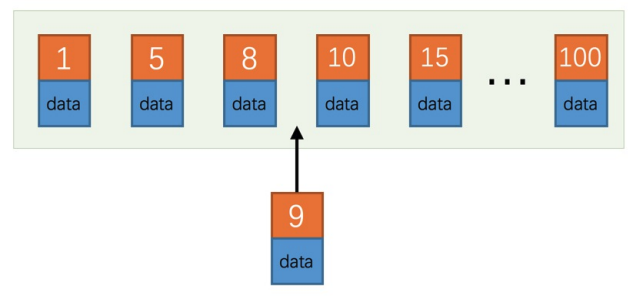

### 索引的代价

虽然索引是个好东西，可不能乱建，在介绍如何更好的使用索引之前先要了解一下使用这玩意儿的代价，它在空间和时间上都会拖后腿：

- 空间上的代价

    这个是显而易见的，每建立一个索引都要为它建立一棵`B+`树，每一棵`B+`树的每一个节点都是一个数据页，一个页默认会占用`16KB`的存储空间，一棵很大的`B+`树由许多数据页组成，那可是很大的一片存储空间呢。

- 时间上的代价

    每次对表中的数据进行增、删、改操作时，都需要去修改各个`B+`树索引。而且我们讲过，`B+`树每层节点都是按照索引列的值从小到大的顺序排序而组成了双向链表。不论是叶子节点中的记录，还是内节点中的记录（也就是不论是用户记录还是目录项记录）都是按照索引列的值从小到大的顺序而形成了一个单向链表。而增、删、改操作可能会对节点和记录的排序造成破坏，所以存储引擎需要额外的时间进行一些记录移位，页面分裂、页面回收啥的操作来维护好节点和记录的排序。如果我们建了许多索引，每个索引对应的`B+`树都要进行相关的维护操作，这还能不给性能拖后腿么

### B+树索引适用的条件

索引的设置其实就是为了能清晰得找到一个查找数据的范围,避免全表扫描。
为了方便说明问题，我们需要先创建一个表，这个表是用来存储人的一些基本信息的：

```mysql
CREATE TABLE person_info(
    id INT NOT NULL auto_increment,
    name VARCHAR(100) NOT NULL,
    birthday DATE NOT NULL,
    phone_number CHAR(11) NOT NULL,
    country varchar(100) NOT NULL,
    PRIMARY KEY (id),
    KEY idx_name_birthday_phone_number (name, birthday, phone_number)
);
```

- 表中的主键是`id`列，它存储一个自动递增的整数。所以`InnoDB`存储引擎会自动为`id`列建立聚簇索引。

- 我们额外定义了一个二级索引`idx_name_birthday_phone_number`，它是由3个列组成的联合索引。所以在这个索引对应的`B+`树的叶子节点处存储的用户记录只保留`name`、`birthday`、`phone_number`这三个列的值以及主键`id`的值，并不会保存`country`列的值。

#### 全值匹配

如果搜索条件中的列和索引列一致的话，这种情况就称为全值匹配，比方说下边这个查找语句：

```mysql
SELECT * FROM person_info WHERE name = 'Ashburn' AND birthday = '1990-09-27' AND phone_number = '15123983239';
```

因为建立了`idx_name_birthday_phone_number`索引包含的3个列在这个查询语句中都展现出来了,查询过程大致如下：

- 因为`B+`树的数据页和记录先是按照`name`列的值进行排序的，所以先可以很快定位`name`列的值是`Ashburn`的记录位置。

- 在`name`列相同的记录里又是按照`birthday`列的值进行排序的，所以在`name`列的值是`Ashburn`的记录里又可以快速定位`birthday`列的值是`'1990-09-27'`的记录。

- 如果`name`和`birthday`列的值都是相同的，那记录是按照`phone_number`列的值排序的，所以联合索引中的三个列都可能被用到。

如果`WHERE`子句中的几个搜索条件的顺序对查询结果有啥影响么？也就是说如果我们调换`name`、`birthday`、`phone_number`这几个搜索列的顺序对查询的执行过程有影响么？比方说写成下边这样：

```mysql
SELECT * FROM person_info WHERE birthday = '1990-09-27' AND phone_number = '15123983239' AND name = 'Ashburn';
```

答案是：没影响哈。`MySQL`有查询优化器，会分析这些搜索条件并且按照可以使用的索引中列的顺序来决定先使用哪个搜索条件，后使用哪个搜索条件

#### 匹配左边的列

其实在我们的搜索语句中也可以不用包含全部联合索引中的列，只包含左边的就行，比方说下边的查询语句：

```mysql
SELECT * FROM person_info WHERE name = 'Ashburn';
# or
SELECT * FROM person_info WHERE name = 'Ashburn' AND birthday = '1990-09-27';
# or
SELECT * FROM person_info WHERE birthday = '1990-09-27';
```

因为联合索引是按照设置的顺序开始查找,name->birthday->phone_number的顺序进行
,所以上诉的第三条是无法使用索引.

如果想使用联合索引中尽可能多的列，搜索条件中的各个列必须是联合索引中从最左边连续的列,且如果没有中间的断开了,比如上诉的例子只使用到了name,phone_number那么只会使用到联合索引中的name层级.

#### 匹配列前缀

字符串排序的本质就是比较哪个字符串大一点儿，哪个字符串小一点，比较字符串大小就用到了该列的字符集和比较规则:

- 先比较字符串的第一个字符，第一个字符小的那个字符串就比较小。

- 如果两个字符串的第一个字符相同，那就再比较第二个字符，第二个字符比较小的那个字符串就比较小。

- 如果两个字符串的第二个字符也相同，那就接着比较第三个字符，依此类推。

所以一个排好序的字符串列其实有这样的特点：

- 先按照字符串的第一个字符进行排序。

- 如果第一个字符相同再按照第二个字符进行排序。

- 如果第二个字符相同再按照第三个字符进行排序，依此类推

```mysql
# 使用索引
SELECT * FROM person_info WHERE name LIKE 'As%';
# 无法使用索引
SELECT * FROM person_info WHERE name LIKE '%As%';
```

#### 匹配范围值

因为索引本质上就是将某个值进行排序好,然后进行查找.

```mysql
SELECT * FROM person_info WHERE name > 'Asa' AND name < 'Barlow';
```

上边的查询过程其实是这样的：

- 找到`name`值为`Asa`的记录。
- 找到`name`值为`Barlow`的记录。
- 哦啦，由于所有记录都是由链表连起来的（记录之间用单链表，数据页之间用双链表），所以他们之间的记录都可以很容易的取出来喽～
- 找到这些记录的主键值，再到`聚簇索引`中`回表`查找完整的记录。

不过在使用联合进行范围查找的时候需要注意，<span style="color:red">如果对多个列同时进行范围查找的话，只有对索引最左边的那个列进行范围查找的时候才能用到`B+`树索引</span>，比方说这样：

```mysql
SELECT * FROM person_info WHERE name > 'Asa' AND name < 'Barlow' AND birthday > '1980-01-01';
```

上边这个查询可以分成两个部分：

1. 通过条件`name > 'Asa' AND name < 'Barlow'`来对`name`进行范围，查找的结果可能有多条`name`值不同的记录，

2. 对这些`name`值不同的记录继续通过`birthday > '1980-01-01'`条件继续过滤。

这样子对于联合索引`idx_name_birthday_phone_number`来说，只能用到`name`列的部分，而用不到`birthday`列的部分，因为只有`name`值相同的情况下才能用`birthday`列的值进行排序，而这个查询中<span style="color:red">通过`name`进行范围查找的记录中可能并不是按照`birthday`列进行排序的</span>，所以在搜索条件中继续以`birthday`列进行查找时是用不到这个`B+`树索引的。

#### 精确匹配某一列并范围匹配另外一列

对于同一个联合索引来说，虽然对多个列都进行范围查找时只能用到最左边那个索引列，但是如果左边的列是精确查找，则右边的列可以进行范围查找，比方说这样：

```mysql
SELECT * FROM person_info WHERE name = 'Ashburn' AND birthday > '1980-01-01' AND birthday < '2000-12-31' AND phone_number > '15100000000';
```

这个查询的条件可以分为3个部分：

1. `name = 'Ashburn'`，对`name`列进行精确查找，当然可以使用`B+`树索引了。

2. `birthday > '1980-01-01' AND birthday < '2000-12-31'`，由于`name`列是精确查找，所以通过`name = 'Ashburn'`条件查找后得到的结果的`name`值都是相同的，它们会再按照`birthday`的值进行排序。所以此时对`birthday`列进行范围查找是可以用到`B+`树索引的。

3. `phone_number > '15100000000'`，通过`birthday`的范围查找的记录的`birthday`的值可能不同，所以这个条件无法再利用`B+`树索引了，只能遍历上一步查询得到的记录。

#### 用于排序

在`MySQL`中，把这种在内存中或者磁盘上进行排序的方式统称为文件排序（英文名：`filesort`），跟`文件`这个词儿一沾边儿，就显得这些排序操作非常慢了（磁盘和内存的速度比起来，就像是飞机和蜗牛的对比）。但是如果`ORDER BY`子句里使用到了我们的索引列，就有可能省去在内存或文件中排序的步骤，比如下边这个简单的查询语句：

```mysql
SELECT * FROM person_info ORDER BY name, birthday, phone_number LIMIT 10;
```

这个查询的结果集需要先按照`name`值排序，如果记录的`name`值相同，则需要按照`birthday`来排序，如果`birthday`的值相同，则需要按照`phone_number`排序。大家可以回过头去看我们建立的`idx_name_birthday_phone_number`索引的示意图，因为这个`B+`树索引本身就是按照上述规则排好序的，所以直接从索引中提取数据，然后进行`回表`操作取出该索引中不包含的列就好了。简单吧？是的，索引就是这么牛逼。

##### 使用联合索引进行排序注意事项

对于`联合索引`有个问题需要注意，`ORDER BY`的子句后边的列的顺序也必须按照索引列的顺序给出,索引的顺序为ABC,那么order by的顺序也应该是ABC

### 不可以使用索引进行排序的几种情况

#### ASC、DESC混用

对于使用联合索引进行排序的场景，我们要求各个排序列的排序顺序是一致的，也就是要么各个列都是`ASC`规则排序，要么都是`DESC`规则排序。

```text
小贴士：
ORDER BY子句后的列默认是按照ASC排序规则排序的，也就是升序排序的。
```

`idx_name_birthday_phone_number`联合索引中记录的结构：

- 先按照记录的`name`列的值进行升序排列。

- 如果记录的`name`列的值相同，再按照`birthday`列的值进行升序排列。

- 如果记录的`birthday`列的值相同，再按照`phone_number`列的值进行升序排列

```mysql
SELECT * FROM person_info
ORDER BY name, birthday LIMIT 10
# 这种情况直接从索引的最左边开始往右读10行记就可以了
ORDER BY name DESC, birthday DESC LIMIT 10
#  这种情况直接从索引的最右边开始往左读10行记录就可以了。
```

```mysql
SELECT * FROM person_info ORDER BY name, birthday DESC LIMIT 10;
```

这样如果使用索引排序的话过程就是这样的：

- 先从索引的最左边确定`name`列最小的值，然后找到`name`列等于该值的所有记录，然后从`name`列等于该值的最右边的那条记录开始往左找10条记录。

- 如果`name`列等于最小的值的记录不足10条，再继续往右找`name`值第二小的记录，重复上边那个过程，直到找到10条记录为止。

累不累？累！重点是这样不能高效使用索引，而要采取更复杂的算法去从索引中取数据，设计`MySQL`的大叔觉得这样还不如直接文件排序来的快，所以就规定使用联合索引的各个排序列的排序顺序必须是一致的

#### WHERE子句中出现非排序使用到的索引列

如果WHERE子句中出现了非排序使用到的索引列，那么排序依然是使用不到索引的，比方说这样：

```mysql
SELECT * FROM person_info WHERE country = 'China' ORDER BY name LIMIT 10;
```

这个查询只能先把符合搜索条件`country = 'China'`的记录提取出来后再进行排序，是使用不到索引。注意和下边这个查询作区别：

```mysql
SELECT * FROM person_info WHERE name = 'A' ORDER BY birthday, phone_number LIMIT 10;
```

虽然这个查询也有搜索条件，但是`name = 'A'`可以使用到索引`idx_name_birthday_phone_number`，而且过滤剩下的记录还是按照`birthday`、`phone_number`列排序的，所以还是可以使用索引进行排序的。

#### 排序列包含非同一个索引的列

有时候用来排序的多个列不是一个索引里的，这种情况也不能使用索引进行排序，比方说：

```mysql
SELECT * FROM person_info ORDER BY name, country LIMIT 10;
```

`name`和`country`并不属于一个联合索引中的列，所以无法使用索引进行排序，

#### 排序列使用了复杂的表达式

要想使用索引进行排序操作，必须保证索引列是以单独列的形式出现，而不是修饰过的形式，比方说这样：

```mysql
SELECT * FROM person_info ORDER BY UPPER(name) LIMIT 10;
```

使用了`UPPER`函数修饰过的列就不是单独的列啦，这样就无法使用索引进行排序啦。

### 用于分组

有时候为了方便统计表中的一些信息，会把表中的记录按照某些列进行分组。比如下边这个分组查询：

```mysql
SELECT name, birthday, phone_number, COUNT(*) FROM person_info GROUP BY name, birthday, phone_number
```

这个查询语句相当于做了3次分组操作：

1. 先把记录按照`name`值进行分组，所有`name`值相同的记录划分为一组。

2. 将每个`name`值相同的分组里的记录再按照`birthday`的值进行分组，将`birthday`值相同的记录放到一个小分组里，所以看起来就像在一个大分组里又化分了好多小分组。

3. 再将上一步中产生的小分组按照`phone_number`的值分成更小的分组，所以整体上看起来就像是先把记录分成一个大分组，然后把`大分组`分成若干个`小分组`，然后把若干个`小分组`再细分成更多的`小小分组`。

然后针对那些`小小分组`进行统计，比如在我们这个查询语句中就是统计每个`小小分组`包含的记录条数。如果没有索引的话，这个分组过程全部需要在内存里实现，而如果有了索引的话，恰巧这个分组顺序又和我们的`B+`树中的索引列的顺序是一致的，而我们的`B+`树索引又是按照索引列排好序的，这不正好么，所以可以直接使用`B+`树索引进行分组。

和使用`B+`树索引进行排序是一个道理，分组列的顺序也需要和索引列的顺序一致，也可以只使用索引列中左边的列进行分组.

### 回表的代价

用`idx_name_birthday_phone_number`索引为例，看下边这个查询：

```mysql
SELECT * FROM person_info WHERE name > 'Asa' AND name < 'Barlow';
```

在使用`idx_name_birthday_phone_number`索引进行查询时大致可以分为这两个步骤：

1. 从索引`idx_name_birthday_phone_number`对应的`B+`树中取出`name`值在`Asa`～`Barlow`之间的用户记录。

2. 由于索引`idx_name_birthday_phone_number`对应的`B+`树用户记录中只包含`name`、`birthday`、`phone_number`、`id`这4个字段，而查询列表是`*`，意味着要查询表中所有字段，也就是还要包括`country`字段。这时需要把从上一步中获取到的每一条记录的`id`字段都到聚簇索引对应的`B+`树中找到完整的用户记录，也就是我们通常所说的`回表`，然后把完整的用户记录返回给查询用户

那什么时候采用全表扫描的方式，什么时候使用采用`二级索引 + 回表`的方式去执行查询呢？这个就是传说中的查询优化器做的工作，查询优化器会事先对表中的记录计算一些统计数据，然后再利用这些统计数据根据查询的条件来计算一下需要回表的记录数，需要回表的记录数越多，就越倾向于使用全表扫描，反之倾向于使用`二级索引 + 回表`的方式。当然优化器做的分析工作不仅仅是这么简单，但是大致上是个这个过程。一般情况下，限制查询获取较少的记录数会让优化器更倾向于选择使用`二级索引 + 回表`的方式进行查询，因为回表的记录越少，性能提升就越高，比方说上边的查询可以改写成这样：

添加了`LIMIT 10`的查询更容易让优化器采用`二级索引 + 回表`的方式进行查询。

对于有排序需求的查询，上边讨论的采用`全表扫描`还是`二级索引 + 回表`的方式进行查询的条件也是成立的，比方说下边这个查询：

```mysql
SELECT * FROM person_info ORDER BY name, birthday, phone_number;
```

由于查询列表是`*`，所以如果使用二级索引进行排序的话，需要把排序完的二级索引记录全部进行回表操作，这样操作的成本还不如直接遍历聚簇索引然后再进行文件排序（`filesort`）低，所以优化器会倾向于使用`全表扫描`的方式执行查询。如果我们加了`LIMIT`子句，比如这样：

```mysql
SELECT * FROM person_info ORDER BY name, birthday, phone_number LIMIT 10;
```

这样需要回表的记录特别少，优化器就会倾向于使用`二级索引 + 回表`的方式执行查询。

#### 覆盖索引

为了彻底告别`回表`操作带来的性能损耗，建议：<span style="color:red">最好在查询列表里只包含索引列</span>，比如这样：

```mysql
SELECT name, birthday, phone_number FROM person_info WHERE name > 'Asa' AND name < 'Barlow'
```

因为只查询`name`, `birthday`, `phone_number`这三个索引列的值，所以在通过`idx_name_birthday_phone_number`索引得到结果后就不必到`聚簇索引`中再查找记录的剩余列，也就是`country`列的值了，这样就省去了`回表`操作带来的性能损耗。我们把这种只需要用到索引的查询方式称为`索引覆盖`。排序操作也优先使用`覆盖索引`的方式进行查询，比方说这个查询：

```mysql
SELECT name, birthday, phone_number  FROM person_info ORDER BY name, birthday, phone_number;
```

虽然这个查询中没有`LIMIT`子句，但是采用了`覆盖索引`，所以查询优化器就会直接使用`idx_name_birthday_phone_number`索引进行排序而不需要回表操作了。

当然，如果业务需要查询出索引以外的列，那还是以保证业务需求为重。但是<span style="color:red">我们很不鼓励用`*`号作为查询列表，最好把需要查询的列依次标明</span>。

### 如何建立索引

#### 只为用于搜索、排序或分组的列创建索引

只为出现在`WHERE`子句中的列、连接子句中的连接列，或者出现在`ORDER BY`或`GROUP BY`子句中的列创建索引。而出现在查询列表中的列就没必要建立索引了：

```mysql
SELECT birthday, country FROM person_name WHERE name = 'Ashburn';
```

像查询列表中的`birthday`、`country`这两个列就不需要建立索引，我们只需要为出现在`WHERE`子句中的`name`列创建索引就可以了。

#### 在值分散的列上建立

列的值越分散则建立索引的效果越好

#### 索引列的类型尽量小

在定义表结构的时候要显式的指定列的类型，以整数类型为例，有`TINYINT`、`MEDIUMINT`、`INT`、`BIGINT`这么几种，它们占用的存储空间依次递增，我们这里所说的`类型大小`指的就是<span style="color:red">该类型表示的数据范围的大小</span>。能表示的整数范围当然也是依次递增，如果我们想要对某个整数列建立索引的话，<span style="color:red">在表示的整数范围允许的情况下，尽量让索引列使用较小的类型</span>，比如我们能使用`INT`就不要使用`BIGINT`，能使用`MEDIUMINT`就不要使用`INT`～ 这是因为：

- 数据类型越小，在查询时进行的比较操作越快（这是CPU层次的东东）

- 数据类型越小，索引占用的存储空间就越少，在一个数据页内就可以放下更多的记录，从而减少磁盘`I/O`带来的性能损耗，也就意味着可以把更多的数据页缓存在内存中，从而加快读写效率。

这个建议对于表的主键来说更加适用，因为不仅是聚簇索引中会存储主键值，其他所有的二级索引的节点处都会存储一份记录的主键值，如果主键适用更小的数据类型，也就意味着节省更多的存储空间和更高效的`I/O`

#### 索引字符串值的前缀

一个字符串其实是由若干个字符组成，如果我们在`MySQL`中使用`utf8`字符集去存储字符串的话，编码一个字符需要占用`1~3`个字节。假设我们的字符串很长，那存储一个字符串就需要占用很大的存储空间。在我们需要为这个字符串列建立索引时，那就意味着在对应的`B+`树中有这么两个问题：

- `B+`树索引中的记录需要把该列的完整字符串存储起来，而且字符串越长，在索引中占用的存储空间越大。

- 如果`B+`树索引中索引列存储的字符串很长，那在做字符串比较时会占用更多的时间。

前边儿说过索引列的字符串前缀其实也是排好序的，所以索引的设计者提出了个方案 --- <span style="color:red">只对字符串的前几个字符进行索引</span>也就是说在二级索引的记录中只保留字符串前几个字符。这样在查找记录时虽然不能精确的定位到记录的位置，但是能定位到相应前缀所在的位置，然后根据前缀相同的记录的主键值回表查询完整的字符串值，再对比就好了。这样只在`B+`树中存储字符串的前几个字符的编码，既节约空间，又减少了字符串的比较时间，还大概能解决排序的问题，何乐而不为，比方说我们在建表语句中只对`name`列的前10个字符进行索引可以这么写：

```mysql
CREATE TABLE person_info(
    name VARCHAR(100) NOT NULL,
    birthday DATE NOT NULL,
    phone_number CHAR(11) NOT NULL,
    country varchar(100) NOT NULL,
    KEY idx_name_birthday_phone_number (name(10), birthday, phone_number)
);    
```

`name(10)`就表示在建立的`B+`树索引中只保留记录的前`10`个字符的编码，这种<span style="color:red">只索引字符串值的前缀的策略是我们非常鼓励的，尤其是在字符串类型能存储的字符比较多的时候</span>。

##### 索引列前缀对排序的影响

如果使用了索引列前缀，比方说前边只把`name`列的前10个字符放到了二级索引中，下边这个查询可能就有点儿尴尬了：

```mysql
SELECT * FROM person_info ORDER BY name LIMIT 10;
```

因为二级索引中不包含完整的`name`列信息，所以无法对前十个字符相同，后边的字符不同的记录进行排序，也就是使用索引列前缀的方式无法支持使用索引排序，只好乖乖的用文件排序喽。

#### 让索引列在比较表达式中单独出现

假设表中有一个整数列`my_col`，我们为这个列建立了索引。下边的两个`WHERE`子句虽然语义是一致的，但是在效率上却有差别：

1. `WHERE my_col * 2 < 4`

2. `WHERE my_col < 4/2`

第1个`WHERE`子句中`my_col`列并<span style="color:red">不是</span>以单独列的形式出现的，而是以`my_col * 2`这样的表达式的形式出现的，存储引擎<span style="color:red">会依次遍历所有的记录，计算这个表达式的值是不是小于`4`</span>，所以这种情况下是使用不到为`my_col`列建立的`B+`树索引的。而第2个`WHERE`子句中`my_col`列并<span style="color:red">是</span>以单独列的形式出现的，这样的情况可以直接使用`B+`树索引。

所以结论就是：<span style="color:red">如果索引列在比较表达式中不是以单独列的形式出现，而是以某个表达式，或者函数调用形式出现的话，是用不到索引的</span>。

### 主键插入顺序

对于一个使用`InnoDB`存储引擎的表来说，没有显式的创建索引时，表中的数据实际上都是存储在`聚簇索引`的叶子节点的。而记录又是存储在数据页中的，数据页和记录又是按照记录主键值从小到大的顺序进行排序，所以如果插入的记录的主键值是依次增大的话，那每插满一个数据页就换到下一个数据页继续插，而如果插入的主键值忽大忽小的话，这就比较麻烦了，假设某个数据页存储的记录已经满了，它存储的主键值在`1~100`之间：


如果此时再插入一条主键值为`9`的记录，那它插入的位置就如下图：


可这个数据页已经满了啊，再插进来咋办呢？我们需要把当前页面分裂成两个页面，把本页中的一些记录移动到新创建的这个页中。页面分裂和记录移位意味着什么？意味着：<span style="color:red">性能损耗</span>！所以如果我们想尽量避免这样无谓的性能损耗，最好让插入的记录的主键值依次递增，这样就不会发生这样的性能损耗了。所以我们建议：<span style="color:red">让主键具有`AUTO_INCREMENT`，让存储引擎自己为表生成主键，而不是我们手动插入 </span>，比方说我们可以这样定义`person_info`表：

```mysql
CREATE TABLE person_info(
    id INT UNSIGNED NOT NULL AUTO_INCREMENT,
    name VARCHAR(100) NOT NULL,
    birthday DATE NOT NULL,
    phone_number CHAR(11) NOT NULL,
    country varchar(100) NOT NULL,
    PRIMARY KEY (id),
    KEY idx_name_birthday_phone_number (name(10), birthday, phone_number)
);    
```
