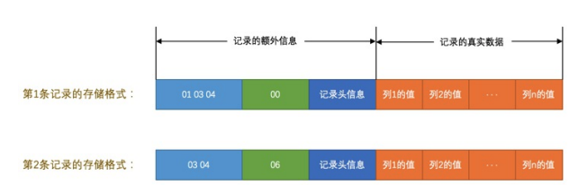

### 简介

InnoDB采取的方式是：将数据划分为若干个页，以页作为磁盘和内存之间交互的基本单位，InnoDB中页的大小一般为 16 KB。也就是在一般情况下，一次最少从磁盘中读取16KB的内容到内存中，一次最少把内存中的16KB内容刷新到磁盘中。

### InnoDB行格式

计InnoDB存储引擎的大叔们到现在为止设计了4种不同类型的行格式，分别是Compact、Redundant、Dynamic和Compressed行格式，随着时间的推移，他们可能会设计出更多的行格式，但是不管怎么变，在原理上大体都是相同的。

#### 指定行格式的语法

可以在创建或修改表的语句中指定`行格式`：

```mysql
CREATE TABLE 表名 (列的信息) ROW_FORMAT=行格式名称
    
ALTER TABLE 表名 ROW_FORMAT=行格式名称
```

比如我们在xiaohaizi数据库里创建一个演示用的表record_format_demo，可以这样指定它的行格式

```mysql
mysql> CREATE TABLE record_format_demo (
    ->     c1 VARCHAR(10),
    ->     c2 VARCHAR(10) NOT NULL,
    ->     c3 CHAR(10),
    ->     c4 VARCHAR(10)
    -> ) CHARSET=ascii ROW_FORMAT=COMPACT;
Query OK, 0 rows affected (0.03 sec)

mysql> INSERT INTO record_format_demo(c1, c2, c3, c4) VALUES('aaaa', 'bbb', 'cc', 'd'), ('eeee', 'fff', NULL, NULL);
Query OK, 2 rows affected (0.02 sec)
Records: 2  Duplicates: 0  Warnings: 0

mysql> SELECT * FROM record_format_demo;
+------+-----+------+------+
| c1   | c2  | c3   | c4   |
+------+-----+------+------+
| aaaa | bbb | cc   | d    |
| eeee | fff | NULL | NULL |
+------+-----+------+------+
2 rows in set (0.00 sec)
```

#### COMPACT行格式


##### 记录的额外信息

###### 变长字段长度列表

`MySQL`支持一些变长的数据类型，比如`VARCHAR(M)`、`VARBINARY(M)`、各种`TEXT`类型，各种`BLOB`类型，我们也可以把拥有这些数据类型的列称为`变长字段`，变长字段中存储多少字节的数据是不固定的，所以我们在存储真实数据的时候需要顺便把这些数据占用的字节数也存起来，这样才不至于把`MySQL`服务器搞懵，所以这些变长字段占用的存储空间分为两部分:

1. 真正的数据内容
2. 占用的字节数

在`Compact`行格式中，<span style="color:red">把所有变长字段的真实数据占用的字节长度都存放在记录的开头部位，从而形成一个变长字段长度列表，各变长字段数据占用的字节数按照列的顺序逆序存放</span>，我们再次强调一遍，是<span style="color:red">逆序</span>存放！

`record_format_demo`表中的第一条记录来举个例子。因为`record_format_demo`表的`c1`、`c2`、`c4`列都是`VARCHAR(10)`类型的，也就是变长的数据类型，所以这三个列的值的长度都需要保存在记录开头处，因为`record_format_demo`表中的各个列都使用的是`ascii`字符集，所以每个字符只需要1个字节来进行编码，来看一下第一条记录各变长字段内容的长度：

|列名|存储内容|内容长度（十进制表示）|内容长度（十六进制表示）|
|:--:|:--:|:--:|:--:|
|`c1`|`'aaaa'`|`4`|`0x04`|
|`c2`|`'bbb'`|`3`|`0x03`|
|`c4`|`'d'`|`1`|`0x01`|

又因为这些长度值需要按照列的<span style="color:red">逆序</span>存放，所以最后`变长字段长度列表`的字节串用十六进制表示的效果就是（各个字节之间实际上没有空格，用空格隔开只是方便理解）：

```text
01 03 04 
```


由于第一行记录中`c1`、`c2`、`c4`列中的字符串都比较短，也就是说内容占用的字节数比较小，用1个字节就可以表示，但是如果变长列的内容占用的字节数比较多，可能就需要用2个字节来表示。具体用1个还是2个字节来表示真实数据占用的字节数，`InnoDB`有它的一套规则，我们首先声明一下`W`、`M`和`L`的意思：

1. 假设某个字符集中表示一个字符最多需要使用的字节数为`W`，也就是使用`SHOW CHARSET`语句的结果中的`Maxlen`列，比方说`utf8`字符集中的`W`就是`3`，`gbk`字符集中的`W`就是`2`，`ascii`字符集中的`W`就是`1`。

2. 对于变长类型`VARCHAR(M)`来说，这种类型表示能存储最多`M`个字符（注意是字符不是字节），所以这个类型能表示的字符串最多占用的字节数就是`M×W`。

3. 假设它实际存储的字符串占用的字节数是`L`。

所以确定使用1个字节还是2个字节表示真正字符串占用的字节数的规则就是这样：

- 如果`M×W <= 255`，那么使用1个字节来表示真正字符串占用的字节数。

    ```!
    也就是说InnoDB在读记录的变长字段长度列表时先查看表结构，如果某个变长字段允许存储的最大字节数不大于255时，可以认为只使用1个字节来表示真正字符串占用的字节数。
    ```

- 如果`M×W > 255`，则分为两种情况：

  - 如果`L <= 127`，则用1个字节来表示真正字符串占用的字节数。

  - 如果`L > 127`，则用2个字节来表示真正字符串占用的字节数。

    ```!
    InnoDB在读记录的变长字段长度列表时先查看表结构，如果某个变长字段允许存储的最大字节数大于255时，该怎么区分它正在读的某个字节是一个单独的字段长度还是半个字段长度呢？设计InnoDB的大叔使用该字节的第一个二进制位作为标志位：如果该字节的第一个位为0，那该字节就是一个单独的字段长度（使用一个字节表示不大于127的二进制的第一个位都为0），如果该字节的第一个位为1，那该字节就是半个字段长度。
    
    对于一些占用字节数非常多的字段，比方说某个字段长度大于了16KB，那么如果该记录在单个页面中无法存储时，InnoDB会把一部分数据存放到所谓的溢出页中（我们后边会唠叨），在变长字段长度列表处只存储留在本页面中的长度，所以使用两个字节也可以存放下来。
    ```

总结一下就是说：如果该可变字段允许存储的最大字节数（`M×W`）超过255字节并且真实存储的字节数（`L`）超过127字节，则使用2个字节，否则使用1个字节。

总结一下就是说：如果该可变字段允许存储的最大字节数（M×W）超过255字节并且真实存储的字节数（L）超过127字节，则使用2个字节，否则使用1个字节

另外需要注意的一点是，<span style="color:red">变长字段长度列表中只存储值为 ***非NULL*** 的列内容占用的长度，值为 ***NULL*** 的列的长度是不储存的 </span>。也就是说对于第二条记录来说，因为`c4`列的值为`NULL`，所以第二条记录的`变长字段长度列表`只需要存储`c1`和`c2`列的长度即可。其中`c1`列存储的值为`'eeee'`，占用的字节数为`4`，`c2`列存储的值为`'fff'`，占用的字节数为`3`。数字`4`可以用1个字节表示，`3`也可以用1个字节表示，所以整个`变长字段长度列表`共需2个字节。填充完`变长字段长度列表`的两条记录的对比图如下：


###### NULL值列表

某些列可能存储`NULL`值，如果把这些`NULL`值都放到`记录的真实数据`中存储会很占地方，所以`Compact`行格式把这些值为`NULL`的列统一管理起来，存储到`NULL`值列表中，它的处理过程是这样的：

1. 首先统计表中允许存储`NULL`的列有哪些。

    我们前边说过，主键列、被`NOT NULL`修饰的列都是不可以存储`NULL`值的，所以在统计的时候不会把这些列算进去。比方说表`record_format_demo`的3个列`c1`、`c3`、`c4`都是允许存储`NULL`值的，而`c2`列是被`NOT NULL`修饰，不允许存储`NULL`值。

2. <span style="color:red">如果表中没有允许存储 ***NULL*** 的列，则 *NULL值列表* 也不存在了</span>，否则将每个允许存储`NULL`的列对应一个二进制位，二进制位按照列的顺序<span style="color:red">逆序</span>排列，二进制位表示的意义如下：

    - 二进制位的值为`1`时，代表该列的值为`NULL`。
    - 二进制位的值为`0`时，代表该列的值不为`NULL`。

    因为表`record_format_demo`有3个值允许为`NULL`的列，所以这3个列和二进制位的对应关系就是这样：

    

    再一次强调，二进制位按照列的顺序<span style="color:red">逆序</span>排列，所以第一个列`c1`和最后一个二进制位对应。

3. `MySQL`规定`NULL值列表`必须用整数个字节的位表示，如果使用的二进制位个数不是整数个字节，则在字节的高位补`0`。

    表`record_format_demo`只有3个值允许为`NULL`的列，对应3个二进制位，不足一个字节，所以在字节的高位补`0`，效果就是这样：

   

    以此类推，如果一个表中有9个允许为`NULL`，那这个记录的`NULL`值列表部分就需要2个字节来表示了。

知道了规则之后，我们再返回头看表`record_format_demo`中的两条记录中的`NULL值列表`应该怎么储存。因为只有`c1`、`c3`、`c4`这3个列允许存储`NULL`值，所以所有记录的`NULL值列表`只需要一个字节。

- 对于第一条记录来说，`c1`、`c3`、`c4`这3个列的值都不为`NULL`，所以它们对应的二进制位都是`0`，画个图就是这样：

    
    所以第一条记录的`NULL值列表`用十六进制表示就是：`0x00`。

- 对于第二条记录来说，`c1`、`c3`、`c4`这3个列中`c3`和`c4`的值都为`NULL`，所以这3个列对应的二进制位的情况就是：

    

    所以第二条记录的`NULL值列表`用十六进制表示就是：`0x06`。

所以这两条记录在填充了`NULL值列表`后的示意图就是这样：



###### 记录头信息

除了`变长字段长度列表`、`NULL值列表`之外，还有一个用于描述记录的`记录头信息`，它是由固定的`5`个字节组成。`5`个字节也就是`40`个二进制位，不同的位代表不同的意思，如图：


这些二进制位代表的详细信息如下表：

|名称|大小（单位：bit）|描述|
|:--:|:--:|:--:|
|`预留位1`|`1`|没有使用|
|`预留位2`|`1`|没有使用|
|`delete_mask`|`1`|标记该记录是否被删除|
|`min_rec_mask`|`1`|B+树的每层非叶子节点中的最小记录都会添加该标记|
|`n_owned`|`4`|表示当前记录拥有的记录数|
|`heap_no`|`13`|表示当前记录在记录堆的位置信息|
|`record_type`|`3`|表示当前记录的类型，`0`表示普通记录，`1`表示B+树非叶子节点记录，`2`表示最小记录，`3`表示最大记录|
|`next_record`|`16`|表示下一条记录的相对位置|

之后会详细介绍,当前仅仅是看下存储`record_format_demo`中的两条记录的`头信息`分别是什么：


###### 记录的真实数据

对于`record_format_demo`表来说，`记录的真实数据`除了`c1`、`c2`、`c3`、`c4`这几个我们自己定义的列的数据以外，`MySQL`会为每个记录默认的添加一些列（也称为`隐藏列`），具体的列如下：

|列名|是否必须|占用空间|描述|
|:--:|:--:|:--:|:--:|
|`row_id`|否|`6`字节|行ID，唯一标识一条记录|
|`transaction_id`|是|`6`字节|事务ID|
|`roll_pointer`|是|`7`字节|回滚指针|

```!
小贴士：

实际上这几个列的真正名称其实是：DB_ROW_ID、DB_TRX_ID、DB_ROLL_PTR，我们为了美观才写成了row_id、transaction_id和roll_pointer。
```


看这个图的时候需要注意几点：

1. 表`record_format_demo`使用的是`ascii`字符集，所以`0x61616161`就表示字符串`'aaaa'`，`0x626262`就表示字符串`'bbb'`，以此类推。

2. 注意第1条记录中`c3`列的值，它是`CHAR(10)`类型的，它实际存储的字符串是：`'cc'`，而`ascii`字符集中的字节表示是`'0x6363'`，虽然表示这个字符串只占用了2个字节，但整个`c3`列仍然占用了10个字节的空间，除真实数据以外的8个字节的统统都用<span style="color:red">空格字符</span>填充，空格字符在`ascii`字符集的表示就是`0x20`。

3. 注意第2条记录中`c3`和`c4`列的值都为`NULL`，它们被存储在了前边的`NULL值列表`处，在记录的真实数据处就不再冗余存储，从而节省存储空间。

### char与varchar

#### CHAR(M)列的存储格式

`record_format_demo`表的`c1`、`c2`、`c4`列的类型是`VARCHAR(10)`，而`c3`列的类型是`CHAR(10)`，我们说在`Compact`行格式下只会把变长类型的列的长度<span style="color:red">逆序</span>存到`变长字段长度列表`中，就像这样：


但是这只是因为我们的`record_format_demo`表采用的是`ascii`字符集，这个字符集是一个定长字符集，也就是说表示一个字符采用固定的一个字节，如果采用变长的字符集（也就是表示一个字符需要的字节数不确定，比如`gbk`表示一个字符要1~2个字节、`utf8`表示一个字符要1 ~3个字节等）的话，`c3`列的长度也会被存储到`变长字段长度列表`中，比如我们修改一下`record_format_demo`表的字符集：

```shell
mysql> ALTER TABLE record_format_demo MODIFY COLUMN c3 CHAR(10) CHARACTER SET utf8;
Query OK, 2 rows affected (0.02 sec)
Records: 2  Duplicates: 0  Warnings: 0
```

修改该列字符集后记录的`变长字段长度列表`也发生了变化，如图：


这就意味着：<span style="color:red">对于 ***CHAR(M)*** 类型的列来说，当列采用的是定长字符集时，该列占用的字节数不会被加到变长字段长度列表，而如果采用变长字符集时，该列占用的字节数也会被加到变长字段长度列表</span>

另外有一点还需要注意，变长字符集的`CHAR(M)`类型的列要求至少占用`M`个字节，而`VARCHAR(M)`却没有这个要求。比方说对于使用`utf8`字符集的`CHAR(10)`的列来说，该列存储的数据字节长度的范围是10～30个字节。即使我们向该列中存储一个空字符串也会占用`10`个字节，这是怕将来更新该列的值的字节长度大于原有值的字节长度而小于10个字节时，可以在该记录处直接更新，而不是在存储空间中重新分配一个新的记录空间，导致原有的记录空间成为所谓的碎片。（这里你感受到设计`Compact`行格式的大叔既想节省存储空间，又不想更新`CHAR(M)`类型的列产生碎片时的纠结心情了吧。）

#### VARCHAR(M)

对于`VARCHAR(M)`类型的列最多可以占用`65535`个字节。其中的`M`代表该类型最多存储的字符数量，如果我们使用`ascii`字符集的话，一个字符就代表一个字节，我们看看`VARCHAR(65535)`是否可用：

mysql> CREATE TABLE varchar_size_demo(
    ->     c VARCHAR(65535)
    -> ) CHARSET=ascii ROW_FORMAT=Compact;
ERROR 1118 (42000): Row size too large. The maximum row size for the used table type, not counting BLOBs, is 65535. This includes storage overhead, check the manual. You have to change some columns to TEXT or BLOBs
mysql>
``

从报错信息里可以看出，`MySQL`对一条记录占用的最大存储空间是有限制的，除了`BLOB`或者`TEXT`类型的列之外，其他所有的列（不包括隐藏列和记录头信息）占用的字节长度加起来不能超过`65535`个字节。所以`MySQL`服务器建议我们把存储类型改为`TEXT`或者`BLOB`的类型。这个`65535`个字节除了列本身的数据之外，还包括一些其他的数据（`storage overhead`），比如说我们为了存储一个`VARCHAR(M)`类型的列，其实需要占用3部分存储空间：

- 真实数据
- 真实数据占用字节的长度 2个字节
- `NULL`值标识，如果该列有`NOT NULL`属性则可以没有这部分存储空间 如果需要则一个字节

```shell
mysql> CREATE TABLE varchar_size_demo(
    ->      c VARCHAR(65532)
    -> ) CHARSET=ascii ROW_FORMAT=Compact;
Query OK, 0 rows affected (0.02 sec)
```

如果`VARCHAR`类型的列有`NOT NULL`属性，那最多只能存储`65533`个字节的数据，因为真实数据的长度可能占用2个字节，不需要`NULL`值标识：

如果`VARCHAR`类型的列有`NOT NULL`属性，那最多只能存储`65533`个字节的数据，因为真实数据的长度可能占用2个字节，不需要`NULL`值标识：

```mysql
mysql> CREATE TABLE varchar_size_demo(
    ->      c VARCHAR(65532)
    -> ) CHARSET=ascii ROW_FORMAT=Compact;
Query OK, 0 rows affected (0.02 sec)


mysql> DROP TABLE varchar_size_demo;
Query OK, 0 rows affected (0.01 sec)

mysql> CREATE TABLE varchar_size_demo(
    ->      c VARCHAR(65533) NOT NULL
    -> ) CHARSET=ascii ROW_FORMAT=Compact;
Query OK, 0 rows affected (0.02 sec)
```

如果`VARCHAR(M)`类型的列使用的不是`ascii`字符集，那会怎么样呢？来看一下：

```shell
mysql> DROP TABLE varchar_size_demo;
Query OK, 0 rows affected (0.00 sec)

mysql> CREATE TABLE varchar_size_demo(
    ->       c VARCHAR(65532)
    -> ) CHARSET=gbk ROW_FORMAT=Compact;
ERROR 1074 (42000): Column length too big for column 'c' (max = 32767); use BLOB or TEXT instead

mysql> CREATE TABLE varchar_size_demo(
    ->       c VARCHAR(65532)
    -> ) CHARSET=utf8 ROW_FORMAT=Compact;
ERROR 1074 (42000): Column length too big for column 'c' (max = 21845); use BLOB or TEXT instead
```

从执行结果中可以看出，如果`VARCHAR(M)`类型的列使用的不是`ascii`字符集，那`M`的最大取值取决于该字符集表示一个字符最多需要的字节数。在列的值允许为`NULL`的情况下，`gbk`字符集表示一个字符最多需要`2`个字节，那在该字符集下，`M`的最大取值就是`32766`（也就是：65532/2），也就是说最多能存储`32766`个字符；`utf8`字符集表示一个字符最多需要`3`个字节，那在该字符集下，`M`的最大取值就是`21844`，就是说最多能存储`21844`（也就是：65532/3）个字符。

```!
小贴士：

上述所言在列的值允许为NULL的情况下，gbk字符集下M的最大取值就是32766，utf8字符集下M的最大取值就是21844，这都是在表中只有一个字段的情况下说的，一定要记住一个行中的所有列（不包括隐藏列和记录头信息）占用的字节长度加起来不能超过65535个字节！
```

#### 记录中的数据太多产生的溢出

以`ascii`字符集下的`varchar_size_demo`表为例，插入一条记录：

```shell
mysql> CREATE TABLE varchar_size_demo(
    ->       c VARCHAR(65532)
    -> ) CHARSET=ascii ROW_FORMAT=Compact;
Query OK, 0 rows affected (0.01 sec)

mysql> INSERT INTO varchar_size_demo(c) VALUES(REPEAT('a', 65532));
Query OK, 1 row affected (0.00 sec)
```

`MySQL`是以`页`为基本单位来管理存储空间的，我们的记录都会被分配到某个`页`中存储。而一个页的大小一般是`16KB`，也就是`16384`字节，而一个`VARCHAR(M)`类型的列就最多可以存储`65532`个字节，这样就可能造成一个页存放不了一条记录的尴尬情况。

在`Compact`和`Reduntant`行格式中，对于占用存储空间非常大的列，在`记录的真实数据`处只会存储该列的一部分数据，把剩余的数据分散存储在几个其他的页中，然后`记录的真实数据`处用20个字节存储指向这些页的地址（当然这20个字节中还包括这些分散在其他页面中的数据的占用的字节数），从而可以找到剩余数据所在的页，如图所示：


从图中可以看出来，对于`Compact`和`Reduntant`行格式来说，如果某一列中的数据非常多的话，在本记录的真实数据处只会存储该列的前`768`个字节的数据和一个指向其他页的地址，然后把剩下的数据存放到其他页中，这个过程也叫做`行溢出`，存储超出`768`字节的那些页面也被称为`溢出页`。

最后需要注意的是，<span style="color:red">不只是 ***VARCHAR(M)*** 类型的列，其他的 ***TEXT***、***BLOB*** 类型的列在存储数据非常多的时候也会发生`行溢出`</span>。

#### 行溢出的临界点

`MySQL`中规定<span style="color:red">一个页中至少存放两行记录</span>，至于为什么这么规定我们之后再说，现在看一下这个规定造成的影响。以上边的`varchar_size_demo`表为例，它只有一个列`c`，我们往这个表中插入两条记录，每条记录最少插入多少字节的数据才会`行溢出`的现象呢？这得分析一下页中的空间都是如何利用的。

- 每个页除了存放我们的记录以外，也需要存储一些额外的信息，乱七八糟的额外信息加起来需要`136`个字节的空间（现在只要知道这个数字就好了），其他的空间都可以被用来存储记录。

- 每个记录需要的额外信息是`27`字节。

    这27个字节包括下边这些部分：
  - 2个字节用于存储真实数据的长度
  - 1个字节用于存储列是否是NULL值
  - 5个字节大小的头信息
  - 6个字节的`row_id`列
  - 6个字节的`transaction_id`列
  - 7个字节的`roll_pointer`列

假设一个列中存储的数据字节数为n，那么发生`行溢出`现象时需要满足这个式子：

```shell
136 + 2×(27 + n) > 16384
```

求解这个式子得出的解是：`n > 8098`。也就是说如果一个列中存储的数据不大于`8098`个字节，那就不会发生`行溢出`，否则就会发生`行溢出`。不过这个`8098`个字节的结论只是针对只有一个列的`varchar_size_demo`表来说的，如果表中有多个列，那上边的式子和结论都需要改一改了，所以重点就是：<span style="color:red">你不用关注这个临界点是什么，只要知道如果我们想一个行中存储了很大的数据时，可能发生`行溢出`的现象</span>。

##### Dynamic和Compressed行格式

下边要介绍另外两个行格式，`Dynamic`和`Compressed`行格式，我现在使用的`MySQL`版本是`5.7`，它的默认行格式就是`Dynamic`，这俩行格式和`Compact`行格式挺像，只不过在处理`行溢出`数据时有点儿分歧，它们不会在记录的真实数据处存储字段真实数据的前`768`个字节，而是把所有的字节都存储到其他页面中，只在记录的真实数据处存储其他页面的地址，就像这样：


`Compressed`行格式和`Dynamic`不同的一点是，`Compressed`行格式会采用压缩算法对页面进行压缩，以节省空间。
