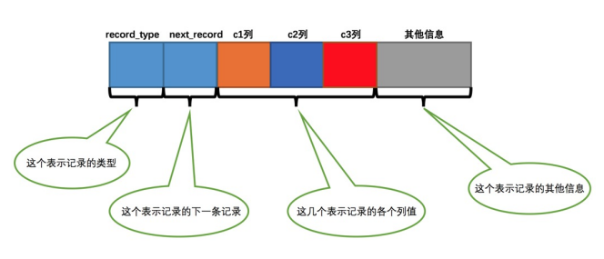
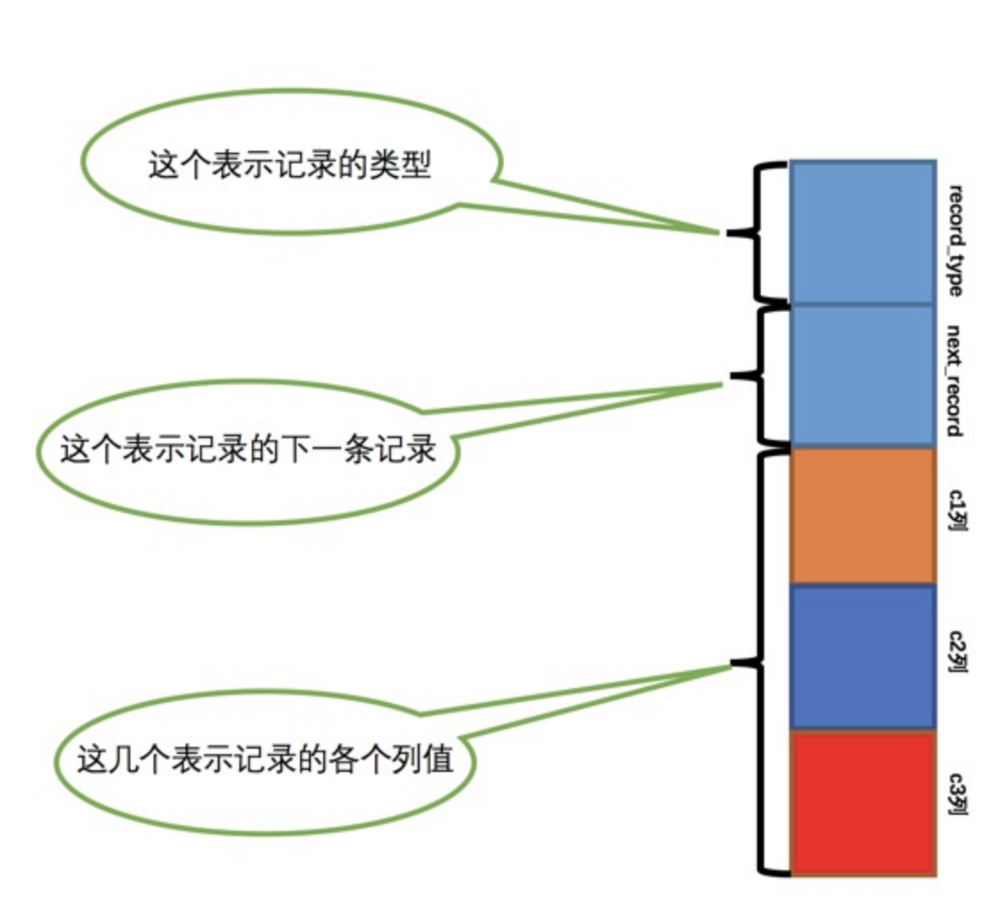
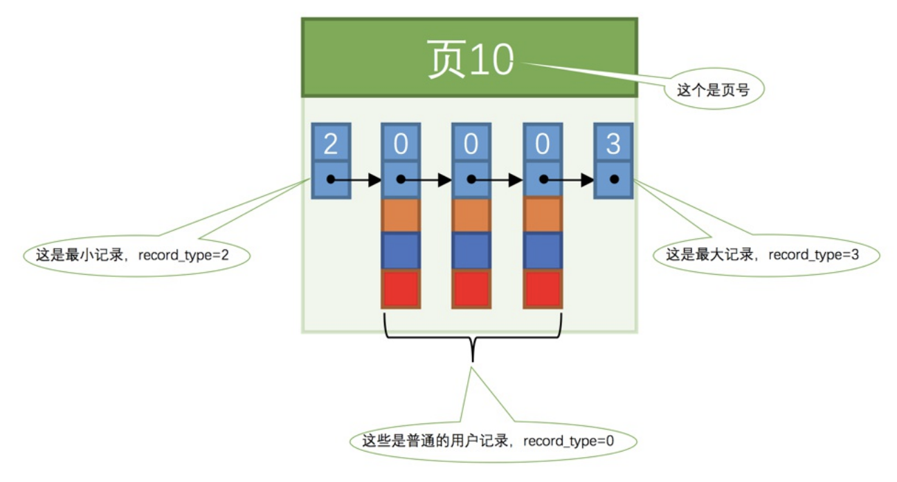
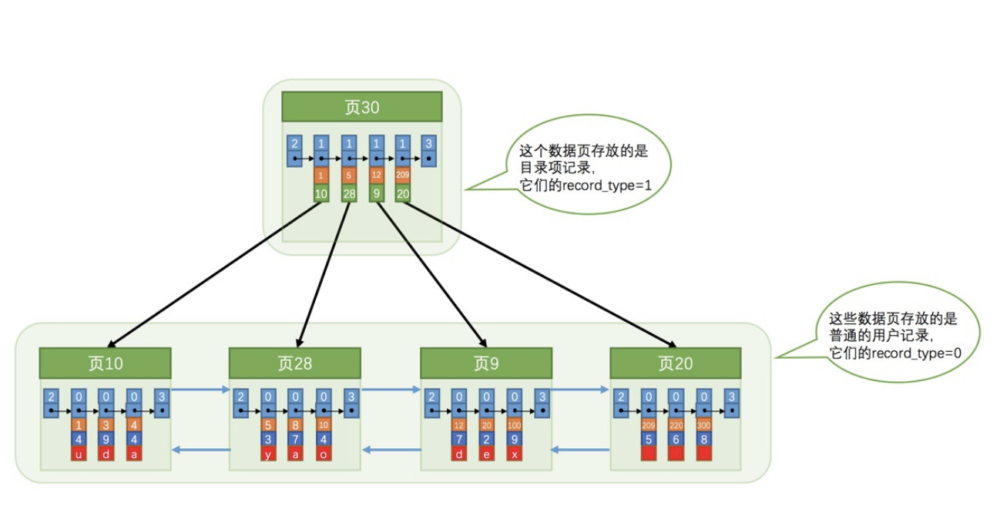
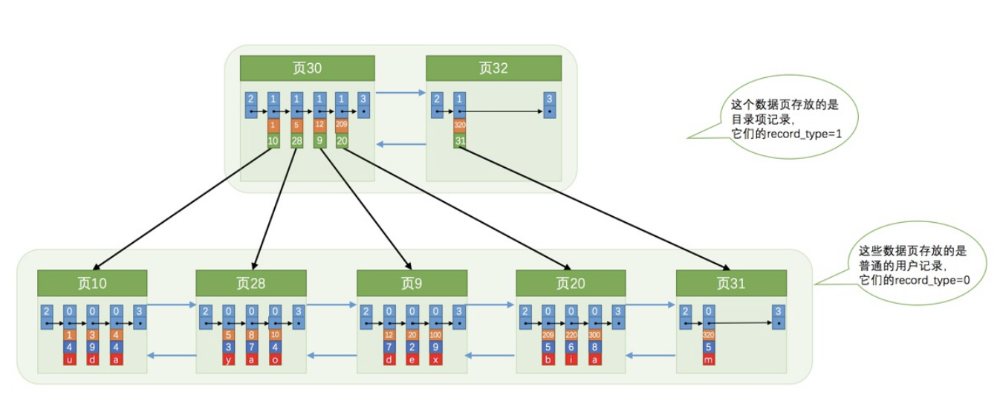
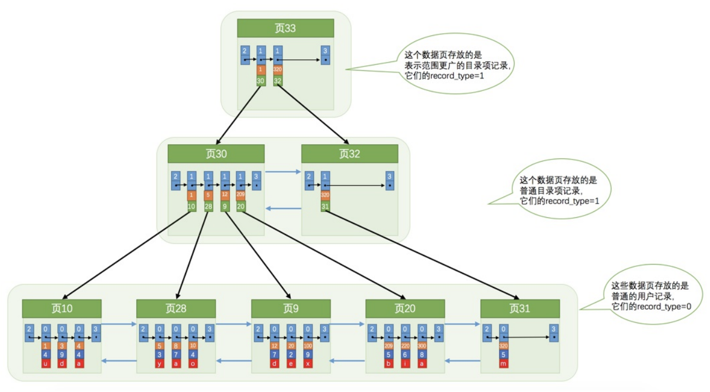
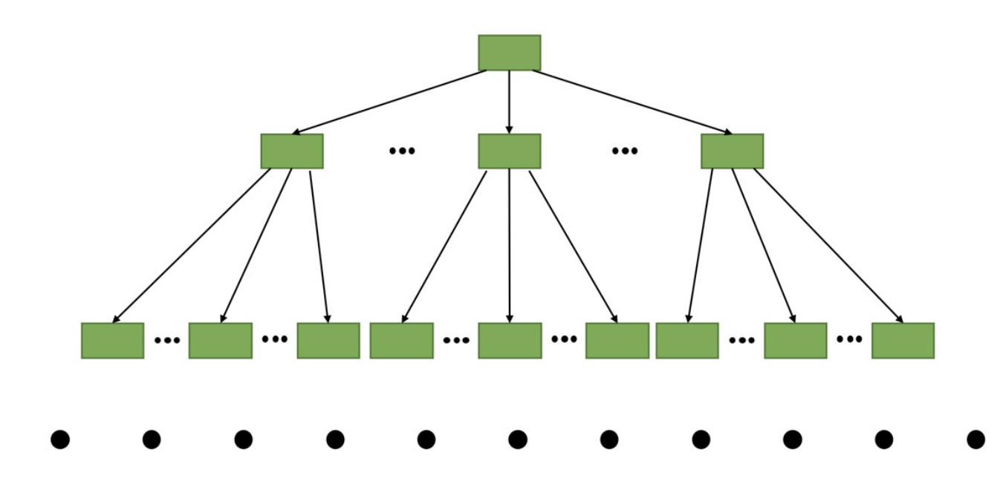
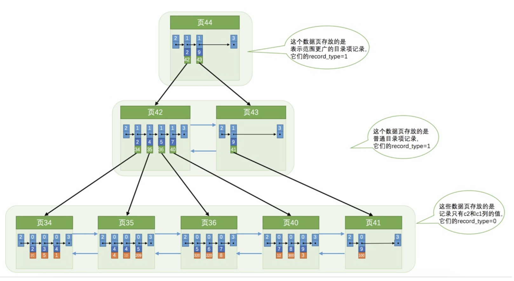
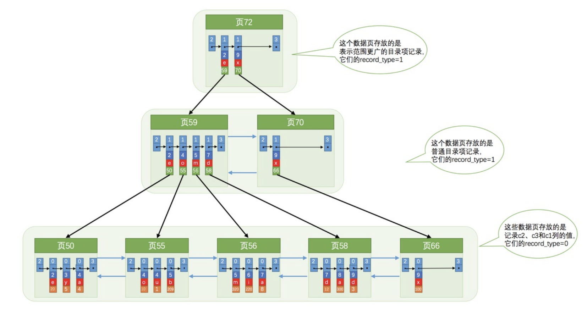
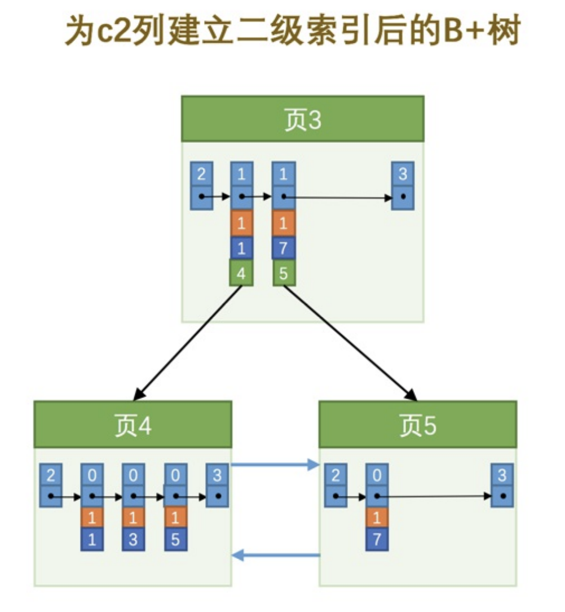

### 没有索引的查找

没有索引的时候是怎么查找记录的。为了方便大家理解，我们下边先只唠叨搜索条件为对某个列精确匹配的情况，所谓精确匹配，就是搜索条件中用等于`=`连接起的表达式，比如这样：

```
SELECT [列名列表] FROM 表名 WHERE 列名 = xxx;
```

- 以主键为搜索条件

    这个查找过程我们已经很熟悉了，可以在`页目录`中使用二分法快速定位到对应的槽，然后再遍历该槽对应分组中的记录即可快速找到指定的记录。

- 以其他列作为搜索条件

    对非主键列的查找的过程可就不这么幸运了，因为在数据页中并没有对非主键列建立所谓的`页目录`，所以我们无法通过二分法快速定位相应的`槽`。这种情况下只能从`最小记录`开始依次遍历单链表中的每条记录，然后对比每条记录是不是符合搜索条件。很显然，这种查找的效率是非常低的。

### 在很多页中查找

大部分情况下我们表中存放的记录都是非常多的，需要好多的数据页来存储这些记录。在很多页中查找记录的话可以分为两个步骤：

1. 定位到记录所在的页。
2. 从所在的页内中查找相应的记录。

在没有索引的情况下，不论是根据主键列或者其他列的值进行查找，<span style="color:red">由于我们并不能快速的定位到记录所在的页，所以只能从第一个页沿着双向链表一直往下找，在每一个页中根据我们刚刚唠叨过的查找方式去查找指定的记录</span>。因为要遍历所有的数据页，所以这种方式显然是超级耗时的，如果一个表有一亿条记录，使用这种方式去查找记录那要等到猴年马月才能等到查找结果。

### 前置内容

这个新建的`index_demo`表中有2个`INT`类型的列，1个`CHAR(1)`类型的列，而且规定了`c1`列为主键，这个表使用`Compact`行格式来实际存储记录的。为了我们理解上的方便，我们简化了一下`index_demo`表的行格式示意图：

  
只在示意图里展示记录的这几个部分：

- `record_type`：记录头信息的一项属性，表示记录的类型，`0`表示普通记录、`2`表示最小记录、`3`表示最大记录、`1`我们还没用过，等会再说～

- `next_record`：记录头信息的一项属性，表示下一条地址相对于本条记录的地址偏移量，为了方便大家理解，我们都会用箭头来表明下一条记录是谁。

- `各个列的值`：这里只记录在`index_demo`表中的三个列，分别是`c1`、`c2`和`c3`。

- `其他信息`：除了上述3种信息以外的所有信息，包括其他隐藏列的值以及记录的额外信息。

为了表示方便，之后的示意图中会把记录的`其他信息`这个部分省略掉，因为它占地方并且不会有什么观赏效果。另外，为了方便理解，我们觉得把记录竖着放看起来感觉更好，所以将记录格式示意图的`其他信息`去掉并把它竖起来的效果就是这样：

放到页里面的数据如下


### InnoDB中的索引方案

需要一种可以灵活管理所有`目录项`的方式。他们灵光乍现，忽然发现这些`目录项`其实长得跟我们的用户记录差不多，只不过`目录项`中的两个列是`主键`和`页号`而已，所以他们<span style="color:red">复用了之前存储用户记录的数据页来存储目录项，为了和用户记录做一下区分，我们把这些用来表示目录项的记录称为`目录项记录`</span>。那`InnoDB`怎么区分一条记录是普通的`用户记录`还是`目录项记录`呢？别忘了记录头信息里的`record_type`属性，它的各个取值代表的意思如下：

- `0`：普通的用户记录
- `1`：目录项记录
- `2`：最小记录
- `3`：最大记录


从图中可以看出来，我们新分配了一个编号为`30`的页来专门存储`目录项记录`。这里再次强调一遍`目录项记录`和普通的`用户记录`的不同点：

- `目录项记录`的`record_type`值是1，而普通用户记录的`record_type`值是0。

- `目录项记录`只有主键值和页的编号两个列，而普通的用户记录的列是用户自己定义的，可能包含很多列，另外还有`InnoDB`自己添加的隐藏列。

- 还记得我们之前在唠叨记录头信息的时候说过一个叫`min_rec_mask`的属性么，只有在存储`目录项记录`的页中的主键值最小的`目录项记录`的`min_rec_mask`值为`1`，其他别的记录的`min_rec_mask`值都是`0`。

除了上述几点外，这两者就没啥差别了，它们用的是一样的数据页（页面类型都是`0x45BF`，这个属性在`File Header`中，忘了的话可以翻到前边的文章看），页的组成结构也是一样一样的（就是我们前边介绍过的7个部分），都会为主键值生成`Page Directory`（页目录），从而在按照主键值进行查找时可以使用二分法来加快查询速度。现在以查找主键为`20`的记录为例，根据某个主键值去查找记录的步骤就可以大致拆分成下边两步：

1. 先到存储`目录项记录`的页，也就是页`30`中通过二分法快速定位到对应目录项，因为`12 < 20 < 209`，所以定位到对应的记录所在的页就是`页9`。

2. 再到存储用户记录的`页9`中根据二分法快速定位到主键值为`20`的用户记录。

虽然说目录项记录中只存储主键值和对应的页号，比用户记录需要的存储空间小多了，但是不论怎么说一个页只有16KB大小，能存放的目录项记录也是有限的，那如果表中的数据太多，以至于一个数据页不足以存放所有的目录项记录，该咋办呢？

当然是再多整一个存储目录项记录的页喽～ 为了大家更好的理解新分配一个目录项记录页的过程，我们假设一个存储目录项记录的页最多只能存放4条目录项记录（请注意是假设哦，真实情况下可以存放好多条的），所以如果此时我们再向上图中插入一条主键值为320的用户记录的话，那就需要分配一个新的存储目录项记录的页喽


从图中可以看出，我们插入了一条主键值为`320`的用户记录之后需要两个新的数据页：

- 为存储该用户记录而新生成了`页31`。

- 因为原先存储`目录项记录`的`页30`的容量已满（我们前边假设只能存储4条`目录项记录`），所以不得不需要一个新的`页32`来存放`页31`对应的目录项。
现在因为存储`目录项记录`的页不止一个，所以如果我们想根据主键值查找一条用户记录大致需要3个步骤，以查找主键值为`20`的记录为例：

1. 确定`目录项记录`页

    我们现在的存储`目录项记录`的页有两个，即`页30`和`页32`，又因为`页30`表示的目录项的主键值的范围是`[1, 320)`，`页32`表示的目录项的主键值不小于`320`，所以主键值为`20`的记录对应的目录项记录在`页30`中。

2. 通过`目录项记录`页确定用户记录真实所在的页。

    在一个存储`目录项记录`的页中通过主键值定位一条目录项记录的方式说过了，不赘述了～

3. 在真实存储用户记录的页中定位到具体的记录。略

那么问题来了，在这个查询步骤的第1步中我们需要定位存储`目录项记录`的页，但是这些页在存储空间中也可能不挨着，如果我们表中的数据非常多则会产生很多存储`目录项记录`的页，那我们怎么根据主键值快速定位一个存储`目录项记录`的页呢？其实也简单，为这些存储`目录项记录`的页再生成一个更高级的目录，就像是一个多级目录一样，大目录里嵌套小目录，小目录里才是实际的数据，所以现在各个页的示意图就是这样子


随着表中记录的增加，这个目录的层级会继续增加，如果简化一下，那么我们可以用下边这个图来描述它：


不论是存放用户记录的数据页，还是存放目录项记录的数据页，我们都把它们存放到`B+`树这个数据结构中了，所以我们也称这些数据页为`节点`。从图中可以看出来，我们的<span style="color:red">实际用户记录其实都存放在B+树的最底层的节点上</span>，这些节点也被称为`叶子节点`或`叶节点`，其余用来存放`目录项`的节点称为`非叶子节点`或者`内节点`，其中`B+`树最上边的那个节点也称为`根节点`。

从图中可以看出来，一个`B+`树的节点其实可以分成好多层，设计`InnoDB`的大叔们为了讨论方便，规定最下边的那层，也就是存放我们用户记录的那层为第`0`层，之后依次往上加。之前的讨论我们做了一个非常极端的假设：存放用户记录的页最多存放3条记录，存放目录项记录的页最多存放4条记录。其实真实环境中一个页存放的记录数量是非常大的，假设，假设，假设所有存放用户记录的叶子节点代表的数据页可以存放100条用户记录，所有存放目录项记录的内节点代表的数据页可以存放1000条目录项记录，那么：

- 如果`B+`树只有1层，也就是只有1个用于存放用户记录的节点，最多能存放`100`条记录。

- 如果`B+`树有2层，最多能存放`1000×100=100000`条记录。

- 如果`B+`树有3层，最多能存放`1000×1000×100=100000000`条记录。

- 如果`B+`树有4层，最多能存放`1000×1000×1000×100=100000000000`条记录。哇咔咔～这么多的记录！！！

你的表里能存放`100000000000`条记录么？所以一般情况下，我们用到的`B+`树都不会超过4层，那我们通过主键值去查找某条记录最多只需要做4个页面内的查找（查找3个目录项页和一个用户记录页），又因为在每个页面内有所谓的`Page Directory`（页目录），所以在页面内也可以通过二分法实现快速定位记录，这不是很牛么，哈哈！

#### 聚簇索引

`B+`树本身就是一个目录，或者说本身就是一个索引。它有两个特点：

1. 使用记录主键值的大小进行记录和页的排序，这包括三个方面的含义：

    - 页内的记录是按照主键的大小顺序排成一个单向链表。

    - 各个存放用户记录的页也是根据页中用户记录的主键大小顺序排成一个双向链表。

    - 存放目录项记录的页分为不同的层次，在同一层次中的页也是根据页中目录项记录的主键大小顺序排成一个双向链表。

2. `B+`树的叶子节点存储的是完整的用户记录。

    所谓完整的用户记录，就是指这个记录中存储了所有列的值（包括隐藏列）

把具有这两种特性的`B+`树称为`聚簇索引`，所有完整的用户记录都存放在这个`聚簇索引`的叶子节点处。这种`聚簇索引`并不需要我们在`MySQL`语句中显式的使用`INDEX`语句去创建（后边会介绍索引相关的语句），`InnoDB`存储引擎会<span style="color:red">自动的为我们创建聚簇索引</span>。另外有趣的一点是，在`InnoDB`存储引擎中，`聚簇索引`就是数据的存储方式（所有的用户记录都存储在了`叶子节点`），也就是所谓的<span style="color:red">索引即数据，数据即索引</span>。

#### 二级索引

只有聚簇索引是不够的，因为还需要对某个列进行索引设置从而加快速度。比方说我们用`c2`列的大小作为数据页、页中记录的排序规则，再建一棵`B+`树，效果如下图所示：


这种索引与上边介绍的聚簇索引有几处不同：

- 使用记录`c2`列的大小进行记录和页的排序，这包括三个方面的含义：

  - 页内的记录是按照`c2`列的大小顺序排成一个单向链表。

  - 各个存放用户记录的页也是根据页中记录的`c2`列大小顺序排成一个双向链表。

  - 存放目录项记录的页分为不同的层次，在同一层次中的页也是根据页中目录项记录的`c2`列大小顺序排成一个双向链表。

- `B+`树的叶子节点存储的并不是完整的用户记录，而只是`c2列+主键`这两个列的值。

- 目录项记录中不再是`主键+页号`的搭配，而变成了`c2列+页号`的搭配。

通过二级索引查找数据的流程，以查找`c2`列的值为`4`的记录为例，查找过程如下：

1. 确定`目录项记录`页

    根据`根页面`，也就是`页44`，可以快速定位到`目录项记录`所在的页为`页42`（因为`2 < 4 < 9`）。

2. 通过`目录项记录`页确定用户记录真实所在的页。

    在`页42`中可以快速定位到实际存储用户记录的页，但是由于`c2`列并没有唯一性约束，所以`c2`列值为`4`的记录可能分布在多个数据页中，又因为`2 < 4 ≤ 4`，所以确定实际存储用户记录的页在`页34`和`页35`中。

3. 在真实存储用户记录的页中定位到具体的记录。

    到`页34`和`页35`中定位到具体的记录。

4. 但是这个`B+`树的叶子节点中的记录只存储了`c2`和`c1`（也就是`主键`）两个列，所以<span style="color:red">我们必须再根据主键值去聚簇索引中再查找一遍完整的用户记录</span>。(这个过程也被称为`回表`。这种按照`非主键列`建立的`B+`树需要一次`回表`操作才可以定位到完整的用户记录，所以这种`B+`树也被称为`二级索引`)

#### 联合索引

可以同时以多个列的大小作为排序规则，也就是同时为多个列建立索引，比方说我们想让`B+`树按照`c2`和`c3`列的大小进行排序，这个包含两层含义：

- 先把各个记录和页按照`c2`列进行排序。
- 在记录的`c2`列相同的情况下，采用`c3`列进行排序

为`c2`和`c3`列建立的索引的示意图如下：


如图所示，需要注意一下几点：

- 每条`目录项记录`都由`c2`、`c3`、`页号`这三个部分组成，各条记录先按照`c2`列的值进行排序，如果记录的`c2`列相同，则按照`c3`列的值进行排序。

- `B+`树叶子节点处的用户记录由`c2`、`c3`和主键`c1`列组成。

千万要注意一点，<span style="color:red">以c2和c3列的大小为排序规则建立的B+树称为联合索引，本质上也是一个二级索引。它的意思与分别为c2和c3列分别建立索引的表述是不同的</span>，不同点如下：

- 建立`联合索引`只会建立如上图一样的1棵`B+`树。

- 为c2和c3列分别建立索引会分别以`c2`和`c3`列的大小为排序规则建立2棵`B+`树。

#### 注意事项

前边介绍`B+`树索引的时候，为了大家理解上的方便，先把存储用户记录的叶子节点都画出来，然后接着画存储目录项记录的内节点，实际上`B+`树的形成过程是这样的：

- 每当为某个表创建一个`B+`树索引（聚簇索引不是人为创建的，默认就有）的时候，都会为这个索引创建一个`根节点`页面。最开始表中没有数据的时候，每个`B+`树索引对应的`根节点`中既没有用户记录，也没有目录项记录。

- 随后向表中插入用户记录时，先把用户记录存储到这个`根节点`中。

- 当`根节点`中的可用空间用完时继续插入记录，此时会将`根节点`中的所有记录复制到一个新分配的页，比如`页a`中，然后对这个新页进行`页分裂`的操作，得到另一个新页，比如`页b`。这时新插入的记录根据键值（也就是聚簇索引中的主键值，二级索引中对应的索引列的值）的大小就会被分配到`页a`或者`页b`中，而`根节点`便升级为存储目录项记录的页。

这个过程需要大家特别注意的是：<span style="color:red">一个B+树索引的根节点自诞生之日起，便不会再移动</span>。这样只要我们对某个表建立一个索引，那么它的`根节点`的页号便会被记录到某个地方，然后凡是`InnoDB`存储引擎需要用到这个索引的时候，都会从那个固定的地方取出`根节点`的页号，从而来访问这个索引。

##### 非叶子节点中目录项记录的唯一性

`B+`树索引的内节点中目录项记录的内容是`索引列 + 页号`的搭配，但是这个搭配对于二级索引来说有点儿不严谨。还拿`index_demo`表为例，假设这个表中的数据是这样的：

|`c1`|`c2`|`c3`|
|:--:|:--:|:--:|
|1|1|'u'|
|3|1|'d'|
|5|1|'y'|
|7|1|'a'|

如果二级索引中目录项记录的内容只是`索引列 + 页号`的搭配的话，那么为`c2`列建立索引后的`B+`树应该长这样


想新插入一行记录，其中`c1`、`c2`、`c3`的值分别是：`9`、`1`、`'c'`，那么在修改这个为`c2`列建立的二级索引对应的`B+`树时便碰到了个大问题：由于`页3`中存储的目录项记录是由`c2列 + 页号`的值构成的，`页3`中的两条目录项记录对应的`c2`列的值都是`1`，而我们新插入的这条记录的`c2`列的值也是`1`，那我们这条新插入的记录到底应该放到`页4`中，还是应该放到`页5`中啊？

为了让新插入记录能找到自己在那个页里，<span style="color:red">我们需要保证在B+树的同一层内节点的目录项记录除`页号`这个字段以外是唯一的</span>。所以对于二级索引的内节点的目录项记录的内容实际上是由三个部分构成的：

- 索引列的值
- 主键值
- 页号

这样我们再插入记录`(9, 1, 'c')`时，由于`页3`中存储的目录项记录是由`c2列 + 主键 + 页号`的值构成的，可以先把新记录的`c2`列的值和`页3`中各目录项记录的`c2`列的值作比较，如果`c2`列的值相同的话，可以接着比较主键值，因为`B+`树同一层中不同目录项记录的`c2列 + 主键`的值肯定是不一样的，所以最后肯定能定位唯一的一条目录项记录，在本例中最后确定新记录应该被插入到`页5`中。

先根据c2的值进行排列,如果值相同则根据主键进行排列。

### MyISAM中的索引方案简单介绍

我们有必要再简单介绍一下`MyISAM`存储引擎中的索引方案。我们知道`InnoDB`中<span style="color:red">索引即数据，也就是聚簇索引的那棵`B+`树的叶子节点中已经把所有完整的用户记录都包含了</span>，而`MyISAM`的索引方案虽然也使用树形结构，但是却将索引和数据分开存储：

- 将表中的记录按照记录的插入顺序单独存储在一个文件中，称之为`数据文件`。这个文件并不划分为若干个数据页，有多少记录就往这个文件中塞多少记录就成了。我们可以通过行号而快速访问到一条记录。

    `MyISAM`记录也需要记录头信息来存储一些额外数据，我们以上边唠叨过的`index_demo`表为例，看一下这个表中的记录使用`MyISAM`作为存储引擎在存储空间中的表示：

    

    由于在插入数据的时候并没有刻意按照主键大小排序，所以我们并不能在这些数据上使用二分法进行查找。

- 使用`MyISAM`存储引擎的表会把索引信息另外存储到一个称为`索引文件`的另一个文件中。`MyISAM`会单独为表的主键创建一个索引，只不过在索引的叶子节点中存储的不是完整的用户记录，而是`主键值 + 行号`的组合。也就是先通过索引找到对应的行号，再通过行号去找对应的记录！

    这一点和`InnoDB`是完全不相同的，在`InnoDB`存储引擎中，我们只需要根据主键值对`聚簇索引`进行一次查找就能找到对应的记录，而在`MyISAM`中却需要进行一次`回表`操作，意味着<span style="color:red">`MyISAM`中建立的索引相当于全部都是`二级索引`</span>！

- 如果有需要的话，我们也可以对其它的列分别建立索引或者建立联合索引，原理和`InnoDB`中的索引差不多，不过在叶子节点处存储的是`相应的列 + 行号`。这些索引也全部都是`二级索引`。

```!
小贴士：

MyISAM的行格式有定长记录格式（Static）、变长记录格式（Dynamic）、压缩记录格式（Compressed）。上边用到的index_demo表采用定长记录格式，也就是一条记录占用存储空间的大小是固定的，这样就可以轻松算出某条记录在数据文件中的地址偏移量。但是变长记录格式就不行了，MyISAM会直接在索引叶子节点处存储该条记录在数据文件中的地址偏移量。通过这个可以看出，MyISAM的回表操作是十分快速的，因为是拿着地址偏移量直接到文件中取数据的，反观InnoDB是通过获取主键之后再去聚簇索引里边儿找记录，虽然说也不慢，但还是比不上直接用地址去访问。
```

InnoDB中的索引即数据，数据即索引，而MyISAM中却是索引是索引、数据是数据。

### MySQL中创建和删除索引的语句

可以在创建表的时候指定需要建立索引的单个列或者建立联合索引的多个列：

```
CREATE TALBE 表名 (
    各种列的信息 ··· , 
    [KEY|INDEX] 索引名 (需要被索引的单个列或多个列)
)
```

其中的`KEY`和`INDEX`是同义词，任意选用一个就可以。我们也可以在修改表结构的时候添加索引：

```
ALTER TABLE 表名 ADD [INDEX|KEY] 索引名 (需要被索引的单个列或多个列);
```

也可以在修改表结构的时候删除索引：

```
ALTER TABLE 表名 DROP [INDEX|KEY] 索引名;
```

比方说我们想在创建`index_demo`表的时候就为`c2`和`c3`列添加一个`联合索引`，可以这么写建表语句：

```
CREATE TABLE index_demo(
    c1 INT,
    c2 INT,
    c3 CHAR(1),
    PRIMARY KEY(c1),
    INDEX idx_c2_c3 (c2, c3)
);
```

在这个建表语句中我们创建的索引名是`idx_c2_c3`，这个名称可以随便起，不过我们还是建议以`idx_`为前缀，后边跟着需要建立索引的列名，多个列名之间用下划线`_`分隔开。

如果我们想删除这个索引，可以这么写：

```
ALTER TABLE index_demo DROP INDEX idx_c2_c3;
```
