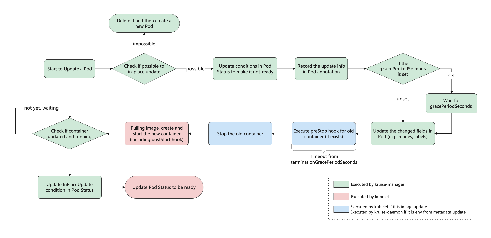

# 定义
OpenKruise 是一个基于 Kubernetes 的扩展套件，主要聚焦于云原生应用的自动化，比如 部署、发布、运维以及可用性防护。
OpenKruise 提供的绝大部分能力都是基于 CRD 扩展来定义，它们不存在于任何外部依赖，可以运行在任意纯净的 Kubernetes 集群中。
# 核心能力
## 增强版本的 Workloads
OpenKruise 包含了一系列增强版本的 Workloads（工作负载），比如 CloneSet、Advanced StatefulSet、Advanced DaemonSet、BroadcastJob 等。

它们不仅支持类似于 Kubernetes 原生 Workloads 的基础功能，还提供了如原地升级、可配置的扩缩容/发布策略、并发操作等。

其中，原地升级是一种升级应用容器镜像甚至环境变量的全新方式。它只会用新的镜像重建 Pod 中的特定容器，整个 Pod 以及其中的其他容器都不会被影响。因此它带来了更快的发布速度，以及避免了对其他 Scheduler、CNI、CSI 等组件的负面影响。

## 应用的旁路管理

OpenKruise 提供了多种通过旁路管理应用 sidecar 容器、多区域部署的方式，“旁路” 意味着你可以不需要修改应用的 Workloads 来实现它们。

比如，SidecarSet 能帮助你在所有匹配的 Pod 创建的时候都注入特定的 sidecar 容器，甚至可以原地升级已经注入的 sidecar 容器镜像、并且对 Pod 中其他容器不造成影响。

而 WorkloadSpread 可以约束无状态 Workload 扩容出来 Pod 的区域分布，赋予单一 workload 的多区域和弹性部署的能力。

## 高可用性防护

OpenKruise 在为应用的高可用性防护方面也做出了很多努力。

目前它可以保护你的 Kubernetes 资源不受级联删除机制的干扰，包括 CRD、Namespace、以及几乎全部的 Workloads 类型资源。

相比于 Kubernetes 原生的 PDB 只提供针对 Pod Eviction 的防护，PodUnavailableBudget 能够防护 Pod Deletion、Eviction、Update 等许多种 voluntary disruption 场景。

## 高级的应用运维能力

OpenKruise 也提供了很多高级的运维能力来帮助你更好地管理应用。

你可以通过 ImagePullJob 来在任意范围的节点上预先拉取某些镜像，或者指定某个 Pod 中的一个或多个容器被原地重启。

# 与k8s
OpenKruise 对于 Kubernetes 是一个辅助扩展角色,可以被很容易地安装到任意 Kubernetes 集群中，它弥补了 Kubernetes 在应用部署、升级、防护、运维 等领域的不足。

# 安装
参考：https://openkruise.io/zh/docs/installation

# 核心概念
## 系统架构

Kruise-manager 是一个运行 controller 和 webhook 中心组件，它通过 Deployment 部署在 kruise-system 命名空间中。
## 升级
### 重建升级
- Pod 名字和 uid 发生变化，因为它们是完全不同的两个 Pod 对象（比如 Deployment 升级）
- Pod 名字可能不变、但 uid 变化，因为它们是不同的 - Pod 对象，只是复用了同一个名字（比如 StatefulSet 升级）
- Pod 所在 Node 名字发生变化，因为新 Pod 很大可能性是不会调度到之前所在的 Node 节点的
- Pod IP 发生变化，因为新 Pod 很大可能性是不会被分配到之前的 IP 地址的
### 原地升级
原地升级是 OpenKruise 提供的核心功能之一。
原地升级的特点：
- 可以避免如 调度、分配 IP、分配、挂载盘 等额外的操作和代价
- 更快的镜像拉取，因为开源复用已有旧镜像的大部分 layer 层，只需要拉取新镜像变化的一些 layer
- 当一个容器在原地升级时，Pod 中的其他容器不会受到影响，仍然维持运行

目前支持原地升级的 Workload：
- CloneSet
- Advanced StatefulSet
- Advanced DaemonSet
- SidecarSet
#### 流程


#### 如何触发
这种 Kruise workload 的升级类型名为 InPlaceIfPossible，它意味着 Kruise 会尽量对 Pod 采取原地升级，如果不能则退化到重建升级。

- 更新 workload 中的 spec.template.metadata.*，比如 labels/annotations，Kruise 只会将
-  2metadata 中的改动更新到存量 Pod 上。
更新 workload 中的 spec.template.spec.containers[x].image，Kruise 会原地升级 Pod 中这些容器的镜像，而不会重建整个 Pod。
-  从 Kruise v1.0 版本开始（包括 v1.0 alpha/beta），更新 spec.template.metadata.labels/annotations 并且 container 中有配置 env from 这些改动的 labels/anntations，Kruise 会原地升级这些容器来生效新的 env 值。

否则，其他字段的改动，比如 spec.template.spec.containers[x].env 或 spec.template.spec.containers[x].resources，都是会回退为重建升级。
```yaml
# 修改 app-image:v1 镜像，会触发原地升级。
# 修改 annotations 中 app-config 的 value 内容，会触发原地升级（参考下文使用要求）。
# 同时修改上述两个字段，会在原地升级中同时更新镜像和环境变量。
# 直接修改 env 中 APP_NAME 的 value 内容或者新增 env 等其他操作，会触发 Pod 重建升级。
apiVersion: apps.kruise.io/v1alpha1
kind: CloneSet
metadata:
  ...
spec:
  replicas: 1
  template:
    metadata:
      annotations:
        app-config: "... the real env value ..."
    spec:
      containers:
      - name: app
        image: app-image:v1
        env:
        - name: APP_CONFIG
          valueFrom:
            fieldRef:
              fieldPath: metadata.annotations['app-config']
        - name: APP_NAME
          value: xxx
  updateStrategy:
    type: InPlaceIfPossible
```
#### 顺序控制
当同时原地升级多个具有不同启动顺序的容器时，Kruise 会按照相同的权重顺序来逐个升级这些容器。

- 对于不存在容器启动顺序的 Pod，在多容器原地升级时没有顺序保证。
- 对于存在容器启动顺序的 Pod：
   - 如果本次原地升级的多个容器具有不同的启动顺序，会按启动顺序来控制原地升级的先后顺序。
   - 如果本地原地升级的多个容器的启动顺序相同，则原地升级时没有顺序保证。

# Workloads
## CloneSet
CloneSet 控制器提供了高效管理无状态应用的能力，它可以对标原生的 Deployment，但 CloneSet 提供了很多增强功能。
简单例子
```yaml
apiVersion: apps.kruise.io/v1alpha1
kind: CloneSet
metadata:
  labels:
    app: sample
  name: sample
spec:
  replicas: 5
  selector:
    matchLabels:
      app: sample
  template:
    metadata:
      labels:
        app: sample
    spec:
      containers:
      - name: nginx
        image: nginx:alpine
```
### 额外能力
#### 支持 PVC 模板​
CloneSet 允许用户配置 PVC 模板 volumeClaimTemplates，用来给每个 Pod 生成独享的 PVC，这是 Deployment 所不支持的。 如果用户没有指定这个模板，CloneSet 会创建不带 PVC 的 Pod。
- 每个被自动创建的 PVC 会有一个 ownerReference 指向 CloneSet，因此 CloneSet 被删除时，它创建的所有 Pod 和 PVC 都会被删除。
- 每个被 CloneSet 创建的 Pod 和 PVC，都会带一个 apps.kruise.io/cloneset-instance-id: xxx 的 label。关联的 Pod 和 PVC 会有相同的 instance-id，且它们的名字后缀都是这个 instance-id。
- 如果一个 Pod 被 CloneSet controller 缩容删除时，这个 Pod 关联的 PVC 都会被一起删掉。
- 如果一个 Pod 被外部直接调用删除或驱逐时，这个 Pod 关联的 PVC 还都存在；并且 CloneSet controller 发现数量不足重新扩容时，新扩出来的 Pod 会复用原 -  Pod的 instance-id 并关联原来的 PVC。
- 当 Pod 被重建升级时，关联的 PVC 会跟随 Pod 一起被删除、新建。
- 当 Pod 被原地升级时，关联的 PVC 会持续使用。
#### 指定Pod缩容​
当一个 CloneSet 被缩容时，有时候用户需要指定一些 Pod 来删除。这对于 StatefulSet 或者 Deployment 来说是无法实现的，因为 StatefulSet 要根据序号来删除 Pod，而 Deployment/ReplicaSet 目前只能根据控制器里定义的排序来删除。

CloneSet 允许用户在缩小 replicas 数量的同时，指定想要删除的 Pod 名字。参考下面这个例子：
```yaml
apiVersion: apps.kruise.io/v1alpha1
kind: CloneSet
spec:
  # ...
  replicas: 4
  scaleStrategy:
    podsToDelete:
    - sample-9m4hp
```
当控制器收到上面这个 CloneSet 更新之后，会确保 replicas 数量为 4。如果 podsToDelete 列表里写了一些 Pod 名字，控制器会优先删除这些 Pod。 对于已经被删除的 Pod，控制器会自动从 podsToDelete 列表中清理掉。

如果你只把 Pod 名字加到 podsToDelete，但没有修改 replicas 数量，那么控制器会先把指定的 Pod 删掉，然后再扩一个新的 Pod。 另一种直接删除 Pod 的方式是在要删除的 Pod 上打 apps.kruise.io/specified-delete: true 标签。

相比于手动直接删除 Pod，使用 podsToDelete 或 apps.kruise.io/specified-delete: true 方式会有 CloneSet 的 maxUnavailable/maxSurge 来保护删除， 并且会触发 PreparingDelete 生命周期 hook （见下文）。
##### 缩容顺序​
1. 未调度 < 已调度
2. PodPending < PodUnknown < PodRunning
3. Not ready < ready
4. 较小 pod-deletion cost < 较大
5. pod-deletion cost
6. 较大打散权重 < 较小
7. 处于 Ready 时间较短 < 较长
8. 容器重启次数较多 < 较少
9. 创建时间较短 < 较长

##### 短hash
todo
#### 流式扩容
CloneSet 扩容时可以指定 ScaleStrategy.MaxUnavailable 来限制扩容的步长，以达到服务应用影响最小化的目的。 它可以设置为一个绝对值或者百分比，如果不填，则 Kruise 会设置为默认值为 nil，即表示不设限制。

该字段可以配合 Spec.MinReadySeconds 字段使用, 例如：
```yaml
apiVersion: apps.kruise.io/v1alpha1
kind: CloneSet
spec:
  # ...
  minReadySeconds: 60
  scaleStrategy:
    maxUnavailable: 1
```
上述配置能达到的效果是：在扩容时，只有当上一个扩容出的 Pod 已经 Ready 超过一分钟后，CloneSet 才会执行创建下一个 Pod 的操作。

#### 升级功能
CloneSet 提供了 3 种升级方式，默认为 ReCreate：
- ReCreate: 控制器会删除旧 Pod 和它的 PVC，然后用新版本重新创建出来。
- InPlaceIfPossible: 控制器会优先尝试原地升级 Pod，如果不行再采用重建升级。具体参考下方阅读文档。
- InPlaceOnly: 控制器只允许采用原地升级。因此，用户只能修改上一条中的限制字段，如果尝试修改其他字段会被 Kruise 拒绝。
在原地升级中提供了 graceful period 选项，作为优雅原地升级的策略。用户如果配置了 gracePeriodSeconds 这个字段，控制器在原地升级的过程中会先把 Pod status 改为 not-ready，然后等一段时间（gracePeriodSeconds），最后再去修改 Pod spec 中的镜像版本。 这样，就为 endpoints-controller 这些控制器留出了充足的时间来将 Pod 从 endpoints 端点列表中去除。
```yaml
apiVersion: apps.kruise.io/v1alpha1
kind: CloneSet
spec:
  # ...
  updateStrategy:
    type: InPlaceIfPossible
    inPlaceUpdateStrategy:
      gracePeriodSeconds: 10
```
#### 分批灰度
##### partition
Partition 的语义是 保留旧版本 Pod 的数量或百分比，默认为 0。这里的 partition 不表示任何 order 序号。
如果在发布过程中设置了 partition:
- 如果是数字，控制器会将 (replicas - partition) 数量的 Pod 更新到最新版本。
- 如果是百分比，控制器会将 (replicas * (100% - partition)) 数量的 Pod 更新到最新版本。
- 如果 partition 是百分比, 并且满足 partition < 100% && replicas > 1 , CloneSet 会保证 至少有一个 Pod 会被升级到最新版本。
- 用户可以使用 .status.updatedReplicas >= .status.ExpectedUpdatedReplicas 条件，来判断在当前 partition 字段的限制下，CloneSet 是否已经完成了预期数量 Pod 的版本升级。

默认情况下，partition 只控制 Pod 更新到 status.updateRevision 新版本。 也就是说以上面这个 CloneSet 来看，当 partition 5 -> 3 时，CloneSet 会升级 2 个 Pod 到 status.updateRevision 版本。 而当把 partition 3 -> 5 修改回去时，CloneSet 不会做任何事情。

但是如果你启用了 CloneSetPartitionRollback 这个 feature-gate， 上面这个场景下 CloneSet 会把 2 个 status.updateRevision 版本的 Pod 重新回滚为 status.currentRevision 版本。

##### maxUnavailable
MaxUnavailable 是 CloneSet 限制下属最多不可用的 Pod 数量。 它可以设置为一个绝对值或者百分比，如果不填 Kruise 会设置为默认值 20%。

##### maxSurge
MaxSurge 是 CloneSet 控制最多能扩出来超过 replicas 的 Pod 数量。 它可以设置为一个绝对值或者百分比，如果不填 Kruise 会设置为默认值 0。

如果发布的时候设置了 maxSurge，控制器会先多扩出来 maxSurge 数量的 Pod（此时 Pod 总数为 (replicas+maxSurge))，然后再开始发布存量的 Pod。 然后，当新版本 Pod 数量已经满足 partition 要求之后，控制器会再把多余的 maxSurge 数量的 Pod 删除掉，保证最终的 Pod 数量符合 replicas。

要说明的是，maxSurge 不允许配合 InPlaceOnly 更新模式使用。 另外，如果是与 InPlaceIfPossible 策略配合使用，控制器会先扩出来 maxSurge 数量的 Pod，再对存量 Pod 做原地升级。

##### paused
用户可以通过设置 paused 为 true 暂停发布，不过控制器还是会做 replicas 数量管理：

```yaml
apiVersion: apps.kruise.io/v1alpha1
kind: CloneSet
spec:
  replicas: 5
  template:
    metadata:
      labels:
        app: sample
    spec:
      containers:
      - image: nginx:mainline
        imagePullPolicy: Always
        name: nginx
  updateStrategy:
    partition: 3
    maxUnavailable: 20%
    maxSurge: 3
    paused: true
```
#### 升级顺序
当控制器选择 Pod 做升级时，默认是有一套根据 Pod phase/conditions 的排序逻辑： unscheduled < scheduled, pending < unknown < running, not-ready < ready。 在此之外，CloneSet 也提供了增强的 priority(优先级) 和 scatter(打散) 策略来允许用户自定义发布顺序。
##### 优先级策略
这个策略定义了控制器计算 Pod 发布优先级的规则，所有需要更新的 Pod 都会通过这个优先级规则计算后排序。 目前 priority 可以通过 weight(权重) 和 order(序号) 两种方式来指定。

```yaml
apiVersion: apps.kruise.io/v1alpha1
kind: CloneSet
spec:
  # ...
  updateStrategy:
    priorityStrategy:
      weightPriority:
      - weight: 50
        matchSelector:
          matchLabels:
            test-key: foo
      - weight: 30
        matchSelector:
          matchLabels:
            test-key: bar
    orderPriority:
      - orderedKey: some-label-key
```

##### 打散策略
定义了如何将一类 Pod 打散到整个发布过程中。 比如，针对一个 replica=10 的 CloneSet，我们在 3 个 Pod 中添加了 foo=bar 标签、并设置对应的 scatter 策略，那么在发布的时候这 3 个 Pod 会排在第 1、6、10 个发布。
```yaml
apiVersion: apps.kruise.io/v1alpha1
kind: CloneSet
spec:
  # ...
  updateStrategy:
    scatterStrategy:
    - key: foo
      value: bar
```
#### 原地升级自动预热
如果你在安装或升级 Kruise 的时候启用了 PreDownloadImageForInPlaceUpdate feature-gate， CloneSet 控制器会自动在所有旧版本 pod 所在 node 节点上预热你正在灰度发布的新版本镜像。 这对于应用发布加速很有帮助。

默认情况下 CloneSet 每个新镜像预热时的并发度都是 1，也就是一个个节点拉镜像。 如果需要调整，你可以通过 apps.kruise.io/image-predownload-parallelism annotation 来设置并发度。

另外从 Kruise v1.1.0 开始，你可以使用 apps.kruise.io/image-predownload-min-updated-ready-pods 来控制在少量新版本 Pod 已经升级成功之后再执行镜像预热。它的值可能是绝对值数字或是百分比。
```yaml
apiVersion: apps.kruise.io/v1alpha1
kind: CloneSet
metadata:
  annotations:
    apps.kruise.io/image-predownload-parallelism: "10"
    apps.kruise.io/image-predownload-min-updated-ready-pods: "3"
```
注意，为了避免大部分不必要的镜像拉取，目前只针对 replicas > 3 的 CloneSet 做自动预热。
#### 生命周期钩子​
每个 CloneSet 管理的 Pod 会有明确所处的状态，在 Pod label 中的 lifecycle.apps.kruise.io/state 标记：
- Normal：正常状态
- PreparingUpdate：准备原地升级
- Updating：原地升级中
- Updated：原地升级完成
- PreparingDelete：准备删除
而生命周期钩子，则是通过在上述状态流转中卡点，来实现原地升级前后、删除前的自定义操作（比如开关流量、告警等）。

```yaml
# 升级/删除 Pod 前将其置为 NotReady​
  lifecycle:
    preDelete:
      markPodNotReady: true
      finalizersHandler:
      - example.io/unready-blocker
    inPlaceUpdate:
      markPodNotReady: true
      finalizersHandler:
      - example.io/unready-blocker
```

### 相关annotation
#### Pod deletion cost
EATURE STATE: Kruise v0.9.0

controller.kubernetes.io/pod-deletion-cost 是从 Kubernetes 1.21 版本后加入的 annotation，Deployment/ReplicaSet 在缩容时会参考这个 cost 数值来排序。 CloneSet 从 Kruise v0.9.0 版本后也同样支持了这个功能。

用户可以把这个 annotation 配置到 pod 上，值的范围在 [-2147483647, 2147483647]。 它表示这个 pod 相较于同个 CloneSet 下其他 pod 的 "删除代价"，代价越小的 pod 删除优先级相对越高。 没有设置这个 annotation 的 pod 默认 deletion cost 是 0.
#### Deletion by Spread Constraints​
FEATURE STATE: Kruise v0.10.

目前，CloneSet 支持 按同节点打散 和 按 pod topolocy spread constraints 打散。

如果在 CloneSet template 中存在 Pod Topology Spread Constraints 规则定义，则 controller 在这个 CloneSet 缩容的时候会根据 spread constraints 规则来所打散并选择要删除的 pod。 否则，controller 默认情况下是按同节点打散来选择要缩容的 pod。

更多：https://openkruise.io/zh/docs/user-manuals/cloneset#优先级策略

## Advanced StatefulSet
这个控制器基于原生 StatefulSet 上增强了发布能力，比如 maxUnavailable 并行发布、原地升级等.

注意 Advanced StatefulSet 是一个 CRD，kind 名字也是 StatefulSet，但是 apiVersion 是 apps.kruise.io/v1beta1。 这个 CRD 的所有默认字段、默认行为与原生 StatefulSet 完全一致，除此之外还提供了一些 optional 字段来扩展增强的策略。

因此，用户从原生 StatefulSet 迁移到 Advanced StatefulSet，只需要把 apiVersion 修改后提交即可：
```yaml
-  apiVersion: apps/v1
+  apiVersion: apps.kruise.io/v1beta1
   kind: StatefulSet
   metadata:
     name: sample
   spec:
    podManagementPolicy: Parallel
    updateStrategy:
      type: RollingUpdate
      rollingUpdate:
        maxUnavailable: 20%
     #...
```
### MaxUnavailable
Advanced StatefulSet 在 RollingUpdateStatefulSetStrategy 中新增了 maxUnavailable 策略来支持并行 Pod 发布，它会保证发布过程中最多有多少个 Pod 处于不可用状态。注意，maxUnavailable 只能配合 podManagementPolicy 为 Parallel 来使用。

这个策略的效果和 Deployment 中的类似，但是可能会导致发布过程中的 order 顺序不能严格保证。 如果不配置 maxUnavailable，它的默认值为 1，也就是和原生 StatefulSet 一样只能 one by one 串行发布 Pod，即使把 podManagementPolicy 配置为 Parallel 也是这样。

### 原地升级
参考cloneset.
不同的是，如果使用 InPlaceIfPossible 或 InPlaceOnly 策略，必须要增加一个 InPlaceUpdateReady readinessGate，用来在原地升级的时候控制器将 Pod 设置为 NotReady。
```yaml
apiVersion: apps.kruise.io/v1beta1
kind: StatefulSet
metadata:
  name: sample
spec:
  replicas: 3
  serviceName: fake-service
  selector:
    matchLabels:
      app: sample
  template:
    metadata:
      labels:
        app: sample
    spec:
      readinessGates:
         # A new condition that ensures the pod remains at NotReady state while the in-place update is happening
      - conditionType: InPlaceUpdateReady
      containers:
      - name: main
        image: nginx:alpine
  podManagementPolicy: Parallel 
  updateStrategy:
    type: RollingUpdate
    rollingUpdate:
      podUpdatePolicy: InPlaceIfPossible
      maxUnavailable: 2

```

### 其他
升级顺序，暂停发布，原地升级预热，流式扩容，pvc保留，以及生命周期钩子等参考cloneset。

参考：https://openkruise.io/zh/docs/user-manuals/advancedstatefulset

## Advanced DaemonSet
这个控制器基于原生 DaemonSet 上增强了发布能力，比如 灰度分批、按 Node label 选择、暂停、热升级等。

注意 Advanced DaemonSet 是一个 CRD，kind 名字也是 DaemonSet，但是 apiVersion 是 apps.kruise.io/v1alpha1。 这个 CRD 的所有默认字段、默认行为与原生 DaemonSet 完全一致，除此之外还提供了一些 optional 字段来扩展增强的策略。

因此，用户从原生 DaemonSet 迁移到 Advanced DaemonSet，只需要把 apiVersion 修改后提交即可：
```yaml
-  apiVersion: apps/v1
+  apiVersion: apps.kruise.io/v1alpha1
   kind: DaemonSet
   metadata:
     name: sample-ds
```
### 升级方式
Advanced DaemonSet 在 spec.updateStrategy.rollingUpdate 中有一个 rollingUpdateType 字段，标识了如何进行滚动升级：

- Standard: 对于每个 node，控制器会先删除旧的 daemon Pod，再创建一个新 Pod，和原生 DaemonSet 行为一致。

- Surging: 对于每个 node，控制器会先创建一个新 Pod，等它 ready 之后再删除老 Pod。

- Standard (默认): 控制器会重建升级 Pod，与原生 DaemonSet 行为一致。你可以通过 maxUnavailable 或 maxSurge 来控制重建新旧 Pod 的顺序。

- InPlaceIfPossible: 控制器会尽量采用原地升级的方式，如果不行则重建升级。请阅读该文档了解更多原地升级的细节。 注意，在这个类型下，只能使用 maxUnavailable 而不能用 maxSurge。

### Selector 标签选择升级​
这个策略支持用户通过配置 node 标签的 selector，来指定灰度升级某些特定类型 node 上的 Pod。
```yaml
spec:
  updateStrategy:
    type: RollingUpdate
    rollingUpdate:
      selector:
        matchLabels:
          nodeType: canary
```
### 其他
分批灰度升级或扩容,暂停升级​,升级镜像自动预热​,生命周期钩子等参考Cloneset.


## BroadcastJob
这个控制器将 Pod 分发到集群中每个 node 上，类似于 DaemonSet， 但是 BroadcastJob 管理的 Pod 并不是长期运行的 daemon 服务，而是类似于 Job 的任务类型 Pod。

最终在每个 node 上的 Pod 都执行完成退出后，BroadcastJob 和这些 Pod 并不会占用集群资源。 这个控制器非常有利于做升级基础软件、巡检等过一段时间需要在整个集群中跑一次的工作。

此外，BroadcastJob 还可以维持每个 node 跑成功一个 Pod 任务。如果采取这种模式，当后续集群中新增 node 时 BroadcastJob 也会分发 Pod 任务上去执行。

### 定义
#### Template
Template 描述了 Pod 模板，用于创建任务 Pod。 注意，由于是任务类型的 Pod，其中的 restart policy 只能设置为 Never 或 OnFailure，不允许设为 Always。
#### Parallelism
Parallelism 指定了最多能允许多少个 Pod 同时在执行任务，默认不做限制。

比如，一个集群里有 10 个 node、并设置了 Parallelism 为 3，那么 BroadcastJob 会保证同时只会有 3 个 node 上的 Pod 在执行。每当一个 Pod 执行完成，BroadcastJob 才会创建一个新 Pod 执行。
#### CompletionPolicy
CompletionPolicy 支持指定 BroadcastJob 控制器的 reconciling 行为，可以设置为 Always 或 Never：
##### Always
Always 策略意味着 job 最终会完成，不管是执行成功还是失败了。在 Always 策略下还可以设置以下参数：

- ActiveDeadlineSeconds：指定一个超时时间，如果 BroadcastJob 开始运行超过了这个时间，所有还在跑着的 job 都会被停止、并标记为失败。

- BackoffLimit：指定一个重试次数，超过这个次数后才标记 job 失败，默认没有限制。目前，Pod 实际的重试次数是看 Pod status 中上报所有容器的 ContainerStatus.RestartCount 重启次数。如果这个重启次数超过了 BackoffLimit，这个 job 就会被标记为失败、并把运行的 Pod 删除掉。

- TTLSecondsAfterFinished 限制了 BroadcastJob 在完成之后的存活时间，默认没有限制。比如设置了 TTLSecondsAfterFinished 为 10s，那么当 job 结束后超过了 10s，控制器就会把 job 和下面的所有 Pod 删掉。
##### Never
Never 策略意味着 BroadcastJob 永远都不会结束（标记为 Succeeded 或 Failed），即使当前 job 下面的 Pod 都已经执行成功了。 这也意味着 ActiveDeadlineSeconds、 BackoffLimit、 TTLSecondsAfterFinished 这三个参数是不能使用的。

比如说，用户希望对集群中每个 node 都下发一个配置，包括后续新增的 node 都需要做，那么就可以创建一个 Never 策略的 BroadcastJob。

## AdvancedCronJob
AdvancedCronJob 是对于原生 CronJob 的扩展版本，根据用户设置的 schedule 规则，周期性创建 Job 执行任务，而 AdvancedCronJob 的 template 支持多种不同的 job 资源.
周期性创建 BroadcastJob 执行任务.
```yaml
# 定义了一个 AdvancedCronJob，每分钟创建一个 BroadcastJob 对象，这个 BroadcastJob 会在所有节点上运行一个 job 任务。
apiVersion: apps.kruise.io/v1alpha1
kind: AdvancedCronJob
metadata:
  name: acj-test
spec:
  schedule: "*/1 * * * *"
  template:
    broadcastJobTemplate:
      spec:
        completionPolicy:
          type: Always
          ttlSecondsAfterFinished: 30
        template:
          spec:
            restartPolicy: Never
            containers:  # 一定不是一个常驻前台的进程，一定是一个任务，执行完成后需要退出的
            - name: counter
              image: busybox
              command:
              - "/bin/sh"
              - "-c"
              - "for i in 9 8 7 6 5 4 3 2 1; do echo $i; done"
```
## SidecarSet
这个控制器支持通过 admission webhook 来自动为集群中创建的符合条件的 Pod 注入 sidecar 容器。 这个注入过程和 istio 的自动注入方式很类似。 除了在 Pod 创建时候注入外，SidecarSet 还提供了为运行时 Pod 原地升级其中已经注入的 sidecar 容器镜像的能力。

简单来说，SidecarSet 将 sidecar 容器的定义和生命周期与业务容器解耦。 它主要用于管理无状态的 sidecar 容器，比如监控、日志等 agent。

```yaml
# sidecarset.yaml
apiVersion: apps.kruise.io/v1alpha1
kind: SidecarSet
metadata:
  name: sidecarset
spec:
  imagePullSecrets:
  - name: my-secret
  injectionStrategy:
      paused: true
      revisionName: <specific-controllerRevision-name>
  selector:
    matchLabels:
      app: sample
  containers:
  - name: nginx
    image: nginx:alpine
  initContainers:
  - name: init-container
    image: busybox:latest
    command: [ "/bin/sh", "-c", "sleep 5 && echo 'init container success'" ]
  podInjectPolicy: BeforeAppContainer
  transferEnv: 
  - sourceContainerName: main
    envName: PROXY_IP
  shareVolumePolicy:
      type: disabled | enabled
  updateStrategy:
    type: RollingUpdate
  namespace: ns-1
```
### 说明
- spec.selector 通过label的方式选择需要注入、更新的pod，支持matchLabels、MatchExpressions两种方式.
- spec.containers 定义需要注入、更新的pod.spec.containers容器，支持完整的k8s container字段.
- spec.initContainers 定义需要注入的pod.spec.initContainers容器，支持完整的k8s initContainer字段.
  - 注入initContainers容器默认基于container name升级排序
  - initContainers只支持注入，不支持pod原地升级
- spec.updateStrategy sidecarSet更新策略，type表明升级方式：
  - NotUpdate 不更新，此模式下只会包含注入能力
  - RollingUpdate 注入+滚动更新，包含了丰富的滚动更新策略，后面会详细介绍
- spec.namespace sidecarset默认在k8s整个集群范围内生效，即对所有的命名空间生效（除了kube-system, kube-public），当设置该字段时，只对该namespace的pod生效
- podInjectPolicy 定义container注入到pod.spec.containers中的位置
  - BeforeAppContainer(默认) 注入到pod原containers的前面
  - AfterAppContainer 注入到pod原containers的后面
- shareVolumePolicy 
  - 共享指定卷：通过 spec.volumes 来定义 sidecar 自身需要的 volume，详情请参考：https://kubernetes.io/docs/concepts/storage/volumes/
  - 共享所有卷：通过 spec.containers[i].shareVolumePolicy.type = enabled | disabled 来控制是否挂载pod应用容器的卷，常用于日志收集等 sidecar，配置为 enabled 后会把应用容器中所有挂载点注入 sidecar 同一路经下(sidecar中本身就有声明的数据卷和挂载点除外）
- transferEnv 环境变量共享,可以通过 spec.containers[i].transferEnv 来从别的容器获取环境变量，会把名为 sourceContainerName 容器中名为 envName 的环境变量拷贝到本容器

### 注入暂停​
对于已经创建的 SidecarSet，可通过设置 spec.injectionStrategy.paused=true 实现sidecar container的暂停注入,上述方法只作用于新创建的 Pod，对于已注入 Pod 的存量 sidecar container 不产生任何影响。
### imagePullSecrets
SidecarSet 可以通过配置 spec.imagePullSecrets，来配合 Secret 拉取私有 sidecar 镜像。其实现原理为: 当sidecar注入时，SidecarSet 会将其 spec.imagePullSecrets 注入到 Pod 的 spec.imagePullSecrets。
对于需要拉取私有 sidecar 镜像的 Pod，用户必需确保这些 Pod 所在的命名空间中已存在对应的 Secret，否则会导致拉取私有镜像失败。
### 指定版本
SidecarSet 通过 ControllerRevision 记录了关于 containers、volumes、initContainers、imagePullSecrets 和 patchPodMetadata 等字段的历史版本，并允许用户在 Pod 创建时选择特定的历史版本进行注入。 基于这一特性，用户可以规避在 SidecarSet 灰度发布时，因Deployment 等 Workload 扩容、升级等操作带来的 SidecarSet 发布风险。如果不选择注入版本，SidecarSet 将对重建 Pod 默认全都注入最新版本 Sidecar。

注：SidecarSet 相关 ControllerRevision 资源被放置在了与 Kruise-Manager 相同的命名空间中，用户可以使用 kubectl get controllerrvisions -n kruise-system -l kruise.io/sidecarset-name=<your-sidecarset-name> 来查看。此外，用户还可以通过 SidecarSet 的 status.latestRevision 字段看到当前版本对应的 ControllerRevision 名称，以方便自行记录。
### sidecar更新策略​
同cloneset。
### Sidecar热升级特性​
SidecarSet原地升级会先停止旧版本的容器，然后创建新版本的容器。这种方式更加适合不影响Pod服务可用性的sidecar容器，比如说：日志收集Agent。

但是对于很多代理或运行时的sidecar容器，例如Istio Envoy，这种升级方法就有问题了。Envoy作为Pod中的一个代理容器，代理了所有的流量，如果直接重启，Pod服务的可用性会受到影响。如果需要单独升级envoy sidecar，就需要复杂的grace终止和协调机制。所以我们为这种sidecar容器的升级提供了一种新的解决方案。
```yaml
apiVersion: apps.kruise.io/v1alpha1
kind: SidecarSet
metadata:
  name: hotupgrade-sidecarset
spec:
  selector:
    matchLabels:
      app: hotupgrade
  containers:
  - name: sidecar
    image: openkruise/hotupgrade-sample:sidecarv1
    imagePullPolicy: Always
    lifecycle:
      postStart:
        exec:
          command:
          - /bin/sh
          - /migrate.sh
    upgradeStrategy:
      upgradeType: HotUpgrade
      hotUpgradeEmptyImage: openkruise/hotupgrade-sample:empty
```
- upgradeType: HotUpgrade代表该sidecar容器的类型是hot upgrade，将执行热升级方案
- hotUpgradeEmptyImage: 当热升级sidecar容器时，业务必须要提供一个empty容器用于热升级过程中的容器切换。empty容器同sidecar容器具有相同的配置（除了镜像地址），例如：command, lifecycle, probe等，但是它不做任何工作。
- lifecycle.postStart: 状态迁移，该过程完成热升级过程中的状态迁移，该脚本需要由业务根据自身的特点自行实现，例如：nginx热升级需要完成Listen FD共享以及流量排水（reload）

热升级特性总共包含以下两个过程：
1. Pod创建时，注入热升级容器
2. 原地升级时，完成热升级流程

## WorkloadSpread
WorkloadSpread能够将workload的Pod按一定规则分布到不同类型的Node节点上，赋予单一workload多区域部署和弹性部署的能力。
常见规则
- 水平打散（比如按host、az等维度的平均打散）。
- 按指定比例打散（比如按比例部署Pod到几个指定的 az 中）。
- 带优先级的分区管理，比如：
  - 优先部署到ecs，资源不足时部署到eci。
  - 优先部署固定数量个pod到ecs，其余到eci。
- 定制化分区管理，比如：
  - 控制workload部署不同数量的Pod到不同的cpu架构上。
  - 确保不同的cpu架构上的Pod配有不同的资源配额。

当前支持的workload类型：CloneSet、Deployment、ReplicaSet、StatefulSet。
注：StatefulSet 从 Kruise 1.3.0 版本开始支持。

```yaml
apiVersion: apps.kruise.io/v1alpha1
kind: WorkloadSpread
metadata:
  name: workloadspread-demo
spec:
  targetRef:
    apiVersion: apps/v1 | apps.kruise.io/v1alpha1
    kind: Deployment | CloneSet
    name: workload-xxx
  subsets:
    - name: subset-a
      requiredNodeSelectorTerm:
        matchExpressions:
          - key: topology.kubernetes.io/zone
            operator: In
            values:
              - zone-a
    preferredNodeSelectorTerms:
      - weight: 1
        preference:
        matchExpressions:
          - key: another-node-label-key
            operator: In
            values:
              - another-node-label-value
      maxReplicas: 3
      tolertions: []
      patch:
        metadata:
          labels:
            xxx-specific-label: xxx
    - name: subset-b
      requiredNodeSelectorTerm:
        matchExpressions:
          - key: topology.kubernetes.io/zone
            operator: In
            values:
              - zone-b
  scheduleStrategy:
    type: Adaptive | Fixed
    adaptive:
      rescheduleCriticalSeconds: 30
```
### 说明
- targetRef:
    指定WorkloadSpread管理的workload。不可以变更，且一个workload只能对应一个WorkloadSpread。
- subsets
    定义了多个区域(subset),每个区域配置不同的subset信息
- sub-fields
  - name: subset的名称，在同一个WorkloadSpread下name唯一，代表一个topology区域。
  - maxReplicas：该subset所期望调度的最大副本数，需为 >= 0的整数。若设置为空，代表不限制subset的副本数。
    当前版本暂不支持百分比类型。
  - requiredNodeSelectorTerm: 强制匹配到某个zone。
  - preferredNodeSelectorTerms: 尽量匹配到某个zone。
- tolerations
  subsetPod的Node容忍度。
    ```yaml
    tolerations:
    - key: "key1"
      operator: "Equal"
      value: "value1"
      effect: "NoSchedule"
    ```
- patch
  定制subset中的Pod配置，可以是Annotations、Labels、Env等。
  ```yaml
  # patch pod with a topology label:
  patch:
    metadata:
      labels:
        topology.application.deploy/zone: "zone-a"
  ```
  ```yaml
  # patch pod container resources:
  patch:
    spec:
      containers:
      - name: main
        resources:
          limit:
            cpu: "2"
            memory: 800Mi
  ```
  ```yaml
  # patch pod container env with a zone name
  patch:
    spec:
      containers:
      - name: main
        env:
        - name: K8S_AZ_NAME
          value: zone-a
  ```

### 调度策略
WorkloadSpread提供了两种调度策略，默认为Fixed:
- Fixed:
  workload严格按照subsets定义分布。
- Adaptive:
  Reschedule：Kruise检查subset中调度失败的Pod，若超过用户定义的时间就将其调度到其他有可用的subset上。
```yaml
  scheduleStrategy:
    type: Adaptive | Fixed
    adaptive:
      rescheduleCriticalSeconds: 30
```
### 配置要求
WorkloadSpread 功能默认是关闭的，你需要在 安装/升级 Kruise 的时候打开 feature-gate：WorkloadSpread
```shell
helm install kruise https://... --set featureGates="WorkloadSpread=true"
```
### 扩缩容
WorkloadSpread所管理的workload会按照subsets中定义的顺序扩缩容，subset的顺序允许改变，即通过改变subset的顺序来调整扩缩容的顺序。
#### 扩容​
按照spec.subsets中subset定义的顺序调度Pod，当前subset的active Pod数量达到maxReplicas时再调度到下一个subset。
#### 缩容​
当subset的副本数(active)大于定义的maxReplicas时，优先缩容多余的Pod。
依据spec.subsets中subset定义的顺序，后面subset的Pod先于前面的被删除。
## UnitedDeployment
在一个 Kubernetes 集群中可能存在不同的 node 类型，比如多个可用区、或不同的节点技术（比如 Virtual kueblet）等，这些不同类型的 node 上有 label/taint 标识。 UnitedDeployment 控制器可以提供一个模板来定义应用，并通过管理多个 workload 来匹配下面不同的区域。 每个 UnitedDeployment 下每个区域的 workload 被称为 subset，有一个期望的 replicas Pod 数量。 目前 subset 支持使用 StatefulSet、Advanced StatefulSet、CloneSet、Deployment。
参考：https://openkruise.io/zh/docs/user-manuals/uniteddeployment
## Container Restart Request
ContainerRecreateRequest 可以帮助用户重启/重建存量 Pod 中一个或多个容器。

和 Kruise 提供的原地升级类似，当一个容器重建的时候，Pod 中的其他容器还保持正常运行。重建完成后，Pod 中除了该容器的 restartCount 增加以外不会有什么其他变化。 注意，之前临时写到旧容器 rootfs 中的文件会丢失，但是 volume mount 挂载卷中的数据都还存在。

这个功能依赖于 kruise-daemon 组件来停止 Pod 容器。 如果 KruiseDaemon feature-gate 被关闭了，ContainerRecreateRequest 也将无法使用。
```yaml
apiVersion: apps.kruise.io/v1alpha1
kind: ContainerRecreateRequest
metadata:
  namespace: pod-namespace
  name: xxx
spec:
  podName: pod-name
  containers:       # 要重建的容器名字列表，至少要有 1 个
  - name: app
  - name: sidecar
  strategy:
    failurePolicy: Fail                 # 'Fail' 或 'Ignore'，表示一旦有某个容器停止或重建失败， CRR 立即结束
    orderedRecreate: false              # 'true' 表示要等前一个容器重建完成了，再开始重建下一个
    terminationGracePeriodSeconds: 30   # 等待容器优雅退出的时间，不填默认用 Pod 中定义的
    unreadyGracePeriodSeconds: 3        # 在重建之前先把 Pod 设为 not ready，并等待这段时间后再开始执行重建
    minStartedSeconds: 10               # 重建后新容器至少保持运行这段时间，才认为该容器重建成功
  activeDeadlineSeconds: 300        # 如果 CRR 执行超过这个时间，则直接标记为结束（未结束的容器标记为失败）
  ttlSecondsAfterFinished: 1800     # CRR 结束后，过了这段时间自动被删除掉
```
#### 查看状态
```yaml
status:
  completionTime: "2021-03-22T11:53:48Z"
  containerRecreateStates:
  - name: app
    phase: Succeeded
  - name: sidecar
    phase: Succeeded
  phase: Completed
```
status.phase 包括
- Pending: CRR 等待被执行
- Recreating: CRR 正在被执行
- Completed: CRR 已经执行完成，完成时间在 status.completionTime 字段可见


注意，status.phase=Completed 只表示 CRR 完成，并不代表 CRR 中声明的容器都重建成功了，因此还需要检查 status.containerRecreateStates 中的信息。

status.containerRecreateStates[x].phase 包括:
- Pending: container 等待被重建
- Recreating: container 正在被重建
- Failed: container 重建失败，此时 status.containerRecreateStates[x].message 应有错误信息
- Succeeded: container 重建成功

## ImagePullJob
NodeImage 和 ImagePullJob 是从 Kruise v0.8.0 版本开始提供的 CRD。

Kruise 会自动为每个 Node 创建一个 NodeImage，它包含了哪些镜像需要在这个 Node 上做预热。

用户能创建 ImagePullJob 对象，来指定一个镜像要在哪些 Node 上做预热。
```yaml
apiVersion: apps.kruise.io/v1alpha1
kind: ImagePullJob
metadata:
  name: job-with-always
spec:
  image: nginx:1.9.1   # [required] 完整的镜像名 name:tag
  parallelism: 10      # [optional] 最大并发拉取的节点梳理, 默认为 1
  selector:            # [optional] 指定节点的 名字列表 或 标签选择器 (只能设置其中一种)
    names:
    - node-1
    - node-2
    matchLabels:
      node-type: xxx
  # podSelector:         # [optional] pod label 选择器来在这些 pod 所在节点上拉取镜像, 与 selector 不能同时设置.
  #  pod-label: xxx
  completionPolicy:
    type: Always                  # [optional] 默认为 Always
    activeDeadlineSeconds: 1200   # [optional] 无默认值, 只对 Alway 类型生效
    ttlSecondsAfterFinished: 300  # [optional] 无默认值, 只对 Alway 类型生效
  pullPolicy:                     # [optional] 默认 backoffLimit=3, timeoutSeconds=600
    backoffLimit: 3
    timeoutSeconds: 300
```
selector 字段中指定节点的 名字列表 或 标签选择器 (只能设置其中一种)，如果没有设置 selector 则会选择所有节点做预热。

或者可以配置 podSelector 来在这些 pod 所在节点上拉取镜像，podSelector 与 selector 不能同时设置。

同时，ImagePullJob 有两种 completionPolicy 类型:

- Always 表示这个 job 是一次性预热，不管成功、失败都会结束
  - activeDeadlineSeconds: 整个 job 的 deadline 结束时间
  - ttlSecondsAfterFinished: 结束后超过这个时间，自动清理删除 job
- Never 表示这个 job 是长期运行、不会结束，并且会每天都会在匹配的节点上重新预热一次指定的镜像

## Container Launch Priority
Container Launch Priority 提供了控制一个 Pod 中容器启动顺序的方法。
注意，这个功能作用在 Pod 对象上，不管它的 owner 是什么类型的，因此可以适用于 Deployment、CloneSet 以及其他的 workload 种类。
### 按照 container 顺序启动​
只需要在 Pod 中定义一个 annotation 即可：
```yaml
apiVersion: v1
kind: Pod
  annotations:
    apps.kruise.io/container-launch-priority: Ordered
spec:
  containers:
  - name: sidecar
    # ...
  - name: main
    # ...
```
### 按自定义顺序启动​
需要在 Pod container 中添加 KRUISE_CONTAINER_PRIORITY 环境变量:
1. 值的范围在 [-2147483647, 2147483647]，不写默认是 0。
2. 权重高的容器，会保证在权重低的容器之前启动。
3. 相同权重的容器不保证启动顺序。
```yaml
apiVersion: v1
kind: Pod
spec:
  containers:
  - name: main
    # ...
  - name: sidecar
    env:
    - name: KRUISE_CONTAINER_PRIORITY
      value: "1"
    # ...
```

## ResourceDistribution
在对 Secret、ConfigMap 等 namespace-scoped 资源进行跨 namespace 分发及同步的场景中，原生 kubernetes 目前只支持用户 one-by-one 地进行手动分发与同步，十分地不方便。

因此，面对这些需要跨 namespaces 进行资源分发和多次同步的场景，我们期望一种更便捷的分发和同步工具来自动化地去做这件事，为此我们设计并实现了一个新的CRD --- ResourceDistribution。

ResourceDistribution 目前支持 Secret 和 ConfigMap 两类资源的分发和同步。

下面的示例就是直接创建个configmap，然后分发到多个ns上。
### targets说明
targets 字段目前支持四种规则来描述用户所要分发的目标命名空间，包括 allNamespaces、includedNamespaces、namespaceLabelSelector 以及 excludedNamespaces：
- allNamespaces: bool值，如果为true，则分发至所有命名空间；
- includedNamespaces: 通过 Name 来匹配目标命名空间；
- namespaceLabelSelector：通过 LabelSelector 来匹配目标命名空间；
- excludedNamespaces: 通过 Name 来排除某些不想分发的命名空间；
- 
目标命名空间的计算规则：
1. 初始化目标命名空间 T = ∅；
2. 如果用户设置了allNamespaces=true，T 则会匹配所有命名空间；
3. 将includedNamespaces中列出的命名空间加入 T；
4. 将与namespaceLabelSelector匹配的命名空间加入 T；
5. 将excludedNamespaces中列出的命名空间从 T 中剔除；
```yaml
apiVersion: apps.kruise.io/v1alpha1
kind: ResourceDistribution
metadata:
  name: sample
spec:
  resource:
    apiVersion: v1
    kind: ConfigMap
    metadata:
      name: game-demo
    data:
      game.properties: |
        enemy.types=aliens,monsters
        player.maximum-lives=5
      player_initial_lives: "3"
      ui_properties_file_name: user-interface.properties
      user-interface.properties: |
        color.good=purple
        color.bad=yellow
        allow.textmode=true
  targets:
    excludedNamespaces:
      list:
      - name: ns-3
    includedNamespaces:
      list:
      - name: ns-1
      - name: ns-4
    namespaceLabelSelector:
      matchLabels:
        group: test
```
## PersistentPodState
随着云原生的发展，越来越多的公司开始将有状态服务（如：Etcd、MQ）进行Kubernetes部署。K8S StatefulSet是管理有状态服务的工作负载，它在很多方面考虑了有状态服务的部署特征。 然而，StatefulSet只能保持有限的Pod状态，如：Pod Name有序且不变，PVC持久化，并不能满足其它Pod状态的保持需求，例如：固定IP调度，优先调度到之前部署的Node等。
Kruise通过自定义PersistentPodState CRD，能够保持Pod其它相关状态，例如："固定IP调度"。
### 通过使用Annotations自动生成PersistentPodState
```yaml
apiVersion: apps.kruise.io/v1alpha1
kind: StatefulSet
metadata:
  annotations:
    # 自动生成PersistentPodState对象
    kruise.io/auto-generate-persistent-pod-state: "true"
    # preferred node affinity，如下：Pod重建后将尽量部署到同Node
    kruise.io/preferred-persistent-topology: kubernetes.io/hostname[,other node labels]
    # required node affinity，如下：Pod重建后将强制部署到同Zone
    kruise.io/required-persistent-topology: failure-domain.beta.kubernetes.io/zone[,other node labels]
```
### 直接使用
固定IP调度实践​
```yaml
apiVersion: apps.kruise.io/v1alpha1
kind: PersistentPodState
metadata:
  name: echoserver
  namespace: echoserver
spec:
  targetRef:
    # 原生k8s 或 kruise StatefulSet
    # 只支持 StatefulSet 类型
    apiVersion: apps.kruise.io/v1beta1
    kind: StatefulSet
    name: echoserver
  # required node affinity，如下：Pod重建后将强制部署到同Zone
  requiredPersistentTopology:
    nodeTopologyKeys:
      failure-domain.beta.kubernetes.io/zone[,other node labels]
  # preferred node affinity，如下：Pod重建后将尽量部署到同Node
  preferredPersistentTopology:
    - preference:
        nodeTopologyKeys:
          kubernetes.io/hostname[,other node labels]
      # int, [1 - 100]
      weight: 100
```
## PodProbeMarker
Kubernetes提供了三种默认的Pod生命周期管理：
- Readiness Probe 用来判断业务容器是否已经准备好响应用户请求，如果检查失败，会将该Pod从Service Endpoints中剔除。
- Liveness Probe 用来判断容器的健康状态，如果检查失败，kubelet将会重启该容器。
- Startup Probe 用来判断容器是否启动完成，如果定义了该Probe，那么Readiness Probe与Liven

OpenKruise提供了自定义Probe的能力，并将结果返回到Pod Status中，用户可以根据该结果决定后续的行为,例如为pod打上某些label。

### 开启
```shell
helm install kruise https://... --set featureGates="PodProbeMarkerGate=true"
```
### 举个栗子
```yaml
apiVersion: apps.kruise.io/v1alpha1
kind: PodProbeMarker
metadata:
  name: game-server-probe
  namespace: ns
spec:
  selector:
    matchLabels:
      app: game-server
  probes:
  - name: Idle
    containerName: game-server
    probe:
      exec: /home/game/idle.sh
      initialDelaySeconds: 10
      timeoutSeconds: 3
      periodSeconds: 10
      successThreshold: 1
      failureThreshold: 3
    markerPolicy:
    - state: Succeeded
      labels:
        gameserver-idle: 'true'
      annotations:
        controller.kubernetes.io/pod-deletion-cost: '-10'
    - state: Failed
      labels:
        gameserver-idle: 'false'
      annotations:
        controller.kubernetes.io/pod-deletion-cost: '10'
    podConditionType: game.io/idle
```
- spec.selector: 根据Label选择匹配的Pods，MatchLabels和MatchExpressions都支持。详情请参考：https://kubernetes.io/docs/concepts/overview/working-with-objects/labels。 定义后，该selector不允许修改。
- spec.probes
  - name: probe名字，需要在Pod内是唯一的，哪怕不同的容器之间也需要唯一
  - containerName: 执行probe的容器
  - probe: probe相关的API定义，与原生K8S probe一致（当前只支持 Exec）。详情请参考：https://kubernetes.io/docs/tasks/configure-pod-container/configure-liveness-readiness-startup-probes/#configure-probes
  - markerPolicy: 根据Probe执行结果（Succeeded或Failed），在Pod上面打特定的Labels和Annotations。
  - state: probe结果，Succeeded 或 Failed
    - labels: 如果结果满足，打 labels 到Pod上
    - annotations: 如果结果满足，打 annotations 到Pod上
  - podConditionType: 将Probe执行结果（Succeeded或Failed）保存到pod condition上。如果该字段为空，probe执行结果将不会同步到pod condition。
注意： 如果只定义了一种Marker Policy策略，例如：只定义了 State=Succeeded，Patch Labels[healthy]='true'。当Probe执行成功时，将会Patch Label[healthy]='true' 到Pod上。当Probe执行失败时，Label[healthy]将会被删除。
## Deletion Protection
该功能提供了一个安全策略，用来在 Kubernetes 级联删除的机制下保护用户的资源和应用可用性。
### 启用
需要在安装或升级 Kruise 的时候启用 ResourcesDeletionProtection feature-gate。
### 使用
可以给一些特定资源对象加上 policy.kruise.io/delete-protection 标签，值可以是：
Always: 这个对象禁止被删除，除非上述 label 被去掉
Cascading: 这个对象如果还有可用的下属资源，则禁止被删除

目前支持的资源类型、以及 cascading 级联关系如下：

| Kind | Group | Version  | judgement | 
| :-----| ----: | :----: |  :----: |
| Namespace| Group | Version | namespace下是否还有正常的 Pod |
| CustomResourceDefinition| apiextensions.k8s.io | 1beta1, v1	 | CRD下是否还有存量的 CR|
| Deployment| apps | v1 | replicas 是否为 0 |
| StatefulSet| apps | v1 | replicas 是否为 0 |
| ReplicaSet| apps | v1 | replicas 是否为 0 |
| CloneSet| apps.kruise.io | v1alpha1 | replicas下是否还有正常的 Pod |
| StatefulSet| apps.kruise.io | v1alpha1 | replicas下是否还有正常的 Pod |
| UnitedDeployment| apps.kruise.io | v1alpha1 | replicas下是否还有正常的 Pod |

## PodUnavailableBudget
https://openkruise.io/zh/docs/user-manuals/podunavailablebudget
