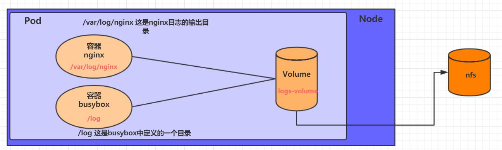

# K8s命令格式

```shell
# comand：指定要对资源执行的操作，例如create、get、delete
# type：指定资源类型，比如deployment、pod、service
# name：指定资源的名称，名称大小写敏感
# flags：指定额外的可选参数
kubectl [command] [type] [name] [flags]

# 创建某一资源，资源的类型在yaml的kind指明
# create 创建 ，不存在创建 ，存在报错
# apply 更新，存在更新，不存在创建 
kubectl  create/apply -f  xxx.yaml


# 查看某一资源信息下所有信息，resource代表资源名称，例如namespace
# 查看某一类型下所有资源,对资源类型加个s，例如pods，namespaces
kubectl  get resources 
# 查看某一具体的资源名称
kubectl  get resource  name 
# 查看具体信息 
kubectl  describe resource  name 


# 删除某一资源下的某个具体资源
kubectl delete resource name
# 通过配置文件对删除
kubeclt delete -f xxx.yaml

# 查看某资源的ymal 
kubectl get resource resource_name -n namespace_name -o yaml
```

### 资源

| 资源分类      | 资源名称                 | 缩写    | 资源作用        |
| :------------ | :----------------------- | :------ | :-------------- |
| 集群级别资源  | nodes                    | no      | 集群组成部分    |
| namespaces    | ns                       | 隔离Pod |                 |
| pod资源       | pods                     | po      | 装载容器        |
| pod资源控制器 | replicationcontrollers   | rc      | 控制pod资源     |
|               | replicasets              | rs      | 控制pod资源     |
|               | deployments              | deploy  | 控制pod资源     |
|               | daemonsets               | ds      | 控制pod资源     |
|               | jobs                     |         | 控制pod资源     |
|               | cronjobs                 | cj      | 控制pod资源     |
|               | horizontalpodautoscalers | hpa     | 控制pod资源     |
|               | statefulsets             | sts     | 控制pod资源     |
| 服务发现资源  | services                 | svc     | 统一pod对外接口 |
|               | ingress                  | ing     | 统一pod对外接口 |
| 存储资源      | volumeattachments        |         | 存储            |
|               | persistentvolumes        | pv      | 存储            |
|               | persistentvolumeclaims   | pvc     | 存储            |
| 配置资源      | configmaps               | cm      | 配置            |
|               | secrets                  |         | 配置            |

### 动作

| 命令分类   | 命令         | 翻译                        | 命令作用                     |
| :--------- | :----------- | :-------------------------- | :--------------------------- |
| 基本命令   | create       | 创建                        | 创建一个资源                 |
|            | edit         | 编辑                        | 编辑一个资源                 |
|            | get          | 获取                        | 获取一个资源                 |
|            | patch        | 更新                        | 更新一个资源                 |
|            | delete       | 删除                        | 删除一个资源                 |
|            | explain      | 解释                        | 展示资源文档                 |
| 运行和调试 | run          | 运行                        | 在集群中运行一个指定的镜像   |
|            | expose       | 暴露                        | 暴露资源为Service            |
|            | describe     | 描述                        | 显示资源内部信息             |
|            | logs         | 日志输出容器在 pod 中的日志 | 输出容器在 pod 中的日志      |
|            | attach       | 缠绕进入运行中的容器        | 进入运行中的容器             |
|            | exec         | 执行容器中的一个命令        | 执行容器中的一个命令         |
|            | cp           | 复制                        | 在Pod内外复制文件            |
|            | rollout      | 首次展示                    | 管理资源的发布               |
|            | scale        | 规模                        | 扩(缩)容Pod的数量            |
|            | autoscale    | 自动调整                    | 自动调整Pod的数量            |
| 高级命令   | apply        | rc                          | 通过文件对资源进行配置       |
|            | label        | 标签                        | 更新资源上的标签             |
| 其他命令   | cluster-info | 集群信息                    | 显示集群信息                 |
|            | version      | 版本                        | 显示当前Server和Client的版本 |

# K8S中的对象

## Namespace

Namespace是对一组资源和对象的抽象集合，比如可以用来将系统内部的对象划分为不同的项目组或用户组。常见的pods, services, replication controllers和deployments等都是属于某一个namespace的（默认是default），而node, persistentVolumes等则不属于任何namespace。

默认情况下，kubernetes集群中的所有的Pod都是可以相互访问的。但是在实际中，可能不想让两个Pod之间进行互相的访问，那此时就可以将两个Pod划分到不同的namespace下。kubernetes通过将集群内部的资源分配到不同的Namespace中，可以形成逻辑上的"组"，以方便不同的组的资源进行隔离使用和管理。

可以通过kubernetes的授权机制，将不同的namespace交给不同租户进行管理，这样就实现了多租户的资源隔离。此时还能结合kubernetes的资源配额机制，限定不同租户能占用的资源，例如CPU使用量、内存使用量等等，来实现租户可用资源的管理

```yaml
# kind：Namespace 表示yaml文件创建的是命名空间
#  metadata表示命名空间的元信息
# metadata.name 是命名空间的名称 取值nginx
# metadata.labels 是命名空间的标签 name=nginx

apiVersion: v1
kind: Namespace
metadata:
  name: xxx
  labels:
    name: xxx
```

相关命令

```shell
# 制定配置文件创建命名空间
kubectl create -f xxx.yaml
# 查看所有的命名空间
kubectl get namespaces
# 查看某一命名空间
kubectl get namespace name
# 查看命名空间详细
kubectl describe namespace xxx
# 通过名字删除
kubectl delete namespace xxx
# 通过配置文件删除
kubectl delete -f xxx.yaml
```

### 资源限制

#### Resource Quota

Resource Quota即资源配额，限定单个namespace中可使用集群资源的总量，包括两个维度：

1. 限定某个对象类型（如Pod）可创建对象的总数；
2. 限定某个对象类型可消耗的计算资源（CPU、内存）与存储资源（存储卷声明）总数

如果在 namespace 中为计算资源 CPU 和内存设定了 ResourceQuota，用户在创建对象（Pod、Service等）时，必须指定 requests 和 limits；如果在创建或更新对象时申请的资源与 namespace 的 ResourceQuota 冲突，则 apiserver 会返回 HTTP 状态码 403，以及对应的错误提示信息。当集群中总的容量小于各个 namespace 资源配额的总和时，可能会发生资源争夺，此时 Kubernetes 将按照先到先得的方式分配资源

```yaml
apiVersion: v1
kind: ResourceQuota
metadata:
  name: quota-test   # 名称
  namespace: test    # 限制的namespace
spec:
  hard:
    requests.cpu: 2      		# 该namespace中，所有非终止状态的 Pod，其 CPU 请求总量不能超过该值。
    requests.memory: 2Gi		# 该namespace中，所有非终止状态的 Pod，其 memory 请求总量不能超过该值。
    limits.cpu: 4               # 该namespace中，所有非终止状态的 Pod，其 CPU 限额总量不能超过该值。
    limits.memory: 4Gi          # 该namespace中，所有非终止状态的 Pod，其 memory 限额总量不能超过该值。
    requests.nvidia.com/gpu: 4  # 该namespace中，所有非终止状态的 Pod，其 gpu 限额总量不能超过该值
    pods: 3					    # 该namespace中，所有非终止状态的 Pod数量限制
    services: 6                 # 该namespace中，service量
```

#### Resource Limit Range

Resource Limit Range 则是对具体某个Pod或容器的资源使用进行限制。默认情况下，namespace中Pod或容器的资源消耗是不受限制的，这就可能导致某个容器应用内存泄露耗尽资源影响其它应用的情况。Limit Range可以用来限定namespace内Pod（或容器）可以消耗资源的数量。

```yaml
apiVersion: v1
kind: LimitRange
metadata:
  name: lr-test
  namespace: test         #指定namespace
spec:
  limits:
  - type: Container       #资源类型
    max:
      cpu: "1"            #限定最大CPU
      memory: "1Gi"       #限定最大内存
    min:
      cpu: "100m"         #限定最小CPU
      memory: "100Mi"     #限定最小内存
    default:
      cpu: "900m"         #默认CPU限定
      memory: "800Mi"     #默认内存限定
    defaultRequest:
      cpu: "200m"         #默认CPU请求
      memory: "200Mi"     #默认内存请求
    maxLimitRequestRatio:
      cpu: 2              #限定CPU limit/request比值最大为2  
      memory: 1.5         #限定内存limit/request比值最大为1.5
  - type: Pod
    max:
      cpu: "2"            #限定Pod最大CPU
      memory: "2Gi"       #限定Pod最大内存
  - type: PersistentVolumeClaim
    max:
      storage: 2Gi        #限定PVC最大的requests.storage
    min:
      storage: 1Gi        #限定PVC最小的requests.storage
```

比较：

Resource Quota 是对namespace中总体的资源使用进行限制，Resource Limit Range 则是对具体某个Pod或容器的资源使用进行限制。

前者是管总体，后者是管局部。

## Lable

Label是kubernetes系统中的一个重要概念。它的作用就是在资源上添加标识，用来对它们进行区分和选择。对容器进行打标签，然后再Selector可以将资源进行选择。

Label的特点：

- 一个Label会以key/value键值对的形式附加到各种对象上，如Node、Pod、Service等等
- 一个资源对象可以定义任意数量的Label ，同一个Label也可以被添加到任意数量的资源对象上去
- Label通常在资源对象定义时确定，当然也可以在对象创建后动态添加或者删除.

可以通过Label实现资源的多维度分组，以便灵活、方便地进行资源分配、调度、配置、部署等管理工作。

> 一些常用的Label 示例如下：
>
> - 版本标签："version":"release", "version":"stable"......
> - 环境标签："environment":"dev"，"environment":"test"，"environment":"pro"
> - 架构标签："tier":"frontend"，"tier":"backend"

标签定义完毕之后，还要考虑到标签的选择，这就要使用到Label Selector，即：

Label用于给某个资源对象定义标识

Label Selector用于查询和筛选拥有某些标签的资源对象

当前有两种Label Selector：

- 基于等式的Label Selector

  name = slave: 选择所有包含Label中key="name"且value="slave"的对象

  env != production: 选择所有包括Label中的key="env"且value不等于"production"的对象

- 基于集合的Label Selector

  name in (master, slave): 选择所有包含Label中的key="name"且value="master"或"slave"的对象

  name not in (frontend): 选择所有包含Label中的key="name"且value不等于"frontend"的对象

标签的选择条件可以使用多个，此时将多个Label Selector进行组合，使用逗号","进行分隔即可。例如：

name=slave，env!=production

name not in (frontend)，env!=production

相关命令

```shell
# 为pod资源打标签
kubectl label resource resourse_name label_name=xxxx -n namespace_name

# 为pod资源更新标签
kubectl label  resource resourse_name label_name=xxxx  -n namespace_name--overwrite

# 查看标签
kubectl resource resourse_name  -n namespace_name --show-labels


# 筛选标签
kubectl get resource -n namespace_name -l label_name=xxxx  --show-labels

#删除标签
kubectl label resource resourse_name lable_name- -n namespace_name
```

## Pod

### 介绍

Pod 是 kubernetes 中你可以创建和部署的最小也是最简的单位。Pod 代表着集群中运行的进程。

Pod 中封装着应用的容器（有的情况下是好几个容器），存储、独立的网络 IP，管理容器如何运行的策略选项。Pod 代表着部署的一个单位：kubernetes 中应用的一个实例，可能由一个或者多个容器组合在一起共享。

每个Pod中都可以包含一个或者多个容器，这些容器可以分为两类：

- 用户程序所在的容器，数量可多可少

- Pause容器，这是每个Pod都会有的一个**根容器**，它的作用有两个：

  - 可以以它为依据，评估整个Pod的健康状态

  - 可以在根容器上设置Ip地址，其它容器都此Ip（Pod IP），以实现Pod内部的网路通信

### 基础命令

```shell
# 基础命令参考k8s命令格式
# 此处只是写一下，特殊的地方

# 直接下面方式创建pod，
# 会默认生成一个名为nginx的deployment来管理生成的容器
# 如果想要停止这个pod，需要将其生成的deployment删除，相关的pod docker也将被删除 
kubectl run nginx --image=nginx:latest --port=80 --namespace dev 
```

### 配置文件

```yaml
apiVersion: v1     #必选，版本号，例如v1
kind: Pod       　 #必选，资源类型，例如 Pod
metadata:       　 #必选，元数据
  name: string     #必选，Pod名称
  namespace: string  #Pod所属的命名空间,默认为"default"
  labels:       　　  #自定义标签列表
    - name: string      　          
spec:  #必选，Pod中容器的详细定义
  containers:  #必选，Pod中容器列表
  - name: string   #必选，容器名称
    image: string  #必选，容器的镜像名称
    imagePullPolicy: [ Always|Never|IfNotPresent ]  #获取镜像的策略 
    command: [string]   #容器的启动命令列表，如不指定，使用打包时使用的启动命令
    args: [string]      #容器的启动命令参数列表
    workingDir: string  #容器的工作目录
    volumeMounts:       #挂载到容器内部的存储卷配置
    - name: string      #引用pod定义的共享存储卷的名称，需用volumes[]部分定义的的卷名
      mountPath: string #存储卷在容器内mount的绝对路径，应少于512字符
      readOnly: boolean #是否为只读模式
    ports: #需要暴露的端口库号列表
    - name: string        #端口的名称
      containerPort: int  #容器需要监听的端口号
      hostPort: int       #容器所在主机需要监听的端口号，默认与Container相同
      protocol: string    #端口协议，支持TCP和UDP，默认TCP
    env:   #容器运行前需设置的环境变量列表
    - name: string  #环境变量名称
      value: string #环境变量的值
    resources: #资源限制和请求的设置
      limits:  #资源限制的设置(上限)
        cpu: string     #Cpu的限制，单位为core数，将用于docker run --cpu-shares参数
        memory: string  #内存限制，单位可以为Mib/Gib，将用于docker run --memory参数
      requests: #资源请求的设置(下限)
        cpu: string    #Cpu请求，容器启动的初始可用数量
        memory: string #内存请求,容器启动的初始可用数量
    lifecycle: #生命周期钩子
        postStart: #容器启动后立即执行此钩子,如果执行失败,会根据重启策略进行重启
        preStop: #容器终止前执行此钩子,无论结果如何,容器都会终止
    livenessProbe:  #对Pod内各容器健康检查的设置，当探测无响应几次后将自动重启该容器
      exec:       　 #对Pod容器内检查方式设置为exec方式
        command: [string]  #exec方式需要制定的命令或脚本
      httpGet:       #对Pod内个容器健康检查方法设置为HttpGet，需要制定Path、port
        path: string
        port: number
        host: string
        scheme: string
        HttpHeaders:
        - name: string
          value: string
      tcpSocket:     #对Pod内个容器健康检查方式设置为tcpSocket方式
         port: number
       initialDelaySeconds: 0       #容器启动完成后首次探测的时间，单位为秒
       timeoutSeconds: 0    　　    #对容器健康检查探测等待响应的超时时间，单位秒，默认1秒
       periodSeconds: 0     　　    #对容器监控检查的定期探测时间设置，单位秒，默认10秒一次
       successThreshold: 0
       failureThreshold: 0
       securityContext:
         privileged: false
  restartPolicy: [Always | Never | OnFailure]  #Pod的重启策略
  nodeName: <string> #设置NodeName表示将该Pod调度到指定到名称的node节点上
  nodeSelector: obeject #设置NodeSelector表示将该Pod调度到包含这个label的node上
  imagePullSecrets: #Pull镜像时使用的secret名称，以key：secretkey格式指定
  - name: string
  hostNetwork: false   #是否使用主机网络模式，默认为false，如果设置为true，表示使用宿主机网络
  volumes:   #在该pod上定义共享存储卷列表
  - name: string    #共享存储卷名称 （volumes类型有很多种）
    emptyDir: {}       #类型为emtyDir的存储卷，与Pod同生命周期的一个临时目录。为空值
    hostPath: string   #类型为hostPath的存储卷，表示挂载Pod所在宿主机的目录
      path: string      　　        #Pod所在宿主机的目录，将被用于同期中mount的目录
    secret:       　　　#类型为secret的存储卷，挂载集群与定义的secret对象到容器内部
      scretname: string  
      items:     
      - key: string
        path: string
    configMap:         #类型为configMap的存储卷，挂载预定义的configMap对象到容器内部
      name: string
      items:
      - key: string
        path: string
```

### 生命周期

主要包含下面的过程：

- pod创建过程
- 运行初始化容器（init container）过程
- 运行主容器（main container）
  - 容器启动后钩子（post start）、容器终止前钩子（pre stop）
  - 容器的存活性探测（liveness probe）、就绪性探测（readiness probe）
- pod终止过程


- 挂起（Pending）：Pod 已被 Kubernetes 系统接受，但有一个或者多个容器镜像尚未创建。等待时间包括调度 Pod 的时间和通过网络下载镜像的时间，这可能需要花点时间。
- 运行中（Running）：该 Pod 已经绑定到了一个节点上，Pod 中所有的容器都已被创建。至少有一个容器正在运行，或者正处于启动或重启状态。
- 成功（Succeeded）：Pod 中的所有容器都被成功终止，并且不会再重启。
- 失败（Failed）：Pod 中的所有容器都已终止了，并且至少有一个容器是因为失败终止。也就是说，容器以非0状态退出或者被系统终止。
- 未知（Unknown）：因为某些原因无法取得 Pod 的状态，通常是因为与 Pod 所在主机通信失败。

#### **创建过程**

1. 用户通过kubectl或其他api客户端提交需要创建的pod信息给apiServer
2. apiServer开始生成pod对象的信息，并将信息存入etcd，然后返回确认信息至客户端
3. apiServer开始反映etcd中的pod对象的变化，其它组件使用watch机制来跟踪检查apiServer上的变动
4. scheduler发现有新的pod对象要创建，开始为Pod分配主机并将结果信息更新至apiServer
5. node节点上的kubelet发现有pod调度过来，尝试调用docker启动容器，并将结果回送至apiServer
6. apiServer将接收到的pod状态信息存入etcd中

#### **终止过程**

1. 用户向apiServer发送删除pod对象的命令
2. apiServcer中的pod对象信息会随着时间的推移而更新，在宽限期内（默认30s），pod被视为dead
3. 将pod标记为terminating状态
4. kubelet在监控到pod对象转为terminating状态的同时启动pod关闭过程
5. 端点控制器监控到pod对象的关闭行为时将其从所有匹配到此端点的service资源的端点列表中移除
6. 如果当前pod对象定义了preStop钩子处理器，则在其标记为terminating后即会以同步的方式启动执行
7. pod对象中的容器进程收到停止信号
8. 宽限期结束后，若pod中还存在仍在运行的进程，那么pod对象会收到立即终止的信号
9. kubelet请求apiServer将此pod资源的宽限期设置为0从而完成删除操作，此时pod对于用户已不可见

#### 钩子函数

kubernetes在主容器的启动之后和停止之前提供了两个钩子函数：

- post start：容器创建之后执行，如果失败了会重启容器
- pre stop ：容器终止之前执行，执行完成之后容器将成功终止，在其完成之前会阻塞删除容器的操作

提供以下三种方式

##### Exec

在容器内执行一次命令

~~~yaml
……
  lifecycle:
    postStart: 
      exec:
        command:
        - cat
        - /tmp/healthy
……
~~~

##### TCPSocket

在当前容器尝试访问指定的socket

~~~yaml
……      
  lifecycle:
    postStart:
      tcpSocket:
        port: 8080
……
~~~

##### HTTPGet

在当前容器中向某url发起http请求

~~~yaml
  lifecycle:
    postStart:
      httpGet:
        path: / #URI地址
        port: 80 #端口号
        host: 192.168.5.3 #主机地址
        scheme: HTTP #支持的协议，http或者https
~~~

#### 容器探测

容器探测用于检测容器中的应用实例是否正常工作，是保障业务可用性的一种传统机制。如果经过探测，实例的状态不符合预期，那么kubernetes就会把该问题实例" 摘除 "，不承担业务流量。kubernetes提供了两种探针来实现容器探测，分别是：

- liveness probes：存活性探针，用于检测应用实例当前是否处于正常运行状态，如果不是，k8s会重启容器
- readiness probes：就绪性探针，用于检测应用实例当前是否可以接收请求，如果不能，k8s不会转发流量

livenessProbe 决定是否重启容器，readinessProbe 决定是否将请求转发给容器。

提供了和钩子函数相同的三种使用方式，如果对应的exec/tcpsocket/http操作失败了，就会重启。

#### 重启策略

在上一节中，一旦容器探测出现了问题，kubernetes就会对容器所在的Pod进行重启，其实这是由pod的重启策略决定的，pod的重启策略有 3 种，分别如下：

- Always ：容器失效时，自动重启该容器，这也是默认值。
- OnFailure ： 容器终止运行且退出码不为0时重启
- Never ： 不论状态为何，都不重启该容器

重启策略适用于pod对象中的所有容器，首次需要重启的容器，将在其需要时立即进行重启，随后再次需要重启的操作将由kubelet延迟一段时间后进行，且反复的重启操作的延迟时长以此为10s、20s、40s、80s、160s和300s，300s是最大延迟时长。

### 容器调度

在默认情况下，一个Pod在哪个Node节点上运行，是由Scheduler组件采用相应的算法计算出来的，这个过程是不受人工控制的。但是在实际使用中，这并不满足的需求，因为很多情况下，我们想控制某些Pod到达某些节点上，那么应该怎么做呢？这就要求了解kubernetes对Pod的调度规则，kubernetes提供了四大类调度方式：

- 自动调度：运行在哪个节点上完全由Scheduler经过一系列的算法计算得出
- 定向调度：NodeName、NodeSelector
- 亲和性调度：NodeAffinity、PodAffinity、PodAntiAffinity
- 污点（容忍）调度：Taints、Toleration

定向调度和轻和性调度，前者指定到某一name或lable的node，后者则可加入更多的逻辑，选择调度到更多lable，进行更复杂的逻辑调度。

#### 定向调度

定向调度，指的是利用在pod上声明nodeName或者nodeSelector，以此将Pod调度到期望的node节点上。注意，这里的调度是强制的，这就意味着即使要调度的目标Node不存在，也会向上面进行调度，只不过pod运行失败而已。

##### **NodeName**

配置nodename，指定调度到的node节点

~~~
apiVersion: v1
kind: Pod
metadata:
  name: pod-nodename
  namespace: dev
spec:
  containers:
  - name: nginx
    image: nginx:1.17.1
  nodeName: node1 # 指定调度到node1节点上
~~~

##### **NodeSelector**

NodeSelector用于将pod调度到添加了指定标签的node节点上。它是通过kubernetes的label-selector机制实现的，也就是说，在pod创建之前，会由scheduler使用MatchNodeSelector调度策略进行label匹配，找出目标node，然后将pod调度到目标节点，该匹配规则是强制约束。

```yaml
apiVersion: v1
kind: Pod
metadata:
  name: pod-nodeselector
  namespace: dev
spec:
  containers:
  - name: nginx
    image: nginx:1.17.1
  nodeSelector: 
    nodeenv: pro # 指定调度到具有nodeenv=pro标签的节点上
```

#### 轻和性调度

两种定向调度的方式，使用起来非常方便，但是也有一定的问题，那就是如果没有满足条件的Node，那么Pod将不会被运行，即使在集群中还有可用Node列表也不行，这就限制了它的使用场景。

基于上面的问题，kubernetes还提供了一种亲和性调度（Affinity）。它在NodeSelector的基础之上的进行了扩展，可以通过配置的形式，实现优先选择满足条件的Node进行调度，如果没有，也可以调度到不满足条件的节点上，使调度更加灵活。

Affinity主要分为三类,三类轻和性中分为硬性和软性：

- nodeAffinity(node亲和性）: 以node为目标，解决pod可以调度到哪些node的问题
- podAffinity(pod亲和性) : 以pod为目标，解决pod可以和哪些已存在的pod部署在同一个拓扑域中的问题
- podAntiAffinity(pod反亲和性) : 以pod为目标，解决pod不能和哪些已存在pod部署在同一个拓扑域中的问题

##### 硬限制与软限制

硬限制：如果所有节点不满足调度条件，调度失败。

软限制：如果所有节点不满足调度条件，会将Pod调度到不满足条件的节点。

##### 轻和性与反轻和性

轻和性：前段与后端对应的Pod，希望在一个Node内以减少网络通信等带来的损耗。

反轻和性：多机部署的应用A，我希望它分布到不同节点，以提高可用性，采用反轻和性让Pod放到不存在应用A的节点。

##### nodeAffinity(node亲和性）

```yaml
pod.spec.affinity.nodeAffinity
  requiredDuringSchedulingIgnoredDuringExecution  Node节点必须满足指定的所有规则才可以，相当于硬限制
    nodeSelectorTerms  节点选择列表
      matchFields   按节点字段列出的节点选择器要求列表
      matchExpressions   按节点标签列出的节点选择器要求列表(推荐)
        key    键
        values 值
        operat or 关系符 支持Exists, DoesNotExist, In, NotIn, Gt, Lt
  preferredDuringSchedulingIgnoredDuringExecution 优先调度到满足指定的规则的Node，相当于软限制 (倾向)
    preference   一个节点选择器项，与相应的权重相关联
      matchFields   按节点字段列出的节点选择器要求列表
      matchExpressions   按节点标签列出的节点选择器要求列表(推荐)
        key    键
        values 值
        operator 关系符 支持In, NotIn, Exists, DoesNotExist, Gt, Lt
	weight 倾向权重，在范围1-100

#关系符的使用说明:
- matchExpressions:
  - key: nodeenv              # 匹配存在标签的key为nodeenv的节点
    operator: Exists
  - key: nodeenv              # 匹配标签的key为nodeenv,且value是"xxx"或"yyy"的节点
    operator: In
    values: ["xxx","yyy"]
  - key: nodeenv              # 匹配标签的key为nodeenv,且value大于"xxx"的节点
    operator: Gt
    values: "xxx"
```

##### podAffinity(pod亲和性)

让新创建的Pod跟参照pod在一个区域的功能。

```yaml
pod.spec.affinity.podAffinity
  requiredDuringSchedulingIgnoredDuringExecution  硬限制
    namespaces       指定参照pod的namespace
    topologyKey      指定调度作用域
    labelSelector    标签选择器
      matchExpressions  按节点标签列出的节点选择器要求列表(推荐)
        key    键
        values 值
        operator 关系符 支持In, NotIn, Exists, DoesNotExist.
      matchLabels    指多个matchExpressions映射的内容
  preferredDuringSchedulingIgnoredDuringExecution 软限制
    podAffinityTerm  选项
      namespaces      
      topologyKey
      labelSelector
        matchExpressions  
          key    键
          values 值
          operator
        matchLabels 
    weight 倾向权重，在范围1-100

topologyKey用于指定调度时作用域,例如:
    如果指定为kubernetes.io/hostname，那就是以Node节点为区分范围
	如果指定为beta.kubernetes.io/os,则以Node节点的操作系统类型来区分
```

##### podAntiAffinity(pod反亲和性)

新创建的Pod跟参照pod不在一个区域中的功能。

它的配置方式和选项跟PodAffinty是一样的，这里不再做详细解释，直接做一个测试案例。

##### 污点与容忍

###### 污点

在Node的角度上，通过在Node上添加**污点**属性，来决定是否允许Pod调度过来。

Node被设置上污点之后就和Pod之间存在了一种相斥的关系，进而拒绝Pod调度进来，甚至可以将已经存在的Pod驱逐出去。

污点的格式为：`key=value:effect`, key和value是污点的标签，effect描述污点的作用，支持如下三个选项：

- PreferNoSchedule：kubernetes将尽量避免把Pod调度到具有该污点的Node上，除非没有其他节点可调度
- NoSchedule：kubernetes将不会把Pod调度到具有该污点的Node上，但不会影响当前Node上已存在的Pod
- NoExecute：kubernetes将不会把Pod调度到具有该污点的Node上，同时也会将Node上已存在的Pod驱离

```yaml
# 设置污点
kubectl taint nodes node1 key=value:effect

# 去除污点
kubectl taint nodes node1 key:effect-

# 去除所有污点
kubectl taint nodes node1 key-
```

Tips：
    使用kubeadm搭建的集群，默认就会给master节点添加一个污点标记,所以pod就不会调度到master节点上.

###### 容忍

上面介绍了污点的作用，我们可以在node上添加污点用于拒绝pod调度上来，但是如果就是想将一个pod调度到一个有污点的node上去，这就要使用到**容忍**。

```yaml
 spec.tolerations:      # 添加容忍
  - key: "tag"        # 要容忍的污点的key
    operator: "Equal" # 操作符
    value: "heima"    # 容忍的污点的value
    effect: "NoExecute"   # 添加容忍的规则，这里必须和标记的污点规则相同
```

### 网络

每个 Pod 都会被分配一个唯一的 IP 地址。Pod 中的所有容器共享网络空间，包括 IP 地址和端口。Pod 内部的容器可以使用 `localhost` 互相通信。Pod 中的容器与外界通信时，必须分配共享网络资源（例如使用宿主机的端口映射）

### 存储

可以为一个 Pod 指定多个共享的 Volume。Pod 中的所有容器都可以访问共享的 volume。Volume 也可以用来持久化 Pod 中的存储资源，以防容器重启后文件丢失，之后介绍

## 控制器

Pod控制器是管理pod的中间层，使用Pod控制器之后，只需要告诉Pod控制器，想要多少个什么样的Pod就可以了，它会创建出满足条件的Pod并确保每一个Pod资源处于用户期望的目标状态。如果Pod资源在运行中出现故障，它会基于指定策略重新编排Pod。

应用可分为下面几种应用：

**无状态应用**：应用实例不涉及事务交互，不产生持久化数据存储在本地，并且多个应用实例对于同一个请求响应的结果是完全一致的。举例：nginx或者tomcat

**有状态应用**：有状态服务可以说是需要数据存储功能的服务或者指多线程类型的服务、队列等。举例：mysql[数据库](https://cloud.tencent.com/solution/database?from=10680)、kafka、redis、zookeeper等。

**守护型应用**：类似守护进程一样，长期保持运行，监听持续的提供服务。举例：ceph、logstash、fluentd等。

**批处理应用**：工作任务型的服务，通常是一次性的。举例：运行一个批量改文件夹名字的脚本。

根据应用的作用不同，则可为不用的应用使用不同的控制器。

在kubernetes中，有很多类型的pod控制器，每种都有自己的适合的场景，常见的有下面这些：

- ReplicationController：比较原始的pod控制器，已经被废弃，由ReplicaSet替代
- ReplicaSet：保证副本数量一直维持在期望值，并支持pod数量扩缩容，镜像版本升级
- Deployment：通过控制ReplicaSet来控制Pod，并支持滚动升级、回退版本
- Horizontal Pod Autoscaler：可以根据集群负载自动水平调整Pod的数量，实现削峰填谷
- DaemonSet：在集群中的指定Node上运行且仅运行一个副本，一般用于守护进程类的任务
- Job：它创建出来的pod只要完成任务就立即退出，不需要重启或重建，用于执行一次性任务
- Cronjob：它创建的Pod负责周期性任务控制，不需要持续后台运行
- StatefulSet：管理有状态应用

### ReplicaSet/ReplicationController

ReplicaSet的主要作用是**保证一定数量的pod正常运行**，它会持续监听这些Pod的运行状态，一旦Pod发生故障，就会重启或重建。同时它还支持对pod数量的扩缩容和镜像版本的升降级。因为有功能更前大的deployment不多解释。


### Deployment

Deployment中文意思为部署、调度，通过Deployment我们能操作RS（ReplicaSet），你可以简单的理解为它是一种通过yml文件的声明，在Deployment 文件里可以定义Pod数量、更新方式、使用的镜像，资源限制等。无状态应用都用Deployment来创建。

Deployment同样为Kubernetes的一个核心内容，主要职责同样是为了保证pod的数量和健康，90%的功能与Replication Controller完全一样，可以看做新一代的Replication Controller。但是，它又具备了Replication Controller之外的新特性：

- Replication Controller全部功能：Deployment继承了上面描述的Replication Controller全部功能。
- 事件和状态查看：可以查看Deployment的升级详细进度和状态。
- 回滚：当升级pod镜像或者相关参数的时候发现问题，可以使用回滚操作回滚到上一个稳定的版本或者指定的版本。
- 版本记录: 每一次对Deployment的操作，都能保存下来，给予后续可能的回滚使用。
- 暂停和启动：对于每一次升级，都能够随时暂停和启动。
- 多种升级方案：Recreate：删除所有已存在的pod,重新创建新的; RollingUpdate：滚动升级，逐步替换的策略，同时滚动升级时，支持更多的附加参数，例如设置最大不可用pod数量，最小升级间隔时间等等。

#### 配置文件

```yaml
apiVersion: v1       #必选，版本号，例如v1
kind: Pod       #必选，Pod
metadata:       #必选，元数据
  name: string       #必选，Pod名称
  namespace: string    #必选，Pod所属的命名空间
  labels:      #自定义标签
    - name: string     #自定义标签名字
  annotations:       #自定义注释列表
    - name: string
spec:         #必选，Pod中容器的详细定义
  replicas: n     # pod数量
  containers:      #必选，Pod中容器列表
  - name: string     #必选，容器名称
    image: string    #必选，容器的镜像名称
    imagePullPolicy: [Always | Never | IfNotPresent] 
    #获取镜像的策略 Alawys表示下载镜像 IfnotPresent表示优先使用本地镜像，否则下载镜像，Nerver表示仅使用本地镜像
    command: [string]    #容器的启动命令列表，如不指定，使用打包时使用的启动命令
    args: [string]     #容器的启动命令参数列表
    workingDir: string     #容器的工作目录
    volumeMounts:    #挂载到容器内部的存储卷配置
    - name: string     #引用pod定义的共享存储卷的名称，需用volumes[]部分定义的的卷名
      mountPath: string    #存储卷在容器内mount的绝对路径，应少于512字符
      readOnly: boolean    #是否为只读模式
    ports:       #需要暴露的端口库号列表
    - name: string     #端口号名称
      containerPort: int   #容器需要监听的端口号
      hostPort: int    #容器所在主机需要监听的端口号，默认与Container相同
      protocol: string     #端口协议，支持TCP和UDP，默认TCP
    env:       #容器运行前需设置的环境变量列表
    - name: string     #环境变量名称
      value: string    #环境变量的值
    resources:       #资源限制和请求的设置
      limits:      #资源限制的设置
        cpu: string    #Cpu的限制，单位为core数，将用于docker run --cpu-shares参数
        memory: string     #内存限制，单位可以为Mib/Gib，将用于docker run --memory参数
      requests:      #资源请求的设置
        cpu: string    #Cpu请求，容器启动的初始可用数量
        memory: string     #内存清楚，容器启动的初始可用数量
    livenessProbe:    
    #对Pod内个容器健康检查的设置，当探测无响应几次后将自动重启该容器，检查方法有exec、httpGet和tcpSocket，对一个容器只需设置其中一种方法即可
      exec:      #对Pod容器内检查方式设置为exec方式
        command: [string]  #exec方式需要制定的命令或脚本
      httpGet:       #对Pod内个容器健康检查方法设置为HttpGet，需要制定Path、port
        path: string
        port: number
        host: string
        scheme: string
        HttpHeaders:
        - name: string
          value: string
      tcpSocket:     #对Pod内个容器健康检查方式设置为tcpSocket方式
         port: number
       initialDelaySeconds: 0  #容器启动完成后首次探测的时间，单位为秒
       timeoutSeconds: 0   #对容器健康检查探测等待响应的超时时间，单位秒，默认1秒
       periodSeconds: 0    #对容器监控检查的定期探测时间设置，单位秒，默认10秒一次
       successThreshold: 0
       failureThreshold: 0
       securityContext:
         privileged:false
    restartPolicy: [Always | Never | OnFailure]
    #Pod的重启策略，Always表示一旦不管以何种方式终止运行，kubelet都将重启，OnFailure表示只有Pod以非0退出码退出才重启，Nerver表示不再重启该Pod
    nodeSelector: obeject  #设置NodeSelector表示将该Pod调度到包含这个label的node上，以key：value的格式指定
    imagePullSecrets:    #Pull镜像时使用的secret名称，以key：secretkey格式指定
    - name: string
    hostNetwork:false      #是否使用主机网络模式，默认为false，如果设置为true，表示使用宿主机网络
    volumes:       #在该pod上定义共享存储卷列表
    - name: string     #共享存储卷名称 （volumes类型有很多种）
      emptyDir: {}     #类型为emtyDir的存储卷，与Pod同生命周期的一个临时目录。为空值
      hostPath: string     #类型为hostPath的存储卷，表示挂载Pod所在宿主机的目录
        path: string     #Pod所在宿主机的目录，将被用于同期中mount的目录
      secret:      #类型为secret的存储卷，挂载集群与定义的secre对象到容器内部
        scretname: string  
        items:     
        - key: string
          path: string
      configMap:     #类型为configMap的存储卷，挂载预定义的configMap对象到容器内部
        name: string
        items:
        - key: string
          path: string
```

#### 扩容与收缩

```shell
kubectl scale deploy deployment_name --replicas=5  -n namespace
```

#### **镜像更新**

deployment支持两种更新策略:`重建更新`和`滚动更新`,可以通过`strategy`指定策略类型,支持两个属性:

```yaml
strategy：指定新的Pod替换旧的Pod的策略， 支持两个属性：
  type：指定策略类型，支持两种策略
    Recreate：在创建出新的Pod之前会先杀掉所有已存在的Pod
    RollingUpdate：滚动更新，就是杀死一部分，就启动一部分，在更新过程中，存在两个版本Pod
  rollingUpdate：当type为RollingUpdate时生效，用于为RollingUpdate设置参数，支持两个属性：
    maxUnavailable：用来指定在升级过程中不可用Pod的最大数量，默认为25%。
    maxSurge： 用来指定在升级过程中可以超过期望的Pod的最大数量，默认为25%。
```

##### 重建更新

```yaml
spec:
  strategy: # 策略
    type: Recreate # 重建更新
```

##### 滚动更新

```yaml
spec:
  strategy: # 策略
    type: RollingUpdate # 滚动更新策略
    rollingUpdate:
      maxSurge: 25% 
      maxUnavailable: 25%
```

#### 区别

##### ReplicaSet和Deployment

　ReplicaSet 也是用来管理多个 Pod 的副本，那么 Deployment 和 ReplicaSet 的区别在哪里呢？

　当我们创建了 Deployment 之后，实际上也创建了 ReplicaSet，所以说 Deployment 管理着 ReplicaSet（实际上 Deployment 比 ReplicaSet 有着更多功能）

#### 基本操作命令

```shell
# 制定配置文件创建命
kubectl create -f xxx.yaml
# 查看某命名空间下的deployment
kubectl get deployment  -n xxx
# 查看某一命名空间
kubectl get deployment name -n namespace_name
# 查看命名空间详细
kubectl describe deployment xxx -n namespace_name
# 通过名字删除
kubectl delete deployment xxx -n namespace_name
# 通过配置文件删除
kubectl delete -f xxx.yaml


# 将pod数量扩容为10个
kubectl scale deployment deployment_name  --replicas 10  -n namespace_name
# 修改配置
kubectl edit deployment/deployment_name - n namespace_name
# 修改镜像 
kubectl set image deployment/deployment_name 容器名=镜像名:版本 -n namespace_name
# 回滚版本,回滚版本会将之前的pods杀掉，起新的。
kubectl rollout undo deployment/deployment_name -n namespace_name
# 回滚到指定版本
kubectl rollout undo deployment/deployment_name --to-revision=x
# 暂停
kubectl rollout pause deployment/deployment_name
```

参考：<https://jimmysong.io/kubernetes-handbook/concepts/deployment.html>

#### 金丝雀发布

Deployment控制器支持控制更新过程中的控制，如“暂停(pause)”或“继续(resume)”更新操作。

比如有一批新的Pod资源创建完成后立即暂停更新过程，此时，仅存在一部分新版本的应用，主体部分还是旧的版本。然后，再筛选一小部分的用户请求路由到新版本的Pod应用，继续观察能否稳定地按期望的方式运行。确定没问题之后再继续完成余下的Pod资源滚动更新，否则立即回滚更新操作。这就是所谓的金丝雀发布。

```shell
# 更新deployment的版本，并配置暂停deployment,举个例子
kubectl set image deploy pc-deployment nginx=nginx:1.17.4 -n dev 
kubectl rollout pause deployment pc-deployment  -n dev


#观察更新状态
[root@k8s-master01 ~]# kubectl rollout status deploy pc-deployment -n dev　
Waiting for deployment "pc-deployment" rollout to finish: 2 out of 4 new replicas have been updated...

# 监控更新的过程，可以看到已经新增了一个资源，但是并未按照预期的状态去删除一个旧的资源，就是因为使用了pause暂停命令

[root@k8s-master01 ~]# kubectl get rs -n dev -o wide
NAME                       DESIRED   CURRENT   READY   AGE     CONTAINERS   IMAGES         
pc-deployment-5d89bdfbf9   3         3         3       19m     nginx        nginx:1.17.1   
pc-deployment-675d469f8b   0         0         0       14m     nginx        nginx:1.17.2   
pc-deployment-6c9f56fcfb   2         2         2       3m16s   nginx        nginx:1.17.4   
[root@k8s-master01 ~]# kubectl get pods -n dev
NAME                             READY   STATUS    RESTARTS   AGE
pc-deployment-5d89bdfbf9-rj8sq   1/1     Running   0          7m33s
pc-deployment-5d89bdfbf9-ttwgg   1/1     Running   0          7m35s
pc-deployment-5d89bdfbf9-v4wvc   1/1     Running   0          7m34s
pc-deployment-6c9f56fcfb-996rt   1/1     Running   0          3m31s
pc-deployment-6c9f56fcfb-j2gtj   1/1     Running   0          3m31s

# 确保更新的pod没问题了，继续更新
kubectl rollout resume deploy pc-deployment -n dev
```

##### volumes

kubernetes Volume卷具有明确的生命周期——与包裹它的 Pod 相同。 因此，Volume比 Pod 中运行的任何容器的存活期都长，在容器重新启动时数据也会得到保留。 当然，当一个 Pod 不再存在时，Volume也将不再存在。更重要的是，Kubernetes 可以支持许多类型的Volume卷，Pod 也能同时使用任意数量的Volume卷。

使用卷时，Pod 声明中需要提供卷的类型 (.spec.volumes 字段)和卷挂载的位置 (.spec.containers.volumeMounts 字段)

支持类型

<https://www.infoq.cn/article/ah1n57f8tge2wisquj00>

```
 1 awsElasticBlockStore
 2 azureDisk
 3 azureFile
 4 cephfs
 5 cinder
 6 configMap
 7 csi
 8 downwardAPI
 9 emptyDir
10 fc (fibre channel)
11 flexVolume
12 flocker
13 gcePersistentDisk
14 gitRepo (deprecated)
15 glusterfs
16 hostPath
17 iscsi
18 local
19 nfs
20 persistentVolumeClaim
21 projected
22 portworxVolume
23 quobyte
24 rbd
25 scaleIO
26 secret
27 storageos
28 vsphereVolume
```

### Job

Job，主要用于负责**批量处理(一次要处理指定数量任务)**短暂的**一次性(每个任务仅运行一次就结束)**任务。Job特点如下：

- 当Job创建的pod执行成功结束时，Job将记录成功结束的pod数量
- 当成功结束的pod达到指定的数量时，Job将完成执行

```yaml
apiVersion: batch/v1 # 版本号
kind: Job # 类型       
metadata: # 元数据
  name: # rs名称 
  namespace: # 所属命名空间 
  labels: #标签
    controller: job
spec: # 详情描述
  completions: 1 # 指定job需要成功运行Pods的次数。默认值: 1
  parallelism: 1 # 指定job在任一时刻应该并发运行Pods的数量。默认值: 1
  activeDeadlineSeconds: 30 # 指定job可运行的时间期限，超过时间还未结束，系统将会尝试进行终止。
  backoffLimit: 6 # 指定job失败后进行重试的次数。默认是6
  manualSelector: true # 是否可以使用selector选择器选择pod，默认是false
  selector: # 选择器，通过它指定该控制器管理哪些pod
    matchLabels:      # Labels匹配规则
      app: counter-pod
    matchExpressions: # Expressions匹配规则
      - {key: app, operator: In, values: [counter-pod]}
  template: # 模板，当副本数量不足时，会根据下面的模板创建pod副本
    metadata:
      labels:
        app: counter-pod
    spec:
      restartPolicy: Never # 重启策略只能设置为Never或者OnFailure
      containers:
      - name: counter
        image: busybox:1.30
        command: ["bin/sh","-c","for i in 9 8 7 6 5 4 3 2 1; do echo $i;sleep 2;done"]
```

### CronJob

CronJob控制器以 Job控制器资源为其管控对象，并借助它管理pod资源对象，Job控制器定义的作业任务在其控制器资源创建之后便会立即执行，但CronJob可以以类似于Linux操作系统的周期性任务作业计划的方式控制其运行**时间点**及**重复运行**的方式。也就是说，**CronJob可以在特定的时间点(反复的)去运行job任务**。


#### 配置文件

```yaml
apiVersion: batch/v1beta1 # 版本号
kind: CronJob # 类型       
metadata: # 元数据
  name: # rs名称 
  namespace: # 所属命名空间 
  labels: #标签
    controller: cronjob
spec: # 详情描述
  schedule: # cron格式的作业调度运行时间点,用于控制任务在什么时间执行
  concurrencyPolicy: # 并发执行策略，用于定义前一次作业运行尚未完成时是否以及如何运行后一次的作业
  failedJobHistoryLimit: # 为失败的任务执行保留的历史记录数，默认为1
  successfulJobHistoryLimit: # 为成功的任务执行保留的历史记录数，默认为3
  startingDeadlineSeconds: # 启动作业错误的超时时长
  jobTemplate: # job控制器模板，用于为cronjob控制器生成job对象;下面其实就是job的定义
    metadata:
    spec:
      completions: 1
      parallelism: 1
      activeDeadlineSeconds: 30
      backoffLimit: 6
      manualSelector: true
      selector:
        matchLabels:
          app: counter-pod
        matchExpressions: 规则
          - {key: app, operator: In, values: [counter-pod]}
      template:
        metadata:
          labels:
            app: counter-pod
        spec:
          restartPolicy: Never 
          containers:
          - name: counter
            image: busybox:1.30
            command: ["bin/sh","-c","for i in 9 8 7 6 5 4 3 2 1; do echo $i;sleep 20;done"]
```

#### schedule用法

```shell
#  ┌───────────── minute (0 - 59)
#  │ ┌───────────── hour (0 - 23)
#  │ │ ┌───────────── day of the month (1 - 31)
#  │ │ │ ┌───────────── month (1 - 12)
#  │ │ │ │ ┌───────────── day of the week (0 - 6) (Sunday to Saturday;
#  │ │ │ │ │                                   7 is also Sunday on some systems)
#  │ │ │ │ │
#  │ │ │ │ │
*/ * * * * * <command to execute>

# 举个例子
*/0 1 * * * /home/testuser/test.sh
每天晚上1点调用/home/testuser/test.sh
/10 * * * /home/testuser/test.sh
每10钟调用一次/home/testuser/test.sh
30 21 * * * /usr/local/etc/rc.d/lighttpd restart
上面的例子表示每晚的21:30重启apache。
45 4 1,10,22 * * /usr/local/etc/rc.d/lighttpd restart
上面的例子表示每月1、10、22日的4 : 45重启apache。
10 1 * * 6,0 /usr/local/etc/rc.d/lighttpd restart
上面的例子表示每周六、周日的1 : 10重启apache。
0,30 18-23 * * * /usr/local/etc/rc.d/lighttpd restart
上面的例子表示在每天18 : 00至23 : 00之间每隔30分钟重启apache。
0 23 * * 6 /usr/local/etc/rc.d/lighttpd restart
上面的例子表示每星期六的11 : 00 pm重启apache.


concurrencyPolicy:
    Allow:   允许Jobs并发运行(默认)
    Forbid:  禁止并发运行，如果上一次运行尚未完成，则跳过下一次运行
    Replace: 替换，取消当前正在运行的作业并用新作业替换它
```

### DaemonSet

DaemonSet类型的控制器可以保证在集群中的每一台（或指定）节点上都运行一个副本。一般适用于日志收集、节点监控等场景。也就是说，如果一个Pod提供的功能是节点级别的（每个节点都需要且只需要一个），那么这类Pod就适合使用DaemonSet类型的控制器创建。

```yaml
apiVersion: apps/v1 # 版本号
kind: DaemonSet # 类型       
metadata: # 元数据
  name: # rs名称 
  namespace: # 所属命名空间 
  labels: #标签
    controller: daemonset
spec: # 详情描述
  revisionHistoryLimit: 3 # 保留历史版本
  updateStrategy: # 更新策略
    type: RollingUpdate # 滚动更新策略
    rollingUpdate: # 滚动更新
      maxUnavailable: 1 # 最大不可用状态的 Pod 的最大值，可以为百分比，也可以为整数
  selector: # 选择器，通过它指定该控制器管理哪些pod
    matchLabels:      # Labels匹配规则
      app: nginx-pod
    matchExpressions: # Expressions匹配规则
      - {key: app, operator: In, values: [nginx-pod]}
  template: # 模板，当副本数量不足时，会根据下面的模板创建pod副本
    metadata:
      labels:
        app: nginx-pod
    spec:
      containers:
      - name: nginx
        image: nginx:1.17.1
        ports:
        - containerPort: 80
```

### StatefulSet(暂时没看完全懂)

StatefulSet是为了解决有状态服务的问题（对应Deployments和ReplicaSets是为无状态服务而设计），其应用场景包括

- 稳定的持久化存储，即Pod重新调度后还是能访问到相同的持久化数据，基于PVC来实现
- 稳定的网络标志，即Pod重新调度后其PodName和HostName不变，基于Headless Service（即没有Cluster IP的Service）来实现
- 有序部署，有序扩展，即Pod是有顺序的，在部署或者扩展的时候要依据定义的顺序依次依次进行（即从0到N-1，在下一个Pod运行之前所有之前的Pod必须都是Running和Ready状态），基于init containers来实现
- 有序收缩，有序删除（即从N-1到0）

### Horizontal Pod Autoscaler(HPA)

HPA可以获取每个Pod利用率，然后和HPA中定义的指标进行对比，同时计算出需要伸缩的具体值，最后实现Pod的数量的调整。其实HPA与之前的Deployment一样，也属于一种Kubernetes资源对象，它通过追踪分析RC控制的所有目标Pod的负载变化情况，来确定是否需要针对性地调整目标Pod的副本数，这是HPA的实现原理。

#### 配置文件

```yaml
apiVersion: autoscaling/v1
kind: HorizontalPodAutoscaler
metadata:
  name: ms-wechat  # 名称
  namespace: default #k8s命名空间
spec:
  maxReplicas: 10  # 最大副本数
  minReplicas: 3   # 最小副本数
  scaleTargetRef:   
    apiVersion: apps/v1beta1
    kind: Deployment  
    name: ms-wechat   # 监控名为ms-wechat的Deployment
  targetCPUUtilizationPercentage: 80  # cpu 阈值
```

版本不同配置不太一样，参考下面网址。

参考：<https://blog.csdn.net/fly910905/article/details/105375822>

<https://www.cnblogs.com/centos-python/articles/13641576.html>

## Service

Service是一种抽象的对象，它定义了一组Pod的逻辑集合和一个用于访问它们的策略，一个Serivce下面包含的Pod集合一般是由**Label Selector**来决定的。假如我们后端运行了3个副本，这些副本都是可以替代的，因为前端并不关心它们使用的是哪一个后端服务。尽管由于各种原因后端的Pod集合会发生变化，但是前端却不需要知道这些变化，也不需要自己用一个列表来记录这些后端的服务，Service的这种抽象就可以帮我们达到这种解耦的目的。

Endpoint是kubernetes中的一个资源对象，存储在etcd中，用来记录一个service对应的所有pod的访问地址，它是根据service配置文件中selector描述产生的。

一个Service由一组Pod组成，这些Pod通过Endpoints暴露出来，**Endpoints是实现实际服务的端点集合**。换句话说，service和pod之间的联系是通过endpoints实现的。


配置文件

```yaml
apiVersion: v1
kind: Service
matadata:                                #元数据
  name: string                           #service的名称
  namespace: string                      #命名空间
  labels:                                #自定义标签属性列表
    - name: string
  annotations:                           #自定义注解属性列表
    - name: string
spec:                                    #详细描述
  selector: []                           #选择器，将service服务到对应标签的pod上。
  type: string                           #service的类型，指定service的访问方式，默认为clusterIp
  clusterIP: string                      #虚拟服务地址
  sessionAffinity: string                #是否支持session
  ports:                                 #service需要暴露的端口列表
  - name: string                         #端口名称
    protocol: string                     #端口协议，支持TCP和UDP，默认TCP
    port: int                            #服务监听的端口号
    targetPort: int                      #需要转发到后端Pod的端口号
    nodePort: int                        #当type = NodePort时，指定映射到物理机的端口号
  status:                                #当spce.type=LoadBalancer时，设置外部负载均衡器的地址
    loadBalancer:                        #外部负载均衡器
      ingress:                           #外部负载均衡器
        ip: string                       #外部负载均衡器的Ip地址值
        hostname: string                 #外部负载均衡器的主机名
```

### spec.type种类

#### ClusterIP

通过集群的内部 IP 暴露服务，选择该值，服务只能够在集群内部可以访问，这也是默认的Type。

使用此种方式，可以为service分配一个IP(也可以设置clusterip: None来配置不分配IP,

而通过域名访问，其的生成规则是 service名称.namespace.svc.cluster.local，后面的svc.cluster.local是可以配置的)，

通过选择器选择到对应的Pod。

举个例子

```
spec:
  selector:
    app: nginx-pod
  clusterIP: 10.97.97.97 # service的ip地址，如果不写，默认会生成一个
  type: ClusterIP
  ports:
  - port: 80  # Service端口       
    targetPort: 80 # pod端口
```

#### NodePort

指定为NodePort，那Kubernetes master 会分配一个区域范围内（默认是30000-32767），并且每一个node都会代理（proxy）这个端口到你的服务中，我们可以在spec.ports[*].nodePort 找到具体的值。

```
  type: NodePort # service类型
  ports:
  - port: 80
    nodePort: 30002 # 指定绑定的node的端口(默认的取值范围是：30000-32767), 如果不指定，会默认分配
    targetPort: 80
```

#### LoadBalance

使用云提供商的负载局衡器，可以向外部暴露服务。外部的负载均衡器可以路由到 NodePort 服务和 ClusterIP 服务，这个需要结合具体的云厂商进行操作。

#### ExternalName

ExternalName类型的Service用于引入集群外部的服务，它通过`externalName`属性指定外部一个服务的地址，然后在集群内部访问此service就可以访问到外部的服务了。

参考：<https://www.jianshu.com/p/f2f44f2d4176>

## Ingress

在前面课程中已经提到，Service对集群之外暴露服务的主要方式有两种：NotePort和LoadBalancer，但是这两种方式，都有一定的缺点：

- NodePort方式的缺点是会占用很多集群机器的端口，那么当集群服务变多的时候，这个缺点就愈发明显
- LB方式的缺点是每个service需要一个LB，浪费、麻烦，并且需要kubernetes之外设备的支持

基于这种现状，kubernetes提供了Ingress资源对象，Ingress只需要一个NodePort或者一个LB就可以满足暴露多个Service的需求。工作机制大致如下图表示：


实际上，Ingress相当于一个7层的负载均衡器，是kubernetes对反向代理的一个抽象，它的工作原理类似于Nginx，可以理解成在**Ingress里建立诸多映射规则，Ingress Controller通过监听这些配置规则并转化成Nginx的反向代理配置 , 然后对外部提供服务**。在这里有两个核心概念：

- ingress：kubernetes中的一个对象，作用是定义请求如何转发到service的规则
- ingress controller：具体实现反向代理及负载均衡的程序，对ingress定义的规则进行解析，根据配置的规则来实现请求转发，实现方式有很多，比如Nginx, Contour, Haproxy等等

Ingress（以Nginx为例）的工作原理如下：

1. 用户编写Ingress规则，说明哪个域名对应kubernetes集群中的哪个Service
2. Ingress控制器动态感知Ingress服务规则的变化，然后生成一段对应的Nginx反向代理配置
3. Ingress控制器会将生成的Nginx配置写入到一个运行着的Nginx服务中，并动态更新
4. 到此为止，其实真正在工作的就是一个Nginx了，内部配置了用户定义的请求转发规则

```yaml
# 生成证书  https准备
openssl req -x509 -sha256 -nodes -days 365 -newkey rsa:2048 -keyout tls.key -out tls.crt -subj "/C=CN/ST=BJ/L=BJ/O=nginx/CN=itheima.com"

# 创建密钥
kubectl create secret tls tls-secret --key tls.key --cert tls.crt


apiVersion: extensions/v1beta1
kind: Ingress
metadata:
  name: ingress-https
  namespace: dev
spec:
  tls:
    - hosts:
      - nginx.will.com
      secretName: tls-secret # 指定秘钥，如果指定了秘钥就是https，未指定就是http。
  rules:
  - host: nginx.will.com
    http:
      paths:
      - path: /                          # 路径信息
        backend:
          serviceName: nginx-service     # 指定service的名称
          servicePort: 80                # 指定端口信息
```

## 存储

Volume是Pod中能够被多个容器访问的共享目录，它被定义在Pod上，然后被一个Pod里的多个容器挂载到具体的文件目录下，kubernetes通过Volume实现同一个Pod中不同容器之间的数据共享以及数据的持久化存储。Volume的生命容器不与Pod中单个容器的生命周期相关，当容器终止或者重启时，Volume中的数据也不会丢失。

kubernetes的Volume支持多种类型，比较常见的有下面几个：

- 简单存储：EmptyDir、HostPath、NFS
- 高级存储：PV、PVC
- 配置存储：ConfigMap、Secret

### 简单存储

#### EmptyDir

EmptyDir是最基础的Volume类型，一个EmptyDir就是Host上的一个空目录。

EmptyDir是在Pod被分配到Node时创建的，它的初始内容为空，并且无须指定宿主机上对应的目录文件，因为kubernetes会自动分配一个目录，当Pod销毁时， EmptyDir中的数据也会被永久删除。 EmptyDir用途如下：

- 临时空间，例如用于某些应用程序运行时所需的临时目录，且无须永久保留
- 一个容器需要从另一个容器中获取数据的目录（多容器共享目录）

在一个Pod中准备两个容器nginx和busybox，然后声明一个Volume分别挂在到两个容器的目录中，然后nginx容器负责向Volume中写日志，busybox中通过命令将日志内容读到控制台。


举个例子

```yaml
apiVersion: v1
kind: Pod
metadata:
  name: volume-emptydir
  namespace: dev
spec:
  containers:
  - name: nginx
    image: nginx:1.17.1
    ports:
    - containerPort: 80
    volumeMounts:  # 将logs-volume挂在到nginx容器中，对应的目录为 /var/log/nginx
    - name: logs-volume
      mountPath: /var/log/nginx
  - name: busybox
    image: busybox:1.30
    command: ["/bin/sh","-c","tail -f /logs/access.log"] # 初始命令，动态读取指定文件中内容
    volumeMounts:  # 将logs-volume 挂在到busybox容器中，对应的目录为 /logs
    - name: logs-volume
      mountPath: /logs
  volumes: # 声明volume， name为logs-volume，类型为emptyDir
  - name: logs-volume
    emptyDir: {}
```

#### hostpath

EmptyDir中数据不会被持久化，它会随着Pod的结束而销毁，如果想简单的将数据持久化到主机中，可以选择HostPath。HostPath就是将Node主机中一个实际目录挂在到Pod中，以供容器使用，这样的设计就可以保证Pod销毁了，但是数据依据可以存在于Node主机上。

例如将nginx的log信息通过hostpath的方式，存储到宿主机上。


示例：

```yaml
apiVersion: v1
kind: Pod
metadata:
  name: volume-hostpath
  namespace: dev
spec:
  containers:
  - name: nginx
    image: nginx:1.17.1
    ports:
    - containerPort: 80
    volumeMounts:
    - name: logs-volume
      mountPath: /var/log/nginx
  - name: busybox
    image: busybox:1.30
    command: ["/bin/sh","-c","tail -f /logs/access.log"]
    volumeMounts:
    - name: logs-volume
      mountPath: /logs
  volumes:
  - name: logs-volume
    hostPath: 
      path: /root/logs
      type: DirectoryOrCreate  # 目录存在就使用，不存在就先创建后使用
```

关于type的值的一点说明：
    DirectoryOrCreate 目录存在就使用，不存在就先创建后使用
    Directory   目录必须存在
    FileOrCreate  文件存在就使用，不存在就先创建后使用
    File 文件必须存在
    Socket  unix套接字必须存在
    CharDevice  字符设备必须存在
    BlockDevice 块设备必须存在

#### NFS

HostPath可以解决数据持久化的问题，但是一旦Node节点故障了，Pod如果转移到了别的节点，又会出现问题了，此时需要准备单独的网络存储系统，比较常用的用NFS、CIFS。

NFS是一个网络文件存储系统，可以搭建一台NFS服务器，然后将Pod中的存储直接连接到NFS系统上，这样的话，无论Pod在节点上怎么转移，只要Node跟NFS的对接没问题，数据就可以成功访问。


NFS的配置，此处不将，只是将如何配置

```yaml
apiVersion: v1
kind: Pod
metadata:
  name: volume-nfs
  namespace: dev
spec:
  containers:
  - name: nginx
    image: nginx:1.17.1
    ports:
    - containerPort: 80
    volumeMounts:
    - name: logs-volume
      mountPath: /var/log/nginx
  - name: busybox
    image: busybox:1.30
    command: ["/bin/sh","-c","tail -f /logs/access.log"] 
    volumeMounts:
    - name: logs-volume
      mountPath: /logs
  volumes:
  - name: logs-volume
    nfs:
      server: 192.168.5.6  #nfs服务器地址
      path: /root/data/nfs #共享文件路径
```

### 高级存储

前面已经学习了使用NFS提供存储，此时就要求用户会搭建NFS系统，并且会在yaml配置nfs。由于kubernetes支持的存储系统有很多，要求客户全都掌握，显然不现实。为了能够屏蔽底层存储实现的细节，方便用户使用， kubernetes引入PV和PVC两种资源对象。

- PV（Persistent Volume）是持久化卷的意思，是对底层的共享存储的一种抽象。一般情况下PV由kubernetes管理员进行创建和配置，它与底层具体的共享存储技术有关，并通过插件完成与共享存储的对接。
- PVC（Persistent Volume Claim）是持久卷声明的意思，是用户对于存储需求的一种声明。换句话说，PVC其实就是用户向kubernetes系统发出的一种资源需求申请。


使用了PV和PVC之后，工作可以得到进一步的细分：

- 存储：存储工程师维护
- PV： kubernetes管理员维护
- PVC：kubernetes用户维护

#### PV

PV是存储资源的抽象，，注意pv是集群层面的，也就是说多个node可以访问一个pv，下面是资源清单文件:

```yaml
apiVersion: v1  
kind: PersistentVolume
metadata:
  name: pv2
spec:
  nfs: # 存储类型，与底层真正存储对应
  capacity:  # 存储能力，目前只支持存储空间的设置
    storage: 2Gi
  accessModes:  # 访问模式
  storageClassName: # 存储类别
  persistentVolumeReclaimPolicy: # 回收策略
```

PV 的关键配置参数说明：

- **存储类型**

  底层实际存储的类型，kubernetes支持多种存储类型，每种存储类型的配置都有所差异

- **存储能力（capacity）**

目前只支持存储空间的设置( storage=1Gi )，不过未来可能会加入IOPS、吞吐量等指标的配置

- **访问模式（accessModes）**

  用于描述用户应用对存储资源的访问权限，访问权限包括下面几种方式：

  - ReadWriteOnce（RWO）：读写权限，但是只能被单个节点挂载
  - ReadOnlyMany（ROX）： 只读权限，可以被多个节点挂载
  - ReadWriteMany（RWX）：读写权限，可以被多个节点挂载

  `需要注意的是，底层不同的存储类型可能支持的访问模式不同`

- **回收策略（persistentVolumeReclaimPolicy）**

  当PV不再被使用了之后，对其的处理方式。目前支持三种策略：

  - Retain （保留） 保留数据，需要管理员手工清理数据
  - Recycle（回收） 清除 PV 中的数据，效果相当于执行 rm -rf /thevolume/*
  - Delete （删除） 与 PV 相连的后端存储完成 volume 的删除操作，当然这常见于云服务商的存储服务

  `需要注意的是，底层不同的存储类型可能支持的回收策略不同`

- **存储类别**

  PV可以通过storageClassName参数指定一个存储类别

  - 具有特定类别的PV只能与请求了该类别的PVC进行绑定
  - 未设定类别的PV则只能与不请求任何类别的PVC进行绑定

- **状态（status）**

  一个 PV 的生命周期中，可能会处于4中不同的阶段：

  - Available（可用）： 表示可用状态，还未被任何 PVC 绑定
  - Bound（已绑定）： 表示 PV 已经被 PVC 绑定
  - Released（已释放）： 表示 PVC 被删除，但是资源还未被集群重新声明
  - Failed（失败）： 表示该 PV 的自动回收失败

  ```yaml
  apiVersion: v1
  kind: PersistentVolume
  metadata:
    name:  pv1
  spec:
    capacity: 
      storage: 1Gi
    accessModes:
    - ReadWriteMany
    persistentVolumeReclaimPolicy: Retain
    nfs:
      path: /root/data/pv1
      server: 192.168.5.6
  ---
  apiVersion: v1
  kind: PersistentVolumeClaim
  metadata:
    name: pvc
    namespace: dev
  spec:
    accessModes: 
    - ReadWriteMany
    resources:
      requests:
        storage: 1Gi
  
  ---
  apiVersion: v1
  kind: Pod
  metadata:
    name: pod2
    namespace: dev
  spec:
    containers:
    - name: busybox
      image: busybox:1.30
      command: ["/bin/sh","-c","while true;do echo pod2 >> /root/out.txt; sleep 10; done;"]
      volumeMounts:
      - name: volume
        mountPath: /root/
    volumes:
      - name: volume
        persistentVolumeClaim:
          claimName: pvc
          readOnly: false
  ```
  
#### pvc

PVC是资源的申请，用来声明对存储空间、访问模式、存储类别需求信息。下面是资源清单文件

```yaml
apiVersion: v1
kind: PersistentVolumeClaim
metadata:
  name: pvc
  namespace: dev
spec:
  accessModes: # 访问模式
  selector: # 采用标签对PV选择
  storageClassName: # 存储类别
  resources: # 请求空间
    requests:
      storage: 5Gi
```

PVC 的关键配置参数说明：

- **访问模式（accessModes）**

用于描述用户应用对存储资源的访问权限

- **选择条件（selector）**

  通过Label Selector的设置，可使PVC对于系统中己存在的PV进行筛选

- **存储类别（storageClassName）**

  PVC在定义时可以设定需要的后端存储的类别，只有设置了该class的pv才能被系统选出

- **资源请求（Resources ）**

  描述对存储资源的请求

#### 生命周期

PVC和PV是一一对应的，PV和PVC之间的相互作用遵循以下生命周期：

- **资源供应**：管理员手动创建底层存储和PV

- **资源绑定**：用户创建PVC，kubernetes负责根据PVC的声明去寻找PV，并绑定

  在用户定义好PVC之后，系统将根据PVC对存储资源的请求在已存在的PV中选择一个满足条件的

  - 一旦找到，就将该PV与用户定义的PVC进行绑定，用户的应用就可以使用这个PVC了
  - 如果找不到，PVC则会无限期处于Pending状态，直到等到系统管理员创建了一个符合其要求的PV

  PV一旦绑定到某个PVC上，就会被这个PVC独占，不能再与其他PVC进行绑定了

- **资源使用**：用户可在pod中像volume一样使用pvc

  Pod使用Volume的定义，将PVC挂载到容器内的某个路径进行使用。

- **资源释放**：用户删除pvc来释放pv

  当存储资源使用完毕后，用户可以删除PVC，与该PVC绑定的PV将会被标记为“已释放”，但还不能立刻与其他PVC进行绑定。通过之前PVC写入的数据可能还被留在存储设备上，只有在清除之后该PV才能再次使用。

- **资源回收**：kubernetes根据pv设置的回收策略进行资源的回收

  对于PV，管理员可以设定回收策略，用于设置与之绑定的PVC释放资源之后如何处理遗留数据的问题。只有PV的存储空间完成回收，才能供新的PVC绑定和使

### 存储配置

#### ConfigMap

ConfigMap是一种比较特殊的存储卷，它的主要作用是用来存储配置信息的。

举个例子,在pod中的 /configmap/config就会有对应信息

```yaml
apiVersion: v1
kind: ConfigMap
metadata:
  name: configmap
  namespace: dev
data:
  info: |
    username:admin
    password:123456
---
apiVersion: v1
kind: Pod
metadata:
  name: pod-configmap
  namespace: dev
spec:
  containers:
  - name: nginx
    image: nginx:1.17.1
    volumeMounts: # 将configmap挂载到目录
    - name: config
      mountPath: /configmap/config
  volumes: # 引用configmap
  - name: config
    configMap:
      name: configmap
      
# 可以看到映射已经成功，每个configmap都映射成了一个目录
# key--->文件     value---->文件中的内容
# 此时如果更新configmap的内容, 容器中的值也会动态更新
```

#### secret

在kubernetes中，还存在一种和ConfigMap非常类似的对象，称为Secret对象。它主要用于存储敏感信息，例如密码、秘钥、证书等等。

```
# base64编码信息
echo -n 'admin' | base64 #准备username
YWRtaW4=
echo -n '123456' | base64 #准备password
MTIzNDU2
```

举个例子

```yaml
apiVersion: v1
kind: Secret
metadata:
  name: secret
  namespace: dev
type: Opaque
data:
  username: YWRtaW4=
  password: MTIzNDU2
----
apiVersion: v1
kind: Pod
metadata:
  name: pod-secret
  namespace: dev
spec:
  containers:
  - name: nginx
    image: nginx:1.17.1
    volumeMounts: # 将secret挂载到目录
    - name: config
      mountPath: /secret/config
  volumes:
  - name: config
    secret:
      secretName: secret
```
