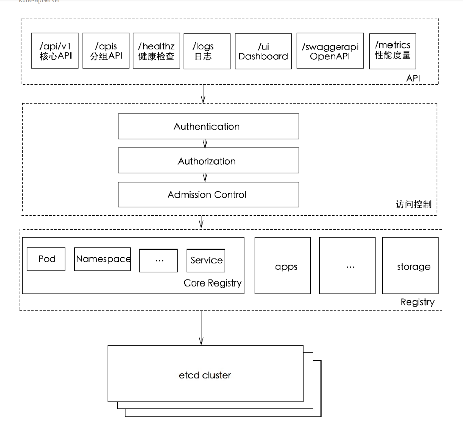
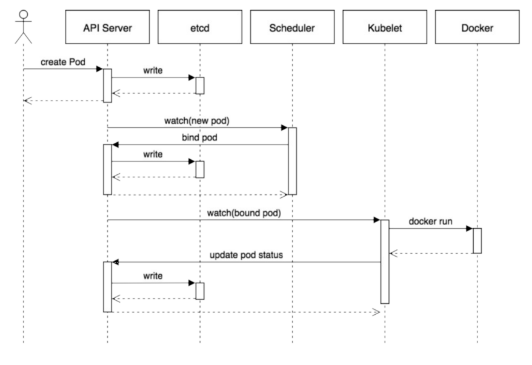
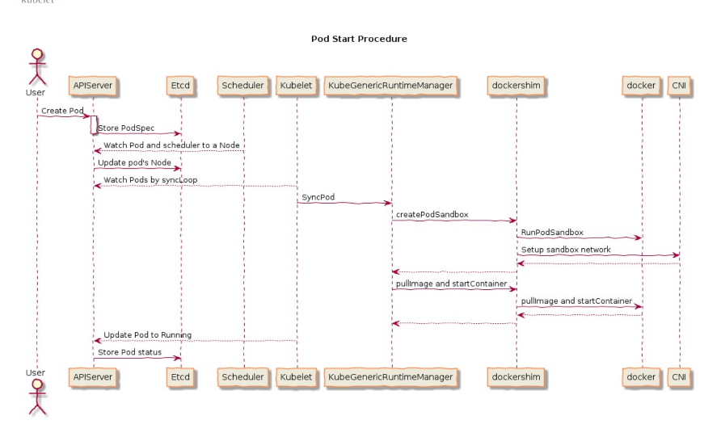

Kubernetes 主要由以下几个核心组件组成:

## 组件

### Etcd

Etcd 保存了整个集群的状态；

Etcd 是 CoreOS 基于 Raft 开发的分布式 key-value 存储，可用于服务发现、共享配置以及一
致性保障（如数据库选主、分布式锁等）。

#### 主要功能

1. 基本的 key-value 存储
2. 监听机制
3. key 的过期及续约机制，用于监控和服务发现
4. 原子 CAS 和 CAD，用于分布式锁和 leader 选举

### scheduler

kube-scheduler 负责分配调度 Pod 到集群内的节点上，它监听 kube-apiserver，查询还未分
配 Node 的 Pod，然后根据调度策略为这些 Pod 分配节点（更新 Pod 的 NodeName 字段）
调度器需要充分考虑诸多的因素：

1. 公平调度
2. 资源高效利用
3. QoS
4. affinity 和 anti-affinity
5. 数据本地化（data locality）
6. 内部负载干扰（inter-workload interference）
7. deadlines

在yaml中配置包括的

1. 节点选择nodeSelector nodeAffinity(requiredDuringSchedulingIgnoredDuringExecution 和
preferredDuringSchedulingIgnoredDuringExecution，分别代表必须满足条件和优选条件)
2. pod的亲和性 podAffinity
3. Taints 和 tolerations污点与容忍

### APIServer

kube-apiserver 是 Kubernetes 最重要的核心组件之一，主要提供以下的功能

1. 提供集群管理的 REST API 接口，包括认证授权、数据校验以及集群状态变更等
2. 提供其他模块之间的数据交互和通信的枢纽（其他模块通过 API Server 查询或修改数据，只
有 API Server 才直接操作 etcd）


### Kubelet

Kubelet 负责维护容器的生命周期，同时也负责 Volume（CVI）和网络（CNI）的管理

每个Node节点上都运行一个 Kubelet 服务进程，默认监听 10250 端口，接收并执行 Master 发
来的指令，管理 Pod 及 Pod 中的容器。每个 Kubelet 进程会在 API Server 上注册所在Node
节点的信息，定期向 Master 节点汇报该节点的资源使用情况，并通过 cAdvisor 监控节点和容器
的资源。

### CoreDNS

### Proxy

每台机器上都运行一个 kube-proxy 服务，它监听 API server 中 service 和 endpoint 的
变化情况，并通过 iptables 等来为服务配置负载均衡（仅支持 TCP 和 UDP）。

kube-proxy 当前支持以下几种实现

1. userspace：最早的负载均衡方案，它在用户空间监听一个端口，所有服务通过 iptables 转
发到这个端口，然后在其内部负载均衡到实际的 Pod。该方式最主要的问题是效率低，有明显的
性能瓶颈。
2. iptables：目前推荐的方案，完全以 iptables 规则的方式来实现 service 负载均衡。该
方式最主要的问题是在服务多的时候产生太多的 iptables 规则，非增量式更新会引入一定的
时延，大规模情况下有明显的性能问题
3. ipvs：为解决 iptables 模式的性能问题，v1.11 新增了 ipvs 模式（v1.8 开始支持测试
版，并在 v1.11 GA），采用增量式更新，并可以保证 service 更新期间连接保持不断开
4. winuserspace：同 userspace，但仅工作在 windows 节点上

#### 第一代

本机的iptables转发到本机的kube-proxy进程，然后由kube-proxy建立起到后端Pod的TCP/UDP连接，

#### 第二代

Kubernetes从1.2版本开始，将iptables作为kubeproxy的默认模式。iptables模式下的kube-proxy不再起到Proxy的作用，
其核心功能：通过API Server的Watch接口实时跟踪Service与Endpoint的
变更信息，并更新对应的iptables规则，Client的请求流量则通过iptables
的NAT机制“直接路由”到目标Pod。

缺陷：
iptables模式虽然实现起来简单，但存在无法避免的缺陷：在集群中
的Service和Pod大量增加以后，iptables中的规则会急速膨胀，导致性能
显著下降，在某些极端情况下甚至会出现规则丢失的情况，并且这种故
障难以重现与排查

#### 第三代

IPVS（IP Virtual Server）模式，
iptables是为防火墙而设计的；IPVS则专门用于高
性能负载均衡，并使用更高效的数据结构（Hash表），允许几乎无限的
规模扩张，因此被kube-proxy采纳为第三代模式。

与iptables相比，IPVS拥有以下明显优势：
◎ 为大型集群提供了更好的可扩展性和性能；
◎ 支持比iptables更复杂的复制均衡算法（最小负载、最少连接、
加权等）；
◎ 支持服务器健康检查和连接重试等功能；
◎ 可以动态修改ipset的集合，即使iptables的规则正在使用这个集
合。
由于IPVS无法提供包过滤、airpin-masquerade tricks（地址伪装）、
SNAT等功能，因此在某些场景（如NodePort的实现）下还要与iptables
搭配使用。在IPVS模式下，kube-proxy又做了重要的升级，即使用
iptables的扩展ipset，而不是直接调用iptables来生成规则链。

iptables规则链是一个线性的数据结构，ipset则引入了带索引的数据
结构，因此当规则很多时，也可以很高效地查找和匹配。我们可以将
ipset简单理解为一个IP（段）的集合，这个集合的内容可以是IP地址、
IP网段、端口等，iptables可以直接添加规则对这个“可变的集合”进行操
作，这样做的好处在于可以大大减少iptables规则的数量，从而减少性能
损耗。

### Controller Manager

Controller Manager 负责维护集群的状态，比如故障检测、自动扩展、滚动更新等；

Controller Manager 由 kube-controller-manager 和 cloud-controller-manager 组
成，是 Kubernetes 的大脑，它通过 apiserver 监控整个集群的状态，并确保集群处于预期的工
作状态。
kube-controller-manager 由一系列的控制器组成

```text
    Replication Controller
    Node Controller
    CronJob Controller
    Daemon Controller
    Deployment Controller
    Endpoint Controller
    Garbage Collector
    Namespace Controller
    Job Controller
    Pod AutoScaler
    RelicaSet
    Service Controller
    ServiceAccount Controller
    StatefulSet Controller
    Volume Controller
    Resource quota Controller
```

## 组件通信

API Server 负责 etcd 存储的所有操作，且只有 API Server 才直接操作 etcd 集群

1. API Server 对内（集群中的其他组件）和对外（用户）提供统一的 REST API，其他组件均
通过 API Server 进行通信
2. Controller Manager、Scheduler、Kube-proxy 和 Kubelet 等均通过 API
Server watch API 监测资源变化情况，并对资源作相应的操作
所有需要更新资源状态的操作均通过 API Server 的 REST API 进行
3. API Server 也会直接调用 Kubelet API（如 logs, exec, attach 等），默认不校验
Kubelet 证书，但可以通过 --kubelet-certificate-authority 开启（而 GKE 通过 SSH
隧道保护它们之间的通信）

如pod创建的


1. 用户通过 REST API 创建一个 Pod
2. API Server 将其写入 etcd
3. Scheduluer 检测到未绑定 Node 的 Pod，开始调度并更新 Pod 的 Node 绑定
4. Kubelet 检测到有新的 Pod 调度过来，通过 Container Runtime 运行该 Pod
5. Kubelet 通过 Container Runtime 取到 Pod 状态，并更新到 API Server 中

## 其他

### 网络插件

#### 网络模型

1. IP-per-Pod，每个 Pod 都拥有一个独立 IP 地址，Pod 内所有容器共享一个网络命名空间
2. 集群内所有 Pod 都在一个直接连通的扁平网络中，可通过 IP 直接访问
    所有容器之间无需 NAT 就可以直接互相访问
    所有 Node 和所有容器之间无需 NAT 就可以直接互相访问容器自己看到的 IP 跟其他容器看到的一样
3. Service cluster IP 尽可在集群内部访问，外部请求需要通过 NodePort、LoadBalance
或者 Ingress 来访问

### pause容器

pause容器就是各种ns不包含mount的ns,给pod内的容器共享

### POD DNS配置

TODO

### service的转发策略

提供了两种负载分发策略：RoundRobin和SessionAffinity，具体说明如
下。
◎ RoundRobin：轮询模式，即轮询将请求转发到后端的各个Pod
上。
◎ SessionAffinity：基于客户端IP地址进行会话保持的模式，即第
1次将某个客户端发起的请求转发到后端的某个Pod上，之后从相同的客
户端发起的请求都将被转发到后端相同的Pod上

Kubernetes的kube-proxy
作为一个全功能的代理服务器管理了两个独立的TCP连接：一个是从容
器到kube-proxy：另一个是从kube-proxy到负载均衡的目标Pod。

### CNI

Container Network Interface

在CNI模型中只涉及两个概念：容器和网络。
◎ 容器（Container）：是拥有独立Linux网络命名空间的环境，
例如使用Docker或rkt创建的容器。关键之处是容器需要拥有自己的
Linux网络命名空间，这是加入网络的必要条件。
◎ 网络（Network）：表示可以互连的一组实体，这些实体拥有
各自独立、唯一的IP地址，可以是容器、物理机或者其他网络设备（比
如路由器）等。

对容器网络的设置和操作都通过插件（Plugin）进行具体实现，
CNI插件包括两种类型：CNI Plugin和IPAM（IP Address Management）
Plugin。CNI Plugin负责为容器配置网络资源，IPAM Plugin负责对容器
的IP地址进行分配和管理。IPAM Plugin作为CNI Plugin的一部分，与
CNI Plugin一起工作。



### calico

Calico在每个计
算节点都利用Linux Kernel实现了一个高效的vRouter来负责数据转发。
每个vRouter都通过BGP1协议把在本节点上运行的容器的路由信息向整
个Calico网络广播，并自动设置到达其他节点的路由转发规则。Calico
保证所有容器之间的数据流量都是通过IP路由的方式完成互联互通的。
Calico节点组网时可以直接利用数据中心的网络结构（L2或者L3），不
需要额外的NAT、隧道或者Overlay Network，没有额外的封包解包，能
够节约CPU运算，提高网络效率，

### Secret

每个单独的Secret大小不能超过1MB，Kubernetes不鼓励创建大的
Secret，因为如果使用大的Secret，则将大量占用API Server和kubelet的
内存。

只有所有Volume都挂载成功，Pod中的Container才会被启动。
在kubelet启动Pod中的Container后，Container中和Secret相关的Volume将
不会被改变，即使Secret本身被修改。为了使用更新后的Secret，必须删
除旧Pod，并重新创建一个新Pod。
