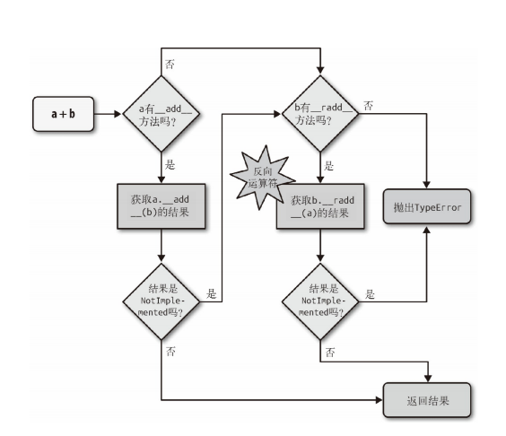

## 魔术方法

### 总览

#### 与计算无关

| 类别 | 方法名 |
| ------- | ------- |
| 字符串/字节序列表示形式 | __repr__、__str__、__format__、__bytes__ |
| 数值转换 | __abs__、__bool__、__complex__、__int__、__float__、__hash__、__index__ |
| 集合模拟 | __len__、__getitem__、__setitem__、__delitem__、__contains__ |
| 迭代枚举 | __iter__、__reversed__、__next__ |
| 可调用模拟 | __call__ |
| 上下文管理 | __enter__、__exit__|
| 实例创建和销毁 | __new__、__init__、__del__ |
| 属性管理 | __getattr__、__getattribute__、__setattr__、__delattr__、__dir__ |
| 属性描述符 | __get__、__set__、__delete__ |
| 跟类相关的服务 | __prepare__、__instancecheck__、__subclasscheck__ |

#### 与计算有关

| 类别 | 方法名 |
| ------- | ------- |
| 一元运算符 | __neg__ -、__pos__ +、__abs__ abs()|
| 比较运算符 | __lt__ <、__le__ <=、__eq__ ==、__ne__ !=、__gt__ >、__ge__ >= |
| 算术运算符 | __add__ +、__sub__ -、__mul__ *、__truediv__ /、__floordiv__ //、__mod__ %、__divmod__  divmod()、__pow__ ** 或pow()、__round__ round()|
| 反向算术运算符 | __radd__、__rsub__、__rmul__、__rtruediv__、__rfloordiv__、__rmod__、__rdivmod__、__r |
| 增量赋值算术运算符 | __iadd__、__isub__、__imul__、__itruediv__、__ifloordiv__、__imod__、__ipow__|
| 位运算符 | __invert__ ~、__lshift__ <<、__rshift__ >>、__and__ &、__or__ |、__xor__ ^ |
| 反向位运算符 | __rlshift__、__rrshift__、__rand__、__rxor__、__ror__ |
| 增量赋值位运算符 | __ilshift__、__irshift__、__iand__、__ixor__、__ior__ |

### __len__(self)

len某个对象的时候调用

### __xxxitem__(self, position)

对某个对象使用[xx]的时候调用

```python
class FrenchDeck:
     def __init__(self):
         self._cards = {}
         
     def __len__(self):
        print("len")
        return len(self._cards)
        
     def __setitem__(self, key, value):
         print("--set item")
         self._cards[key] = value

     def __getitem__(self, position):
         print("--get item")
         return self._cards[position]

     def __delitem__(self, key):
         print("--del item")
         self._cards.pop(key)

deck = FrenchDeck()
print(len(deck)) # 调用len
deck["a"] = 1    # 调用setitem
print(deck["a"]) # 调用getitem
del deck["a"]    # 调用delitem
# len
# 0
# --set item
# --get item
# 1
# --del item
```

### __repr__(self)/__str__(self)

__repr__ 和 __str__ 的区别在于，后者是在 str() 函数被使用，
或是在用 print 函数打印一个对象的时候才被调用的，并且它返回的
字符串对终端用户更友好。

如果你只想实现这两个特殊方法中的一个，__repr__ 是更好的选择，
因为如果一个对象没有 __str__ 函数，而 Python 又需要调用它的时
候，解释器会用 __repr__ 作为替代。

### __getattr__

属性查找失败后，解释器会调用 __getattr__ 方法。简单来说，对
my_obj.x 表达式，Python 会检查 my_obj 实例有没有名为 x 的属性；
如果没有，到类（my_obj.__class__）中查找；如果还没有，顺着
继承树继续查找。4 如果依旧找不到，调用 my_obj 所属类中定义的
__getattr__ 方法，传入 self 和属性名称的字符串形式（如
'x'）

## 数据结构

### 概览

容器序列list、tuple 和 collections.deque 这些序列能存放不同类型的数据。
扁平序列str、bytes、bytearray、memoryview 和 array.array，这类序列只能容纳一种类型。

可变序列list、bytearray、array.array、collections.deque 和memoryview。
不可变序列tuple、str 和 bytes。

str 是一个例外，因为对字符串做 += 实在是太普遍了，所以 CPython 对它做了优化。为
str 初始化内存的时候，程序会为它留出额外的可扩展空间，因此进行增量操作的时候，并
不会涉及复制原有字符串到新位置这类操作。

### list

### tuple

不可变的列表

```python
t = (1, 2, [30, 40])
t[2] += [50, 60]
# tuple' object does not support item assignment
# (1, 2, [30, 40, 50, 60])
```

1. 不要把可变对象放在元组里面。
2. 增量赋值不是一个原子操作它虽然抛出了异
常，但还是完成了操作。

#### 具名元组

collections.namedtuple 是一个工厂函数，它可以用来构建一个
带字段名的元组和一个有名字的类——这个带名字的类对调试程序有很
大帮助。

```python
from collections import namedtuple
City = namedtuple('City', 'name country population coordinates') ➊
tokyo = City('Tokyo', 'JP', 36.933, (35.689722, 139.691667)) ➋
print(tokyo)
# City(name='Tokyo', country='JP', population=36.933, coordinates=(35.689722,139.691667))
print(tokyo.population)
# 36.933
print(tokyo.coordinates)
# (35.689722, 139.691667)
print(tokyo[1])
# 'JP'
```

### 数组

数组支持所有跟可变序列有关的操作，包括 .pop、.insert 和
.extend。另外，数组还提供从文件读取和存入文件的更快的方法，如
.frombytes 和 .tofile。

如果我们需要一个只包含数字的列表，那么 array.array 比 list 更
高效。

#### memoryview

memoryview 是一个内置类，它能让用户在不复制内容的情况下操作
同一个数组的不同切片。

#### 数组VS列表

数组（Array）
    类型专一度：数组是固定类型的数据集合，意味着数组中的所有元素都必须是相同类型的。
    内存效率：数组通常比列表更节省内存，因为它们是同质的，不需要为每个元素存储类型信息。
    性能：由于内存布局的连续性和类型一致性，数组在某些操作上可能比列表有更好的性能。
    使用场景：数组常用于科学计算和数值分析，如使用NumPy库创建的ndarray对象。
    内置类型：Python内置的array模块提供了array的功能，但它的使用没有列表那么广泛。
列表（List）
    类型灵活性：列表是异质的，可以包含任意类型的元素，包括不同的数据类型和对象。
    内存使用：由于需要存储类型信息，列表相比数组通常会占用更多的内存。
    性能：列表是动态数组，其内存分配和元素插入可能会导致额外的内存开销和性能损失，特别是在大型数据集上。
    内置类型：列表是Python的内置数据类型，使用非常广泛，支持广泛的操作，如切片、排序和内置函数。

### 双向队列和其他形式的队列

#### 双向队列

collections.deque 类（双向队列）是一个线程安全、可以快速从
两端添加或者删除元素的数据类型。而且如果想要有一种数据类型来存
放“最近用到的几个元素”，deque 也是一个很好的选择。这是因为在新
建一个双向队列的时候，你可以指定这个队列的大小，如果这个队列满
员了，还可以从反向端删除过期的元素，然后在尾端添加新的元素。示
例 2-23 中有几个双向队列的典型操作

```python
>>> from collections import deque
>>> dq = deque(range(10), maxlen=10) 
>>> dq
deque([0, 1, 2, 3, 4, 5, 6, 7, 8, 9], maxlen=10)
>>> dq.rotate(3) 
>>> dq
deque([7, 8, 9, 0, 1, 2, 3, 4, 5, 6], maxlen=10)
>>> dq.rotate(-4)
>>> dq
deque([1, 2, 3, 4, 5, 6, 7, 8, 9, 0], maxlen=10)
>>> dq.appendleft(-1) 
>>> dq
deque([-1, 1, 2, 3, 4, 5, 6, 7, 8, 9], maxlen=10)
>>> dq.extend([11, 22, 33]) 
>>> dq
deque([3, 4, 5, 6, 7, 8, 9, 11, 22, 33], maxlen=10)
>>> dq.extendleft([10, 20, 30, 40]) 
>>> dq
deque([40, 30, 20, 10, 3, 4, 5, 6, 7, 8], maxlen=10)
```

#### queue

提供了同步（线程安全）类 Queue、LifoQueue 和
PriorityQueue，不同的线程可以利用这些数据类型来交换信息。这
三个类的构造方法都有一个可选参数 maxsize，它接收正整数作为输
入值，用来限定队列的大小。但是在满员的时候，这些类不会扔掉旧的
元素来腾出位置。相反，如果队列满了，它就会被锁住，直到另外的线
程移除了某个元素而腾出了位置。这一特性让这些类很适合用来控制活
跃线程的数量。

multiprocessing
　　这个包实现了自己的 Queue，它跟 queue.Queue 类似，是设计
给进程间通信用的。同时还有一个专门的
multiprocessing.JoinableQueue 类型，可以让任务管理变得更
方便。
asyncio
　　Python 3.4 新提供的包，里面有
Queue、LifoQueue、PriorityQueue 和 JoinableQueue，这些
类受到 queue 和 multiprocessing 模块的影响，但是为异步编程里
的任务管理提供了专门的便利。

### 字典

标准库里的所有映射类型都是利用 dict 来实现的，因此它们有个共同的限制，即只有可散列的数据类型才能用作这些映射里的键（只有键有
这个要求，值并不需要是可散列的数据类型）。

```python
tt = (1, 2, (30, 40))
hash(tt)
tl = (1, 2, [30, 40])
hash(tl)
Traceback (most recent call last):
 File "<stdin>", line 1, in <module>
TypeError: unhashable type: 'list'
```

#### 建立字典

```python
a = dict(one=1, two=2, three=3)
b = {'one': 1, 'two': 2, 'three': 3}
c = dict(zip(['one', 'two', 'three'], [1, 2, 3]))
d = dict([('two', 2), ('one', 1), ('three', 3)])
e = dict({'three': 3, 'one': 1, 'two': 2})
```

#### 字典推导

```python
DIAL_CODES = [ 
(86, 'China'),
(91, 'India'),
(1, 'United States'),
(62, 'Indonesia'),
(55, 'Brazil'),
(92, 'Pakistan'),
(880, 'Bangladesh'),
(234, 'Nigeria'),
(7, 'Russia'),
(81, 'Japan'),
]
country_code = {country: code for code, country in DIAL_CODES} 

# {'China': 86, 'India': 91, 'Bangladesh': 880, 'United States': 1,
# 'Pakistan': 92, 'Japan': 81, 'Russia': 7, 'Brazil': 55, 'Nigeria':
# 234, 'Indonesia': 62}
{code: country.upper() for country, code in country_code.items() 
if code < 66}
# {1: 'UNITED STATES', 55: 'BRAZIL', 62: 'INDONESIA', 7: 'RUSSIA'}
```

#### 字典的变种

##### collections.OrderedDict

这个类型在添加键的时候会保持顺序，因此键的迭代次序总是一致
的。OrderedDict 的 popitem 方法默认删除并返回的是字典里的最
后一个元素，但是如果像 my_odict.popitem(last=False) 这样
调用它，那么它删除并返回第一个被添加进去的元素。

##### collections.Counter

　这个映射类型会给键准备一个整数计数器。每次更新一个键的时候
都会增加这个计数器。所以这个类型可以用来给可散列表对象计数，或
者是当成多重集来用——多重集合就是集合里的元素可以出现不止一1次
Counter 实现了 + 和 - 运算符用来合并记录，还有像
most_common([n]) 这类很有用的方法。most_common([n]) 会按
照次序返回映射里最常见的 n 个键和它们的计数，

```python
>>> ct = collections.Counter('abracadabra')
>>> ct
Counter({'a': 5, 'b': 2, 'r': 2, 'c': 1, 'd': 1})
>>> ct.update('aaaaazzz')
>>> ct
Counter({'a': 10, 'z': 3, 'b': 2, 'r': 2, 'c': 1, 'd': 1})
>>> ct.most_common(2)
[('a', 10), ('z', 3)]

```

#### 其他

散列表其实是一个稀疏数组（总是有空白元素的数组称为稀疏数组）。
在一般的数据结构教材中，散列表里的单元通常叫作表元（bucket）。
在 dict 的散列表当中，每个键值对都占用一个表元，每个表元都有两
个部分，一个是对键的引用，另一个是对值的引用。因为所有表元的大
小一致，所以可以通过偏移量来读取某个表元。

1. 键必须是可散列的
一个可散列的对象必须满足以下要求。
    (1) 支持 hash() 函数，并且通过 __hash__() 方法所得到的散列
    值是不变的。
    (2) 支持通过 __eq__() 方法来检测相等性。
    163
    (3) 若 a == b 为真，则 hash(a) == hash(b) 也为真。
    所有由用户自定义的对象默认都是可散列
2. 字典在内存上的开销巨大
    由于字典使用了散列表，而散列表又必须是稀疏的，这导致它在空
    间上的效率低下。举例而言，如果你需要存放数量巨大的记录，那
    么放在由元组或是具名元组构成的列表中会是比较好的选择；最好
    不要根据 JSON 的风格，用由字典组成的列表来存放这些记录。用
    元组取代字典就能节省空间的原因有两个：其一是避免了散列表所
    耗费的空间，其二是无需把记录中字段的名字在每个元素里都存一
    遍。
    在用户自定义的类型中，__slots__ 属性可以改变实例属性的存
    储方式，由 dict 变成 tuple,
    记住我们现在讨论的是空间优化。如果你手头有几百万个对象，而
    你的机器有几个 GB 的内存，那么空间的优化工作可以等到真正需
    要的时候再开始计划，因为优化往往是可维护性的对立面。
3. 键查询很快
    dict 的实现是典型的空间换时间：字典类型有着巨大的内存开
    164
    销，但它们提供了无视数据量大小的快速访问——只要字典能被装
    在内存里。正如表 3-5 所示，如果把字典的大小从 1000 个元素增
    加到 10 000 000 个，查询时间也不过是原来的 2.8 倍，从 0.000163
    秒增加到了 0.00456 秒。这意味着在一个有 1000 万个元素的字典
    里，每秒能进行 200 万个键查询。
4. 键的次序取决于添加顺序
    当往 dict 里添加新键而又发生散列冲突的时候，新键可能会被安
    排存放到另一个位置。于是下面这种情况就会发生：由
    dict([key1, value1), (key2, value2)] 和
    dict([key2, value2], [key1, value1]) 得到的两个字
    典，在进行比较的时候，它们是相等的；但是如果在 key1 和
    key2 被添加到字典里的过程中有冲突发生的话，这两个键出现在
    字典里的顺序是不一样的。

    ```python
    DIAL_CODES = [
    (86, 'China'),
    (91, 'India'),
    (1, 'United States'),
    (62, 'Indonesia'),
    (55, 'Brazil'),
    (92, 'Pakistan'),
    (880, 'Bangladesh'),
    (234, 'Nigeria'),
    (7, 'Russia'),
    (81, 'Japan'),
    ]
    d1 = dict(DIAL_CODES) 
    print('d1:', d1.keys())
    d2 = dict(sorted(DIAL_CODES)) 
    print('d2:', d2.keys())
    d3 = dict(sorted(DIAL_CODES, key=lambda x:x[1])) 
    print('d3:', d3.keys())
    assert d1 == d2 and d2 == d3 
    # key顺序不一样，但是 == 为true
    # d1: dict_keys([880, 1, 86, 55, 7, 234, 91, 92, 62, 81])
    # d2: dict_keys([880, 1, 91, 86, 81, 55, 234, 7, 92, 62])
    # d3: dict_keys([880, 81, 1, 86, 55, 7, 234, 91, 92, 62])
    ```

5. 往字典里添加新键可能会改变已有键的顺序
    无论何时往字典里添加新的键，Python 解释器都可能做出为字典扩
    容的决定。扩容导致的结果就是要新建一个更大的散列表，并把字
    典里已有的元素添加到新表里。这个过程中可能会发生新的散列冲
    突，导致新散列表中键的次序变化。要注意的是，上面提到的这些
    变化是否会发生以及如何发生，都依赖于字典背后的具体实现，因
    此你不能很自信地说自己知道背后发生了什么。如果你在迭代一个
    166
    字典的所有键的过程中同时对字典进行修改，那么这个循环很有可
    能会跳过一些键——甚至是跳过那些字典中已经有的键。
    由此可知，不要对字典同时进行迭代和修改。如果想扫描并修改一
    个字典，最好分成两步来进行：首先对字典迭代，以得出需要添加
    的内容，把这些内容放在一个新字典里；迭代结束之后再对原有字
    典进行更新。

### 集合

集合还实现了很多基础的中缀运算符。给定两个集合
a 和 b，a | b 返回的是它们的合集，a & b 得到的是交集，而 a -
b 得到的是差集。合理地利用这些操作，不仅能够让代码的行数变少，
还能减少 Python 程序的运行时间。这样做同时也是为了让代码更易读，
从而更容易判断程序的正确性，因为利用这些运算符可以省去不必要的
循环和逻辑操作。

#### 特点

实现也依赖散列表，但在它们的散列表里存放的
只有元素的引用（就像在字典里只存放键而没有相应的值）。在 set
加入到 Python 之前，我们都是把字典加上无意义的值当作集合来用的。
这些特点总结如下。

1. 集合里的元素必须是可散列的。
2. 集合很消耗内存。
3. 可以很高效地判断元素是否存在于某个集合。
4. 元素的次序取决于被添加到集合里的次序。
5. 往集合里添加元素，可能会改变集合里已有元素的次序。

### 相关使用

#### 切片

左闭右开
[start:end:step]

```python


# 切片赋值
l = list(range(10))
l[2:5] = [20, 30]
# [0, 1, 20, 30, 5, 6, 7, 8, 9]
del l[5:7]
# [0, 1, 20, 30, 5, 8, 9]

# 　对序列使用+和*
l = [1, 2, 3]
# l * 5
# [1, 2, 3, 1, 2, 3, 1, 2, 3, 1, 2, 3, 1, 2, 3]
# 5 * 'abcd'
# 'abcdabcdabcdabcdabcd'
```

#### 列表推导和生成器表达式

```python
[ord(x) for x in x]


# 列表推导同filter和map的比较
symbols = '$¢£¥€¤'
beyond_ascii = [ord(s) for s in symbols if ord(s) > 127]
beyond_ascii = list(filter(lambda c: c > 127, map(ord, symbols)))

```

#### list.sort方法和内置函数sorted

list.sort 方法会就地排序列表，也就是说不会把原列表复制一份。
这也是这个方法的返回值是 None 的原因，提醒你本方法不会新建一个
列表。

与 list.sort 相反的是内置函数 sorted，它会新建一个列表作为返
回值。这个方法可以接受任何形式的可迭代对象作为参数，甚至包括不
可变序列或生成器（见第 14 章）。而不管 sorted 接受的是怎样的参
数，它最后都会返回一个列表

## 函数

### __doc__

```python
def factorial(n): 
    ''' i am doc!'''
    return 1 if n < 2 else n * factorial(n-1)
factorial.__doc__
#  i am doc!
```

### 高阶函数

接受函数为参数，或者把函数作为结果返回的函数是高阶函数（higher order function）。

python3中map、filter 和 reduce 这三个高阶函数还能见到。

```python
fruits = ['strawberry', 'fig', 'apple', 'cherry', 'raspberry', 'banana']
# 把 len 函数传给 key 参数
sorted(fruits, key=len)
['fig', 'apple', 'cherry', 'banana', 'raspberry', 'strawberry']

```

### 匿名函数

lambda 关键字在 Python 表达式内创建匿名函数.
然而，Python 简单的句法限制了 lambda 函数的定义体只能使用纯表达
式。换句话说，lambda 函数的定义体中不能赋值，也不能使用 while
和 try 等 Python 语句。

```python
# 把 lambda 表达式转换成 def 语句，使用那个名称来定义函数。
fruits = ['strawberry', 'fig', 'apple', 'cherry', 'raspberry', 'banana']
sorted(fruits, key=lambda word: word[::-1])
['banana', 'apple', 'fig', 'raspberry', 'strawberry', 'cherry']
```

### 函数内省

代码内省是检查类、函数等以了解它们是什么、做什么以及知道什么的能力。

内省是一种自我检查(self examination)的行为。内省是在运行时确定对象的类型或属性的能力。 Python中的所有内容都是一个对象。 Python中的每个对象都可以具有属性和方法。 通过使用内省， 可以动态检查Python对象。

```python
# 例如fastapi
# 需要传递person
# 在运行的时候去检验是否传递
from fastapi import APIRouter

router = APIRouter(prefix="/auth", tags=["用户认证"])

@router.query('/')
    def hello(person):
    return 'Hello %s!' % person
```

函数对象有个 __defaults__ 属性，它的值是一个元组，里面保存着
定位参数和关键字参数的默认值。仅限关键字参数的默认值在
__kwdefaults__ 属性中。然而，参数的名称在 __code__ 属性中，
它的值是一个 code 对象引用，自身也有很多属性。

```python
def tag(name, *content, cls=None, **attrs):
    print("name---", name)
    print("content---", content)
    print("attrs---", attrs)

import inspect
sig = inspect.signature(tag) 
my_tag = {'name': 'img', 'title': 'Sunset Boulevard','src': 'sunset.jpg', 'cls': 'framed'}
bound_args = sig.bind(**my_tag) 
for name, value in bound_args.arguments.items():
    print(name, '=', value)
    # name = img
    # cls = framed
    # attrs = {'title': 'Sunset Boulevard', 'src': 'sunset.jpg'}
del my_tag['name'] 
bound_args = sig.bind(**my_tag) 
# Traceback (most recent call last):
#  ...
# TypeError: 'name' parameter lacking default value
```

#### 参数捕获

```python
def tag(name, *content, cls=None, **attrs):
    # cls 参数只能作为关键字参数传入
    print("name---", name)
    print("content---", content)
    print("attrs---", attrs)

tag('br')
# 传入单个定位参数，生成一个指定名称的空标签。
# name--- br
# content--- ()
# attrs--- {}
tag('p', 'hello')
# name--- p
# content--- ('hello',)
# attrs--- {}
tag('p', 'hello', 'world')
#  第一个参数后面的任意个参数会被 *content 捕获，存入一个元组。
# name--- p
# content--- ('hello', 'world')
# attrs--- {}
tag('p', 'hello', 'world' ,id=33)
# tag 函数签名中没有明确指定名称的关键字参数会被 **attrs 捕获，存入一个字典。
# name--- p
# content--- ('hello', 'world')
# attrs--- {'id': 33}
tag(content='testing', name="img")
# name--- img
# content--- ()
# attrs--- {'content': 'testing'}
my_tag = {'name': 'img', 'title': 'Sunset Boulevard','src': 'sunset.jpg', 'cls': 'framed'}
tag(**my_tag)
# 在 my_tag 前面加上 **，字典中的所有元素作为单个参数传入，同名键会绑定到对应的具名参数上，余下的则被 **attrs 捕获。
# name--- img
# content--- ()
# attrs--- {'title': 'Sunset Boulevard', 'src': 'sunset.jpg'}
```

### 函数注解

可以获取函数的注解，例如实现一个真正的类型校验

```python
def clip(text:str, max_len:'int > 0'=80) -> str: 
    """在max_len前面或后面的第一个空格处截断文本"""
    end = None
    if len(text) > max_len:
        space_before = text.rfind(' ', 0, max_len)
    if space_before >= 0:
        end = space_before
    else:
        space_after = text.rfind(' ', max_len)
    if space_after >= 0:
        end = space_after
    if end is None: # 没找到空格
        end = len(text)
    return text[:end].rstrip()
clip.__annotations__
# {'text': str, 'max_len': 'int > 0', 'return': str}
from inspect import signature
sig = signature(clip)
sig.return_annotation
for param in sig.parameters.values():
    note = param.annotation
    print(note, ':', param.name, '=', param.default)
    # <class 'str'> : text = <class 'inspect._empty'>
    # int > 0 : max_len = 80
```

#### 装饰器实现类型校验

```python

def debug(func):
    def wrapper(*args, **kwargs):
        # func希望的类型
        par = func.__annotations__
        ans = func(*args, **kwargs)

        signature = inspect.signature(func)
        parameters = signature.parameters
        args_dict = dict(zip(parameters.keys(), args))
        kwargs_dict = {k: v for k, v in kwargs.items()}
        # 实际传入的参数
        data = {**args_dict, **kwargs_dict}
        # 校验传入的参数类型
        for key in data.keys():
            if not isinstance(data[key],par[key]):
                raise ValueError(f'var {data[key]} is not {par[key]}')
        # 校验返回值信息
        if not isinstance(ans,par["return"]):
            raise ValueError(f'return {ans} is not {par["return"]}')
        return ans
    return wrapper
@debug
def clip(text:str, max_len:int=80) -> str: 
    """在max_len前面或后面的第一个空格处截断文本"""
    print(text,max_len)
    # return "ok"
clip("999",max_len=1)

# 使用装饰器的另一种方式
def decorate(func):
    def wrapper(*args, **kwargs):
        print("9999")
        return func(*args, **kwargs)
    return wrapper
t = decorate(print)
t("11")


def decorate(func):
    def wrapper(*args, **kwargs):
        print("head ---- decorate")
        func(*args, **kwargs)
        print("tail ---- decorate")
    return wrapper

def decorate2(func):
    def wrapper(*args, **kwargs):
        print("head ---- decorate2")
        func(*args, **kwargs)
        print("head ---- decorate2")
    return wrapper


# 多个装饰器
@decorate
@decorate2
def func():
    print("---")
func()
# head ---- decorate
# head ---- decorate2
# ---
# head ---- decorate2
# tail ---- decorate


# 带参数的装饰器
def with_args(xx):
    def decorate(func):
        def wrapper(*args, **kwargs):
            print(xx)
            func(*args, **kwargs)
        return wrapper
    return decorate

@with_args(0)
def func():
    print("---")
func()


# 类装饰器
class A:
    def __init__(self,func):
        print("----")
        self.func = func
    def __call__(self,*args,**kargs):
        self.func(*args,**kargs)

@A
def hah(info):
    print("------",info)

# 带参数类装饰器
class A:
    def __init__(self,a):
        print("----")
        self.a = a
    def __call__(self,func):
        print("aaa",self.a)
        self.func = func
        return self.hah
    def hah(self,*args,**kargs):
        print("99")
        self.func(*args,**kargs)
# 带参数的相当于是 A(a=1)(hah)，调用了hah的方法,在写一个方法接受参数
@A(a=1)
def hah(info):
    print("------",info)
# 这里可以看出执行了init的方法和call方法
# 即执行了 c = A(a=1)(hah)
# ----
# aaa 1
hah(info="1")
# 这里才是调用了类的hah和hah本身自己的方法
# 执行了c.hah,然后在c.hah中调用了hah的方法
# 99
# ------ 1
```

#### 装饰器的问题

使用装饰器包装函数,当要得到函数本身的信息的话，
如果没有@wraps(func)，则只会得到装饰器里的return的那个函数的信息。
如果有@wraps(func)，则只会得到函数自己的信息。

装饰器的调用时机为,当有函数使用装饰器的时候,就会调用装饰器的外函数,当具体函数执行的时候执行内函数。

```python
from  functools import wraps
def decorate(func):
    # @wraps(func)
    def wrapper(*args, **kwargs):
        print("9999")
        return func(*args, **kwargs)
    return wrapper
@decorate
def hah():
    print("hello world")
print(hah.__name__)


def decorate(func):
    @wraps(func)
    def wrapper(*args, **kwargs):
        print("9999")
        return func(*args, **kwargs)
    return wrapper
@decorate
def hah():
    print("hello world")
print(hah.__name__)

```

##### classmethod and staticmethod

就是一个装饰器,一个对象的实例都可以调用类方法和静态方法，无非是里面做了参数的传递与否。

### 闭包

有内部函数和外部函数，外层函数的变量被内层函数引用，内层函数被外部函数返回。
外部函数传入的参数不会消失,实现一种session的机制。
就是因为外部函数的局部变量不会被释放,所以内存占用比较高。

闭包可以是认为是轻量级的简单类,参数为属性,内部方法为函数,闭包里的信息相对于类会少很多.

1. 闭包定义是在函数内再嵌套函数
2. 闭包是可以访问另一个函数局部作用域中变量的函数
3. 闭包可以读取另外一个函数内部的变量,可以保证外部函数的数据安全
4. 闭包可以让参数和变量不会被垃圾回收机制回收圣放局部变量,最好是用完手动释放

```python
def get_av():
    prices = []
    def inner(price):
        prices.append(price)
        return sum(prices)/len(prices)
    return inner
c  = get_av()
c(100)
c(200)

```

#### nonlocal

需要修改外部函数的变量，需要使用nonlocal关键字

```python
## 优化get_av
# 把所有值存储在历史数列中，然后在每次调用 averager 时使用 sum求和。更好的实现方式是，只存储目前的总值和元素个数，然后使用这两个数计算均值。

def make_averager():
    count = 0
    total = 0
    def averager(new_value):
        nonlocal count, total
        # Python 3 引入了 nonlocal 声明。它的作用是把变量标记为自由变量，即使在函数中为变量赋予新值了，也会变成自由变量。
        count += 1
        # 当 count 是数字或任何不可变类型时，count += 1 语句的
        # 作用其实与 count = count + 1 一样。因此，我们在 averager 的
        # 定义体中为 count 赋值了，这会把 count 变成局部变量。total 变
        # 量也受这个问题影响。
        total += new_value
        return total / count
    return averager

```

#### 思考

函数、匿名函数、闭包、对象 当做实参时 有什么区别 ?

1. 匿名函数能够完成基本的简单功能，传递是这个函数的引用 只有功能
2. 普通函数能够完成较为复杂的功能，传递是这个函数的引用 只有功能
3. 闭包能够将较为复杂的功能，传递是这个闭包中的函数以及数据，因此传递是功能+数据
4. 对象能够完成最为复杂的功能 ，传递是很多数据+很多功能，因此传递是功能+数据

### 单分派泛函数

函数重载，即是传入不同的参数做不同的事情，减少if/else的判断。

```python
from functools import singledispatch
from collections import  abc
@singledispatch
def show(obj):
    print (obj, type(obj), "obj")

#参数字符串
@show.register(str)
def _(text):
    print("i am str")
    print (text, type(text), "str")

#参数int
@show.register(int)
def _(n):
    print("i am int")
    print (n, type(n), "int")


#参数元祖或者字典均可
@show.register(list)
@show.register(tuple)
@show.register(dict)
def _(tup_dic):
    print("i am tuple or dict list")
    print (tup_dic, type(tup_dic), "int")

show(1)
show("xx")
show([1])
show((1,2,3))
show({"a":"b"})
# i am int
# 1 <class 'int'> int
# i am str
# xx <class 'str'> str
# i am tuple or dict list
# [1] <class 'list'> int
# i am tuple or dict list
# (1, 2, 3) <class 'tuple'> int
# i am tuple or dict list
# {'a': 'b'} <class 'dict'> int
```

## 对象引用、可变性和垃圾回收

```python
a = [1, 2, 3]
b = a
a.append(4)
b
# [1, 2, 3, 4]

nums = [1,2]
def func(nums):
    nums.append(9)
func(nums)
# [1, 2, 9]
```

### is VS ==

is 运算符比 == 速度快，因为它不能重载，所以 Python 不用寻找并调用特殊方法，而是直接比较两个整数 ID。
而 a == b 是语法糖，等同于 a.__eq__(b)。继承自 object 的 __eq__ 方法比较两个对象的ID，结果与 is 一样。但是多数内置类型使用更有意义的方式覆盖了__eq__ 方法，会考虑对象属性的值。相等性测试可能涉及大量处理工作.

### 深浅拷贝

浅拷贝: 仅仅是复制最顶层数据(切片[:]是浅拷贝,字典的copy也是浅拷贝)
深拷贝: 递归拷贝,任何一层数据都是会复制一份.

```python
import copy

a = [1,[1,2,3]]
b = copy.copy(a)
a[1] is b[1]
# True

l1 = [3, [55, 44], (7, 8, 9)]
l2 = list(l1) 
# 构造方法或 [:] 做的是浅复制（即复制了最外层容器，副本中的元素是源容器中元素的引用）
l2
# [3, [55, 44], (7, 8, 9)]
l2 == l1 
# True
l2 is l1 
# False

# 因为l1的[1]的
l1[1].append(1)
l1[0]=99
l2[2] += (10, 11) 
# 对元组来说，+= 运算符创建一个新元组，然后重新绑定给变量l2[2]。这等同于 l2[2] = l2[2] + (10, 11)。现在，l1 和 l2中最后位置上的元组不是同一个对象。

# l1 [99, [55, 44, 1], (7, 8, 9)]
# l2 [3, [55, 44, 1], (7, 8, 9,10,11)]
# 使用浅拷贝的话，仅仅是复制了最外层的容器
# 如果最外层的容器的是不可变，那么改变 l1/l2互不影响
# 但是如果容器是可以变化的,那么改变其一另一方会受到影响
```

构造方法或 [:] 做的是浅复制（即复制了最外层容器，副本中的元素是源容器中元素的引用）。如果所有元素都是不可变的，那么这样没有问题，还能节省内存。但是，如果有可变的元素，可能就会导致意想不到的问题。

```python
>>> import copy
>>> bus1 = Bus(['Alice', 'Bill', 'Claire', 'David'])
>>> bus2 = copy.copy(bus1)
>>> bus3 = copy.deepcopy(bus1)
>>> id(bus1), id(bus2), id(bus3)
(4301498296, 4301499416, 4301499752) 
>>> bus1.drop('Bill')
>>> bus2.passengers
['Alice', 'Claire', 'David'] 
# bus1 和 bus2 共享同一个列表对象，因为 bus2 是 bus1 的浅复制副本。
>>> id(bus1.passengers), id(bus2.passengers), id(bus3.passengers)
(4302658568, 4302658568, 4302657800) 
>>> bus3.passengers
['Alice', 'Bill', 'Claire', 'David'] 
# bus3 是 bus1 的深复制副本，因此它的 passengers 属性指代另一个列表。
```

一般来说，深复制不是件简单的事。如果对象有循环引用，那么这个朴素的算法会进入无限循环。deepcopy 函数会记住已经复制的对象，因此能优雅地处理循环引用.

### 函数参数

```python

>>> def f(a, b):
... a += b
... return a
...
>>> x = 1
>>> y = 2
>>> f(x, y)
3
>>> x, y 
(1, 2)
# 数字 x 没变。
>>> a = [1, 2]
>>> b = [3, 4]
>>> f(a, b)
[1, 2, 3, 4]
>>> a, b 
# 列表 a 变了。
([1, 2, 3, 4], [3, 4])
>>> t = (10, 20)
>>> u = (30, 40)
>>> f(t, u)
(10, 20, 30, 40)
>>> t, u 
((10, 20), (30, 40))
# 元组 t 没变。


# 不要使用可变类型作为参数的默认值
class HauntedBus:
    """备受幽灵乘客折磨的校车"""
    def __init__(self, passengers=[]): 
        self.passengers = passengers 
    # 优化
    # def __init__(self, passengers=None):
    #     if passengers is None:
    #         self.passengers = [] 
    #     else:
    #         self.passengers = passengers

    def pick(self, name):
        self.passengers.append(name) 
    def drop(self, name):
        self.passengers.remove(name)          
bus2 = HauntedBus() 
bus2.pick('Carrie')
bus2.passengers
# ['Carrie']
bus3 = HauntedBus() 
bus3.passengers 
# ['Carrie']
bus3.pick('Dave')
bus2.passengers 
# ['Carrie', 'Dave']
# bus2.passengers is bus3.passengers
```

### 弱引用

有时需要引用对象，而不让对象存在的时间超过所需时间。这经常用在缓存中。
弱引用不会增加对象的引用数量。引用的目标对象称为所指对象referent）。因此我们说，弱引用不会妨碍所指对象被当作垃圾回收。

```python
import weakref

ccc = {0, 1}
wref = weakref.ref(ccc)
print(wref())       # {0, 1}
ccc = {2,3,4}
print(wref())  
# 因为 {0, 1} 对象不存在了，所以 wref() 返回 None

```

#### 　弱引用的局限

不是每个 Python 对象都可以作为弱引用的目标（或称所指对象）。基本
的 list 和 dict 实例不能作为所指对象，但是它们的子类可以轻松地
解决这个问题：

```python
class MyList(list):
    """list的子类，实例可以作为弱引用的目标"""
    pass
a_list = MyList(range(10))
# a_list可以作为弱引用的目标
wref_to_a_list = weakref.ref(a_list)

```

参考：<https://blog.csdn.net/lb971216008/article/details/138258447>

### del和垃圾回收

del 语句删除名称，而不是对象。del 命令可能会导致对象被当作垃圾
回收，但是仅当删除的变量保存的是对象的最后一个引用，或者无法得
到对象时。重新绑定也可能会导致对象的引用数量归零，导致对象被
销毁。

在 CPython 中，垃圾回收使用的主要算法是引用计数。实际上，每个对
象都会统计有多少引用指向自己。当引用计数归零时，对象立即就被销
毁：CPython 会在对象上调用 __del__ 方法（如果定义了），然后释
放分配给对象的内存。CPython 2.0 增加了分代垃圾回收算法，用于检
测引用循环中涉及的对象组——如果一组对象之间全是相互引用，即使
再出色的引用方式也会导致组中的对象不可获取。

```python
>>> import weakref
>>> s1 = {1, 2, 3}
>>> s2 = s1 
#  s1 和 s2 是别名，指向同一个集合，{1, 2, 3}。
>>> def bye(): 
... print('Gone with the wind...')
...
>>> ender = weakref.finalize(s1, bye) 
# 在 s1 引用的对象上注册 bye 回调。
>>> ender.alive 
# 调用 finalize 对象之前，.alive 属性的值为 True。
True
>>> del s1
# del 不删除对象，而是删除对象的引用。
# 删除了s1，但是s2指向同一个集合,所以s1仍然活着
>>> ender.alive 
True
>>> s2 = 'spam' 
# 重新绑定最后一个引用 s2，让 {1, 2, 3} 无法获取。对象被销毁了，调用了 bye 回调，ender.alive 的值变成了 False。
Gone with the wind...
>>> ender.alive
False

```

## 面向对象

### 属性

属性分为类属性和实例属性,公共的属性即是类属性,私有的属性即是实例属性

因为python是动态类型语言,一个类或者对象都可以随时增加属性和函数等.

```python
class A:
    # 类在内存中只会有一份
    a = '123'

    def __init__(self,name):
        # 实例属性 在每一个对象实例中都有一份
        self.name = name


a = A("!")
a.a = 999
print(a.a)
print(A.a)
# 999 实例对象能改自己的类属性,但是改不了类的属性
# 123
# 123
A.a = 666
print(a.a)
print(A.a)
print(A("!").a)
# 999 修改类属性后,已经生成的对象的类属性不受影响
# 666
# 666 修改类属性后,新生成的对象的类属性不受影响


A.b =111   # 添加类属性

import types
def func(self):
    print("func")
a.run = types.MethodType(func,a) # 添加实例函数
a.run()
```

#### 动态增加

##### 属性

```python
class A:
    def __init__(self):
        self.a = 1
A.b = 2  # 添加类属性
a = A()
a.c = 3 # 对象添加属性
```

##### 方法

```python
class A:
    def __init__(self):
        self.a = 1

import types
def func(self):
    print("func")
a.run = types.MethodType(func,a) # 添加实例函数
a.run()

@classmethod
def classmethod_1(cls):
    print("classmethod")

@staticmethod
def staticmethod_1():
    print("staticmethod_1")
A.classmethod_1 = classmethod_1   # 添加类方法
A.staticmethod_1 = staticmethod_1 # 添加静态方法
```

### __slots__

__slots__是一个特殊的内置类属性，它可以用于定义类的属性名称的集合。一旦在类中定义了__slots__属性，Python将限制该类的实例只能拥有__slots__中定义的属性。这有助于减少每个实例的内存消耗，提高属性访问速度，同时也可以防止意外添加新属性。

slots定义类只能拥有哪些属性,而不允许添加其他属性。

```python
class MyClass:
    __slots__ = ('attr1', 'attr2', 'attr3')
```

使用__slots__有几个潜在的好处：

1. 内存效率：通过限制实例的属性集合，__slots__可以降低每个实例的内存消耗。在大型数据结构或对象数量众多的情况下，这可能会显著减小内存占用。

2. 属性访问速度：由于__slots__限制了属性的数量和名称，属性访问速度会更快。这对于需要高性能的应用程序和数据处理非常有用。

3. 防止错误：通过限制可用属性，__slots__可以减少在程序中意外添加新属性的可能性，有助于提高代码的稳定性和可维护性。

4. 强制规范：__slots__可以强制类的设计者明确定义属性的名称，从而使代码更易于理解和维护。

```python

class Person:
    __slots__ = ('name', 'age')
 
    def __init__(self, name, age):
        self.name = name
        self.age = age
 
person = Person("Alice", 30)
print(person.name)  # 输出 "Alice"
print(person.age)   # 输出 30
print(person.ccc)   # 错误无法修改

# 内存效率比较
import sys
 
class WithoutSlots:
    def __init__(self, name, age):
        self.name = name
        self.age = age
 
class WithSlots:
    __slots__ = ('name', 'age')
    
    def __init__(self, name, age):
        self.name = name
        self.age = age
 
obj1 = WithoutSlots("Alice", 30)
obj2 = WithSlots("Bob", 25)
 
print(sys.getsizeof(obj1))  # 输出 56
print(sys.getsizeof(obj2))  # 输出 40

# 属性访问速度比较
import timeit
 
class WithoutSlots:
    def __init__(self, name, age):
        self.name = name
        self.age = age
 
class WithSlots:
    __slots__ = ('name', 'age')
    
    def __init__(self, name, age):
        self.name = name
        self.age = age
 
obj1 = WithoutSlots("Alice", 30)
obj2 = WithSlots("Bob", 25)
 
def access_name_age(obj):
    obj.name
    obj.age
 
time1 = timeit.timeit(lambda: access_name_age(obj1), number=1000000)
time2 = timeit.timeit(lambda: access_name_age(obj2), number=1000000)
 
print(f"WithoutSlots: {time1} seconds")
print(f"WithSlots: {time2} seconds")


# 当属性数量较多时，__slots__的元组形式可能会变得冗长。您可以使用元组展开来改善可读性
# __slots__与property方法一起使用可以添加属性的getter和setter，以便在属性访问时执行特定的操作
class Person:
    __slots__ = ('name', 'age', 'city', 'email')
 
    def __init__(self, name, age, city, email):
        self.name = name
        self.age = age
        self.city = city
        self.email = email

    @property
    def name(self):
        return self._name
 
    @name.setter
    def name(self, value):
        if isinstance(value, str):
            self._name = value
        else:
            raise ValueError("Name must be a string")
 
    @property
    def age(self):
        return self._age
 
    @age.setter
    def age(self, value):
        if isinstance(value, int) and 0 <= value <= 120:
            self._age = value
        else:

```

参考：<https://blog.csdn.net/Rocky006/article/details/135384857>

### property

看上去是掉了属性,其实是调用了一个方法,可以简化操作.

xxx.setter/deleter需要放在那个对应property的后面,且几个函数的名称需要相同,
可以只有property

```python
class Page(object):
    current_page = 1
    count = 10 

    # 第一种使用方法
    @property
    def offset(self):
        return (self.current_page -1)* self.count

    # 需要放在那个对应property的后面
    # offset的函数名称与上面property的方法一致.
    @offset.setter
    def offset(self,value):
        print("setter")

    @offset.deleter
    def offset(self):
        print("deleter")


    # 第二种方法
    def get_offset(self):
        return (self.current_page -1)* self.count

    def set_offset(self，value):
        print("setter2")

    def del_offset(self):
        print("deleter2") 

    # 对应上面 get set del 最后一个是描述信息
    # 第一个必须有
    offset2 = property(get_offset, set_offset, del_offset, "doc")
a = Page()
print(a.offset)  # 调用  @property/offset
a.offset = 1     # 调用  @property.setter/offset
del a.offset     # 调用  @property.deleter/offset
# 0
# setter
# deleter

a.offset2 
a.offset2 = 2
a.offset2.__doc__
del a.offset2  
# 0
# setter2
# deleter2
```

### 基类

声明抽象基类最简单的方式是继承 abc.ABC 或其他抽象基类。

除了 @abstractmethod 之外，abc 模块还定义了
@abstractclassmethod、@abstractstaticmethod 和
@abstractproperty 三个装饰器。然而，后三个装饰器从 Python 3.3
起废弃了，因为装饰器可以在 @abstractmethod 上堆叠，那三个就
显得多余了。

```python

import abc
class Tombola(abc.ABC): 

    @abc.abstractmethod
    def load(self, iterable): 
    """从可迭代对象中添加元素。"""

    @abc.abstractmethod
    def pick(self): 
    """随机删除元素，然后将其返回。
    如果实例为空，这个方法应该抛出`LookupError`。
    """


    @classmethod
    @abc.abstractclassmethod
    def an_abstract_classmethod(cls, ...):
        pass
    def loaded(self): ➍
    """如果至少有一个元素，返回`True`，否则返回`False`。"""
        return bool(self.inspect())
```

### 虚拟子类

Python 中的虚拟子类主要是为了实现动态性和解耦。

1. 动态性：与传统的静态继承关系相比，虚拟子类具有更高的动态性。虚拟子类可以在运行时动态地添加或移除，而不需要修改代码。这使得程序具有更高的灵活性和可扩展性。
2. 解耦：虚拟子类可以实现不同类之间的解耦，降低了类之间的依赖性。传统的继承关系可能会导致子类与父类紧密地绑定在一起，而虚拟子类则可以避免这一点。通过使用虚拟子类，一个类可以灵活地使用另一个类的功能，而不必关心具体的实现细节。
3. 模块化：虚拟子类可以帮助我们更好地组织和管理代码。将类的功能提取为单独的模块，通过虚拟子类来实现不同模块之间的交互，可以使代码结构更加清晰，便于维护和复用。

```python
import abc
class Tombola(abc.ABC): 

    @abc.abstractmethod
    def pick(self, iterable): 
    """从可迭代对象中添加元素。"""

@Tombola.register 
class TomboList(list): 
    def pick(self):
        if self: 
            position = randrange(len(self))
            return self.pop(position) 
        else:
            raise LookupError('pop from empty TomboList')
# 或者
Tombola.register(tuple)
```

### 继承

#### 子类化内置类型

在 Python 2.2 之前，内置类型（如 list 或 dict）不能子类化。在
Python 2.2 之后，内置类型可以子类化了，但是有个重要的注意事项：
内置类型（使用 C 语言编写）不会调用用户定义的类覆盖的特殊方法。

直接子类化内置类型（如 dict、list 或 str）容易出
错，因为内置类型的方法通常会忽略用户覆盖的方法。不要子类化
内置类型，用户自己定义的类应该继承 collections 模块
（<http://docs.python.org/3/library/collections.html）中的类，例如>
UserDict、UserList 和 UserString，这些类做了特殊设计，
因此易于扩展。

```python
>>> class DoppelDict(dict):
...     def __setitem__(self, key, value):
...         super().__setitem__(key, [value] * 2) # ➊

>>> dd = DoppelDict(one=1) # 
# 继承自 dict 的 __init__ 方法显然忽略了我们覆盖的__setitem__ 方法：'one' 的值没有重复。
>>> dd
{'one': 1}
>>> dd['two'] = 2 
>>> dd
{'one': 1, 'two': [2, 2]}
#  [] 运算符会调用我们覆盖的 __setitem__ 方法，按预期那样工作：'two' 对应的是两个重复的值，即 [2, 2]。
>>> dd.update(three=3) 
>>> dd
{'three': 3, 'one': 1, 'two': [2, 2]}
# 继承自 dict 的 update 方法也不使用我们覆盖的 __setitem__方法：'three' 的值没有重复。
```

#### 多重继承

任何实现多重继承的语言都要处理潜在的命名冲突，这种冲突由不相关
的祖先类实现同名方法引起。

多继承中父类中有相同的方法, Python 会按照特
定的顺序遍历继承图。这个顺序叫方法解析顺序（Method Resolution Order，MRO）。类都有一个名为 __mro__ 的属性，它的值是一个元组，按照方法解析顺序列出各个超类，从当前类一直向上，直到object 类。
例如下面的pingpong里面的pong方法，因为是先解析到了B,所以调用了B的方法。

对于init方法也是会按照__mro__里面的顺序执行init方法.

```python
class A:
    def ping(self):
        print('A-ping:', self)
class B(A):
    def pong(self):
        print('B-pong:', self)
class C(A):
    def pong(self):
        print('C-PONG:', self)

class D(B, C):
    def ping(self):
        super().ping()
        print('post-ping:', self)
    def pingpong(self):
        self.ping()
        super().ping()
        self.pong()
        super().pong()
        C.pong(self)
d = D()
d.pong()
# B-pong: <__main__.D object at 0x7f6c1c51e7f0>
d.ping()
# A-ping: <__main__.D object at 0x7f6c0c2c2160>
# post-ping: <__main__.D object at 0x7f6c0c2c2160>
d.pingpong()
# post-ping: <__main__.D object at 0x7f6c1c1a6190>
# A-ping: <__main__.D object at 0x7f6c1c1a6190>
# B-pong: <__main__.D object at 0x7f6c1c1a6190>
# B-pong: <__main__.D object at 0x7f6c1c1a6190>
# C-PONG: <__main__.D object at 0x7f6c1c1a6190>
D.__mro__
# (__main__.D, __main__.B, __main__.C, __main__.A, object)
```

## 运算符重载

### +

__add__

__radd__



### *

__mul__

__rmul__

### 中缀运算符方法

| 运算符 | 正向方法 |反向方法 |就地方法 |说明 |
| ------- | ------- |------- |------- |------- |
| + | __add__ | __radd__ | __iadd__ | 加法或拼接 |
| - | __sub__ | __rsub__ | __isub__ | 减法 |
| * | __mul__ | __rmul__ | __imul__ | 乘法或重复复制 |
| / | __truediv__ | __rtruediv__ | __itruediv__ | 除法 |
| // | __floordiv__ | __rfloordiv__ | __ifloordiv__ | 整除 |
| % | __mod__ | __rmod__ | __imod__ | 取模 |
| divmod() | __divmod__ | __rdivmod__ | __idivmod__ | 返回由整除的商和模数组成的元组 |
| pow | __pow__ | __rpow__ | __ipow__ | 取幂 |
| @ | __matmul__ | __rmatmul__ | __imatmul__| 矩阵乘法 |
| & | __and__ | __rand__ | __iand__ | 位与 |
| \| |__or__  |  __ror__ | __ior__  |   位或 |
| ^ | __xor__ |  __rxor__ | __ixor__ |位异或 |
| << | __lshift__ |  __rlshift__ |  __ilshift__ | 按位左移|
| >> | __rshift__  | __rrshift__ | __irshift__  | 按位右移|

## 可迭代的对象、迭代器和生成器

所有生成器都是迭代器，因为生成器完全实现了迭代器接口。

1. for循环可以循环Iterable类型(可迭代对象)
2. next则是Iterator类型(迭代器)

### 是否可迭代

```python
from collections.abc import Iterable

isinstance(1, Iterable)

nums = [1,2,3]

nums_iter = iter(nums)

next(nums_iter)
next(nums_iter)
next(nums_iter)
# 最后一个没了报错 StopIteration 
next(nums_iter)

```

### 序列可以迭代的原因：iter函数

1. 检查对象是否实现了 __iter__ 方法，如果实现了就调用它，获取
一个迭代器。
2. 如果没有实现 __iter__ 方法，但是实现了 __getitem__ 方法，
Python 会创建一个迭代器，尝试按顺序（从索引 0 开始）获取元素。
3. 如果尝试失败，Python 抛出 TypeError 异常，通常会提示“C object
is not iterable”（C 对象不可迭代），其中 C 是目标对象所属的类。

从 Python 3.4 开始，检查对象 x 能否迭代，最准确的方法
是：调用 iter(x) 函数，如果不可迭代，再处理 TypeError 异
常。这比使用 isinstance(x, abc.Iterable) 更准确，因为
iter(x) 函数会考虑到遗留的 __getitem__ 方法，而abc.Iterable 类则不考虑。

### 迭代器

__next__
　　返回下一个可用的元素，如果没有元素了，抛出 StopIteration
异常。
__iter__
　　返回 self，以便在应该使用可迭代对象的地方使用迭代器，例如
在 for 循环中。

```python
class A:
    nums = [ 1,2,3]
    def __iter__(self):
        return B()

    # 只有iter方法就是可迭代对象,但是不是迭代器
    
    # def __next__(self):
    #     pass

class B:
    nums = [ 1,2,3]
    current = 0
    # 有iter,next方法是迭代器
    def __iter__(self):
        return self

    def __next__(self):
        # for 循环里其实调用的就是iter和next方法
        # 带有异常判断StopIteration,所以next方法需要raise StopIteratio
        if self.current < len(self.nums):
            item = self.nums[self.current]
            self.current+=1
            return item
        else:
            self.current=0
            raise StopIteration
        
from collections.abc import Iterable,Iterator
a = A()
iter(a)  # 会调用上面的__iter__方法
print(isinstance(a,Iterable))
print(isinstance(a,Iterator))
b = B()
print(isinstance(b,Iterable))
print(isinstance(b,Iterator))
for i in b:
    print(i)
for i in b:
    print(i)
list(b)
[ i for i in b]
# [1,2,3]
```

### 生成器

如果需要很多数据的列表,不需要一次性全部生成,从而导致内存占用太高,而是需要的时候再去生成,就可以省内存.
只是知道数据生成方式,而不是先生成所有数据.

生成器是一种特别的迭代器.

通过next调用生成器,直到遇到yield返回出去,然后等下一次next调用生成器,执行上次yiedl后的代码,然后遇到下一次yield返回出去.

```python
import sys
import time

total1 = 0
total2 = 0
count = 10000000
t1 = time.time()
nums = [ i  for i in range(count)]
print(type(nums))
print(sys.getsizeof(nums))
for i in nums:
    total1+=i
t2 = time.time()
print(t2-t1)

# (列表推导式) 生成器
t3 = time.time()
nums = (i  for i in range(count))
print(type(nums))
print(sys.getsizeof(nums))
for i in nums:
    total2+=i
t4 = time.time()
print(t4-t3)
# <class 'list'>
# 800984       --------内存占用
# 0.006327390670776367 ----执行时间对比
# <class 'generator'>
# 112          --------内存占用
# 0.0066471099853515625 ----执行时间对比


# 斐波那次数列
def fib():
    a, b = 1 , 1
    while True:
        res = a
        a,  b = b, a + b
        print("before yield")
        if b > 100000:
            return "b值已经大于100000"
        yield res
        print("after yield")
generator = fib()
# 得到是生成器对象
print(next(generator))
print(next(generator))
print(next(generator))

for i in fib():
    print(i)
# before yield
# here is  1
# after yield
# before yield
# here is  1
# after yield
# ...
```

如果没有遇到yield,而是有return,而return的信息,会放到stopiteration异常中.

```python
def fib():
    a, b = 1 , 1
    while True:
        res = a
        a,  b = b, a + b
        print("before yield")
        if b > 4:
            return "我是错误"
        yield res
        print("after yield")
gen = fib()
gen = fib()
print(next(gen))
print(next(gen))
# print(next(gen))
try:
    print(next(gen))
except StopIteration as s:
    print(s.value)
# 1
# 1
# 我是错误
```

#### seed

使用seed可以向生成器传入信息

```python
def fib():
    a, b = 1 , 1
    while True:
        res = a
        a,  b = b, a + b
        if b > 4:
            return "我是错误"
        cc = yield res
        print("here is ",cc)

gen = fib()
# 生成器还没开始,需要执行一次next，或者使用gen.send(None)不传入只
# print(next(gen))
print(gen.send(None))
# 将11传给上面的cc
print(gen.send((1,2)))
try:
    print(gen.send(12))
except StopIteration as s:
    print(s.value)
# 1
# here is  (1,2)
# 1
# here is  13
# 我是错误
```

## 上下文管理

上下文管理器协议包含 __enter__ 和 __exit__ 两个方法。with 语
句开始运行时，会在上下文管理器对象上调用 __enter__ 方
法。with 语句运行结束后，会在上下文管理器对象上调用 __exit__
方法，以此扮演 finally 子句的角色.

### contextlib

编写__enter__和__exit__仍然很繁琐，因此Python的标准库contextlib提供了更简单的写法，

```python
from contextlib import contextmanager

class Query(object):

    def __init__(self, name):
        self.name = name

    def __enter__(self):
        print('Begin')
        return self
    
    def __exit__(self, exc_type, exc_value, traceback):
        if exc_type:
            print('Error')
        else:
            print('End')
    
    def query(self):
        print('Query info about %s...' % self.name)

@contextmanager
def create_query(name):
    print('Begin')
    q = Query(name)
    yield q
    print('End')
```

## GIL

一次只允许使用一个线程执行 Python 字节码

1. GIL global interface lock 全局解释器锁 存在于Cpython
2. 每个线程在执行前都需要获取GIL,保证同一时刻只会有一个线程执行代码.
3. 标准库中所有执行阻塞型 I/O 操作的函数，在等待操作系统返回
结果时都会释放 GIL,如果函数中没有阻塞型 I/O 操作,在代码执行达到一定的次数后会释放GIL
4. 可以使用多进程,利用多核CPU.

### 优化

可以通过进程的代码通过其他语言实现,然后在python中使用多进程掉对应对应的方法就OK.
就可以实现真正的多线程.

```python
from ctypes import *
from threading import Thread

# 动态加载库
libc = cdll.LoadLibrary('./loop.so')

# thread
# loop里面有个方法是DeadLoop
t = Thread(target=libc.DeadLoop)
t.start()

# 主线程
while True:
    pass

```

```c
// loop.c
// 生成动态库文件
// gcc -shared -o loop.so loop.c
void DeadLoop(){
    while(1){
    }
}
```

## 并发/并行

真正的并行需要多个核心。现代的笔记本电脑有４个 CPU 核心，但是
通常不经意间就有超过 100 个进程同时运行。因此，实际上大多数过程
都是并发处理的，而不是并行处理。计算机始终运行着 100 多个进程，
确保每个进程都有机会取得进展，不过 CPU 本身同时做的事情不能超
过四件。十年前使用的设备也能并发处理 100 个进程，不过都在同一个
核心里。

## 协程

线程与协程之间的比较还有最后一点要说明：如果使用线程做过重要的
编程，你就知道写出程序有多么困难，因为调度程序任何时候都能中断
线程。必须记住保留锁，去保护程序中的重要部分，防止多步操作在执
行的过程中中断，防止数据处于无效状态。

而协程默认会做好全方位保护，以防止中断。必须显式产出才能让
程序的余下部分运行。对协程来说，无需保留锁，在多个线程之间同步
操作，协程自身就会同步，因为在任意时刻只有一个协程运行。

### 状态

#### 'GEN_CREATED'

　　等待开始执行。

#### 'GEN_RUNNING'

　　解释器正在执行。

#### 'GEN_SUSPENDED'

　　在 yield 表达式处暂停。

#### 'GEN_CLOSED'

　　执行结束。

```python
>>> def simple_coro2(a):
... print('-> Started: a =', a)
... b = yield a
... print('-> Received: b =', b)
... c = yield a + b
... print('-> Received: c =', c)
...
>>> my_coro2 = simple_coro2(14)
>>> from inspect import getgeneratorstate
>>> getgeneratorstate(my_coro2) 
'GEN_CREATED'
>>> next(my_coro2) 
-> Started: a = 14
14
>>> getgeneratorstate(my_coro2) 
'GEN_SUSPENDED'
>>> my_coro2.send(28) 
728
-> Received: b = 28
42
>>> my_coro2.send(99) 
-> Received: c = 99
Traceback (most recent call last):
 File "<stdin>", line 1, in <module>
StopIteration
>>> getgeneratorstate(my_coro2) 
'GEN_CLOSED'


# my_coro2.close()
```

### 比较

#### 进程

进程有独立的数据代码,堆栈内存分页等信息,所以开销很大。且每个进程的运行环境是独立的.

#### 线程

比进程轻量级,仅仅是包含了程序和CPU,建立在进程的基础之上,一个进程里包含多个线程.
线程分为kernel thread 内核态线程和user thread用户态线程,真正工作的是kernel thread,
kernel thread去执行user thread 。
并发模型可以分为1:1(java),1:n(python),m:n(golang)

每一个User线程需要记录自己的栈信息,共享进程里的堆数据代码等。

线程的上下文切换的流程：

1. 进入内核态,执行中断
2. 保存线程的上下文
3. 调度
4. 加载cpu
5. 恢复切换到的线程上下文(频繁做切换，会导致效率很低)
6. 切换到用户态，执行

而线程的调度只有拥有最高权限的内核空间才可以完成，所以线程的切换涉及到用户空间和内核空间的切换，也就是特权模式切换，然后需要操作系统调度模块完成线程调度（taskstruct），而且除了和协程相同基本的 CPU 上下文，还有线程私有的栈和寄存器等
上下文切换的开销大约是2.7-5.48us左右。

<https://zhuanlan.zhihu.com/p/80037638>

```python
import asyncio
from concurrent.futures import ProcessPoolExecutor, ThreadPoolExecutor
from threading import Lock
import time

num = 4

test = 0
# 修改大小测试线程安全的问题
count = 40000000
# lock = Lock()


async def task1():
    print("--")
    global test
    for i in range(count):
        test += 1
    await asyncio.sleep(0.1)


def task2():
    global test
    for i in range(count):
        # with lock:
        test += 1
    time.sleep(0.1)


def with_processing():
    with ProcessPoolExecutor(max_workers=5) as executor:
        for i in range(num):
            executor.submit(task2)


def with_threading():
    with ThreadPoolExecutor(max_workers=5) as executor:
        for i in range(num):
            executor.submit(task2)


async def main():
    tasks = [task1() for i in range(num)]
    await asyncio.gather(*tasks)


if __name__ == "__main__":
    # time1 = time.time()
    # with_processing()
    # time2 = time.time()
    # print("processing", time2 - time1)
    # with_threading()
    # time3 = time.time()
    # print(test)
    # print("threading", time3 - time2)
    asyncio.run(main())
    # print("asyncio", time.time() - time3)
    print(test)

```

#### 协程

比线程更为轻量,不需要创建内核线程,上下文切换快,允许用户自主调度.

协程切换非常简单，就是把当前协程的 CPU 寄存器状态保存起来，然后将需要切换进来的协程的 CPU 寄存器状态加载的 CPU 寄存器上就 ok 了。

一般来说一次协程上下文切换最多就是几十ns 这个量级.

#### 代码对比

```python
import asyncio
from concurrent.futures import ProcessPoolExecutor, ThreadPoolExecutor

import time

num = 500


async def task1():
    await asyncio.sleep(0.1)


def task2():
    time.sleep(0.1)


def with_processing():
    with ProcessPoolExecutor(max_workers=5) as executor:
        for i in range(num):
            executor.submit(task2)


def with_threading():
    with ThreadPoolExecutor(max_workers=5) as executor:
        for i in range(num):
            executor.submit(task2)


async def main():
    tasks = [task1() for i in range(num)] 
    await asyncio.gather(*tasks)


if __name__ == "__main__":
    time1 = time.time()
    with_processing()
    time2 = time.time()
    print("processing", time2 - time1)
    with_threading()
    time3 = time.time()
    print("threading", time3 - time2)
    asyncio.run(main())
    print("asyncio", time.time() - time3)
    # processing 10.522849082946777
    # threading 10.752429962158203
    # asyncio 0.1018362045288086
```

## 垃圾回收

### 小整数对象池

为了优化速速,[-5.256]这些整数对象是提前建立好的，使用了小整数对象池,不会被垃圾回收,避免为整数频繁申请和销毁内存空间.而比较大的数,都会创建一个新的对象。

```python
a = 1
b = 1
id(a) == id(b)
# True
l1 = [1]
l2 = [2]
id(l1) == id(l2)
# False
a = 300
b = 300
id(a) == id(b)
# False
```

### intern机制

因为普通字符串(不包含特殊字符)时不可修改,所以相同的字符会共用一份.

```python
a = "hello"
b = "hello"
id(a) == id(b)
# True
a = "hello world"
b = "hello world"
id(a) == id(b)
# False
```

### GC

garbage collection 垃圾回收机制
python采用的是引用计数为主,分代收集机制为辅

#### 引用计数

每个对象的存储里有一个变量指向引用数.

特点:

1. 简单
2. 实时性,一旦没有引用就会被及时GC
3. 比较消耗资源
4. 循环引用无法解决,会导致内存泄漏

```python
a = A() # 计数+1
b =a  # 计数+1 
```

##### +1

1. 对象被创建,如 a = 999
2. 对象被引用,如 b = a
3. 对象作为参数传递,如 func(a)
4. 对象作为其他对象的元素,存储在容器里,如 c = [a,b]

##### -1

1. 对象被del,如 del a
2. 对象变化,如 a = 1000
3. 一个对象离开它的作用域,如函数执行完毕,func中的局部变量(全局变量不会减少引用数)
4. 对象所在的容器被销毁,或者容器中的元素被删除,如 a = []

```python
# 在ipython中查看
import sys
a = "python"
# 取消注释查看变化
# b = a
# c =  [a]
print(sys.getrefcount(a))
```

#### 隔代计数

将刚创建对象的放到1代的链表中,如果存在某次GC后的存在的对象数量大于阈值,将零代的链表中的对象的计数-1,如果它的计数为0,则将对象从链表中移除,并释放内存空间,将不为0的对象放入到2代GC的链表中。再次GC则放到3代GC的链表中。python默认开启.

```python
import gc

class A:
    def __init__(self):
        print("-------",id(slef))

def func():
    while True:
        a1 = A()
        a2 = A()
        a1.a = a2
        a2.a = a1
        # 如果关闭了gc,那么a1和a2的计数不会为0,del不掉,导致内存泄漏
        del a1
        del a2 
        # 强制回收,就可以回收
        # gc.collect()
gc.disable()
func()
```

```python
import gc
# 关闭gc
gc.disable()
# 查看清理条件
gc.get_threshold()
(700, 10, 10)
# 当1代的链表的垃圾对象数量大于700时，会触发一次GC。
# 当1代的链表GC10次后,触发2代链表的GC。
# 当2代的链表GC10次后,触发3代链表的GC。

gc.get_counts()
# 获取当前的信息
(40, 10, 3)
# 1代的链表上的垃圾对象数量。
# 1代的GC的数量
# 2代的GC的数量
```

#### 执行时机

1. 当对象数量的阈值大于阈值时，会触发一次GC。
2. gc.collect
3. 退出程序

## 元类

元类就是一个特殊的类,用于专门创建其他类.所有的类的最终的__class__都是type

### type

pass

### __getattr__和__getattribute__

1. __getattr__只有在访问不存在的属性时被调用，而__getattribute__在每次访问属性时都被调用。
2. __getattr__返回值可以是任意对象，或者抛出AttributeError异常来模拟找不到属性的情况。而__getattribute__必须始终返回一个属性的值，否则会抛出AttributeError异常

```python
class MyClass:
    name = 1
    def __getattr__(self, name):
        print(f"Trying to access attribute {name}")
        return None


    def __getattribute__(self, name):
        print(f"Accessing attribute {name}")
        return object.__getattribute__(self, name)


obj = MyClass()
print(obj.foo)
print(obj.name)
# Accessing attribute foo
# Trying to access attribute foo
# None
# Accessing attribute name
# 1
```
