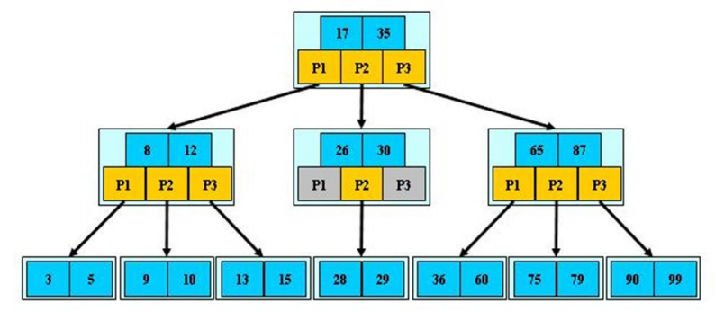
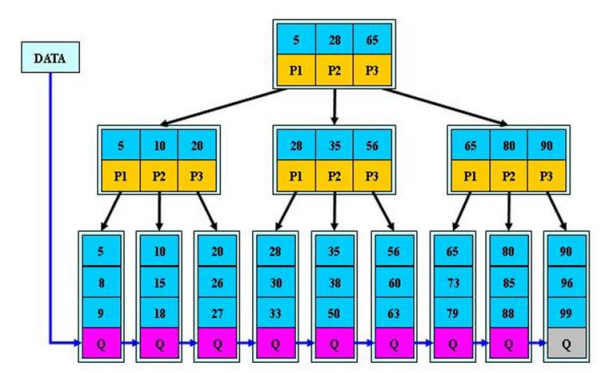
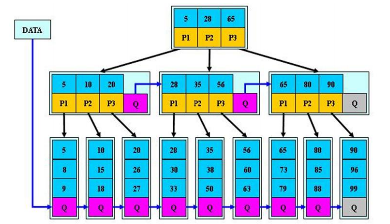

## 　B树

B-tree 树即 B 树，B 即 Balanced，平衡的意思。



### 说明

1. B树的阶：节点的最多子节点个数。比如2-3树的阶是3，2-3-4树的阶是4
1. B树的搜索：从根结点开始，对结点内的关键字(有序)序列进行二分查找，如果命中则结束，否则进入查询关键字所属范围的儿子结点；重复，直到所对应的儿子指针为空，或已经是叶子结点
1. 关键字集合分布在整棵树中，即叶子结点和非叶子节点都存放数据
搜索有可能在非叶子结点结束
1. 其搜索性能等价于在关键字全集内做一次二分查找

## B+树

B+树的分裂

```plain
当一个结点满时，分配一个新的结点，并将原结点中1/2的数据复制到新结点，最后在父结点中增加新结点的指针；B+树的分裂只影响原结点和父结点，而不会影响兄弟结点，所以它不需要指向兄弟的指针；
```



### 说明

1. B+树的搜索与B树基本相同，区别是B+树只有达到叶子结点才命中(B树可以在非叶子结点命中)，其性能也等价于在关键字全集做一次二分查找
1. 所有关键字都出现在叶子结点的链表中(即数据只能在叶子结点【也叫稠密索引】)，且链表中的关键字(数据)恰好是有序的
B+树非叶子结点相当于是叶子结点的索引(稀疏索引)，叶子结点相当于是存储(关键字)数据的数据层；B树的非叶子结点也存储数据(数据信息)，这样导致每次加载io的数据量减小
1. 更适合文件索引系统
1. B数和B+树各有自己的应用场景，不能说B+树完全比B树好，反之亦然。

## B*树

B*树的分裂

```plain
当一个结点满时，如果它的下一个兄弟结点未满，那么将一部分数据移到兄弟结点中，再在原结点插入关键字，最后修改父结点中兄弟结点的关键字（因为兄弟结点的关键字范围改变了）；如果兄弟结点也满了，则在原结点与兄弟结点之间增加新结点，并各复制1/3的数据到新结点，最后在父结点增加新结点的指针； 所以，B*树分配新结点的概率比B+树要低，空间使用率更高；
```



### 说明

定义了非叶子结点关键字个数至少为(2/3)*M，即块的最低使用率为2/3，而B+树的快的最低使用率为1/2
B*树分配新结点的概率比B+树要低，空间使用率更高

