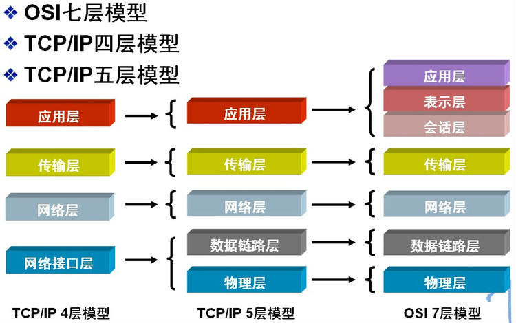
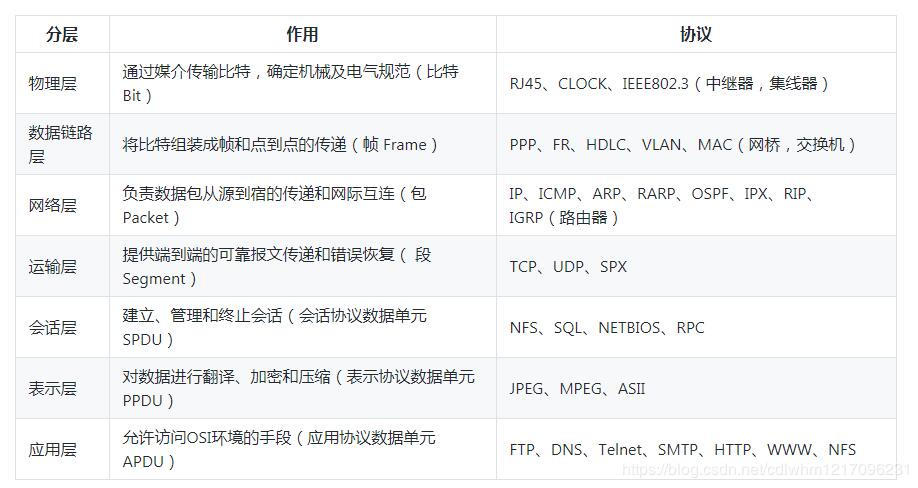
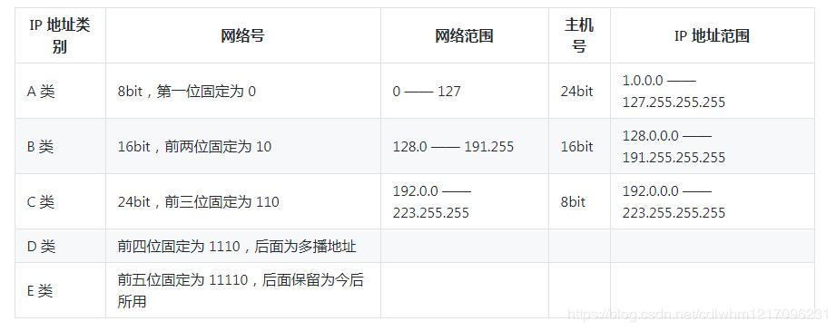
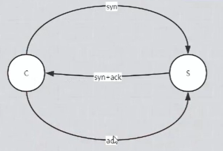
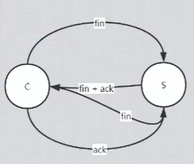

#

## 网络模型

## 协议

## IP

## HTTP

### 头部

#### 通用首部字段（请求报文与响应报文都会使用的首部字段）

* Date：创建报文时间
* Connection：连接的管理
* Cache-Control：缓存的控制
* Transfer-Encoding：报文主体的传输编码方式

#### 请求首部字段（请求报文会使用的首部字段）

* Host：请求资源所在服务器
* Accept：可处理的媒体类型
* Accept-Charset：可接收的字符集
* Accept-Encoding：可接受的内容编码
* Accept-Language：可接受的自然语言

#### 响应首部字段（响应报文会使用的首部字段）

* Accept-Ranges：可接受的字节范围
* Location：令客户端重新定向到的
* URI Server：HTTP服务器的安装信息

#### 实体首部字段（请求报文与响应报文的的实体部分使用的首部字段）

* Allow：资源可支持的HTTP方法
* Content-Type：实体主类的类型
* Content-Encoding：实体主体适用的编码方式
* Content-Language：实体主体的自然语言
* Content-Length：实体主体的的字节数
* Content-Range：实体主体的位置范围，一般用于发出部分请求时使用

### 三次握手

1. c想要与s建立连接。
2. s收到，发回确认建立连接以及s这边想要与c连接连接。
3. c回复，发回确认建立连接的信息。

### 四次挥手

1. c发出想要断开连接的信息。
2. s发回确认收到c发出的断开连接的信息，但是此时可能数据还没有发完，所以会继续发送数据。
3. 当所有数据发送完成之后，s发出我想与c断开连接的信息，
4. c收到，c发出确认断开连接。连接断开。

### 用塞控制

### 问答

#### 三次握手为什么不能两次

如果第二次不发送SYN+ACK，只是发送确认应答消息ACK，会造成只能建立单向通信，而且不能应答。而TCP是全双工通信的，而且必须保证可靠性。
如果第二发送SYN+ACK，不用应答。此时会出现三种情况
一、二次握手失败，C端会重复发送SYN报文，等待对端发送确认报文，S端会保存tcp连接的所有资源，大量的这种情况会导致S资源耗尽。
二、二次握手成功，S收不到ACK会重复发送SYN+ACK报文。
三、二次握手完以后，双方以为连接建立成功，即可开始通信。假如此时连接并没有真的建立成功，S端开始发送消息，会造成网络拥堵发生。
为什么不能四次，节约资源

#### 为什么要四次挥手？

TCP是全双工的通信机制，每个方向必须单独进行关闭。
TCP传输连接关闭的原则如下：
当一端完成它的数据发送任务后就可以发送一个FIN字段置1的数据段来终止这个方向的数据发送；当另一端收到这个FIN数据段后，必须通知它的应用层 对端已经终止了那个方向的数据传送。

#### 为什么不能用三次握手中捎带应答机制减少一次握手？

这点到是很迷惑人，但是掌握了TCP传输的一些细节就会发现并不难。
TCP是全双工通信的，S收到断开链接请求后只是表示C端不会传输数据到S端了，但是并不表示S端不传输数据到C端。
如果采用捎带应答，S端将无法把剩余的数据传输到C端。

#### 为何最后一次ACK之后需要等待2MSL的时间？

网络是不可靠的，TCP是可靠协议，必须保证最后一次报文送达之后才能断开链接，否则会再次收到S端的FIN报文信息。
而等待2MSL时间就是为了保证最后最后一次报文丢失时还能重新发送。

#### 为何是2MSL的时间？

2MSL是报文一个往返的最长时间，假设小于这个时间会发生，ACK丢了，但是还没接收到对方重传的FIN我方就重新发送了ACK。

#### 如果已经建立了连接，但是客户端突然出现故障了怎么办？

这个不难TCP自己做了保证，TCP默认有个定时器，每次收到客户端的请求后会把定时器设置好，通常设置两小时，超过两小时还没收到数据。
服务端会发送一个探测报文，以后每隔75秒钟发送一次。若一连发送10个探测报文仍然没反应，服务器就认为客户端出了故障，接着就关闭连接。
