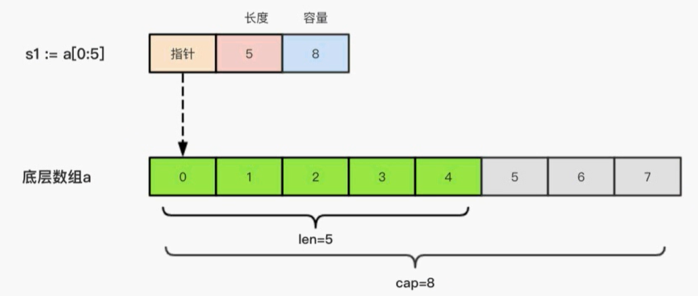

## 包的导入

```go
// 导入一个包
import "fmt"

//给包取别名
import fmt "fmt"

// 多个包的导入
import (
	"fmt"
    "os"
)   

//导入而不使用
import _ "fmt" 

//使用的时候可以直接使用其方法，而不需要 fmt.xxx
import . "fmt" 
```

## 注释方式

```go
 // 单行注释

/*
多行注释
*/
```
## 关键字
```
包管理（2个）：
	import	package

程序实体声明与定义（8个）：
	chan	const	func	interface	map	struct	type	var

程序流程控制（15个）：
	break	case	continue	default	defer	else	fallthrough	
	for		go		goto		if		range	return	select		switch
```

## 数据类型

### 概述

Go 语言中数据类型分为：基本数据类型和复合数据类型基本数据类型有：

整型、浮点型、布尔型、字符串

复合数据类型有：

数组、切片、结构体、函数、map、通道（channel）、接口等。

### 整型

整型的类型有很多中，包括 int8，int16，int32，int64。我们可以根据具体的情况来进行定义

如果我们直接写 int也是可以的，它在不同的操作系统中，int的大小是不一样的

- 32位操作系统：int  -> int32
- 64位操作系统：int -> int64

|     类型      |                             释义                             |
| :-----------: | :----------------------------------------------------------: |
| uint8 (byte)  |                  无符号 8位整型 (0 到 255)                   |
|    uint16     |                 无符号 16位整型 (0 到 65535)                 |
|    uint32     |              无符号 32位整型 (0 到 4294967295)               |
|    uint64     |         无符号 64位整型 (0 到 18446744073709551615)          |
|     int8      |                 有符号 8位整型 (-128 到 127)                 |
|     int16     |              有符号 16位整型 (-32768 到 32767)               |
| int32（rune） |         有符号 32位整型 (-2147483648 到 2147483647)          |
|     int64     | 有符号 64位整型 (-9223372036854775808 到 9223372036854775807) |
|    uintptr    |                   无符号整型，用于存放指针                   |
|    float32    |                          32位浮点数                          |
|    float64    |                          64位浮点数                          |

> 可以通过unsafe.Sizeof 查看不同长度的整型，在内存里面的存储空间
>
> ```
> var num2 = 12
> fmt.Println(unsafe.Sizeof(num2))
> ```

#### 类型转换

通过在变量前面添加指定类型，就可以进行强制类型转换

```go
var a1 int16 = 10
var a2 int32 = 12
var a3 = int32(a1) + a2
fmt.Println(a3)
```

注意，高位转低位的时候，需要注意，会存在精度丢失，比如上述16转8位的时候，就丢失了

```go
var n1 int16 = 130
fmt.Println(int8(n1)) // 变成 -126
```

#### 数字字面量语法

Go1.13版本之后，引入了数字字面量语法，这样便于开发者以二进制、八进制或十六进制浮点数的格式定义数字，例如：

```go
v := 0b00101101  // 代表二进制的101101
v：= Oo377       // 代表八进制的377
```

#### 进制转换

```go
number := int64(17)

// 十进制输出
a := Sprintf("%d", number)
Println("  十进制   ",a)

o := Sprintf("%o", number)
Println("  八进制   ",o)

b := Sprintf("%b", number)
Println("  二进制   ",b)

s := strconv.FormatInt(number, 16)
Println("十六进制   ",s)


// 数值转n进制,数字需要为int64
// s := strconv.FormatInt(number, n)
```

### 浮点型

Go语言支持两种浮点型数：float32和float64。这两种浮点型数据格式遵循IEEE754标准：

float32的浮点数的最大范围约为3.4e38，可以使用常量定义：math.MaxFloat32。float64的浮点数的最大范围约为1.8e308，可以使用一个常量定义：math.MaxFloat64

打印浮点数时，可以使用fmt包配合动词%f，代码如下：

```go
var pi = math.Pi
// 打印浮点类型，默认小数点6位
fmt.Printf("%f\n", pi)
// 打印浮点类型，打印小数点后2位
fmt.Printf("%.2f\n", pi)
```

#### Golang中精度丢失的问题

几乎所有的编程语言都有精度丢失的问题，这是典型的二进制浮点数精度损失问题，在定长条件下，二进制小数和十进制小数互转可能有精度丢失

```go
d := 1129.6
fmt.Println(d*100) //输出112959.99999999
```

解决方法，使用第三方包来解决精度损失的问题

http://github.com/shopspring/decimal

### 布尔类型

定义

```go
var fl = false
if f1 {
    fmt.Println("true")
} else {
    fmt.Println("false")
}
```

### 字符串类型

Go 语言中的字符串以原生数据类型出现，使用字符串就像使用其他原生数据类型（int、bool、float32、float64等）一样。Go语言里的字符串的内部实现使用UTF-8编码。字符串的值为双引号（"）中的内容，可以在Go语言的源码中直接添加非ASCll码字符，例如：

```go
s1 := "hello"
s1 := "你好"
```

如果想要定义多行字符串，可以使用反引号
```go
	var str = `第一行
          第二行`
	fmt.Println(str)
```

#### 字符串常见操作

- len(str)：求长度
- +或fmt.Sprintf：拼接字符串
- strings.Split：分割
- strings.contains：判断是否包含
- strings.HasPrefix，strings.HasSuffix：前缀/后缀判断
- strings.Index()，strings.LastIndex()：子串出现的位置
- strings.Join()：join操作
- strings.Index()：判断在字符串中的位置

#### byte 和 rune类型

组成每个字符串的元素叫做 “字符”，可以通过遍历字符串元素获得字符。字符用单引号 '' 包裹起来

Go语言中的字符有以下两种类型

- uint8类型：或者叫byte型，代表了ACII码的一个字符
- rune类型：代表一个UTF-8字符

当需要处理中文，日文或者其他复合字符时，则需要用到rune类型，rune类型实际上是一个int32

Go使用了特殊的rune类型来处理Unicode，让基于Unicode的文本处理更为方便，也可以使用byte型进行默认字符串处理，性能和扩展性都有照顾。

需要注意的是，在go语言中，一个汉字占用3个字节（utf-8），一个字母占用1个字节

```go
package main
import "fmt"

func main() {
	var a byte = 'a'
	// 输出的是ASCII码值，也就是说当我们直接输出byte（字符）的时候，输出的是这个字符对应的码值
	fmt.Println(a)
	// 输出的是字符
	fmt.Printf("%c", a)

	// for循环打印字符串里面的字符
	// 通过len来循环的，相当于打印的是ASCII码
	s := "你好 golang"
	for i := 0; i < len(s); i++ {
		fmt.Printf("%v(%c)\t", s[i], s[i])
	}

	// 通过rune打印的是 utf-8字符
	for index, v := range s {
		fmt.Println(index, v)
	}
}
```

#### 修改字符串

要修改字符串，需要先将其转换成[]rune 或 []byte类型，完成后在转换成string，无论哪种转换都会重新分配内存，并复制字节数组

转换为 []byte 类型

```go
// 字符串转换
s1 := "big"
byteS1 := []byte(s1)
byteS1[0] = 'p'
fmt.Println(string(byteS1))
```

转换为rune类型

```go
// rune类型
s2 := "你好golang"
byteS2 := []rune(s2)
byteS2[0] = '我'
fmt.Println(string(byteS2))
```
#### 单引号/双引号/反引号
Golang限定字符或者字符串一共三种引号，单引号（’’)，双引号("") 以及反引号(``)。反引号就是标准键盘“Esc”按钮下面的那个键。
 >单引号，表示byte类型或rune类型，对应 uint8和int32类型，默认是 rune 类型。byte用来强调数据是raw data，而不是数字；而rune用来表示Unicode的code point。
 >
 >双引号，才是字符串，实际上是字符数组。可以用索引号访问某字节，也可以用len()函数来获取字符串所占的字节长度。
 >
 >反引号，表示字符串字面量，但不支持任何转义序列。字面量 raw literal string 的意思是，你定义时写的啥样，它就啥样，你有换行，它就换行。你写转义字符，它也就展示转义字符。

### 类型转换

#### 数值类型转换

```go
// 整型和浮点型之间转换
var aa int8 = 20
var bb int16 = 40
fmt.Println(int16(aa) + bb)

// 建议整型转换成浮点型
var cc int8 = 20
var dd float32 = 40
fmt.Println(float32(cc) + dd)
```

建议从低位转换成高位，这样可以避免

#### 转换成字符串类型

第一种方式，就是通过 fmt.Sprintf()来转换

```go
// 字符串类型转换
var i int = 20
var f float64 = 12.456
var t bool = true
var b byte = 'a'
str1 := fmt.Sprintf("%d", i)
fmt.Printf("类型：%v-%T \n", str1, str1)

str2 := fmt.Sprintf("%f", f)
fmt.Printf("类型：%v-%T \n", str2, str2)

str3 := fmt.Sprintf("%t", t)
fmt.Printf("类型：%v-%T \n", str3, str3)

str4 := fmt.Sprintf("%c", b)
fmt.Printf("类型：%v-%T \n", str4, str4)
```

第二种方法就是通过strconv包里面的集中转换方法进行转换

```go
// int类型转换str类型
var num1 int64 = 20
s1 := strconv.FormatInt(num1, 10)
fmt.Printf("转换：%v - %T", s1, s1)

// float类型转换成string类型
var num2 float64 = 3.1415926

/*
		参数1：要转换的值
		参数2：格式化类型 'f'表示float，'b'表示二进制，‘e’表示 十进制
		参数3：表示保留的小数点，-1表示不对小数点格式化
		参数4：格式化的类型，传入64位 或者 32位
	 */
s2 := strconv.FormatFloat(num2, 'f', -1, 64)
fmt.Printf("转换：%v-%T", s2, s2)
```

#### 字符串转换成int 和 float类型

```go
str := "10"
// 第一个参数：需要转换的数，第二个参数：进制， 参数三：32位或64位
num,_ = strconv.ParseInt(str, 10, 64)

// 转换成float类型
str2 := "3.141592654"
num,_ = strconv.ParseFloat(str2, 10)
```
## 控制与循环
### if/else
流程控制是每种编程语言控制逻辑走向和执行次序的重要部分，流程控制可以说是一门语言的“经脉"

Go 语言中最常用的流程控制有if和for，而switch和goto主要是为了简化代码、降低重复代码而生的结构，属于扩展类的流程控制。
```go
func main() {
	var num = 10
	if num == 10 {
		fmt.Println("hello == 10")
	} else if(num > 10) {
		fmt.Println("hello > 10")
	} else {
		fmt.Println("hello < 10")
	}
}
```
### for
Go语言中的所有循环类型均可使用for关键字来完成

for循环的基本格式如下：

```
for 初始语句; 条件表达式; 结束语句 {
	循环体
}
```

条件表达式返回true时循环体不停地进行循环，直到条件表达式返回false时自动退出循环

实例：打印1 ~ 10

```go
for i := 0; i < 10; i++ {
    fmt.Printf("%v ", i+1)
}
```

注意，在Go语言中，没有while语句，我们可以通过for来代替

```go
for {
    循环体
}
```

for循环可以通过break、goto、return、panic语句退出循环
#### for/range
Go 语言中可以使用for range遍历数组、切片、字符串、map及通道（channel）。通过for range遍历的返回值有以下规律：

- 数组、切片、字符串返回索引和值。
- map返回键和值。
- 通道（channel）只返回通道内的值。

实例：遍历字符串

```go
var str = "你好golang"
for key, value := range str {
    fmt.Printf("%v - %c ", key, value)
}
```

遍历切片（数组）

```go
var array = []string{"php", "java", "node", "golang"}
for index, value := range array {
    fmt.Printf("%v %s ", index, value)
}
```
### switch
-  可以使用任何类型或表达式作为条件语句；
- 不需要写break，一旦条件符合自动终止；
- case xxxx中，xxx可以是多个条件。
- 若希望继续执行下一个case，需使用fallthrough语句，但是仅仅只能执行下一个case，例如case a fallthrough case b,满足a条件，因为a中有fallthrough,则b中的也会执行。

```go
extname := ".a"
switch extname {
	case ".html": {
		fmt.Println(".html")
	}
	// 多个条件
	case ".doc",".txt": {
		fmt.Println(".doc")
	}
	case ".js": {
		fmt.Println(".js")
	}
	default: {
		fmt.Println("其它后缀")
	}
}
```
#### fallthrough
```
extname := ".txt"
switch extname {
	case ".html": {
		fmt.Println(".html")
		fallthrought
	}
	case ".txt",".doc": {
		fmt.Println("传递来的是文档")
		fallthrought
	}
	case ".js": {
		fmt.Println(".js")
		fallthrought
	}
	default: {
		fmt.Println("其它后缀")
	}
}
```
## 数组与切片
> 数组是固定长度的同一类型的数据集合，占用连续的内存
> 切片是可伸缩动态序列
### 数组

```go
// 数组的长度是类型的一部分
var arr1 [3]int
var arr2 [4]string
fmt.Printf("%T, %T \n", arr1, arr2)

// 数组的初始化 第一种方法
var arr3 [3]int
arr3[0] = 1
arr3[1] = 2
arr3[2] = 3
fmt.Println(arr3)

// 第二种初始化数组的方法
var arr4 = [4]int {10, 20, 30, 40}
fmt.Println(arr4)

// 第三种数组初始化方法，自动推断数组长度
var arr5 = [...]int{1, 2}
fmt.Println(arr5)

// 第四种初始化数组的方法，指定下标
a := [...]int{1:1, 3:5}
fmt.Println(a)

// 遍历
a := [...]int{1:1, 3:5}
for i := 0; i < len(a); i++ {
	fmt.Print(a[i], " ")
}
for _, value := range a {
    fmt.Print(value, " ")
}
```
### 切片
切片（Slice）是一个拥有相同类型元素的可变长度的序列。它是基于数组类型做的一层封装。
它非常灵活，支持自动扩容(切片就如python中的列表)

切片是一个引用类型，它的内部结构包含地址、长度和容量。
#### 基本使用
声明切片类型的基本语法如下：
```go
//- name：表示变量名
//T：表示切片中的元素类型
var name [] T
// 声明切片，把长度去除就是切片
var slice = []int{1,2,3}
fmt.Println(slice)
// 遍历切片
for i := 0; i < len(slice); i++ {
    fmt.Print(slice[i], " ")
}
```
#### 底层结构
切片的本质就是对底层数组的封装，它包含了三个信息

>底层数组的指针
>切片的长度(len)
>切片的容量(cap)




#### 长度和容量
切片拥有自己的长度和容量，我们可以通过使用内置的len）函数求长度，使用内置的cap（）
函数求切片的容量。

切片的长度就是它所包含的元素个数。

切片的容量是从它的第一个元素开始数，到其底层数组元素末尾的个数。切片s的长度和容量可通过表达式len（s）和cap（s）来获取。

#### make切片
切片扩容：当元素存放不下的时候，会将原来的容量扩大两倍
```go
// T：切片的元素类型
// size：切片中元素的数量
// cap：切片的容量
make ([]T, size, cap)

fmt.Println()
var slices = make([]int, 4, 8)
//[0 0 0 0]
fmt.Println(slices)
// 长度：4, 容量8
fmt.Printf("长度：%d, 容量%d", len(slices), cap(slices))
// 添加元素
slices = append(slices, 5)
// 合并两个切片
slices2 = append(slices, slices1...)
// 复制切片，改变其中一个的实话另一个不受不受影响
copy(slices5, slices4)
// Go语言中并没有删除切片元素的专用方法，利用切片本身的特性来删除元素
slices6 = append(slices6[:1], slices6[2:]...)

```


### 比较
- 数组是值类型，赋值和传参会赋值整个数组，因此改变副本的值，不会改变本身的值
- 在golang中，切片的定义和数组定义是相似的，但是需要注意的是，切片是引用数据类型，因此改变副本的值,会改变本身的值

```go
// 数组
var array1 = [...]int {1, 2, 3}
array2 := array1
array2[0] = 3
fmt.Println(array1, array2)
//[1 2 3] [3 2 3]

// 切片定义
var array3 = []int{1,2,3}
array4 := array3
array4[0] = 3
fmt.Println(array3, array4)
//[3 2 3] [3 2 3]
```

## map
map是一种无序的基于key-value的数据结构，Go语言中的map是引用类型，必须初始化才能使用。map类型的变量默认初始值为nil，需要使用make()函数来分配内存。语法为：
```go
// KeyType：表示键的类型
// ValueType：表示键对应的值的类型
map[KeyType]ValueType

// 方式1初始化
var userInfo = make(map[string]string)
userInfo["userName"] = "zhangsan"
fmt.Println(userInfo)
fmt.Println(userInfo["userName"])
// 创建方式2，map也支持声明的时候填充元素
var userInfo2 = map[string]string {
    "username":"张三",
    "sex":"女",
}
fmt.Println(userInfo2)

// 遍历map
for key, value := range userInfo2 {
    fmt.Println("key:", key, " value:", value)
}

// 判断是否存在,如果存在  ok = true，否则 ok = false
value, ok := userInfo2["username2"]
fmt.Println(value, ok)
// 删除map数据里面的key，以及对应的值
delete(userInfo2, "sex")
fmt.Println(userInfo2)
```
## 函数
函数是组织好的、可重复使用的、用于执行指定任务的代码块
Go语言支持：函数、匿名函数和闭包
Go语言中定义函数使用func关键字，具体格式如下：
```go
func 函数名(参数)(返回值) {
    函数体
}

// 求两个数的和
func sumFn(x int, y int) int{
	return x + y
}
// 调用方式
sunFn(1, 2)

//获取可变的参数，可变参数是指函数的参数数量不固定。Go语言中的可变参数通过在参数名后面加... 来标识。
//注意：可变参数通常要作为函数的最后一个参数
func sunFn2(x ...int) int {
	sum := 0
	for _, num := range x {
		sum = sum + num
	}
	return sum
}
// 调用方法
sunFn2(1, 2, 3, 4, 5, 7)


// 多值返回
func sunFn4(x int, y int)(sum int, sub int) {
	sum = x + y
	sub = x -y
	return
}
```